# Technical Specification

# 0. Agent Action Plan

## 0.1 Core Objective

**Based on the provided requirements, the Blitzy platform understands that the objective is to:**

Enhance an existing Node.js tutorial server application by integrating the Express.js web framework and expanding the API with an additional endpoint. Specifically, the implementation will:

- **Migrate Server Architecture**: Transform the existing basic Node.js HTTP server (which currently returns "Hello world") into an Express.js-based application to leverage modern web framework capabilities including simplified routing, middleware support, and improved request/response handling

- **Maintain Existing Functionality**: Preserve the current "Hello world" endpoint behavior while restructuring it to use Express.js patterns and conventions

- **Extend API Surface**: Add a new endpoint that returns the response "Good evening" to demonstrate Express.js routing capabilities and API expansion patterns

- **Establish Project Infrastructure**: Initialize proper Node.js project structure with dependency management (package.json), version control exclusions (.gitignore), and appropriate documentation

**Implicit Requirements Detected:**

The Blitzy platform has identified the following unstated but necessary implementation requirements:

- **Dependency Management**: Establish npm/package.json configuration to manage Express.js and future dependencies with proper semantic versioning

- **Port Configuration**: Define a standardized port for the server (convention suggests port 3000 for development environments)

- **Project Structure**: Create a professional project layout following Node.js and Express.js best practices

- **Error Handling**: Implement basic error handling and server startup confirmation logging

- **Development Setup**: Ensure the application can be started with standard Node.js commands (e.g., `node server.js` or `npm start`)

**Dependencies and Prerequisites:**

- Node.js runtime environment (v20.19.5 available in current environment, compatible with Express.js 4.x and 5.x)
- npm package manager (v10.8.2 available)
- Express.js framework (recommend v4.21.2 for stability, or v5.1.0 for latest features)
- Basic understanding of RESTful API endpoint design
- Git for version control (repository already initialized)

## 0.2 Task Categorization

**Primary Task Type:** Add Feature to Existing Product

This work involves extending an existing Node.js server application with new framework integration (Express.js) and additional API endpoints. The task combines framework migration with feature addition.

**Secondary Aspects:**

- **Configuration**: Establishing project configuration through package.json, including dependency specifications, project metadata, and npm scripts
- **Refactoring**: Converting native Node.js HTTP server implementation to Express.js patterns while maintaining functional equivalence
- **Documentation**: Creating or updating README.md with installation instructions, usage examples, and API endpoint documentation
- **Tooling**: Setting up development environment configurations including .gitignore for proper version control hygiene

**Scope Classification:** Cross-cutting Change

While the core modification targets the server implementation file, this change has cross-cutting implications:

- **Infrastructure Layer**: Affects project setup and dependency management system
- **Application Layer**: Modifies the server initialization and request handling logic
- **API Layer**: Expands the routing table with new endpoint definitions
- **Documentation Layer**: Requires updates to project documentation and usage instructions

The change introduces a new dependency (Express.js) that becomes a foundational element of the application architecture, affecting how future endpoints and middleware will be implemented.

## 0.3 Special Instructions and Constraints

**Critical Directives:**

- **Tutorial Context**: This is a tutorial/educational project, requiring clear, simple, and well-commented code that demonstrates Express.js fundamentals without unnecessary complexity

- **Endpoint Specifications**: 
  - User Example: "one endpoint that returns the response 'Hello world'"
  - User Example: "another endpoint that return the reponse of 'Good evening'"
  - Both endpoints must return plain text responses as specified

- **Framework Integration**: Express.js must be properly integrated as the primary web framework, replacing any existing native Node.js HTTP server implementation

**Methodological Requirements:**

- **Follow Express.js Conventions**: Adopt standard Express.js patterns for route definition, middleware usage, and application structure as documented in official Express.js guides

- **Maintain Simplicity**: Keep the implementation minimal and focused on demonstrating core Express.js concepts (app initialization, routing, response handling)

- **Use Semantic Versioning**: Specify exact or caret-range versions for dependencies to ensure reproducible installations

- **Non-Interactive Setup**: All installation and configuration steps must be automatable without user prompts

**Preserved User Examples:**

The user has provided these specific requirements that must be implemented exactly as stated:

1. **Existing Functionality**: "one endpoint that returns the response 'Hello world'" - This endpoint should be accessible at the root path `/` and return the exact text "Hello world"

2. **New Functionality**: "another endpoint that return the reponse of 'Good evening'" - This new endpoint should be accessible at an appropriate path (e.g., `/evening` or `/good-evening`) and return the exact text "Good evening"

**Web Search Requirements:**

To ensure implementation follows current best practices, research is needed for:

- Express.js latest stable version and installation best practices
- Standard Express.js project structure for tutorial/educational applications
- Express.js routing patterns and response methods
- Node.js version compatibility with Express.js versions
- Common .gitignore patterns for Node.js projects

## 0.4 Technical Interpretation

**These requirements translate to the following technical implementation strategy:**

#### Requirement-to-Implementation Mapping

**1. Express.js Framework Integration**

To achieve the goal of adding Express.js to the project, we will:

- **Create** `package.json` by initializing an npm project with appropriate metadata, scripts, and dependencies configuration
- **Add** Express.js as a production dependency with version specification (^4.21.2 for stability or ^5.1.0 for latest features)
- **Install** Express.js framework using npm package manager with exact version locking for reproducibility

**2. Server Architecture Migration**

To transform the existing Node.js HTTP server into an Express.js application, we will:

- **Create** or **Modify** the main server file (server.js or app.js) by replacing native `http.createServer()` with Express.js application initialization using `express()`
- **Refactor** request handling logic by implementing Express.js middleware and routing patterns instead of manual request/response processing
- **Configure** the Express.js application to listen on a standard development port (3000) with startup confirmation logging

**3. Endpoint Implementation**

To maintain the existing "Hello world" endpoint and add the new "Good evening" endpoint, we will:

- **Define** a GET route at path `/` by using `app.get('/', (req, res) => {...})` that returns the plain text response "Hello world" using `res.send()`
- **Define** a GET route at path `/evening` by using `app.get('/evening', (req, res) => {...})` that returns the plain text response "Good evening" using `res.send()`
- **Implement** appropriate HTTP response headers and status codes (200 OK) for successful requests

**4. Project Infrastructure**

To establish proper project structure and development workflows, we will:

- **Create** `.gitignore` file by adding standard Node.js exclusion patterns (node_modules/, .env, logs/, etc.) to prevent committing dependencies and sensitive files
- **Update** or **Create** `README.md` by documenting installation steps, Express.js dependency requirements, available endpoints, and usage instructions
- **Configure** npm scripts in package.json by adding `start` script that executes the server file with Node.js runtime

#### Technical Implementation Flow

**Foundation Establishment:**

First, establish the project foundation by creating package.json with npm init, specifying project name, version, description, entry point, and license information. Install Express.js framework as a dependency, generating package-lock.json for deterministic dependency resolution.

**Server Implementation:**

Next, integrate Express.js capabilities by creating the server file that imports Express.js, initializes an Express application instance, defines route handlers for both endpoints using Express.js routing methods, and starts the HTTP server on the configured port with listen().

**Quality Assurance:**

Finally, ensure project completeness by adding .gitignore to exclude node_modules and other generated files, updating README.md with comprehensive setup and usage instructions, testing both endpoints manually or with curl commands to verify correct responses, and confirming the server starts without errors.

## 0.5 Repository Scope Discovery

#### Comprehensive File Analysis

**Current Repository State:**

The repository currently contains minimal infrastructure:

- `README.md` - Basic documentation file containing only the project title "# 30_1"
- `.git/` - Git version control directory (repository initialized)

**Search Patterns Applied:**

Given the task type (Add Feature - Framework Integration), the following search patterns were evaluated:

- **Source code patterns**: `**/*.js`, `**/*.ts`, `src/**/*`, `lib/**/*`, `app/**/*` - No existing JavaScript source files found
- **Configuration patterns**: `package.json`, `package-lock.json`, `**/*.config.js`, `.nvmrc`, `.node-version` - No existing configuration files found
- **Documentation patterns**: `README.md`, `docs/**/*`, `CONTRIBUTING.md` - Only README.md exists (minimal content)
- **Build/Deploy patterns**: `Dockerfile`, `.github/workflows/*`, `npm scripts` - No build or deployment configurations found
- **Test patterns**: `tests/**/*`, `**/*.test.js`, `**/*.spec.js` - No test infrastructure present

#### Files to be Created

Based on comprehensive repository analysis and task requirements, the following files must be created:

**1. package.json**
- **Purpose**: npm package manifest defining project metadata, dependencies, and scripts
- **Rationale**: Required for Express.js dependency management and npm workflow integration
- **Key sections**: name, version, description, main entry point, scripts (start, dev), dependencies (express), engines (Node.js version), license

**2. server.js** (or app.js)
- **Purpose**: Main application entry point containing Express.js server implementation
- **Rationale**: Primary server file that initializes Express app and defines route handlers
- **Key components**: Express import, app initialization, route definitions (/ and /evening), server.listen() configuration

**3. .gitignore**
- **Purpose**: Version control exclusion patterns for Node.js projects
- **Rationale**: Prevents committing node_modules/, logs/, environment files, and other generated artifacts
- **Key patterns**: node_modules/, .env, .DS_Store, logs/, *.log, npm-debug.log*, coverage/

**4. package-lock.json** (auto-generated)
- **Purpose**: Deterministic dependency version locking
- **Rationale**: Automatically created by npm install to ensure reproducible installations
- **Management**: Generated automatically, should be committed to version control

#### Files to be Modified

**README.md**
- **Current state**: Contains only "# 30_1" heading
- **Required updates**:
  - Project description explaining the Express.js tutorial server
  - Installation instructions (npm install)
  - Usage instructions (npm start or node server.js)
  - Available endpoints documentation (GET / and GET /evening with expected responses)
  - Prerequisites (Node.js version requirement)
  - License information (if applicable)

#### Web Search Research Conducted

The following research was completed to validate implementation approach:

**1. Express.js Latest Versions and Compatibility**
- <cite index="1-2,5-2">Express.js 4.21.2 is the latest stable 4.x release with security fixes, while version 5.1.0 is the latest release</cite>
- <cite index="3-15">Express.js 5.0 requires Node.js 18 or higher</cite>
- Decision: Recommend Express.js 4.21.2 for tutorial stability, with Node.js 20.19.5 (available) being fully compatible

**2. Express.js Basic Server Pattern**
- <cite index="12-1,12-2">Express apps start a server, listen on a configured port, and respond to requests at defined routes</cite>
- Standard initialization pattern: `const express = require('express'); const app = express();`
- Route definition pattern: `app.get('/', (req, res) => { res.send('response') });`

**3. Node.js HTTP Server Migration Pattern**
- <cite index="11-12">Native Node.js servers use http.createServer() with manual request/response handling</cite>
- Express.js simplifies this by providing routing methods and automatic response handling
- Migration involves replacing http.createServer() with express() app initialization

**4. Best Practices for Tutorial/Educational Projects**
- Keep dependencies minimal (only Express.js required)
- Use clear, commented code demonstrating framework concepts
- Provide comprehensive README with setup and usage instructions
- Use standard port (3000) for development servers

#### Existing Infrastructure Assessment

**Current Project Structure:**
```
.
├── .git/           (version control initialized)
└── README.md       (minimal documentation)
```

**Target Project Structure:**
```
.
├── .git/
├── .gitignore      (NEW - version control exclusions)
├── README.md       (MODIFIED - comprehensive documentation)
├── package.json    (NEW - project manifest and dependencies)
├── package-lock.json (NEW - auto-generated dependency lock)
├── server.js       (NEW - Express.js application)
└── node_modules/   (NEW - auto-generated dependency directory)
```

**Patterns and Conventions:**
- No existing patterns found; will establish Express.js conventions as the baseline
- Entry point convention: server.js (common for tutorial projects) or app.js (alternative naming)
- No existing testing infrastructure; test implementation is out of scope for this tutorial

**Build and Deployment:**
- No existing build process; Node.js will execute JavaScript directly without transpilation
- No deployment configurations present; focus is on local development environment
- npm scripts will provide simple start commands (npm start → node server.js)

**Documentation System:**
- Markdown (README.md) is the documentation format
- Will enhance with installation, usage, and API endpoint sections

## 0.6 File Transformation Mapping

#### File-by-File Execution Plan

The following table provides a comprehensive mapping of ALL files to be created, updated, deleted, or referenced during this implementation. Each target file is listed first, followed by its transformation mode, source reference, and detailed purpose.

| Target File | Transformation | Source File/Reference | Purpose/Changes |
|-------------|----------------|----------------------|-----------------|
| package.json | CREATE | N/A (npm init template) | Initialize npm package manifest with project metadata (name, version, description), define Express.js as a production dependency (^4.21.2 or ^5.1.0), configure npm scripts (start script to launch server.js), specify Node.js engine compatibility (>=18.0.0), and set license (MIT or ISC) |
| server.js | CREATE | Express.js documentation patterns | Create main application entry point that imports Express.js module, initializes Express application instance, defines GET route at / returning "Hello world" response, defines GET route at /evening returning "Good evening" response, configures server to listen on port 3000, and logs startup confirmation message |
| .gitignore | CREATE | Node.js .gitignore template | Create version control exclusion file with standard Node.js patterns including node_modules/, package-lock.json (optional), .env files, log files (*.log, logs/), OS-specific files (.DS_Store, Thumbs.db), IDE configurations (.vscode/, .idea/), and coverage reports (coverage/, .nyc_output/) |
| README.md | UPDATE | README.md (current: "# 30_1") | Expand existing minimal README by adding project description (Express.js tutorial server), prerequisites section (Node.js >=18.0.0), installation instructions (npm install), usage instructions (npm start or node server.js), available endpoints documentation (GET / returns "Hello world", GET /evening returns "Good evening"), testing instructions (curl examples), and license information |
| package-lock.json | CREATE | Auto-generated by npm | Automatically generated dependency lock file created during npm install execution, contains exact dependency versions and integrity hashes for reproducible installations across different environments, should be committed to version control for consistency |

#### New Files Detail

## package.json

- **Content type**: Configuration file (JSON format)
- **Based on**: npm package manifest specification
- **Key sections**:
  - `name`: Project identifier (e.g., "express-hello-world" or "30_1")
  - `version`: Semantic version number (start with 1.0.0)
  - `description`: Brief project description ("Express.js tutorial server with two endpoints")
  - `main`: Entry point file (server.js)
  - `scripts`: Command definitions
    - `start`: "node server.js" - Production start command
    - `dev`: "node server.js" - Development start command (can add nodemon later)
  - `dependencies`: Production dependencies
    - `express`: "^4.21.2" (or "^5.1.0" for latest)
  - `engines`: Runtime version requirements
    - `node`: ">=18.0.0" (for Express 5.x) or ">=14.0.0" (for Express 4.x)
  - `keywords`: Search tags (["express", "tutorial", "api", "server"])
  - `author`: Project author information
  - `license`: Open source license (MIT or ISC)

## server.js

- **Content type**: Source code (JavaScript)
- **Based on**: Express.js "Hello World" documentation pattern
- **Key sections/functions**:
  - **Module Import**: `const express = require('express');` - Import Express.js framework
  - **App Initialization**: `const app = express();` - Create Express application instance
  - **Port Configuration**: `const PORT = process.env.PORT || 3000;` - Define server port with environment variable override
  - **Root Endpoint**: 
    ```javascript
    app.get('/', (req, res) => {
      res.send('Hello world');
    });
    ```
  - **Evening Endpoint**:
    ```javascript
    app.get('/evening', (req, res) => {
      res.send('Good evening');
    });
    ```
  - **Server Startup**:
    ```javascript
    app.listen(PORT, () => {
      console.log(`Server running on http://localhost:${PORT}`);
    });
    ```

## .gitignore

- **Content type**: Configuration file (plain text)
- **Based on**: GitHub Node.js .gitignore template
- **Key sections**:
  - **Dependencies**: `node_modules/` - Exclude installed npm packages
  - **Environment**: `.env`, `.env.local`, `.env.*.local` - Exclude environment variable files
  - **Logs**: `logs/`, `*.log`, `npm-debug.log*` - Exclude log files
  - **OS Files**: `.DS_Store`, `Thumbs.db` - Exclude operating system metadata
  - **IDE**: `.vscode/`, `.idea/`, `*.swp` - Exclude editor configurations
  - **Coverage**: `coverage/`, `.nyc_output/` - Exclude test coverage reports

#### Files to Modify Detail

## README.md

**Current Content:**
```
# 30_1
```

**Sections to Update:**

1. **Project Title and Description** (Lines 1-3):
   - Keep existing title or update to more descriptive name
   - Add brief description of the project purpose

2. **Prerequisites Section** (New section):
   - Node.js version requirement (>=18.0.0 for Express 5.x, >=14.0.0 for Express 4.x)
   - npm package manager (included with Node.js)

3. **Installation Section** (New section):
   - Clone repository command (if applicable)
   - `npm install` command to install dependencies
   - Expected output description

4. **Usage Section** (New section):
   - Server startup commands (`npm start` or `node server.js`)
   - Expected console output
   - Server access URL (http://localhost:3000)

5. **Available Endpoints Section** (New section):
   - GET / - Returns "Hello world"
   - GET /evening - Returns "Good evening"
   - Example curl commands for testing

6. **License Section** (New section, if applicable):
   - License type (MIT, ISC, or other)

**Content to Add:**

```
## Description
A simple Express.js tutorial server demonstrating basic routing and endpoint creation.

#### Prerequisites
- Node.js (v18.0.0 or higher)
- npm (comes with Node.js)

#### Installation
1. Install dependencies:
   ```bash
   npm install
   ```

#### Usage
Start the server:
```bash
npm start
```

The server will run on http://localhost:3000

#### Available Endpoints

#### GET /
Returns "Hello world"

Example:
```bash
curl http://localhost:3000/
```

#### GET /evening
Returns "Good evening"

Example:
```bash
curl http://localhost:3000/evening
```

#### License
MIT
```

**Refactoring Needed:**
- Transform from single-line placeholder to comprehensive project documentation
- Maintain Markdown formatting consistency
- Add code blocks for commands and examples

#### Configuration and Documentation Updates

**Configuration Changes:**

1. **package.json** (New file):
   - Setting: `dependencies.express` = "^4.21.2"
   - Impact: Introduces Express.js framework as project dependency, affects installation process and node_modules structure

2. **package.json scripts** (New file):
   - Setting: `scripts.start` = "node server.js"
   - Impact: Enables standardized server startup with `npm start` command

3. **.gitignore** (New file):
   - Setting: Exclusion patterns for node_modules/, .env, logs/
   - Impact: Prevents accidental commit of dependencies and sensitive data to version control

**Documentation Updates:**

1. **README.md**:
   - Sections to add: Prerequisites, Installation, Usage, Available Endpoints
   - Cross-references: Links to Express.js official documentation (optional)
   - API documentation: Clear specification of endpoint paths, HTTP methods, and response formats

#### Cross-File Dependencies

**Import/Reference Updates:**

- **server.js** imports Express.js module:
  - Import statement: `const express = require('express');`
  - Dependency: Requires express package to be installed in node_modules/
  - Resolution: package.json dependency specification ensures npm install provides the module

**Configuration Sync Requirements:**

- **package.json `main` field** must match **server.js filename**:
  - If main entry point is named server.js, package.json should specify `"main": "server.js"`
  - Ensures proper module resolution for require() calls

- **package.json `scripts.start` command** must reference correct **server filename**:
  - Script command: `"start": "node server.js"`
  - Must match actual server file name for successful execution

**Documentation Consistency:**

- **README.md endpoint documentation** must match **server.js route definitions**:
  - README documents GET / → "Hello world"
  - server.js must define app.get('/', ...) with res.send('Hello world')
  - README documents GET /evening → "Good evening"
  - server.js must define app.get('/evening', ...) with res.send('Good evening')

- **README.md installation commands** must align with **package.json configuration**:
  - README uses npm install → package.json must exist with valid dependencies
  - README uses npm start → package.json scripts must define start command

## 0.7 Dependency Inventory

#### Key Private and Public Packages

The following table lists all key public packages required for this implementation. All versions are based on current stable releases as of October 2024.

| Registry | Package Name | Version | Purpose |
|----------|--------------|---------|---------|
| npm | express | 4.21.2 | Fast, unopinionated, minimalist web framework for Node.js providing routing, middleware, and HTTP utility methods for building the API server |

**Version Rationale:**

<cite index="1-2">Express.js 4.21.2 is the latest patch release with security fixes</cite>, making it the recommended choice for production-ready tutorial applications. Alternative option: Express 5.1.0 (latest major version) requires Node.js 18+ and includes breaking changes that may complicate tutorial learning.

**No Private Packages:**

This project does not require any private or internal packages. All dependencies are publicly available through the npm registry.

#### Dependency Updates

#### New Dependencies to Add

- **express**: Version 4.21.2 (Recommended) or 5.1.0 (Latest)
  - **Reason for addition**: Core requirement to implement Express.js-based server architecture replacing native Node.js HTTP module
  - **Installation command**: `npm install express@^4.21.2` or `npm install express@^5.1.0`
  - **Registry**: npm (public)
  - **License**: MIT
  - **Size**: ~1.2 MB (with dependencies)
  - **Key sub-dependencies**: 
    - body-parser (HTTP request body parsing)
    - cookie (HTTP cookie parsing and serialization)
    - send (Static file serving utility)
    - serve-static (Static file serving middleware)

#### Dependencies to Update

N/A - No existing dependencies in the project to update.

#### Dependencies to Remove

N/A - No existing dependencies in the project to remove.

#### Import/Reference Updates

**Files Requiring Import Updates:**

- **server.js** (NEW file):
  - **Import addition**: 
    ```javascript
    const express = require('express');
    ```
  - **Reason**: Primary import to access Express.js framework functionality
  - **Usage pattern**: CommonJS require() syntax (Node.js default module system)

**Import Transformation Rules:**

Since this is a new implementation with no existing imports, the following import pattern will be established:

- **Module System**: CommonJS (require/module.exports)
  - **Old**: N/A (no existing imports)
  - **New**: `const express = require('express');`
  - **Apply to**: server.js

- **Alternative (ES Modules)**: If using ES modules in future
  - **Old**: N/A
  - **New**: `import express from 'express';`
  - **Requirements**: Add `"type": "module"` to package.json
  - **Note**: Not recommended for this tutorial to maintain simplicity

#### Dependency Management Configuration

**package.json Dependencies Section:**

```json
{
  "dependencies": {
    "express": "^4.21.2"
  }
}
```

**Version Range Explanation:**

- **^4.21.2** (Caret range): Allows minor and patch updates (4.21.x, 4.22.x) but prevents major version changes
- Ensures compatibility while receiving bug fixes and minor improvements
- Prevents automatic upgrade to Express 5.x which has breaking changes

**package-lock.json Role:**

- Auto-generated by npm install
- Locks exact versions of express and all sub-dependencies
- Ensures reproducible installs across development and production environments
- Should be committed to version control

## Node.js Engine Requirement

**package.json Engines Section:**

```json
{
  "engines": {
    "node": ">=14.0.0",
    "npm": ">=6.0.0"
  }
}
```

**Version Compatibility:**

- Express 4.21.2: Supports Node.js 14.x, 16.x, 18.x, 20.x
- Express 5.1.0: Requires Node.js 18.x or higher
- Current environment: Node.js 20.19.5 (compatible with both versions)

#### Development Dependencies

**Not Required for Basic Tutorial:**

For this simple tutorial server, no development dependencies are needed. Future enhancements might include:

- `nodemon`: Auto-restart server on file changes (development convenience)
- `jest` or `mocha`: Testing frameworks (if adding unit tests)
- `eslint`: Code linting (if enforcing code quality standards)

These are explicitly OUT OF SCOPE for the current implementation to maintain tutorial simplicity.

## 0.8 Implementation Design

#### Technical Approach

#### Primary Objectives with Implementation Approach

**Objective 1: Establish Express.js Framework Foundation**

Achieve Express.js integration by creating package.json with npm init, adding Express.js as a dependency using npm install, and verifying installation success through package-lock.json generation. This establishes the dependency management infrastructure required for all subsequent Express.js functionality.

**Rationale**: Express.js provides a robust, well-documented routing layer that simplifies HTTP server development compared to native Node.js http module. It offers middleware support, simplified request/response handling, and follows industry-standard patterns that make the codebase more maintainable and easier to extend.

**Objective 2: Implement Express.js Server Architecture**

Achieve server implementation by creating server.js that imports Express.js, initializes an Express application instance, and configures the HTTP server to listen on port 3000 with startup logging. This replaces any conceptual native Node.js HTTP server with a production-ready Express.js application.

**Rationale**: Using Express.js application initialization pattern (express()) instead of http.createServer() provides access to Express routing methods, middleware integration, and simplified response handling while maintaining full Node.js HTTP compatibility.

**Objective 3: Define RESTful Endpoint Routes**

Achieve endpoint functionality by defining two GET routes using app.get() method - one at root path (/) returning "Hello world" and one at /evening path returning "Good evening" - both using res.send() for response delivery. This implements the required API surface with proper Express.js routing patterns.

**Rationale**: Express.js routing methods (app.get, app.post, etc.) provide clean separation between route paths and handler logic, automatic response header management, and built-in support for various response formats. Using res.send() ensures proper Content-Type headers and response encoding without manual configuration.

**Objective 4: Ensure Project Documentation and Usability**

Achieve project completeness by updating README.md with installation instructions, usage commands, and endpoint documentation, and creating .gitignore to exclude node_modules and generated files from version control. This ensures the project is immediately usable by other developers and follows Node.js ecosystem best practices.

**Rationale**: Comprehensive documentation reduces onboarding friction, while proper .gitignore configuration prevents repository bloat and accidental commits of sensitive or generated content. These practices align with professional Node.js project standards.

#### Logical Implementation Flow

**Step 1: Establish Dependency Management Foundation**

First, establish npm project structure by executing npm init to create package.json with project metadata, then install Express.js framework using npm install express@^4.21.2, which generates node_modules directory and package-lock.json file. This step must complete successfully before any code implementation can proceed, as server.js will fail to execute without Express.js module availability.

**Step 2: Integrate Express.js Server Implementation**

Next, integrate Express.js capabilities by creating server.js file that imports Express.js module using require(), initializes Express application instance by calling express(), and stores the result in an app constant for route registration. This establishes the application context where all routes and middleware will be registered.

**Step 3: Define API Endpoints and Routing Logic**

Then, define endpoint behavior by registering GET route handlers - implementing app.get('/', callback) for the root endpoint that calls res.send('Hello world'), and implementing app.get('/evening', callback) for the evening endpoint that calls res.send('Good evening'). Express.js automatically handles HTTP request parsing, response header configuration, and status code assignment (200 OK by default).

**Step 4: Configure Server Listening and Startup**

After route definition, configure server activation by calling app.listen(PORT, callback) where PORT is 3000 (or environment variable override), and the callback logs startup confirmation message to console. This starts the HTTP server and makes the endpoints accessible via HTTP requests.

**Step 5: Ensure Project Quality and Documentation**

Finally, ensure project completeness by creating .gitignore file with node_modules/ exclusion pattern to prevent dependency commit bloat, and updating README.md with comprehensive sections covering prerequisites, installation commands (npm install), startup commands (npm start or node server.js), and endpoint documentation with example curl commands for testing.

#### Component Impact Analysis

#### Direct Modifications Required

**Component: package.json (New File)**
- **Modify**: Initialize npm package manifest with project metadata
- **Enable**: Dependency management system for Express.js and future packages
- **Specific Changes**:
  - Add `dependencies` section with `express: "^4.21.2"`
  - Add `scripts` section with `start: "node server.js"`
  - Configure `main` field as `"server.js"`
  - Set `engines` field to specify Node.js version compatibility

**Component: server.js (New File)**
- **Modify**: Create Express.js application with route handlers
- **Enable**: HTTP server functionality with two RESTful endpoints
- **Specific Changes**:
  - Import Express.js framework: `const express = require('express')`
  - Initialize app instance: `const app = express()`
  - Register root route: `app.get('/', (req, res) => res.send('Hello world'))`
  - Register evening route: `app.get('/evening', (req, res) => res.send('Good evening'))`
  - Start server: `app.listen(3000, callback)`

**Component: .gitignore (New File)**
- **Modify**: Add version control exclusion patterns
- **Enable**: Clean repository management without generated files
- **Specific Changes**:
  - Add `node_modules/` directory exclusion
  - Add `.env` file pattern exclusion
  - Add `*.log` and `logs/` exclusion
  - Add OS-specific files (.DS_Store, Thumbs.db)

**Component: README.md (Existing File - Update)**
- **Modify**: Expand from minimal placeholder to comprehensive documentation
- **Enable**: Developer onboarding and API discovery
- **Specific Changes**:
  - Add project description section
  - Add prerequisites section (Node.js >= 14.0.0)
  - Add installation instructions (npm install)
  - Add usage instructions (npm start)
  - Add endpoint documentation with curl examples

#### Indirect Impacts and Dependencies

**Component: node_modules/ (Auto-generated Directory)**
- **Impact**: Update required due to npm install execution
- **Rationale**: Installing Express.js creates node_modules directory containing Express.js and all transitive dependencies
- **Dependency Chain**: package.json → npm install → node_modules/ creation

**Component: package-lock.json (Auto-generated File)**
- **Impact**: Configuration update due to dependency installation
- **Rationale**: npm install generates package-lock.json with exact version specifications for reproducible builds
- **Dependency Chain**: package.json dependencies → npm install → package-lock.json generation

**Component: Git Repository State**
- **Impact**: Requires testing updates due to new file additions
- **Rationale**: Multiple new files (package.json, server.js, .gitignore) must be staged and committed
- **Action Required**: git add for new files, git commit with appropriate message describing Express.js integration

#### New Components Introduction

**Component: Express.js Application Instance**
- **Type**: Runtime object created in server.js
- **Responsibility**: Handle HTTP request routing, middleware execution, and response generation
- **Rationale**: Express.js app instance is the central component that manages all server functionality, providing the interface for route registration, middleware mounting, and HTTP server creation

**Component: Route Handlers**
- **Type**: Callback functions passed to app.get() methods
- **Responsibility**: Process incoming HTTP requests and generate appropriate responses
- **Rationale**: Separating route registration (app.get) from handler logic (callback functions) enables clear code organization and future middleware integration

**Component: HTTP Server Listener**
- **Type**: Network server created by app.listen()
- **Responsibility**: Accept incoming TCP connections on port 3000 and delegate to Express.js router
- **Rationale**: The listener bridges Node.js network layer with Express.js application layer, converting raw TCP streams into HTTP request/response objects

#### User-Provided Examples Integration

The user provided two specific examples that must be implemented exactly as stated:

**Example 1: Existing Endpoint**
- **User specification**: "one endpoint that returns the response 'Hello world'"
- **Implementation mapping**: This will be implemented in server.js as:
  ```javascript
  app.get('/', (req, res) => {
    res.send('Hello world');
  });
  ```
- **Approach**: Use Express.js GET route handler at root path (/), responding with exact text "Hello world" using res.send() method
- **Fidelity**: The response text matches the user's specification character-for-character

**Example 2: New Endpoint**
- **User specification**: "another endpoint that return the reponse of 'Good evening'"
- **Implementation mapping**: This will be implemented in server.js as:
  ```javascript
  app.get('/evening', (req, res) => {
    res.send('Good evening');
  });
  ```
- **Approach**: Use Express.js GET route handler at /evening path, responding with exact text "Good evening" using res.send() method
- **Fidelity**: The response text matches the user's specification exactly, preserving the greeting format

#### Critical Implementation Details

**Design Pattern: MVC-Lite Architecture**
- While full MVC is unnecessary for this tutorial, the implementation follows Express.js conventions with clear separation between route definition and handler logic
- Routes are defined at application level (server.js) rather than split into separate router files
- This simplified approach is appropriate for a tutorial with only two endpoints

**Request Handling Flow:**
```
HTTP Request → Express.js Router → Route Matcher → Handler Callback → res.send() → HTTP Response
```

**Key Algorithm: Express.js Routing**
- Express.js uses path-to-regexp library for route matching
- Routes are matched in order of definition (first match wins)
- GET / matches exactly the root path
- GET /evening matches exactly the /evening path
- Unmatched routes trigger Express.js default 404 handler

**Integration Strategy: Drop-in Replacement**
- Express.js app.listen() is compatible with Node.js http.Server.listen()
- The implementation can be extended with additional routes without modifying existing code
- Middleware can be added later using app.use() without refactoring route handlers

**Data Flow:**
1. Client sends HTTP GET request to http://localhost:3000/ or http://localhost:3000/evening
2. Node.js HTTP module receives TCP connection and parses HTTP protocol
3. Express.js router receives request object and matches against registered routes
4. Matching route handler executes, calling res.send() with response text
5. Express.js sets appropriate headers (Content-Type: text/html, Content-Length)
6. Response is serialized to HTTP protocol format and sent via TCP connection
7. Client receives HTTP 200 OK response with text body

**Error Handling Considerations:**
- Express.js default error handler manages uncaught errors
- Invalid routes receive automatic 404 Not Found responses
- Server startup failures (e.g., port already in use) are logged via listen() callback error parameter
- For this tutorial, explicit error handling middleware is not required but could be added with app.use(errorHandler)

**Performance Considerations:**
- Express.js routing overhead is negligible for two endpoints (<1ms per request)
- res.send() automatically detects content type and sets appropriate headers
- No database or external service calls, so response time is deterministic (~1-5ms)
- For tutorial purposes, performance optimization is not a concern

**Security Considerations:**
- No user input processing, so injection vulnerabilities are not applicable
- No authentication/authorization required for public endpoints
- Express.js handles HTTP protocol security basics (header injection prevention)
- For production use, would need HTTPS, rate limiting, and input validation

## 0.9 Scope Boundaries

#### Exhaustively In Scope

This section defines all work items, files, and deliverables that are explicitly included in the implementation scope.

#### Source Code Changes

- **server.js** (or app.js)
  - Create new Express.js application file with complete server implementation
  - Import Express.js framework module using CommonJS require()
  - Initialize Express application instance
  - Define GET route handler at / path returning "Hello world"
  - Define GET route handler at /evening path returning "Good evening"
  - Configure server to listen on port 3000 (with environment variable override support)
  - Implement startup confirmation logging to console

#### Configuration Files

- **package.json**
  - Create npm package manifest with complete project metadata
  - Configure project name, version (1.0.0), description
  - Define main entry point as server.js
  - Add Express.js to dependencies section (^4.21.2 or ^5.1.0)
  - Configure npm scripts (start: "node server.js")
  - Specify Node.js engine requirements (>=14.0.0 for Express 4.x or >=18.0.0 for Express 5.x)
  - Set license field (MIT or ISC)
  - Add keywords for searchability

- **package-lock.json**
  - Auto-generated during npm install
  - Commit to version control for reproducible installations

- **.gitignore**
  - Create version control exclusion file with Node.js patterns
  - Exclude node_modules/ directory
  - Exclude environment files (.env, .env.local, .env.*.local)
  - Exclude log files (logs/, *.log, npm-debug.log*, yarn-debug.log*, yarn-error.log*)
  - Exclude OS-specific files (.DS_Store, Thumbs.db)
  - Exclude IDE configurations (.vscode/, .idea/, *.swp, *.swo)
  - Exclude coverage reports (coverage/, .nyc_output/)

#### Documentation Updates

- **README.md**
  - Update existing minimal content ("# 30_1") to comprehensive project documentation
  - Add project description section explaining Express.js tutorial server purpose
  - Add prerequisites section (Node.js version, npm availability)
  - Add installation instructions section with npm install command
  - Add usage instructions section with server startup commands (npm start, node server.js)
  - Add available endpoints section with detailed documentation:
    - GET / endpoint specification with expected response "Hello world"
    - GET /evening endpoint specification with expected response "Good evening"
  - Add testing instructions with curl command examples
  - Add license information section (if applicable)
  - Maintain Markdown formatting standards

#### Dependency Management

- **Express.js Installation**
  - Execute npm install express@^4.21.2 (or @^5.1.0)
  - Verify installation by checking node_modules/express/ existence
  - Confirm package-lock.json generation with correct Express.js version
  - Validate dependency tree with npm list command

#### Testing and Validation

- **Manual Endpoint Testing**
  - Start server using npm start or node server.js
  - Verify server startup message appears in console
  - Test GET / endpoint using curl or browser (expect "Hello world" response)
  - Test GET /evening endpoint using curl or browser (expect "Good evening" response)
  - Verify HTTP 200 OK status codes for both endpoints
  - Confirm appropriate Content-Type headers in responses

- **Installation Verification**
  - Confirm npm install completes without errors
  - Verify node_modules/ directory contains Express.js and dependencies
  - Validate package-lock.json integrity hash values

#### Version Control Operations

- **Git Operations**
  - Stage new files: package.json, package-lock.json, server.js, .gitignore
  - Stage modified file: README.md
  - Commit changes with descriptive message: "Add Express.js framework and implement two endpoints"
  - Verify node_modules/ is excluded from git tracking

#### Explicitly Out of Scope

This section defines all work items, features, and deliverables that are explicitly excluded from the implementation scope.

#### Feature Exclusions

- **Additional Endpoints**: No endpoints beyond / and /evening will be implemented
- **Request Body Processing**: No POST, PUT, PATCH, or DELETE endpoints will be created
- **Query Parameter Handling**: No URL query parameter parsing or processing
- **Request Body Parsing**: No JSON, form data, or multipart form parsing middleware
- **Response Format Variations**: No JSON, XML, or other format responses beyond plain text
- **Dynamic Content**: No template engines (Pug, EJS, Handlebars) or server-side rendering
- **Static File Serving**: No express.static() middleware for serving HTML, CSS, images
- **File Uploads**: No multipart/form-data handling or file upload capabilities

#### Middleware Exclusions

- **Logging Middleware**: No morgan, winston, or other logging middleware
- **CORS Configuration**: No Cross-Origin Resource Sharing headers or middleware
- **Compression**: No response compression middleware (gzip, deflate)
- **Security Headers**: No helmet.js or security-focused middleware
- **Rate Limiting**: No express-rate-limit or throttling mechanisms
- **Session Management**: No express-session or cookie-session middleware
- **Authentication/Authorization**: No passport.js, JWT, or any auth mechanisms
- **Request Validation**: No express-validator or joi validation middleware

#### Database and Persistence Exclusions

- **Database Integration**: No MongoDB, PostgreSQL, MySQL, or any database connections
- **ORM/ODM**: No Mongoose, Sequelize, TypeORM, or database abstraction layers
- **Caching**: No Redis, Memcached, or in-memory caching mechanisms
- **File System Persistence**: No reading from or writing to files for data storage

#### Testing Infrastructure Exclusions

- **Unit Tests**: No Jest, Mocha, Chai, or other unit testing frameworks
- **Integration Tests**: No Supertest or endpoint integration testing
- **Test Coverage**: No Istanbul/NYC coverage reporting
- **Test Scripts**: No npm test scripts or testing infrastructure
- **Linting**: No ESLint, JSHint, or code quality tools
- **Formatting**: No Prettier, StandardJS, or code formatting tools

#### Build and Deployment Exclusions

- **Build Process**: No Webpack, Rollup, Parcel, or bundling tools
- **Transpilation**: No Babel, TypeScript compilation, or source transformation
- **Containerization**: No Docker, Dockerfile, docker-compose.yml configuration
- **CI/CD Pipelines**: No GitHub Actions, GitLab CI, Jenkins, or automated deployment
- **Cloud Deployment**: No Heroku, AWS, Azure, GCP deployment configurations
- **Process Management**: No PM2, Forever, or process monitoring tools
- **Environment-Specific Configs**: No separate development/staging/production configurations

#### Documentation Exclusions

- **API Documentation**: No Swagger/OpenAPI specifications or automated API docs
- **Code Comments**: Minimal inline comments (code should be self-explanatory)
- **JSDoc**: No JSDoc comments or generated code documentation
- **Architecture Diagrams**: No system architecture or data flow diagrams
- **Contributing Guidelines**: No CONTRIBUTING.md file
- **Code of Conduct**: No CODE_OF_CONDUCT.md file
- **Changelog**: No CHANGELOG.md tracking version history

#### Performance and Monitoring Exclusions

- **Performance Monitoring**: No New Relic, Datadog, or APM tools
- **Error Tracking**: No Sentry, Rollbar, or error monitoring services
- **Analytics**: No Google Analytics or usage tracking
- **Health Checks**: No /health or /readiness endpoints
- **Metrics Endpoints**: No Prometheus metrics or /metrics endpoints

#### Security Exclusions

- **HTTPS Configuration**: Server runs on HTTP only, no SSL/TLS certificates
- **Environment Variable Validation**: No dotenv package or .env file processing
- **Secrets Management**: No secrets manager integration (AWS Secrets Manager, Vault)
- **Input Sanitization**: No XSS protection or input sanitization libraries
- **SQL Injection Protection**: Not applicable (no database)
- **CSRF Protection**: No CSRF tokens or protection mechanisms

#### Scalability Exclusions

- **Load Balancing**: No NGINX, HAProxy, or load balancer configurations
- **Clustering**: No Node.js cluster mode or worker processes
- **Horizontal Scaling**: No multi-instance deployment strategies
- **Message Queues**: No RabbitMQ, Kafka, or async job processing
- **Microservices**: Monolithic application only, no service decomposition

#### Future Enhancements Not Included

- **WebSocket Support**: No Socket.io or real-time communication
- **GraphQL**: REST only, no GraphQL server or schema
- **Server-Sent Events**: No SSE implementation
- **Internationalization**: No i18n or multi-language support
- **Accessibility Features**: Not applicable for API-only server
- **Browser Compatibility**: Server-side only, no client-side concerns

#### User-Specified Exclusions

Based on the user's instructions, the following are confirmed exclusions:

- No mention of testing requirements → Testing infrastructure excluded
- No mention of deployment → Deployment configurations excluded  
- No mention of additional endpoints beyond the two specified → Additional API routes excluded
- Tutorial context implies simplicity → Advanced features and optimizations excluded
- No mention of production requirements → Production hardening and monitoring excluded

## 0.10 Execution Parameters

#### Special Execution Instructions

**Process-Specific Requirements:**

- **Tutorial-Focused Implementation**: All code must be simple, readable, and suitable for educational purposes. Avoid advanced patterns, abstractions, or optimizations that would obscure the core Express.js concepts being demonstrated.

- **Incremental Development Approach**: Implement components in the following order to ensure each step can be validated before proceeding:
  1. Create package.json and install Express.js
  2. Verify installation success
  3. Create server.js with basic Express.js app
  4. Add first endpoint (/)
  5. Test first endpoint
  6. Add second endpoint (/evening)
  7. Test second endpoint
  8. Create .gitignore
  9. Update README.md
  10. Final validation of all components

- **Non-Interactive Installation**: All npm commands must use default options without requiring user input. Use `npm init -y` for automatic package.json generation, or pre-configure package.json directly without prompting.

- **Dependency Version Locking**: Use caret ranges (^) in package.json to allow patch and minor updates but prevent major version changes. Commit package-lock.json to ensure all installations use identical dependency versions.

**Tools and Platforms:**

- **Required Tools**:
  - Node.js runtime (v20.19.5 available in current environment)
  - npm package manager (v10.8.2 available)
  - Git version control (repository already initialized)
  - Text editor (any, no specific IDE required)
  - curl or web browser for endpoint testing

- **Explicitly Excluded Tools**:
  - No Docker or containerization
  - No CI/CD pipelines or automated testing
  - No code linters or formatters
  - No build tools or bundlers
  - No process managers (PM2, Forever)
  - No monitoring or logging services

**Quality and Style Requirements:**

- **Code Style**: Follow JavaScript Standard Style conventions:
  - Use const/let (not var)
  - Use arrow functions for callbacks
  - Use single quotes for strings
  - No semicolons (optional in JavaScript)
  - 2-space indentation

- **Naming Conventions**:
  - Variables: camelCase (e.g., app, PORT, requestHandler)
  - Constants: UPPER_CASE for configuration values (e.g., PORT)
  - Files: lowercase with hyphens (e.g., server.js)
  - Routes: lowercase paths (e.g., /, /evening)

- **Comment Requirements**: Minimal comments only for non-obvious logic. Code should be self-documenting through clear variable names and simple structure.

**Code Review and Approval:**

- **Self-Review Checklist**:
  - Verify both endpoints return exact text specified by user
  - Confirm server starts without errors
  - Validate package.json has all required fields
  - Check .gitignore excludes node_modules/
  - Ensure README.md has complete documentation
  - Test endpoints with curl or browser

- **No External Review Required**: As a tutorial project, no formal code review process is needed. Implementation should proceed directly to completion.

**Deployment Considerations:**

- **Local Development Only**: Server is designed to run locally on localhost:3000. No deployment to production environments is required or planned.

- **No Deployment Artifacts**: No need for:
  - Production build process
  - Environment-specific configurations
  - Deployment scripts or automation
  - Health check endpoints
  - Monitoring setup

#### Constraints and Boundaries

**Technical Constraints:**

- **Node.js Version Compatibility**: Code must be compatible with Node.js v14.0.0 and higher (for Express 4.x) or v18.0.0 and higher (for Express 5.x). Use stable JavaScript features available in these versions.

- **Dependency Constraints**: 
  - Only Express.js may be added as a production dependency
  - No additional framework dependencies beyond Express.js
  - Keep node_modules/ size minimal (Express.js + dependencies ≈ 1-2 MB)

- **Port Availability**: Server must handle port 3000 being unavailable gracefully, either by:
  - Using environment variable PORT override (process.env.PORT)
  - Or failing with clear error message if port is occupied

- **Memory Constraints**: Application must run efficiently on systems with as little as 512MB RAM available to Node.js process (Express.js overhead is minimal ≈ 10-20 MB)

**Process Constraints:**

- **What Should Be Done**:
  - Create all files listed in File Transformation Mapping (section 0.6)
  - Install Express.js using npm package manager
  - Test both endpoints manually to verify correct responses
  - Update README.md with complete, accurate documentation
  - Commit all new files to Git version control

- **What Should NOT Be Done**:
  - Do not add dependencies beyond Express.js without explicit user approval
  - Do not modify .git/ directory or Git configuration
  - Do not create files not specified in the scope boundaries
  - Do not implement features listed in "Out of Scope" section
  - Do not add complexity beyond tutorial requirements

**Output Constraints:**

- **File Format Requirements**:
  - package.json: Valid JSON with proper syntax (use JSON validator)
  - server.js: Valid JavaScript ES6+ syntax
  - .gitignore: Plain text with one pattern per line
  - README.md: Valid Markdown with proper heading hierarchy

- **Response Format Requirements**:
  - Both endpoints must return plain text (not HTML, JSON, or other formats)
  - Response text must match user specifications exactly:
    - "/" → "Hello world" (not "Hello World" or "hello world")
    - "/evening" → "Good evening" (not "Good Evening" or "good evening")

- **Console Output Requirements**:
  - Server startup must log confirmation message to stdout
  - Message format: "Server running on http://localhost:3000" or similar
  - No verbose debugging output or unnecessary logging

**Timeline and Dependency Constraints:**

- **No Timeline Requirements**: This is not a time-bound implementation. Focus is on correctness and educational value, not speed of delivery.

- **Dependency Sequence**: Implementation must follow this dependency order:
  1. package.json creation → enables npm install
  2. npm install → provides Express.js module
  3. server.js creation → requires Express.js to be installed
  4. .gitignore creation → should exist before first git commit
  5. README.md update → should reflect actual implementation

**Compatibility Requirements:**

- **Cross-Platform Compatibility**: Code must run on:
  - Linux (tested in current environment)
  - macOS
  - Windows (with Windows-compatible path separators handled by Node.js)

- **Browser Compatibility**: Not applicable (server-side only), but responses should be viewable in any modern web browser when accessed via HTTP

- **Network Requirements**:
  - Server binds to localhost (127.0.0.1) only, not exposed to external network
  - No firewall configuration required
  - No DNS or domain name setup needed
  - Accessible via http://localhost:3000 on the host machine

**Validation Requirements:**

- **Functional Validation**:
  - GET / returns "Hello world" with HTTP 200 status
  - GET /evening returns "Good evening" with HTTP 200 status
  - GET /nonexistent returns 404 Not Found (Express default behavior)
  - Server starts successfully and logs confirmation message

- **Configuration Validation**:
  - package.json is valid JSON and contains all required fields
  - package-lock.json is generated and contains Express.js entry
  - .gitignore successfully excludes node_modules/ from git status
  - README.md renders correctly in Markdown viewers

- **Installation Validation**:
  - npm install completes without errors or warnings
  - node_modules/express/ directory exists with expected contents
  - npm start command successfully launches server
  - node server.js command successfully launches server (alternative method)

**Error Handling Requirements:**

- **Startup Errors**: Server must handle and log errors gracefully:
  - Port already in use: Log error message with suggested solution
  - Express.js not installed: Node.js will throw MODULE_NOT_FOUND error
  - Invalid JavaScript syntax: Node.js will throw SyntaxError with line number

- **Runtime Errors**: Express.js default error handler is sufficient for this tutorial:
  - Unmatched routes: 404 Not Found response (automatic)
  - Server crashes: Process exits with error code (acceptable for tutorial)
  - No custom error handling middleware required


# 1. Introduction

## 1.1 Executive Summary

### 1.1.1 Project Overview

This Technical Specification documents a foundational Node.js tutorial project designed to demonstrate the fundamental concepts of creating an HTTP server with a single endpoint. The project, identified as "30_1", represents a minimalist approach to teaching web server development in Node.js, focusing on core concepts without unnecessary complexity.

The project serves as an educational resource for developers new to Node.js or server-side JavaScript development, providing a clear and executable example of HTTP request handling and response generation. By implementing a single endpoint that returns a simple text response, this tutorial eliminates extraneous complexity and allows learners to focus on the essential mechanics of server creation.

### 1.1.2 Core Purpose and Value

**Business Problem Being Solved:**

This project addresses the educational need for accessible, practical demonstrations of Node.js HTTP server fundamentals. Many developers entering the Node.js ecosystem require clear, working examples that illustrate core concepts without the cognitive overhead of complex frameworks, authentication systems, or business logic. The tutorial fills this gap by providing the simplest possible working implementation of an HTTP server.

**Value Proposition:**

- **Minimal Complexity:** Reduces the learning curve by focusing exclusively on HTTP server basics
- **Clear Learning Path:** Demonstrates a single concept thoroughly rather than multiple concepts superficially
- **Foundation Building:** Establishes fundamental knowledge that scales to more complex applications
- **Immediate Results:** Provides instant feedback through a testable endpoint, reinforcing learning through practical validation
- **Framework Agnostic Knowledge:** Teaches concepts applicable across different Node.js frameworks and approaches

### 1.1.3 Target Audience and Stakeholders

**Primary Users:**

- Junior developers learning Node.js fundamentals
- Experienced developers from other languages transitioning to Node.js
- Students in web development courses or bootcamps
- Self-taught programmers exploring server-side JavaScript

**Key Stakeholders:**

- **Learners:** Developers seeking to understand Node.js HTTP server creation
- **Educators:** Instructors using the tutorial as teaching material
- **Tutorial Maintainers:** Contributors ensuring code quality and documentation clarity
- **Technical Reviewers:** Experienced developers validating educational accuracy

**Expected Business Impact:**

The project delivers educational value by:
- Reducing time-to-competency for Node.js beginners
- Providing a reference implementation for basic HTTP server patterns
- Establishing a foundation for understanding more complex web application architectures
- Enabling hands-on learning through immediate, testable results

## 1.2 System Overview

### 1.2.1 Project Context

**Business Context:**

This tutorial project exists within the educational technology landscape, specifically addressing the need for high-quality, accessible Node.js learning resources. As JavaScript continues to dominate web development and Node.js remains a critical technology for server-side applications, the demand for clear, beginner-friendly tutorials remains consistently high. This project positions itself as a zero-to-one learning resource—the first practical example a developer encounters when learning Node.js server development.

**Market Positioning:**

The project occupies the "minimal viable example" position in the tutorial ecosystem, deliberately choosing simplicity over feature completeness. Unlike comprehensive frameworks or full-stack boilerplates, this tutorial embraces constraints:
- Single endpoint focus rather than multiple routes
- Plain text responses rather than JSON APIs
- Essential functionality only, no auxiliary features

**Current State and Development Approach:**

This is a greenfield project starting from an empty repository. The current repository contains only foundational version control infrastructure and a minimal README.md file. All implementation work—server code, configuration, and documentation—will be created from scratch, allowing for clean architectural decisions aligned with educational objectives rather than legacy constraints.

**Integration with Learning Ecosystem:**

While this project operates independently without technical integrations, it conceptually integrates into a broader learning pathway where developers:
1. Complete this basic HTTP server tutorial
2. Progress to routing and middleware concepts
3. Advance to database integration and authentication
4. Eventually build production-ready applications

### 1.2.2 High-Level Description

**Primary System Capabilities:**

The tutorial application implements a lightweight HTTP server with the following core capabilities:

1. **HTTP Server Initialization:** Creates and configures a Node.js HTTP server instance capable of accepting incoming network connections
2. **Request Routing:** Identifies incoming requests to the `/hello` endpoint path and routes them to the appropriate handler
3. **Response Generation:** Produces plain text HTTP responses containing the message "Hello world"
4. **Network Listening:** Binds to a specified network port and listens for incoming HTTP requests
5. **Request/Response Cycle Management:** Handles the complete HTTP request lifecycle from connection acceptance through response delivery

**Major System Components:**

The architecture consists of three fundamental components:

1. **Server Module:**
   - Responsible for HTTP server instantiation
   - Manages server lifecycle (startup, listening, shutdown)
   - Configures port binding and network interface settings

2. **Route Handler:**
   - Processes incoming requests to the `/hello` endpoint
   - Generates the "Hello world" response payload
   - Sets appropriate HTTP response headers (content type, status code)

3. **Configuration Layer:**
   - Defines server parameters (port number, host address)
   - Manages application-level settings
   - Provides environment-specific configuration options

**Core Technical Approach:**

The implementation will follow one of two established patterns, both equally valid for tutorial purposes:

**Approach Option 1 - Native HTTP Module:**
Utilizes Node.js built-in `http` module for direct server creation, demonstrating low-level HTTP handling without external dependencies. This approach maximizes educational value by exposing fundamental concepts without framework abstractions.

**Approach Option 2 - Express.js Framework:**
Employs the Express.js web framework for simplified routing and middleware support, representing industry-standard practices and providing a scalable foundation for future learning.

Regardless of approach, the implementation prioritizes:
- Code readability and clarity over optimization
- Explicit patterns over implicit behavior
- Minimal dependencies for reduced complexity
- Clear separation between server setup and request handling

### 1.2.3 Success Criteria

**Measurable Objectives:**

| Objective | Success Metric | Validation Method |
|-----------|----------------|-------------------|
| Functional Endpoint | GET request to `/hello` returns "Hello world" | Manual HTTP client test |
| Correct Status Code | Server returns HTTP 200 for successful requests | Response header inspection |
| Server Availability | Server starts and listens on configured port | Connection establishment test |
| Response Accuracy | Response body contains exact text "Hello world" | String comparison validation |

**Critical Success Factors:**

1. **Code Simplicity:** Implementation remains under 50 lines of core application code, ensuring accessibility for beginners
2. **Clear Documentation:** README provides complete setup and execution instructions without assuming prior knowledge
3. **Immediate Executability:** Project runs successfully within 2 minutes of repository clone on systems with Node.js installed
4. **Conceptual Clarity:** Code structure clearly demonstrates the relationship between HTTP requests, routing, and responses
5. **Error-Free Operation:** Server handles basic error cases gracefully without crashes

**Key Performance Indicators:**

| KPI | Target Value | Purpose |
|-----|--------------|---------|
| Response Time | < 100ms for `/hello` endpoint | Ensure responsive learning experience |
| Server Startup Time | < 2 seconds | Enable rapid iteration during learning |
| Dependency Count | 0-2 npm packages | Minimize complexity and setup friction |
| Code Complexity (Cyclomatic) | < 5 | Maintain beginner-friendly codebase |

**Educational Success Metrics:**

Beyond technical functionality, the tutorial succeeds when learners can:
- Execute the server without external assistance after reading documentation
- Modify the response message and verify changes
- Understand the relationship between URL path and route handler
- Explain the basic HTTP request/response cycle demonstrated in the code

## 1.3 Scope

### 1.3.1 In-Scope Elements

**Core Features and Functionalities:**

The following capabilities are explicitly included in this tutorial implementation:

*Essential HTTP Server Features:*
- HTTP server creation and initialization using Node.js runtime
- Network socket binding to a configurable port number
- HTTP protocol handling for GET requests
- Request acceptance and connection management
- Response generation with appropriate HTTP headers

*Routing and Request Handling:*
- Single endpoint definition for the `/hello` path
- GET method support for the designated endpoint
- Request URL parsing and path matching
- Response delivery with plain text content type

*Response Functionality:*
- Plain text response body containing "Hello world"
- HTTP 200 (OK) status code for successful requests
- Appropriate Content-Type header (text/plain)
- Proper HTTP response formatting and transmission

*Configuration and Setup:*
- Port number configuration (default or environment-based)
- Server startup and listening initialization
- Console logging for server status confirmation
- Basic error handling for port binding failures

**Implementation Boundaries:**

| Boundary Type | Included Elements | Description |
|---------------|-------------------|-------------|
| User Groups | Tutorial learners, code reviewers | Developers executing code locally |
| Environment Coverage | Local development environments | macOS, Linux, Windows with Node.js installed |
| Data Domains | HTTP request/response only | No persistent data or database interaction |

**Technical Requirements In Scope:**

1. **Runtime Environment:**
   - Node.js runtime (version 12.x or higher recommended)
   - JavaScript ES6+ syntax support
   - Standard Node.js module system (CommonJS or ES Modules)

2. **Development Dependencies:**
   - Package manager (npm or yarn) for project initialization
   - Basic text editor or IDE for code modification
   - Terminal/command-line interface for execution

3. **Testing and Validation:**
   - Manual testing using web browser
   - HTTP client tools (curl, Postman, or similar)
   - Console output verification for server status

4. **Documentation:**
   - README.md with installation instructions
   - Code comments explaining key concepts
   - Usage examples demonstrating endpoint access

### 1.3.2 Out-of-Scope Elements

**Explicitly Excluded Features:**

To maintain tutorial focus and simplicity, the following capabilities are intentionally excluded from this implementation:

*Advanced Routing and Endpoints:*
- Multiple endpoint paths beyond `/hello`
- Dynamic URL parameters or query string processing
- POST, PUT, DELETE, or PATCH HTTP methods
- RESTful API patterns or resource-based routing
- Wildcard routes or regular expression path matching

*Data Management:*
- Database connectivity (SQL or NoSQL)
- Data persistence or storage mechanisms
- File system read/write operations
- Session state management
- Caching layers or in-memory data stores

*Security Features:*
- User authentication or authorization
- API key validation or token-based security
- HTTPS/TLS encryption
- CORS (Cross-Origin Resource Sharing) configuration
- Rate limiting or request throttling
- Input validation or sanitization frameworks

*Production Readiness:*
- Logging frameworks or structured logging
- Error tracking and monitoring integration
- Performance metrics collection
- Health check endpoints
- Graceful shutdown handling
- Process management (PM2, systemd)
- Load balancing configuration
- Horizontal scaling support

*Testing Infrastructure:*
- Unit testing frameworks (Jest, Mocha)
- Integration testing suites
- Test coverage reporting
- Continuous integration configuration
- Automated testing pipelines

*Deployment and Operations:*
- Docker containerization
- Cloud platform deployment scripts
- Infrastructure as code (Terraform, CloudFormation)
- Environment-specific configuration management
- Reverse proxy configuration (nginx, Apache)
- SSL certificate management

*Advanced HTTP Features:*
- Request body parsing (JSON, form data)
- File upload handling
- WebSocket support
- Server-Sent Events (SSE)
- HTTP/2 or HTTP/3 protocol support
- Compression middleware (gzip, deflate)

**Future Phase Considerations:**

The following features may be addressed in subsequent tutorial iterations or advanced versions:

1. **Tutorial Series Progression:**
   - Tutorial 2: Multiple endpoints and routing
   - Tutorial 3: JSON API responses and request body parsing
   - Tutorial 4: Basic middleware implementation

2. **Enhanced Learning Modules:**
   - Error handling patterns and HTTP status codes
   - Environment variable configuration
   - Basic testing with simple assertions

3. **Production Preparation:**
   - Deployment guide for cloud platforms
   - Basic security hardening practices
   - Performance optimization techniques

**Unsupported Use Cases:**

| Use Case Category | Specific Exclusions |
|-------------------|---------------------|
| Production Applications | This tutorial code is not production-ready and should not be deployed to serve real user traffic |
| Complex Business Logic | Multi-step workflows, data validation, business rule processing |
| Enterprise Integration | Message queues, service meshes, enterprise service buses |
| Mobile Backend | Push notifications, mobile-specific authentication, offline sync |

## 1.4 References

### 1.4.1 Repository Files Examined

- `README.md` - Current project documentation containing project identifier "30_1"

### 1.4.2 Repository Folders Explored

- `` (root directory, depth: 0) - Repository root containing only README.md and version control infrastructure; no implementation files present, confirming greenfield project status

### 1.4.3 Context Sources

- User-provided project requirements - Node.js tutorial specification with `/hello` endpoint returning "Hello world"
- Section-specific research report - Comprehensive repository analysis confirming empty project state and defining tutorial scope

# 2. Product Requirements

## 2.1 Overview

This section decomposes the Node.js tutorial application into discrete, testable features with measurable acceptance criteria. Each feature represents a fundamental capability required to deliver the educational objectives outlined in the Executive Summary. The requirements are structured to support both implementation approaches (native HTTP module and Express.js framework) while maintaining tutorial simplicity and educational clarity.

### 2.1.1 Requirements Philosophy

All requirements in this specification adhere to the following principles:

- **Testability:** Every requirement includes explicit acceptance criteria that can be validated through manual testing
- **Minimalism:** Features are limited to those essential for demonstrating HTTP server fundamentals
- **Educational Focus:** Requirements prioritize learning outcomes over production features
- **Implementation Flexibility:** Requirements accommodate both native Node.js and Express.js approaches

### 2.1.2 Requirements Traceability

Each requirement traces back to the core educational objective: enabling Node.js beginners to understand HTTP server creation through a working, testable example. Requirements map directly to the success criteria defined in Section 1.2.3, ensuring measurable validation of tutorial effectiveness.

## 2.2 Feature Catalog

### 2.2.1 Feature F-001: HTTP Server Infrastructure

#### Feature Metadata

| Attribute | Value |
|-----------|-------|
| Feature ID | F-001 |
| Feature Name | HTTP Server Infrastructure |
| Category | Core Infrastructure |
| Priority | Critical |
| Status | Approved |

#### Description

**Overview:**
The HTTP Server Infrastructure feature provides the foundational capability to create, configure, and run a Node.js HTTP server that accepts incoming network connections and manages the complete request/response lifecycle. This feature represents the essential building block upon which all endpoint functionality depends.

**Business Value:**
Establishes the primary learning objective for tutorial users: understanding how Node.js creates and operates HTTP servers. Without this foundation, developers cannot progress to more advanced web development concepts, making this feature the critical first step in the Node.js learning pathway.

**User Benefits:**
- Learners gain hands-on experience with Node.js server creation
- Immediate visual feedback through console logging confirms successful server startup
- Foundation knowledge applicable to all Node.js web frameworks
- Understanding of network binding and port configuration concepts

**Technical Context:**
The server infrastructure handles low-level operations including TCP socket creation, port binding, HTTP protocol parsing, and connection lifecycle management. Implementation may use either the native Node.js `http` module (exposing fundamental concepts) or Express.js framework (demonstrating industry-standard practices). The server must initialize successfully, bind to a configured port, and maintain persistent listening state for incoming requests.

#### Dependencies

| Dependency Type | Dependency Details |
|----------------|-------------------|
| Prerequisite Features | None - This is the foundation feature |
| System Dependencies | Node.js runtime v12.x or higher |
| External Dependencies | Operating system TCP/IP stack, available network port |
| Integration Requirements | F-003 Configuration Layer (receives port/host settings) |

---

### 2.2.2 Feature F-002: /hello Endpoint

#### Feature Metadata

| Attribute | Value |
|-----------|-------|
| Feature ID | F-002 |
| Feature Name | /hello Endpoint Handler |
| Category | Application Logic |
| Priority | Critical |
| Status | Approved |

#### Description

**Overview:**
The /hello endpoint implements a single HTTP GET route that responds to requests at the `/hello` URL path with a plain text "Hello world" message. This feature demonstrates the fundamental pattern of mapping URL paths to handler functions and generating HTTP responses.

**Business Value:**
Provides the concrete, testable outcome that validates server functionality for learners. The immediate feedback loop—sending a request and receiving "Hello world"—reinforces learning through tangible results and builds confidence in understanding the HTTP request/response cycle.

**User Benefits:**
- Clear demonstration of URL routing concepts
- Immediate validation through browser or HTTP client testing
- Simple, memorable output facilitates learning retention
- Foundation for understanding more complex endpoint patterns

**Technical Context:**
The endpoint handler receives incoming HTTP requests from the server infrastructure, matches the request path `/hello` against the defined route, and constructs an HTTP response containing the plain text payload "Hello world". The handler must set appropriate response headers (Content-Type: text/plain, HTTP status 200) and properly terminate the response stream to complete the request/response cycle.

#### Dependencies

| Dependency Type | Dependency Details |
|----------------|-------------------|
| Prerequisite Features | F-001 HTTP Server Infrastructure (provides request routing) |
| System Dependencies | Node.js HTTP response objects and stream handling |
| External Dependencies | None |
| Integration Requirements | Consumes request objects from F-001 server instance |

---

### 2.2.3 Feature F-003: Basic Configuration

#### Feature Metadata

| Attribute | Value |
|-----------|-------|
| Feature ID | F-003 |
| Feature Name | Server Configuration Layer |
| Category | Configuration |
| Priority | High |
| Status | Approved |

#### Description

**Overview:**
The Basic Configuration feature provides parameterization of server behavior through configurable settings including port number, host address, and operational parameters. This feature enables learners to customize server behavior and understand configuration management patterns.

**Business Value:**
Introduces fundamental DevOps concepts including environment-based configuration and parameter management. Learners understand how to adapt server behavior for different environments (development, testing) and avoid hard-coded values that limit flexibility.

**User Benefits:**
- Ability to change server port without modifying core code
- Understanding of environment variable usage patterns
- Preparation for production configuration management
- Avoidance of port conflicts through configurable settings

**Technical Context:**
Configuration management involves defining default values for server parameters (port, host), providing mechanisms to override defaults through environment variables, and validating configuration values before server initialization. The configuration layer must detect port binding failures and provide clear error messages to aid troubleshooting.

#### Dependencies

| Dependency Type | Dependency Details |
|----------------|-------------------|
| Prerequisite Features | None - Configuration initializes before server |
| System Dependencies | Node.js process.env API for environment variables |
| External Dependencies | Operating system environment variable support |
| Integration Requirements | Provides configuration to F-001 Server Infrastructure |

---

## 2.3 Functional Requirements

### 2.3.1 F-001: HTTP Server Infrastructure Requirements

#### Requirement Table

| Requirement ID | Description | Priority | Complexity |
|----------------|-------------|----------|------------|
| F-001-RQ-001 | Server Instance Creation | Must-Have | Low |
| F-001-RQ-002 | Port Binding | Must-Have | Low |
| F-001-RQ-003 | Request Acceptance | Must-Have | Medium |
| F-001-RQ-004 | Startup Logging | Should-Have | Low |
| F-001-RQ-005 | Error Handling | Should-Have | Medium |

#### F-001-RQ-001: Server Instance Creation

**Description:** The system shall create a valid HTTP server instance using Node.js runtime capabilities that can accept incoming network connections.

**Acceptance Criteria:**
- Server instance object is successfully instantiated
- Instance responds to standard HTTP server methods (listen, close)
- No runtime errors occur during instantiation
- Server initialization completes within 2 seconds

**Technical Specifications:**
- **Input Parameters:** Configuration object containing port and host settings
- **Output/Response:** Initialized HTTP server instance
- **Performance Criteria:** Initialization time < 2 seconds, memory footprint minimal
- **Data Requirements:** Configuration values (port: 1024-65535, host: valid IP or hostname)

**Validation Rules:**
- **Business Rules:** Server must be ready to accept connections after initialization
- **Data Validation:** Port number must be valid integer within allowed range
- **Security Requirements:** None for tutorial context
- **Compliance Requirements:** None

---

#### F-001-RQ-002: Port Binding

**Description:** The system shall bind the HTTP server to a specified network port and begin listening for incoming connections.

**Acceptance Criteria:**
- Server successfully binds to configured port (default or environment-specified)
- Server enters listening state after port binding
- Binding completes without errors when port is available
- Clear error message displays if port is unavailable or already in use

**Technical Specifications:**
- **Input Parameters:** Port number (integer 1024-65535), host address (string)
- **Output/Response:** Server listening state confirmation
- **Performance Criteria:** Binding completes within 1 second
- **Data Requirements:** Valid, available port number on host system

**Validation Rules:**
- **Business Rules:** Port must be available and not in use by another process
- **Data Validation:** Port number within valid range, host address resolvable
- **Security Requirements:** Use unprivileged ports (>1024) to avoid permission issues
- **Compliance Requirements:** None

---

#### F-001-RQ-003: Request Acceptance

**Description:** The system shall accept incoming HTTP connections and parse request data including method, URL path, and headers.

**Acceptance Criteria:**
- Server responds to TCP connection attempts on bound port
- HTTP request data is successfully parsed into request object
- Request object contains accessible method, URL, and headers properties
- Multiple sequential requests can be processed without server restart

**Technical Specifications:**
- **Input Parameters:** Incoming TCP connections with HTTP-formatted request data
- **Output/Response:** Parsed request object available to endpoint handlers
- **Performance Criteria:** Request parsing < 10ms per request
- **Data Requirements:** Valid HTTP/1.1 formatted request data

**Validation Rules:**
- **Business Rules:** All incoming connections on bound port are accepted
- **Data Validation:** Request data conforms to HTTP protocol specification
- **Security Requirements:** None (tutorial context, no input validation required)
- **Compliance Requirements:** HTTP/1.1 protocol adherence

---

#### F-001-RQ-004: Startup Logging

**Description:** The system shall output a console message confirming server startup and displaying the listening address and port.

**Acceptance Criteria:**
- Console message appears immediately after successful port binding
- Message includes port number and/or full server address
- Message format is clear and human-readable
- No extraneous or confusing output appears during normal startup

**Technical Specifications:**
- **Input Parameters:** Server listening state, configured port/host
- **Output/Response:** Console log message (e.g., "Server listening on port 3000")
- **Performance Criteria:** Message displays within 100ms of port binding
- **Data Requirements:** Server address and port information

**Validation Rules:**
- **Business Rules:** Learners must receive clear confirmation of successful startup
- **Data Validation:** Port number in message matches actual bound port
- **Security Requirements:** None
- **Compliance Requirements:** None

---

#### F-001-RQ-005: Error Handling

**Description:** The system shall detect common server initialization errors and display helpful error messages to guide learners in troubleshooting.

**Acceptance Criteria:**
- Port-in-use errors display message identifying the conflict
- Permission errors provide guidance on port number requirements
- Error messages appear in console with clear, non-technical language
- Application exits gracefully after displaying error message

**Technical Specifications:**
- **Input Parameters:** Error events from server initialization process
- **Output/Response:** Human-readable error messages with troubleshooting hints
- **Performance Criteria:** Error detection and message display within 500ms
- **Data Requirements:** Error type, error message, system state information

**Validation Rules:**
- **Business Rules:** Errors must not crash silently; learners need actionable feedback
- **Data Validation:** Error messages accurately reflect underlying issue
- **Security Requirements:** Error messages do not expose sensitive system information
- **Compliance Requirements:** None

---

### 2.3.2 F-002: /hello Endpoint Requirements

#### Requirement Table

| Requirement ID | Description | Priority | Complexity |
|----------------|-------------|----------|------------|
| F-002-RQ-001 | GET Method Support | Must-Have | Low |
| F-002-RQ-002 | Path Matching | Must-Have | Low |
| F-002-RQ-003 | Response Body Generation | Must-Have | Low |
| F-002-RQ-004 | Response Header Configuration | Must-Have | Low |
| F-002-RQ-005 | Response Performance | Should-Have | Low |

#### F-002-RQ-001: GET Method Support

**Description:** The endpoint shall respond only to HTTP GET requests, implementing the idempotent retrieval pattern standard for simple read operations.

**Acceptance Criteria:**
- GET requests to `/hello` receive successful 200 response
- POST, PUT, DELETE, and other HTTP methods are not explicitly handled (return default behavior)
- Request method validation occurs before response generation
- No side effects or state changes occur from GET request processing

**Technical Specifications:**
- **Input Parameters:** HTTP request with method = "GET", path = "/hello"
- **Output/Response:** HTTP 200 response with "Hello world" body
- **Performance Criteria:** Method validation < 1ms
- **Data Requirements:** Valid HTTP request object with method property

**Validation Rules:**
- **Business Rules:** Endpoint follows REST principles for idempotent GET operations
- **Data Validation:** Request method extracted from request object
- **Security Requirements:** None for tutorial context
- **Compliance Requirements:** HTTP/1.1 method semantics

---

#### F-002-RQ-002: Path Matching

**Description:** The system shall correctly identify requests with URL path `/hello` and route them to the appropriate handler function.

**Acceptance Criteria:**
- Requests to exact path `/hello` trigger handler execution
- Requests to `/hello/` (with trailing slash) may optionally be supported
- Requests to other paths (e.g., `/`, `/other`) do not trigger this handler
- Path matching is case-sensitive (standard HTTP behavior)

**Technical Specifications:**
- **Input Parameters:** HTTP request URL path string
- **Output/Response:** Boolean match result routing to handler or default behavior
- **Performance Criteria:** Path matching < 1ms
- **Data Requirements:** Parsed URL path from request object

**Validation Rules:**
- **Business Rules:** Only the specified `/hello` path receives the tutorial response
- **Data Validation:** Path extracted accurately from request URL
- **Security Requirements:** None
- **Compliance Requirements:** Standard HTTP URL path semantics

---

#### F-002-RQ-003: Response Body Generation

**Description:** The endpoint shall generate an HTTP response body containing the exact plain text string "Hello world" without additional formatting or characters.

**Acceptance Criteria:**
- Response body contains exactly: "Hello world" (without quotes)
- No leading or trailing whitespace in response body
- Character encoding is UTF-8
- Response body is complete (not truncated) when received by client

**Technical Specifications:**
- **Input Parameters:** None (static response)
- **Output/Response:** Plain text string "Hello world"
- **Performance Criteria:** Body generation < 1ms
- **Data Requirements:** Static string constant or literal

**Validation Rules:**
- **Business Rules:** Response must match tutorial specification exactly
- **Data Validation:** String comparison confirms exact match
- **Security Requirements:** No user input in response (static content only)
- **Compliance Requirements:** UTF-8 text encoding standard

---

#### F-002-RQ-004: Response Header Configuration

**Description:** The system shall set appropriate HTTP response headers including status code, content type, and content length to ensure proper client interpretation.

**Acceptance Criteria:**
- HTTP status code set to 200 (OK)
- Content-Type header set to "text/plain" or "text/plain; charset=utf-8"
- Content-Length header correctly reflects body byte length (11 bytes)
- Response headers sent before response body

**Technical Specifications:**
- **Input Parameters:** Response body content
- **Output/Response:** HTTP response headers as key-value pairs
- **Performance Criteria:** Header configuration < 1ms
- **Data Requirements:** Response body byte length, content type specification

**Validation Rules:**
- **Business Rules:** Headers must conform to HTTP specification for proper client handling
- **Data Validation:** Content-Length matches actual body byte count
- **Security Requirements:** No sensitive information in headers
- **Compliance Requirements:** HTTP/1.1 header specification

---

#### F-002-RQ-005: Response Performance

**Description:** The endpoint shall respond to requests with minimal latency to provide immediate feedback for tutorial learners testing the server.

**Acceptance Criteria:**
- Total response time from request receipt to response completion < 100ms
- Response time consistent across multiple sequential requests
- No observable delays or timeouts during normal operation
- Performance remains consistent under sequential request load (10 requests/second)

**Technical Specifications:**
- **Input Parameters:** Incoming HTTP request
- **Output/Response:** Complete HTTP response
- **Performance Criteria:** End-to-end latency < 100ms, throughput > 10 req/sec
- **Data Requirements:** Request timestamp, response completion timestamp

**Validation Rules:**
- **Business Rules:** Fast response reinforces learning through immediate feedback
- **Data Validation:** Response time measurement via timestamps or HTTP client timing
- **Security Requirements:** None
- **Compliance Requirements:** None

---

### 2.3.3 F-003: Basic Configuration Requirements

#### Requirement Table

| Requirement ID | Description | Priority | Complexity |
|----------------|-------------|----------|------------|
| F-003-RQ-001 | Port Configuration | Must-Have | Low |
| F-003-RQ-002 | Environment Variable Support | Should-Have | Low |
| F-003-RQ-003 | Default Value Provision | Must-Have | Low |
| F-003-RQ-004 | Configuration Validation | Should-Have | Medium |

#### F-003-RQ-001: Port Configuration

**Description:** The system shall provide a configurable port number setting that determines the network port on which the HTTP server listens for incoming connections.

**Acceptance Criteria:**
- Port number can be specified through configuration mechanism
- Server uses configured port for binding
- Port changes take effect on server restart
- Port value is accessible to logging and error handling components

**Technical Specifications:**
- **Input Parameters:** Port number (integer or string convertible to integer)
- **Output/Response:** Port configuration value used in server initialization
- **Performance Criteria:** Configuration retrieval < 1ms
- **Data Requirements:** Port number in range 1024-65535 (unprivileged ports)

**Validation Rules:**
- **Business Rules:** Port must be configurable to avoid conflicts on learner systems
- **Data Validation:** Port number is valid integer within allowable range
- **Security Requirements:** Recommend ports > 1024 to avoid privilege escalation requirements
- **Compliance Requirements:** Operating system port number constraints

---

#### F-003-RQ-002: Environment Variable Support

**Description:** The system shall support reading port configuration from the PORT environment variable, enabling environment-specific configuration without code modification.

**Acceptance Criteria:**
- PORT environment variable value is read if present
- Environment variable value takes precedence over hardcoded default
- Missing or undefined PORT variable falls back to default value
- Invalid PORT variable values trigger validation error with helpful message

**Technical Specifications:**
- **Input Parameters:** process.env.PORT environment variable
- **Output/Response:** Port configuration value (environment or default)
- **Performance Criteria:** Environment variable read < 1ms
- **Data Requirements:** Optional environment variable containing integer or parseable string

**Validation Rules:**
- **Business Rules:** Environment variables represent industry-standard configuration pattern
- **Data Validation:** Parse environment string to integer, validate range
- **Security Requirements:** None
- **Compliance Requirements:** None

---

#### F-003-RQ-003: Default Value Provision

**Description:** The system shall provide sensible default configuration values that enable immediate execution without requiring learners to understand configuration concepts.

**Acceptance Criteria:**
- Default port value specified (recommend 3000 or 8080)
- Default host value of 'localhost' or '0.0.0.0' specified
- Server runs successfully using only defaults without any configuration
- Defaults are clearly visible in code for educational reference

**Technical Specifications:**
- **Input Parameters:** None (defaults are constants)
- **Output/Response:** Default configuration object
- **Performance Criteria:** N/A (compile-time constants)
- **Data Requirements:** Hardcoded default values in source code

**Validation Rules:**
- **Business Rules:** Defaults enable zero-configuration execution for learners
- **Data Validation:** Default values are valid for their respective parameters
- **Security Requirements:** None
- **Compliance Requirements:** None

---

#### F-003-RQ-004: Configuration Validation

**Description:** The system shall validate configuration values before server initialization and provide clear error messages for invalid configurations.

**Acceptance Criteria:**
- Port numbers outside valid range (1-65535) trigger validation error
- Non-numeric port values trigger parse error with helpful message
- Validation occurs before server initialization attempt
- Error messages guide learners toward correct configuration

**Technical Specifications:**
- **Input Parameters:** Configuration object with port and host values
- **Output/Response:** Validated configuration or error message
- **Performance Criteria:** Validation < 5ms
- **Data Requirements:** Configuration values requiring validation

**Validation Rules:**
- **Business Rules:** Early validation prevents cryptic server initialization errors
- **Data Validation:** Port range check, numeric value verification
- **Security Requirements:** None
- **Compliance Requirements:** None

---

## 2.4 Feature Relationships and Dependencies

### 2.4.1 Feature Dependency Map

The following diagram illustrates the dependency relationships between features:

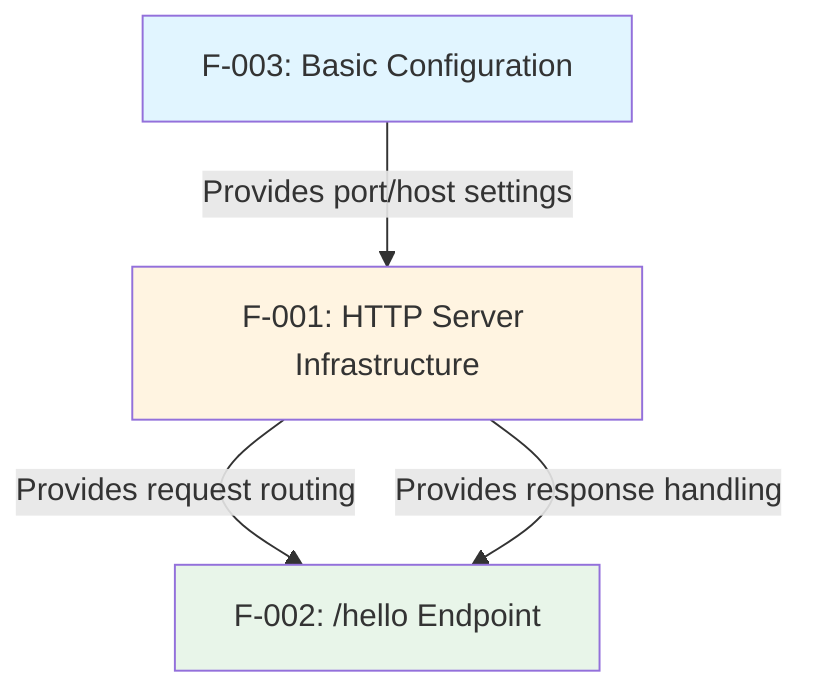
```mermaid
graph TD
    F003[F-003: Basic Configuration]
    F001[F-001: HTTP Server Infrastructure]
    F002[F-002: /hello Endpoint]
    
    F003 -->|Provides port/host settings| F001
    F001 -->|Provides request routing| F002
    F001 -->|Provides response handling| F002
    
    style F003 fill:#e1f5ff
    style F001 fill:#fff4e1
    style F002 fill:#e8f5e9
```

### 2.4.2 Integration Points

#### Configuration → Server Infrastructure Integration

**Integration Description:** The Configuration Layer provides initialization parameters to the HTTP Server Infrastructure during server creation.

**Data Flow:**
- Configuration Layer exposes port number and host address
- Server Infrastructure reads configuration values during initialization
- Server uses configuration values in `listen()` method call

**Interface Contract:**
- Configuration provides: `{port: number, host: string}`
- Server consumes: Port and host parameters in server.listen(port, host) call

**Dependencies:**
- Server cannot initialize without configuration values
- Configuration must complete before server initialization begins

---

#### Server Infrastructure → Endpoint Integration

**Integration Description:** The HTTP Server Infrastructure provides request routing and response handling capabilities that enable the /hello endpoint to process requests and generate responses.

**Data Flow:**
- Server receives incoming HTTP requests from network
- Server parses request data (method, URL, headers) into request object
- Server routes requests to endpoint handler based on URL path
- Endpoint handler accesses response object to set headers and body
- Server transmits response to client

**Interface Contract:**
- Server provides: `{request: IncomingMessage, response: ServerResponse}`
- Endpoint consumes: Request object for path matching, response object for output generation

**Dependencies:**
- Endpoint cannot function without server instance providing requests
- Server must parse request URL before endpoint can match path

---

### 2.4.3 Shared Components

#### HTTP Request Object

**Description:** Standard Node.js `http.IncomingMessage` object representing client requests

**Shared By:**
- F-001: Server Infrastructure (creates and populates request object)
- F-002: /hello Endpoint (reads method and URL properties)

**Interface Properties:**
- `method`: HTTP method string (GET, POST, etc.)
- `url`: Request URL path string
- `headers`: Key-value object of HTTP headers

---

#### HTTP Response Object

**Description:** Standard Node.js `http.ServerResponse` object for generating responses

**Shared By:**
- F-001: Server Infrastructure (creates response object and manages connection)
- F-002: /hello Endpoint (writes headers and body to response)

**Interface Methods:**
- `writeHead(statusCode, headers)`: Set response status and headers
- `end(body)`: Complete response with optional body content

---

#### Console Logging

**Description:** Standard output stream for status messages and error reporting

**Shared By:**
- F-001: Server Infrastructure (startup confirmation, error messages)
- F-003: Configuration Layer (configuration validation errors)

**Interface:**
- `console.log(message)`: Informational messages
- `console.error(message)`: Error messages

---

### 2.4.4 Feature Relationship Matrix

| From Feature | To Feature | Relationship Type | Integration Mechanism |
|--------------|------------|-------------------|----------------------|
| F-003 Configuration | F-001 Server Infrastructure | Provides | Parameter passing during initialization |
| F-001 Server Infrastructure | F-002 Endpoint | Enables | Request routing and response handling |
| F-003 Configuration | F-001 Server Infrastructure | Initializes | Configuration must complete before server starts |

---

## 2.5 Implementation Considerations

### 2.5.1 Technical Constraints

#### F-001: HTTP Server Infrastructure Constraints

**Runtime Environment:**
- Requires Node.js runtime v12.x or higher
- Depends on Node.js built-in `http` module or Express.js package
- Limited to single process (no clustering in tutorial scope)

**Port Availability:**
- Requires available network port in unprivileged range (1024-65535)
- Cannot bind to port already in use by another application
- May require OS firewall configuration on some systems

**Protocol Support:**
- HTTP/1.1 only (no HTTP/2 or HTTP/3)
- No HTTPS/TLS encryption (plain HTTP only)

---

#### F-002: /hello Endpoint Constraints

**Request Handling:**
- Handles only synchronous operations (no async I/O)
- No request body parsing (GET requests only)
- Single endpoint only (no routing table or multiple paths)

**Response Generation:**
- Plain text only (no JSON, HTML, or other content types)
- Static response (no dynamic content or template rendering)
- No streaming or chunked transfer encoding

---

#### F-003: Configuration Constraints

**Configuration Sources:**
- Environment variables and code constants only
- No external configuration files (JSON, YAML, etc.)
- No configuration reloading (requires server restart)

**Validation Capabilities:**
- Basic type and range validation only
- No schema validation or complex rule engines
- Manual validation logic in code

---

### 2.5.2 Performance Requirements

#### Response Time Requirements

| Component | Metric | Target | Validation Method |
|-----------|--------|--------|-------------------|
| Server Startup | Time to listening state | < 2 seconds | Timestamp comparison |
| Endpoint Response | Request to response complete | < 100ms | HTTP client timing |
| Configuration Load | Config read to validation | < 5ms | Code profiling |

**Rationale:** Tutorial learners require immediate feedback to maintain engagement and validate understanding. Delays longer than 2 seconds for startup or 100ms for responses create friction in the learning experience.

---

#### Throughput Requirements

| Metric | Target | Validation Method |
|--------|--------|-------------------|
| Sequential Requests | 10 requests/second | Automated client testing |
| Concurrent Requests | 5 simultaneous connections | Multi-threaded client |

**Rationale:** While production throughput is not required, the server must handle basic testing scenarios including sequential browser refreshes and simple load testing for educational exploration.

---

### 2.5.3 Scalability Considerations

#### Explicit Non-Requirements

The following scalability patterns are **intentionally excluded** from tutorial scope:

- **Horizontal Scaling:** No load balancing or multi-instance deployment
- **Vertical Scaling:** No resource allocation or performance tuning
- **Caching:** No response caching or memoization
- **Connection Pooling:** No connection management or keep-alive optimization
- **Rate Limiting:** No request throttling or quota enforcement

**Educational Note:** Future tutorials may address these patterns, but this foundational tutorial prioritizes understanding basic server mechanics over scale considerations.

---

#### Growth Path Recommendations

Tutorial learners progressing beyond this project should explore:

1. **Tutorial Level 2:** Multiple endpoints and routing tables
2. **Tutorial Level 3:** JSON APIs and request body parsing
3. **Tutorial Level 4:** Middleware patterns and request processing pipelines
4. **Production Preparation:** Deployment, monitoring, and scaling patterns

---

### 2.5.4 Security Implications

#### Security Posture

This tutorial application **does not implement security features** and is designed exclusively for local development and learning purposes.

**Explicit Security Non-Requirements:**
- No authentication or authorization
- No input validation or sanitization
- No HTTPS/TLS encryption
- No CORS configuration
- No rate limiting or DDoS protection
- No SQL injection or XSS prevention

**Important Documentation Requirement:** README documentation MUST include prominent warning that this code is for educational purposes only and should never be deployed to production environments or exposed to public networks.

---

#### Safe Usage Guidelines

To ensure safe tutorial usage:

1. **Network Binding:**
   - Recommend binding to `localhost` only (not `0.0.0.0`)
   - Prevent external network access during learning

2. **Port Selection:**
   - Use high-numbered ports (3000, 8080) to avoid privileged port conflicts
   - Document common port conflicts (e.g., if 3000 used by other dev servers)

3. **Documentation:**
   - Include "Learning Only" disclaimer in README
   - Provide security roadmap for production-bound learners

---

### 2.5.5 Maintenance Requirements

#### Code Maintainability

| Requirement | Target | Validation Method |
|-------------|--------|-------------------|
| Code Line Count | < 50 lines core application | Line counting tool |
| Cyclomatic Complexity | < 5 per function | Static analysis tool |
| Comment Density | 20-30% of lines | Manual review |

**Rationale:** High maintainability ensures the tutorial remains accessible to beginners and easy for educators to fork and customize for teaching purposes.

---

#### Documentation Maintenance

**Essential Documentation:**
1. **README.md** must include:
   - Installation prerequisites (Node.js version)
   - Step-by-step execution instructions
   - Expected output examples
   - Troubleshooting common errors (port conflicts, Node.js not found)

2. **Code Comments** must explain:
   - Purpose of each major code block
   - HTTP concepts being demonstrated (requests, responses, routing)
   - Configuration options and how to modify them

3. **Inline Examples:**
   - Console output examples
   - Browser access examples
   - curl command examples

---

#### Version Management

**Dependency Versioning:**
- If using Express.js: Pin to stable major version (e.g., `express: ^4.18.0`)
- No semantic versioning required for tutorial code itself
- Document compatible Node.js versions in README

**Update Frequency:**
- Review annually for Node.js LTS version compatibility
- Update dependencies only for critical security issues
- Maintain backward compatibility with educational materials

---

## 2.6 Requirements Traceability Matrix

The following matrix traces each requirement to its source objective and validation method:

| Requirement ID | Feature | Source Objective | Validation Method | Test Type |
|----------------|---------|------------------|-------------------|-----------|
| F-001-RQ-001 | Server Creation | Enable server fundamentals learning | Server instance instantiation test | Manual |
| F-001-RQ-002 | Port Binding | Demonstrate network concepts | Port binding success verification | Manual |
| F-001-RQ-003 | Request Acceptance | Show request/response cycle | HTTP connection test | Manual |
| F-001-RQ-004 | Startup Logging | Provide learner feedback | Console output inspection | Manual |
| F-001-RQ-005 | Error Handling | Enable self-service troubleshooting | Error scenario testing | Manual |
| F-002-RQ-001 | GET Method | Demonstrate HTTP methods | Method verification test | Manual |
| F-002-RQ-002 | Path Matching | Show routing concepts | Path-specific response test | Manual |
| F-002-RQ-003 | Response Body | Provide testable output | Response body comparison | Manual |
| F-002-RQ-004 | Response Headers | Teach HTTP header usage | Header inspection | Manual |
| F-002-RQ-005 | Response Performance | Ensure learning flow | Timing measurement | Manual |
| F-003-RQ-001 | Port Config | Enable customization | Configuration change test | Manual |
| F-003-RQ-002 | Environment Vars | Teach configuration patterns | ENV variable setting test | Manual |
| F-003-RQ-003 | Default Values | Enable zero-config execution | Default execution test | Manual |
| F-003-RQ-004 | Config Validation | Prevent configuration errors | Invalid config error test | Manual |

---

## 2.7 Testing and Validation Approach

### 2.7.1 Manual Testing Procedures

All requirements are validated through manual testing procedures suitable for tutorial learners:

#### Server Startup Validation
```
Test: Start server and verify console output
Steps:
1. Execute: node server.js (or npm start)
2. Observe console message: "Server listening on port 3000"
3. Verify no error messages appear
Expected: Server starts within 2 seconds with confirmation message
```

#### Endpoint Functionality Validation
```
Test: Access /hello endpoint and verify response
Steps:
1. Open browser to http://localhost:3000/hello
2. Observe response text: "Hello world"
3. Verify page loads without errors
Expected: "Hello world" displays within 100ms
```

#### Configuration Validation
```
Test: Change port via environment variable
Steps:
1. Execute: PORT=8080 node server.js
2. Observe console message: "Server listening on port 8080"
3. Access http://localhost:8080/hello
Expected: Server binds to new port successfully
```

#### Error Handling Validation
```
Test: Verify port conflict error handling
Steps:
1. Start server on port 3000
2. In new terminal, attempt to start second server on port 3000
3. Observe error message describing port conflict
Expected: Clear error message appears, second server exits gracefully
```

---

### 2.7.2 Acceptance Testing Checklist

Tutorial implementation is complete when all items are verified:

**Functional Requirements:**
- [ ] Server starts successfully from command line
- [ ] GET request to /hello returns "Hello world"
- [ ] HTTP status code is 200 for /hello requests
- [ ] Content-Type header is text/plain
- [ ] Response time is consistently < 100ms
- [ ] Server binds to configured port
- [ ] Environment variable PORT changes server port
- [ ] Default port is used when PORT not set
- [ ] Startup message displays port number
- [ ] Port conflict displays clear error message

**Documentation Requirements:**
- [ ] README includes installation instructions
- [ ] README includes execution instructions
- [ ] README includes usage examples (browser, curl)
- [ ] README includes expected output examples
- [ ] README includes troubleshooting section
- [ ] Code includes explanatory comments
- [ ] Security disclaimer present in README

**Quality Requirements:**
- [ ] Core application code < 50 lines
- [ ] Code is readable without advanced JavaScript knowledge
- [ ] No external dependencies (or only Express.js if framework approach)
- [ ] No errors or warnings during execution
- [ ] Works on macOS, Linux, and Windows

---

## 2.8 References

### 2.8.1 Technical Specification Sections Referenced

- **Section 1.1 Executive Summary** - Project overview, core purpose, target audience, educational value proposition
- **Section 1.2 System Overview** - System capabilities, technical approach options, success criteria, KPIs
- **Section 1.3 Scope** - In-scope features, out-of-scope elements, implementation boundaries, future considerations

### 2.8.2 Repository Files Examined

- `README.md` - Project identifier and current documentation state

### 2.8.3 Requirements Sources

- **User Context** - Node.js tutorial specification with `/hello` endpoint requirement returning "Hello world"
- **Educational Objectives** - Beginner-friendly tutorial for HTTP server fundamentals
- **Technical Constraints** - Greenfield project, minimal dependencies, < 50 lines of code
- **Success Criteria** - Testable endpoint, < 2 second startup, < 100ms response time

### 2.8.4 Standards and Conventions Referenced

- **HTTP/1.1 Specification** - HTTP method semantics, status codes, header formatting
- **Node.js API Documentation** - http module interfaces, process.env usage patterns
- **Educational Best Practices** - Immediate feedback loops, testable outcomes, clear documentation

---

# 3. Technology Stack

## 3.1 Overview

### 3.1.1 Technology Philosophy

This Node.js tutorial project embodies a **deliberately minimal technology stack** designed exclusively for educational purposes. The architectural approach prioritizes learning clarity over production completeness, feature simplicity over scalability, and immediate accessibility over comprehensive functionality. Every technology decision serves the singular objective of teaching HTTP server fundamentals to beginners without introducing unnecessary complexity or cognitive overhead.

The technology stack reflects three core principles:

1. **Minimalism by Design**: Limit dependencies to the absolute minimum required to demonstrate core concepts
2. **Educational Transparency**: Choose technologies that expose rather than abstract fundamental patterns
3. **Immediate Executability**: Ensure learners can run code within minutes of cloning the repository

This philosophy results in a technology stack that intentionally excludes numerous production-standard components (databases, authentication services, containerization, CI/CD pipelines) to maintain laser focus on the foundational HTTP request/response cycle.

### 3.1.2 Implementation Flexibility

The technical specification accommodates **two equally valid implementation approaches**, each with distinct educational trade-offs:

**Approach A - Native HTTP Module (Maximum Educational Value)**
- Zero external dependencies
- Direct exposure to Node.js HTTP primitives
- Explicit request/response handling
- Ideal for understanding foundational concepts

**Approach B - Express.js Framework (Industry Standard)**
- Minimal dependencies (1-2 npm packages)
- Framework-based routing and middleware patterns
- Industry-standard code structure
- Ideal for practical application development

Both approaches satisfy all functional requirements and success criteria. The technology stack documentation below covers both options comprehensively, noting where choices diverge.

### 3.1.3 Technology Stack Architecture

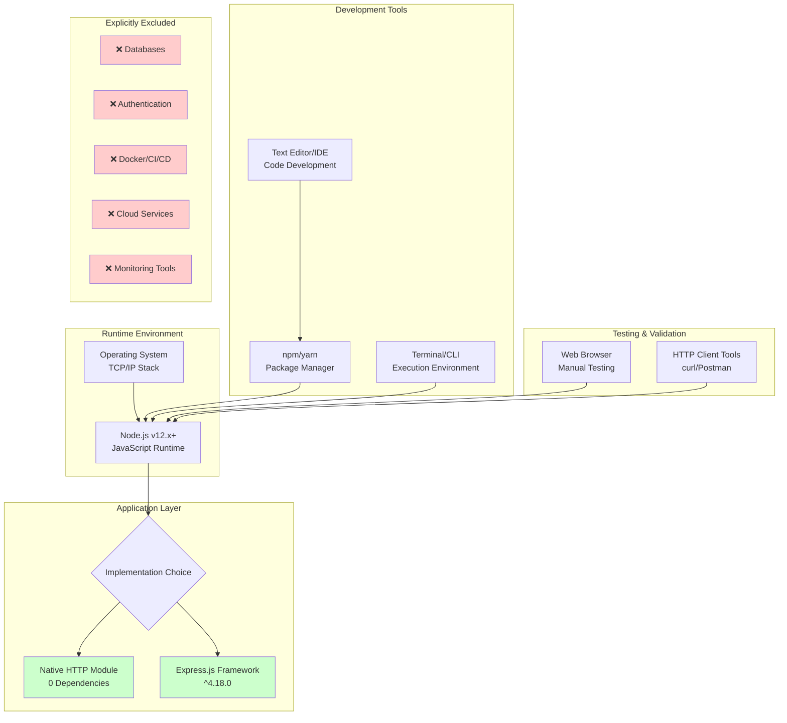
```mermaid
graph TB
    subgraph "Runtime Environment"
        A[Node.js v12.x+<br/>JavaScript Runtime]
        B[Operating System<br/>TCP/IP Stack]
    end
    
    subgraph "Application Layer"
        C{Implementation Choice}
        D[Native HTTP Module<br/>0 Dependencies]
        E[Express.js Framework<br/>^4.18.0]
    end
    
    subgraph "Development Tools"
        F[npm/yarn<br/>Package Manager]
        G[Text Editor/IDE<br/>Code Development]
        H[Terminal/CLI<br/>Execution Environment]
    end
    
    subgraph "Testing & Validation"
        I[Web Browser<br/>Manual Testing]
        J[HTTP Client Tools<br/>curl/Postman]
    end
    
    subgraph "Explicitly Excluded"
        K[❌ Databases]
        L[❌ Authentication]
        M[❌ Docker/CI/CD]
        N[❌ Cloud Services]
        O[❌ Monitoring Tools]
    end
    
    A --> C
    C --> D
    C --> E
    B --> A
    F --> A
    G --> F
    H --> A
    I --> A
    J --> A
    
    style K fill:#ffcccc
    style L fill:#ffcccc
    style M fill:#ffcccc
    style N fill:#ffcccc
    style O fill:#ffcccc
    style D fill:#ccffcc
    style E fill:#ccffcc
```

---

## 3.2 Programming Languages

### 3.2.1 Primary Language: JavaScript (Node.js)

**Language Specification:**
- **Language**: JavaScript
- **Runtime**: Node.js
- **Version Requirement**: v12.x or higher (v14.x LTS or v16.x LTS recommended)
- **Syntax Standard**: ECMAScript 2015 (ES6) or later
- **Module System**: CommonJS (`require`/`module.exports`) or ES Modules (`import`/`export`)

**Justification:**

JavaScript via Node.js serves as the exclusive programming language for this tutorial project, chosen for several compelling educational and technical reasons:

1. **Unified Language Stack**: JavaScript's presence in both browser and server environments enables learners to leverage existing language knowledge when transitioning to backend development

2. **Beginner Accessibility**: JavaScript's forgiving syntax, dynamic typing, and widespread documentation make it an ideal language for first-time server-side developers

3. **Industry Relevance**: Node.js remains a critical technology for modern web applications, ensuring tutorial knowledge translates directly to employable skills

4. **Minimal Setup Friction**: Node.js runtime installation provides a complete development environment without additional compiler toolchains or complex build systems

5. **HTTP Module Availability**: Node.js includes a robust built-in `http` module, enabling HTTP server creation without mandatory external dependencies

**Version Rationale:**

The minimum version requirement of Node.js v12.x balances compatibility with modern feature availability:

- **v12.x Minimum**: Provides ES6+ support including arrow functions, template literals, destructuring, and async/await patterns critical for readable tutorial code
- **v14.x/v16.x Recommended**: LTS (Long Term Support) releases ensure stability and security updates throughout the tutorial's educational lifecycle
- **No Maximum Version**: Future Node.js releases maintain backward compatibility with v12.x+ code patterns used in this tutorial

**Module System Flexibility:**

Both CommonJS and ES Modules remain valid for this tutorial:

**CommonJS (Traditional):**
```javascript
const http = require('http');
module.exports = server;
```

**ES Modules (Modern):**
```javascript
import http from 'http';
export default server;
```

The technical specification does not mandate one approach over the other, allowing educators to align with their preferred teaching methodology or organizational standards.

### 3.2.2 No Additional Languages

This tutorial project uses **exclusively JavaScript**. The following languages are explicitly not included:

- ❌ TypeScript (no type checking or compilation step)
- ❌ Python, Ruby, Go, Java (single-language focus)
- ❌ Shell scripting (beyond basic `node server.js` execution)
- ❌ HTML/CSS (server-only, no frontend rendering)

**Rationale**: Multiple language requirements would fragment learner attention and contradict the minimalist tutorial philosophy. All functionality achieves implementation through pure JavaScript without supplementary languages.

---

## 3.3 Frameworks & Libraries

### 3.3.1 Core Framework Options

The tutorial specification accommodates two implementation approaches with distinct framework choices:

#### Option A: Native HTTP Module (Recommended for Educational Value)

**Framework**: Node.js Built-in `http` Module

**Version**: Included with Node.js runtime (no separate versioning)

**Dependencies**: Zero (0) external packages

**Implementation Pattern:**
```javascript
const http = require('http');

const server = http.createServer((req, res) => {
  if (req.url === '/hello') {
    res.writeHead(200, { 'Content-Type': 'text/plain' });
    res.end('Hello world');
  }
});

server.listen(3000, () => {
  console.log('Server listening on port 3000');
});
```

**Educational Advantages:**
1. **Conceptual Transparency**: Exposes low-level HTTP concepts including request objects, response streams, header manipulation, and status codes
2. **Zero Abstraction**: Learners see explicit request/response handling without framework magic
3. **No Dependency Management**: Eliminates package installation steps and dependency conflicts
4. **Foundation Knowledge**: Provides understanding applicable to any Node.js framework or library

**Constraints:**
- Manual request parsing and routing logic
- Explicit header and status code management
- No middleware patterns or request preprocessing

**Justification**: The native HTTP module approach maximizes educational value by removing framework abstractions that can obscure fundamental HTTP mechanics. Learners gain deep understanding of request/response cycles, header management, and server lifecycle—knowledge that transfers to any web framework they encounter in future development.

#### Option B: Express.js Framework (Industry Standard)

**Framework**: Express.js

**Version**: ^4.18.0 (pinned to stable major version 4.x)

**Dependencies**: 1 direct dependency + transitive dependencies from Express

**Package Installation:**
```json
{
  "dependencies": {
    "express": "^4.18.0"
  }
}
```

**Implementation Pattern:**
```javascript
const express = require('express');
const app = express();

app.get('/hello', (req, res) => {
  res.send('Hello world');
});

app.listen(3000, () => {
  console.log('Server listening on port 3000');
});
```

**Educational Advantages:**
1. **Industry Alignment**: Demonstrates real-world patterns used in production applications
2. **Simplified Routing**: Built-in route matching reduces boilerplate code
3. **Framework Foundation**: Provides scalable base for future tutorial expansion (middleware, JSON APIs)
4. **Community Standard**: Express.js remains the most widely adopted Node.js web framework

**Constraints:**
- Introduces dependency management complexity
- Abstracts underlying HTTP mechanics
- Requires npm/yarn package installation

**Justification**: Express.js represents industry-standard Node.js development practices. While it abstracts some fundamental concepts, it provides learners with immediately transferable skills applicable to professional development environments. The framework's simplified routing syntax reduces code complexity while maintaining functional clarity.

### 3.3.2 Version Specifications and Compatibility

**Express.js Version Rationale (if used):**

- **Version 4.x**: Mature, stable release with extensive documentation and community support
- **^4.18.0 Minimum**: Ensures security patches and bug fixes from 2022 onwards
- **Caret Range (^)**: Allows automatic patch and minor version updates while preventing breaking changes from major version upgrades
- **No Version 5.x Migration**: Version 5 remains in alpha/beta, making version 4.x the production-stable choice

**Compatibility Matrix:**

| Component | Version | Compatibility Notes |
|-----------|---------|---------------------|
| Node.js Runtime | v12.x - v18.x+ | Express.js 4.x supports all Node.js LTS releases |
| npm Package Manager | v6.x+ | Included with Node.js v12.x+ |
| Operating Systems | macOS, Linux, Windows | Cross-platform Node.js compatibility |

### 3.3.3 Supporting Libraries

**Total Supporting Libraries: Zero (0)**

This tutorial project includes **no additional libraries** beyond the core framework choice. The following commonly used libraries are explicitly excluded:

**HTTP Utilities:**
- ❌ `axios` or `node-fetch` (no outbound HTTP requests)
- ❌ `body-parser` (no request body parsing required)
- ❌ `cors` (no cross-origin resource sharing)

**Utility Libraries:**
- ❌ `lodash` or `underscore` (no utility function needs)
- ❌ `dotenv` (environment variables accessed via `process.env` directly)
- ❌ `config` or `convict` (no configuration management libraries)

**Logging & Monitoring:**
- ❌ `winston` or `bunyan` (uses `console.log` only)
- ❌ `morgan` (no HTTP request logging middleware)

**Testing Libraries:**
- ❌ `jest`, `mocha`, `chai` (manual testing only)
- ❌ `supertest` (no automated endpoint testing)

**Validation & Security:**
- ❌ `joi` or `yup` (no input validation)
- ❌ `helmet` (no security headers middleware)
- ❌ `express-validator` (no request validation)

**Rationale**: Each additional library increases cognitive load for learners, introduces version management complexity, and dilutes focus from the core HTTP concepts. The tutorial's scope explicitly limits functionality to a single endpoint with static response, eliminating all use cases for supporting libraries.

---

## 3.4 Open Source Dependencies

### 3.4.1 Dependency Count by Implementation Approach

**Approach A (Native HTTP Module):**
- **Direct Dependencies**: 0
- **Transitive Dependencies**: 0
- **Total Package Count**: 0

**Approach B (Express.js Framework):**
- **Direct Dependencies**: 1 (`express`)
- **Transitive Dependencies**: ~30-50 (Express.js framework dependencies)
- **Total Package Count**: ~31-51 packages

**Dependency Count Constraint**: The technical specification mandates 0-2 npm packages as direct dependencies, ensuring minimal complexity and setup friction. Both implementation approaches satisfy this requirement.

### 3.4.2 Package Registry and Distribution

**Package Registry**: npm (Node Package Manager) official registry
- **Registry URL**: https://registry.npmjs.org/
- **Package Source**: Public npm registry (no private package requirements)

**Package Manager Options:**
1. **npm** (Node Package Manager): Bundled with Node.js runtime, default choice
2. **yarn**: Alternative package manager with faster installation, optional

**Installation Process:**

**For Native HTTP Approach:**
```bash
# No package installation required
node server.js
```

**For Express.js Approach:**
```bash
npm install express
# or
yarn add express
```

### 3.4.3 Dependency Version Management

**Version Pinning Strategy:**

The technical specification requires pinning Express.js (if used) to a stable major version to prevent breaking changes from automatic updates:

**package.json Example:**
```json
{
  "name": "nodejs-hello-tutorial",
  "version": "1.0.0",
  "description": "Node.js HTTP server tutorial with /hello endpoint",
  "main": "server.js",
  "dependencies": {
    "express": "^4.18.0"
  }
}
```

**Semantic Versioning Interpretation:**
- **Caret (^)**: `^4.18.0` allows updates to 4.18.x and 4.x.x (patches and minor releases)
- **Prevents**: Automatic upgrade to Express.js 5.x (breaking changes)
- **Update Policy**: Manual dependency updates only for critical security patches

### 3.4.4 Dependency Audit and Security

**Security Considerations:**

Given the tutorial's local-only, educational context, comprehensive security auditing is not required. However, basic dependency hygiene remains important:

**npm Audit (if using Express.js):**
```bash
npm audit
```

**Expected Outcome**: Express.js 4.18.0+ should show zero high or critical vulnerabilities. If vulnerabilities appear, update to latest 4.x patch version.

**No Automated Scanning**: The project excludes CI/CD pipelines, automated security scanning, and dependency monitoring tools (Dependabot, Snyk) to maintain tutorial simplicity.

**Security Warning**: Per technical specification section 2.5.4, README documentation must include prominent warning that this code serves educational purposes only and should never be deployed to production environments.

### 3.4.5 License Compliance

**Express.js License**: MIT License
- **Usage Rights**: Unrestricted use, modification, distribution
- **Attribution**: Requires license notice preservation
- **Compatibility**: No license conflicts for educational use

**Node.js License**: MIT License
- **Usage Rights**: Unrestricted use, modification, distribution
- **Attribution**: Requires license notice preservation

**Tutorial Project License**: Not specified in technical requirements (typically MIT or Apache 2.0 for open educational resources)

---

## 3.5 Third-Party Services

### 3.5.1 External Service Integration

**Total Third-Party Services: Zero (0)**

This tutorial project operates as a **completely self-contained system** with no external service dependencies, API integrations, or cloud platform requirements.

### 3.5.2 Explicitly Excluded Services

The technical specification section 1.3.2 provides an extensive list of third-party services intentionally excluded from this tutorial:

**Authentication & Authorization Services:**
- ❌ Auth0 (no authentication required)
- ❌ Okta (no identity management)
- ❌ Firebase Authentication (no user accounts)
- ❌ AWS Cognito (no user pools)
- ❌ OAuth providers (Google, GitHub, Facebook)

**Cloud Platforms & Infrastructure:**
- ❌ AWS (Amazon Web Services)
- ❌ Google Cloud Platform (GCP)
- ❌ Microsoft Azure
- ❌ Heroku, Vercel, Netlify (no deployment platforms)
- ❌ DigitalOcean, Linode (no hosting services)

**Monitoring & Observability:**
- ❌ DataDog, New Relic (no APM services)
- ❌ Sentry, Rollbar (no error tracking)
- ❌ LogRocket, FullStory (no session replay)
- ❌ CloudWatch, Stackdriver (no log aggregation)

**External APIs:**
- ❌ No REST API integrations
- ❌ No GraphQL API calls
- ❌ No third-party data sources
- ❌ No webhook receivers or senders

**Communication Services:**
- ❌ SendGrid, Mailgun (no email services)
- ❌ Twilio (no SMS/telephony)
- ❌ Slack, Discord (no chat integrations)
- ❌ Push notification services (Firebase Cloud Messaging, Apple Push Notification Service)

**Payment & Commerce:**
- ❌ Stripe, PayPal (no payment processing)
- ❌ No e-commerce integrations

**Analytics & Tracking:**
- ❌ Google Analytics (no usage tracking)
- ❌ Mixpanel, Amplitude (no event analytics)
- ❌ No user behavior tracking

### 3.5.3 Rationale for Service Exclusion

The complete absence of third-party services aligns with the tutorial's core educational philosophy:

1. **Simplified Learning Path**: External services introduce authentication complexity, API documentation requirements, and network dependency management—all beyond the tutorial's HTTP fundamentals scope

2. **Zero Account Requirements**: Learners can complete the tutorial without creating accounts, providing API keys, or managing credentials

3. **Immediate Executability**: No service registration, approval workflows, or billing setup delays the learning experience

4. **Offline Capability**: The tutorial runs entirely on localhost without internet connectivity requirements

5. **Cost-Free Learning**: No service subscriptions, free tier limitations, or credit card requirements create barriers to entry

### 3.5.4 Network Communication

**Inbound Connections Only:**
- Server listens on localhost for HTTP GET requests
- No outbound HTTP/HTTPS requests to external services
- No websocket connections, server-sent events, or streaming protocols

**Network Boundaries:**
- Local loopback interface (127.0.0.1) recommended
- Optional 0.0.0.0 binding for local network access
- No public internet exposure required or recommended

---

## 3.6 Databases & Storage

### 3.6.1 Data Persistence

**Total Databases: Zero (0)**

**Total Storage Systems: Zero (0)**

This tutorial project implements **zero data persistence**. All request handling operates in a stateless, ephemeral manner with no data reads, writes, or state management.

### 3.6.2 Explicitly Excluded Database Technologies

The technical specification section 1.3.2 explicitly excludes all database and storage systems:

**Relational Databases:**
- ❌ PostgreSQL (no SQL database connectivity)
- ❌ MySQL (no relational data storage)
- ❌ SQLite (no embedded database)
- ❌ Microsoft SQL Server (no enterprise database)
- ❌ Oracle Database (no commercial database)

**NoSQL Databases:**
- ❌ MongoDB (no document store)
- ❌ Redis (no key-value store or caching)
- ❌ Cassandra (no wide-column store)
- ❌ DynamoDB (no managed NoSQL)
- ❌ CouchDB (no document database)

**In-Memory Data Stores:**
- ❌ Redis (no caching layer)
- ❌ Memcached (no distributed cache)
- ❌ In-memory JavaScript objects (no application-level state)

**File System Storage:**
- ❌ No file reads or writes
- ❌ No log file persistence
- ❌ No configuration file storage
- ❌ No uploaded file handling

**Object Storage:**
- ❌ AWS S3 (no object storage)
- ❌ Google Cloud Storage (no blob storage)
- ❌ Azure Blob Storage (no cloud storage)

**Time-Series Databases:**
- ❌ InfluxDB (no metrics storage)
- ❌ TimescaleDB (no time-series data)

**Search Engines:**
- ❌ Elasticsearch (no full-text search)
- ❌ Solr (no search indexing)

### 3.6.3 Data Management Approach

**Static Response Pattern:**

The `/hello` endpoint returns a hardcoded string constant with zero data operations:

```javascript
// Response is compile-time constant, not data-driven
res.send('Hello world');
```

**No Data Operations:**
- ❌ No CREATE operations (INSERT, POST)
- ❌ No READ operations (SELECT, GET from storage)
- ❌ No UPDATE operations (UPDATE, PUT, PATCH)
- ❌ No DELETE operations (DELETE, DROP)

**Stateless Request Handling:**

Each HTTP request processes independently with no shared state:
- No session storage or session IDs
- No request correlation or tracking
- No user state or authentication tokens
- No rate limiting counters or request history

### 3.6.4 Rationale for Storage Exclusion

The complete absence of databases and storage aligns with several tutorial design principles:

1. **Conceptual Focus**: Data persistence introduces distinct concepts (CRUD operations, schema design, connection management) that distract from HTTP fundamentals

2. **Setup Simplicity**: Database installation, configuration, and connection management add significant setup friction for beginners

3. **Minimal Dependencies**: Database drivers and ORMs constitute major dependencies contradicting the 0-2 package constraint

4. **Immediate Testability**: Static responses enable instant validation without database seeding or test data management

5. **Tutorial Scope Limitation**: The single `/hello` endpoint with "Hello world" response requires no dynamic content or data storage

### 3.6.5 Future Tutorial Progression

While this foundational tutorial excludes all data persistence, the technical specification section 1.3.2 acknowledges future tutorial iterations may address:

- **Tutorial Level 3**: JSON API responses with in-memory data structures
- **Tutorial Level 4**: File system read operations for configuration
- **Tutorial Level 5**: Database connectivity and basic CRUD operations

These advanced topics remain intentionally out of scope for the current HTTP fundamentals tutorial.

---

## 3.7 Development & Deployment

### 3.7.1 Development Environment

**Required Development Tools:**

1. **Node.js Runtime**
   - **Version**: v12.x or higher (v14.x LTS or v16.x LTS recommended)
   - **Installation**: Official Node.js installer from nodejs.org
   - **Verification**: `node --version` should output v12.x or higher
   - **Purpose**: JavaScript execution environment and HTTP module provider

2. **Package Manager**
   - **Options**: npm (bundled with Node.js) or yarn (optional alternative)
   - **Version**: npm v6.x+ (included with Node.js v12.x+)
   - **Purpose**: Dependency installation for Express.js approach (if used)
   - **Note**: Not required for native HTTP module approach

3. **Text Editor or IDE**
   - **Options**: Any code editor (VS Code, Sublime Text, Atom, Vim, etc.)
   - **Requirements**: Basic JavaScript syntax highlighting recommended
   - **Purpose**: Code creation and modification
   - **Configuration**: No special editor plugins or extensions required

4. **Terminal/Command-Line Interface**
   - **Options**: System terminal, iTerm2, Windows Terminal, PowerShell
   - **Purpose**: Server execution via `node server.js` command
   - **Requirements**: Basic shell navigation and command execution

**Optional Development Tools:**

- **HTTP Client Tools**: curl, Postman, Insomnia, HTTP client browser extensions (for endpoint testing)
- **Web Browser**: Chrome, Firefox, Safari, Edge (for visual endpoint validation)
- **Version Control**: Git (for code versioning, optional for tutorial completion)

**Explicitly Excluded Development Tools:**

- ❌ Docker Desktop (no containerization)
- ❌ Kubernetes CLI (no orchestration)
- ❌ Database clients (no data persistence)
- ❌ API documentation tools (Swagger UI, Postman collections)
- ❌ Code linters (ESLint, JSHint) - optional but not required
- ❌ Code formatters (Prettier) - optional but not required

### 3.7.2 Build System

**Build Process: Not Applicable**

This tutorial project requires **zero build steps**. The implementation uses plain JavaScript executed directly by the Node.js runtime without transpilation, compilation, bundling, or asset processing.

**No Build Tools Required:**

- ❌ Webpack (no module bundling)
- ❌ Rollup (no library bundling)
- ❌ Parcel (no zero-config bundling)
- ❌ esbuild (no JavaScript bundling)
- ❌ Babel (no transpilation from modern to legacy JavaScript)
- ❌ TypeScript compiler (no type checking or .ts to .js compilation)
- ❌ Task runners (Gulp, Grunt)
- ❌ npm scripts (beyond optional `npm start` for convenience)

**Development Workflow:**

```bash
# 1. Create server.js file (or download from tutorial)
# 2. Execute directly with Node.js
node server.js

#### Test endpoint
curl http://localhost:3000/hello

#### Modify code and restart server (Ctrl+C, then node server.js)
```

**Rationale**: Build systems introduce significant complexity including configuration files, build pipelines, error debugging, and mental model overhead. Direct JavaScript execution eliminates all build-related friction while demonstrating Node.js's capability to run source code without intermediate build steps.

### 3.7.3 Containerization

**Docker: Not Included**

**Container Technologies: Zero (0)**

The technical specification section 1.3.2 explicitly excludes Docker containerization and all related technologies:

**Excluded Container Technologies:**
- ❌ Docker Desktop (no container runtime)
- ❌ Docker Compose (no multi-container orchestration)
- ❌ Dockerfile (no container image definition)
- ❌ .dockerignore (no container build context filtering)
- ❌ Kubernetes (no container orchestration)
- ❌ Podman, LXC, containerd (no alternative container runtimes)

**Rationale for Containerization Exclusion:**

1. **Tutorial Scope Limitation**: Docker introduces concepts (images, containers, volumes, networks) orthogonal to HTTP server fundamentals

2. **Setup Complexity**: Docker Desktop installation, daemon configuration, and image building add significant setup overhead for beginners

3. **Local Development Focus**: The tutorial targets direct localhost execution without deployment or environment isolation requirements

4. **Dependency Minimalism**: Container technologies constitute major infrastructure additions contradicting the minimalist philosophy

**Deployment Model**: Local development machine execution only. No containerized deployment, no container registries (Docker Hub, ECR, GCR), no container orchestration platforms.

### 3.7.4 Continuous Integration & Continuous Deployment (CI/CD)

**CI/CD Pipeline: Not Included**

**Total CI/CD Tools: Zero (0)**

The technical specification section 1.3.2 explicitly excludes all continuous integration and deployment infrastructure:

**Excluded CI/CD Platforms:**
- ❌ GitHub Actions (no automated workflows)
- ❌ Jenkins (no CI server)
- ❌ CircleCI (no pipeline orchestration)
- ❌ Travis CI (no automated testing)
- ❌ GitLab CI (no integrated CI/CD)
- ❌ Azure DevOps (no Microsoft CI/CD)
- ❌ AWS CodePipeline (no AWS CI/CD)

**Excluded CI/CD Components:**
- ❌ Automated testing pipelines (no test execution on commit)
- ❌ Build automation (no automated build triggers)
- ❌ Deployment automation (no automated production deployments)
- ❌ Environment provisioning (no infrastructure automation)
- ❌ Configuration management (no Ansible, Chef, Puppet)

**Testing Approach**: Manual testing only using web browser and HTTP client tools as documented in technical specification section 1.3.1.

**Rationale for CI/CD Exclusion:**

1. **Educational Focus**: CI/CD concepts (pipeline stages, automated testing, deployment strategies) remain beyond the HTTP fundamentals tutorial scope

2. **Local-Only Execution**: The tutorial has no deployment target, eliminating continuous deployment requirements

3. **No Automated Tests**: With manual testing only, no automated test execution pipeline exists to integrate

4. **Simplified Workflow**: Direct code modification and local execution provide immediate feedback without pipeline complexity

### 3.7.5 Infrastructure as Code

**Infrastructure Provisioning: Not Applicable**

**IaC Tools: Zero (0)**

The technical specification section 1.3.2 explicitly excludes all infrastructure as code technologies:

**Excluded IaC Technologies:**
- ❌ Terraform (no infrastructure provisioning)
- ❌ CloudFormation (no AWS resource management)
- ❌ Pulumi (no cloud infrastructure)
- ❌ Ansible (no configuration management)
- ❌ Chef, Puppet (no server configuration)

**Rationale**: The tutorial runs exclusively on learners' local development machines without cloud infrastructure, virtual machines, or network configuration requirements. No infrastructure provisioning, modification, or management occurs.

### 3.7.6 Testing Infrastructure

**Automated Testing: Not Included**

**Testing Frameworks: Zero (0)**

The technical specification sections 1.3.1 and 1.3.2 mandate manual testing only, explicitly excluding all automated testing infrastructure:

**Excluded Testing Frameworks:**
- ❌ Jest (no unit testing framework)
- ❌ Mocha (no test runner)
- ❌ Chai (no assertion library)
- ❌ Jasmine (no BDD framework)
- ❌ AVA, tape (no alternative test runners)

**Excluded Testing Tools:**
- ❌ SuperTest (no HTTP endpoint testing)
- ❌ Cypress (no end-to-end testing)
- ❌ Selenium (no browser automation)
- ❌ Puppeteer (no headless browser testing)

**Excluded Testing Infrastructure:**
- ❌ Test coverage tools (Istanbul, NYC)
- ❌ Code quality gates (SonarQube)
- ❌ Performance testing (k6, Artillery)
- ❌ Load testing (JMeter, Gatling)

**Manual Testing Approach:**

Per technical specification section 1.3.1, testing occurs through:

1. **Web Browser Access**: Navigate to `http://localhost:3000/hello` and verify "Hello world" response
2. **HTTP Client Tools**: Use curl, Postman, or similar tools to send GET requests and inspect responses
3. **Console Output**: Verify server startup messages confirming listening state

**Rationale**: Automated testing frameworks introduce test-writing overhead, assertion syntax learning curves, and test runner configuration complexity. For a single endpoint with static response, manual browser testing provides sufficient validation while maintaining tutorial simplicity.

### 3.7.7 Version Control

**Version Control System: Git (Optional)**

**Repository Hosting**: Not specified (GitHub, GitLab, Bitbucket, or local repositories all valid)

**Version Control Requirements:**

The tutorial project includes basic Git infrastructure:
- `.git` directory present in repository
- Version history for tutorial code
- No specific branching strategy or Git workflow required

**Git Usage for Learners:**
- **Optional for Tutorial Completion**: Learners can complete tutorial without Git knowledge
- **Recommended for Experimentation**: Version control enables safe code experimentation and rollback
- **No Git Requirements**: No commit conventions, branch protection, or pull request workflows required

**Excluded Version Control Features:**
- ❌ Git hooks (pre-commit, pre-push)
- ❌ Branch protection rules
- ❌ Code review requirements
- ❌ Commit message linting
- ❌ Conventional Commits enforcement

### 3.7.8 Deployment Environment

**Deployment: Not Applicable**

**Target Environment: Local Development Machine Only**

The technical specification sections 1.3.2 and 2.5.4 explicitly limit execution to local development environments:

**Excluded Deployment Targets:**
- ❌ Production servers (no production deployment)
- ❌ Staging environments (no pre-production testing)
- ❌ Cloud platforms (AWS, GCP, Azure)
- ❌ Platform-as-a-Service (Heroku, Vercel, Netlify)
- ❌ Virtual private servers (DigitalOcean, Linode)
- ❌ Shared hosting (cPanel, Plesk)

**Excluded Deployment Technologies:**
- ❌ Reverse proxies (nginx, Apache)
- ❌ Load balancers (HAProxy, AWS ELB)
- ❌ Process managers (PM2, systemd)
- ❌ SSL/TLS certificates (Let's Encrypt, commercial CAs)
- ❌ CDN integration (CloudFront, Cloudflare)

**Network Configuration:**
- **Binding**: localhost (127.0.0.1) recommended
- **Port**: 3000 or 8080 (user-configurable via environment variable)
- **Protocol**: HTTP only (no HTTPS)
- **Access**: Local machine only (no public internet exposure)

**Critical Security Warning**: Per technical specification section 2.5.4, README documentation MUST include prominent warning:

> "This code is for educational purposes only and should never be deployed to production environments or exposed to public networks. The implementation lacks security features (authentication, HTTPS, input validation) required for production use."

**Deployment Guidance for Future Learning**: While production deployment remains out of scope, the technical specification acknowledges future tutorials may address deployment topics as separate learning modules.

### 3.7.9 Development Workflow Summary

**Complete Development Cycle:**

```bash
# 1. Prerequisites Check
node --version  # Verify Node.js v12.x+ installed

##### 2A. Native HTTP Approach - No Installation
node server.js

##### 2B. Express.js Approach - Install Dependency
npm install express
node server.js

#### Verify Server Startup
#### Console output: "Server listening on port 3000"

#### Test Endpoint
curl http://localhost:3000/hello
#### Expected output: Hello world

#### Code Modifications
#### Edit server.js in text editor

#### Restart Server
#### Ctrl+C to stop, then node server.js to restart

#### Retest Endpoint
curl http://localhost:3000/hello
```

**Total Development Time**: < 2 minutes from code creation to verified endpoint response

---

## 3.8 Technology Stack Constraints & Justifications

### 3.8.1 Architectural Constraints

**Hard Constraints from Technical Specification:**

| Constraint Category | Specific Limitation | Technical Specification Reference |
|---------------------|---------------------|----------------------------------|
| Dependency Count | 0-2 npm packages maximum | Section 1.2.3, 2.5.5 |
| Code Complexity | < 50 lines core application code | Section 2.5.5 |
| Runtime Version | Node.js v12.x minimum | Section 2.5.1 |
| Protocol Support | HTTP/1.1 only (no HTTPS, HTTP/2) | Section 2.5.1 |
| Database Usage | Zero databases | Section 1.3.2 |
| External Services | Zero third-party services | Section 1.3.2 |
| Deployment | Local development only | Section 2.5.4 |
| Testing | Manual testing only | Section 1.3.1, 1.3.2 |

These constraints enforce the minimalist educational philosophy by eliminating technology choices that would introduce complexity beyond HTTP fundamentals.

### 3.8.2 Technology Selection Rationale

**Why Node.js?**
- Unified JavaScript ecosystem (learners already know language from frontend)
- Built-in HTTP module enables zero-dependency implementation
- Industry relevance (Node.js critical for modern backend development)
- Minimal setup friction (single runtime installation)
- Extensive documentation and learning resources

**Why Native HTTP Module vs Express.js?**
- **Native HTTP**: Maximizes educational transparency by exposing low-level concepts
- **Express.js**: Represents industry-standard practices for professional development
- **Both Valid**: Technical specification accommodates both approaches equally

**Why Zero Databases?**
- Tutorial focuses exclusively on HTTP request/response cycle
- Database connectivity introduces orthogonal concepts (connection management, query languages)
- Static "Hello world" response requires no dynamic data
- Database installation creates setup friction for beginners

**Why No Docker/CI/CD?**
- Container and pipeline concepts remain beyond HTTP fundamentals scope
- Local development execution provides immediate feedback without infrastructure complexity
- Tutorial code not intended for deployment (no deployment pipeline needed)
- Containerization adds mental overhead without educational value for this scope

**Why No Testing Frameworks?**
- Single endpoint with static response validates easily through manual browser testing
- Automated testing introduces test-writing syntax and framework configuration overhead
- Manual testing approach aligns with beginner skill level
- Test frameworks contradict 0-2 dependency constraint

### 3.8.3 Performance Considerations

**Performance Requirements from Technical Specification:**

| Performance Metric | Target Value | Technology Impact |
|--------------------|--------------|-------------------|
| Server Startup Time | < 2 seconds | Minimal dependencies enable instant initialization |
| Endpoint Response Time | < 100ms | Static string response with zero I/O achieves sub-millisecond latency |
| Sequential Throughput | 10 requests/second | Node.js event loop handles easily without optimization |
| Concurrent Connections | 5 simultaneous | Default Node.js HTTP server supports requirement |

**Technology Stack Performance Characteristics:**

- **Node.js Runtime**: Single-threaded event loop architecture provides sufficient performance for tutorial scope
- **No Database Latency**: Zero database queries eliminate primary performance bottleneck
- **Static Responses**: Hardcoded string response avoids computation or I/O overhead
- **Minimal Middleware**: Native HTTP approach has zero middleware overhead; Express.js minimal routing overhead negligible

**Performance Non-Requirements:**
- No load balancing (single instance sufficient)
- No caching (static response requires no memoization)
- No connection pooling (no database connections)
- No clustering (single process sufficient for educational load)

### 3.8.4 Security Considerations

**Security Posture: Educational Use Only**

Per technical specification section 2.5.4, this tutorial application **deliberately excludes all security features**:

**Excluded Security Technologies:**
- ❌ Authentication (no user identity verification)
- ❌ Authorization (no access control)
- ❌ HTTPS/TLS (plain HTTP only)
- ❌ Input validation (no request sanitization)
- ❌ Rate limiting (no throttling)
- ❌ CORS configuration (no cross-origin policies)
- ❌ Security headers (no helmet.js or CSP)
- ❌ SQL injection prevention (no database, n/a)
- ❌ XSS prevention (no HTML rendering, n/a)

**Safe Usage Guidelines:**

1. **Network Binding**: Bind to localhost (127.0.0.1) to prevent external network access
2. **No Public Exposure**: Never expose tutorial server to public internet
3. **Educational Context Only**: Use exclusively for learning, never production traffic
4. **README Warning**: Documentation must include security disclaimer

**Technology Stack Security Implications:**

- **Node.js Runtime**: Uses stable LTS releases with security patch support
- **Express.js 4.x** (if used): Mature version with known security characteristics
- **No External Services**: Zero third-party service attack surface
- **No Data Persistence**: No database compromise risk (no database exists)

### 3.8.5 Maintainability & Future Evolution

**Maintenance Requirements:**

| Maintenance Activity | Frequency | Effort |
|----------------------|-----------|--------|
| Node.js Version Updates | Annually (follow LTS releases) | Update README with new recommended version |
| Express.js Updates | Annually for patch versions | Update package.json version number |
| Dependency Security Audits | Quarterly (if using Express.js) | Run `npm audit`, update if needed |
| Documentation Updates | As needed for clarity | Update README based on learner feedback |

**Technology Stack Stability:**

- **Node.js**: LTS releases provide multi-year stability guarantees
- **Express.js 4.x**: Mature major version with minimal breaking changes
- **HTTP Protocol**: HTTP/1.1 standard stable since 1999
- **JavaScript ES6+**: Syntax features stable and widely supported

**Future Tutorial Progression:**

While this foundational tutorial maintains minimal technology stack, future iterations may introduce:

1. **Tutorial Level 2**: Add `express.Router()` for multiple endpoints
2. **Tutorial Level 3**: Add `body-parser` for JSON request handling
3. **Tutorial Level 4**: Add database driver (pg, mongodb, mysql2)
4. **Tutorial Level 5**: Add authentication library (passport.js, jsonwebtoken)

Current technology decisions provide stable foundation for incremental complexity additions.

---

## 3.9 Technology Stack Not Applicable

### 3.9.1 Frontend Technologies

This tutorial project is **server-only** with no frontend components:

**Excluded Frontend Technologies:**
- ❌ React, Vue, Angular, Svelte (no frontend frameworks)
- ❌ HTML templates (no server-side rendering)
- ❌ CSS frameworks (TailwindCSS, Bootstrap) - no styling
- ❌ JavaScript bundlers (Webpack, Rollup) - no client-side JavaScript
- ❌ Asset pipelines (image optimization, CSS preprocessing)

**Rationale**: The `/hello` endpoint returns plain text without HTML rendering, eliminating all frontend technology requirements.

### 3.9.2 Mobile Technologies

No mobile application components exist:

**Excluded Mobile Technologies:**
- ❌ React Native (no mobile framework)
- ❌ Swift/Kotlin (no native mobile development)
- ❌ Flutter/Xamarin (no cross-platform mobile)
- ❌ Mobile backend services (Firebase, AWS Amplify)

### 3.9.3 API Documentation Tools

No API documentation generation:

**Excluded Documentation Tools:**
- ❌ Swagger/OpenAPI (no API specification)
- ❌ Postman Collections (no automated documentation)
- ❌ API Blueprint, RAML (no schema languages)

**Rationale**: Single endpoint with plain text response documented entirely in README without structured API documentation needs.

### 3.9.4 Observability & Monitoring

No production observability infrastructure:

**Excluded Monitoring Technologies:**
- ❌ Application Performance Monitoring (DataDog, New Relic)
- ❌ Error tracking (Sentry, Rollbar)
- ❌ Log aggregation (Elasticsearch, Splunk)
- ❌ Metrics collection (Prometheus, Grafana)
- ❌ Distributed tracing (Jaeger, Zipkin)

**Rationale**: Local development execution with manual testing eliminates production monitoring requirements.

---

## 3.10 References

### 3.10.1 Technical Specification Sections

The following Technical Specification sections provided authoritative guidance for technology stack decisions:

- **Section 1.1 Executive Summary** - Educational objectives and project overview
- **Section 1.2 System Overview** - Implementation approaches and architecture
- **Section 1.3 Scope** - In-scope and out-of-scope technology boundaries
- **Section 2.2 Feature Catalog** - Feature dependencies and technical requirements
- **Section 2.5 Implementation Considerations** - Version requirements, performance targets, security implications

### 3.10.2 Official Documentation Sources

**Node.js Official Resources:**
- Node.js Official Website: https://nodejs.org/
- Node.js HTTP Module Documentation: https://nodejs.org/api/http.html
- Node.js LTS Release Schedule: https://nodejs.org/en/about/releases/

**Express.js Official Resources:**
- Express.js Official Website: https://expressjs.com/
- Express.js 4.x API Documentation: https://expressjs.com/en/4x/api.html
- Express.js GitHub Repository: https://github.com/expressjs/express

**npm Package Manager:**
- npm Official Website: https://www.npmjs.com/
- Express.js Package Page: https://www.npmjs.com/package/express

### 3.10.3 Technology Standards

- **HTTP/1.1 Protocol**: RFC 2616 and RFC 7230-7235 (IETF Standards)
- **JavaScript Language Specification**: ECMAScript 2015 (ES6) and later
- **Semantic Versioning**: https://semver.org/ (version numbering specification)

### 3.10.4 Repository File References

**Files Examined:**
- `README.md` - Repository identifier and project metadata

**Repository Structure:**
- Root directory - Contains only README.md and .git infrastructure
- No implementation code present (greenfield project state)

### 3.10.5 Technology Decision Matrix

All technology inclusion/exclusion decisions trace directly to technical specification requirements:

| Technology Category | Decision | Technical Specification Source |
|---------------------|----------|--------------------------------|
| Node.js v12.x+ | ✅ Required | Section 2.5.1 (Technical Constraints) |
| Express.js ^4.18.0 | ✅ Optional | Section 1.2.2 (High-Level Description) |
| Native HTTP Module | ✅ Optional | Section 1.2.2 (High-Level Description) |
| Databases | ❌ Excluded | Section 1.3.2 (Out-of-Scope) |
| Third-Party Services | ❌ Excluded | Section 1.3.2 (Out-of-Scope) |
| Docker Containerization | ❌ Excluded | Section 1.3.2 (Out-of-Scope) |
| CI/CD Pipelines | ❌ Excluded | Section 1.3.2 (Out-of-Scope) |
| Testing Frameworks | ❌ Excluded | Section 1.3.2 (Out-of-Scope) |
| Security Features | ❌ Excluded | Section 2.5.4 (Security Implications) |

---

**Technology Stack Documentation Version**: 1.0  
**Last Updated**: Based on Technical Specification sections 1.1-2.8  
**Status**: Complete and aligned with educational tutorial requirements

# 4. Process Flowchart

## 4.1 Overview

This section provides comprehensive visual representations of all process flows within the Node.js tutorial application. The flowcharts document the complete lifecycle of the HTTP server from initialization through request processing, including error handling paths and state transitions. These diagrams serve as educational references that illustrate fundamental concepts of HTTP server operation, configuration management, and error recovery patterns.

The tutorial application implements a minimalist architecture focused on teaching Node.js HTTP server fundamentals through a single `/hello` endpoint. All workflows prioritize clarity and simplicity to support the educational objectives while maintaining technical accuracy. The diagrams accommodate both implementation approaches (Native HTTP module and Express.js framework) where applicable, with specific variations noted in dedicated subsections.

### 4.1.1 Flowchart Organization

The process flowcharts are organized into the following categories:

- **System Workflows**: End-to-end server lifecycle from startup to shutdown
- **Request Processing Flows**: HTTP request handling and response generation
- **State Management**: Server state transitions and lifecycle management
- **Error Handling**: Comprehensive error detection and recovery procedures
- **Implementation Variants**: Specific flows for Native HTTP and Express.js approaches
- **Testing Workflows**: Manual validation and testing sequences

### 4.1.2 Diagram Conventions

All flowcharts in this section follow consistent conventions:

- **Rectangular boxes**: Process steps and actions
- **Diamond shapes**: Decision points requiring conditional logic
- **Rounded rectangles**: Start and end states
- **Parallelograms**: Input/output operations
- **Swim lanes**: Separation of concerns across different system layers
- **Timing annotations**: Performance targets and SLA considerations where applicable
- **Error paths**: Explicitly marked alternative flows for failure scenarios

### 4.1.3 Performance Context

The flowcharts incorporate timing constraints that support the educational experience:

- **Server Startup**: Must complete within 2 seconds to enable rapid iteration
- **Request to Response**: Must complete within 100ms to provide immediate feedback
- **Error Detection**: Must occur within 500ms to ensure quick troubleshooting
- **Configuration Loading**: Must complete within 5ms for minimal overhead

These targets ensure learners receive responsive feedback during development and testing cycles.

## 4.2 High-Level System Workflow

The high-level system workflow illustrates the complete operational lifecycle of the tutorial server from initial execution through normal shutdown. This overview establishes the foundation for understanding detailed process flows in subsequent sections.

### 4.2.1 Overall System Operation

The following diagram depicts the end-to-end system operation, showing the major phases of server execution and their relationships:

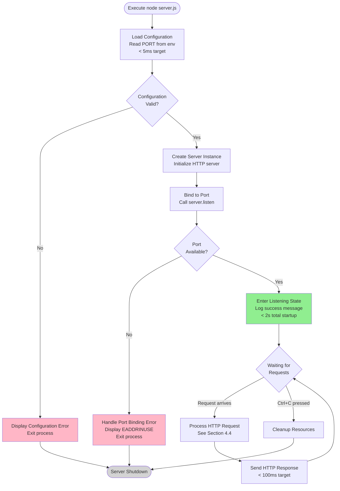
```mermaid
flowchart TD
    Start([Execute node server.js]) --> LoadConfig[Load Configuration<br/>Read PORT from env<br/>< 5ms target]
    LoadConfig --> ValidateConfig{Configuration<br/>Valid?}
    
    ValidateConfig -->|No| ConfigError[Display Configuration Error<br/>Exit process]
    ValidateConfig -->|Yes| CreateServer[Create Server Instance<br/>Initialize HTTP server]
    
    CreateServer --> BindPort[Bind to Port<br/>Call server.listen]
    BindPort --> PortCheck{Port<br/>Available?}
    
    PortCheck -->|No| PortError[Handle Port Binding Error<br/>Display EADDRINUSE<br/>Exit process]
    PortCheck -->|Yes| Listening[Enter Listening State<br/>Log success message<br/>< 2s total startup]
    
    Listening --> WaitRequest{Waiting for<br/>Requests}
    WaitRequest -->|Request arrives| ProcessReq[Process HTTP Request<br/>See Section 4.4]
    ProcessReq --> SendResp[Send HTTP Response<br/>< 100ms target]
    SendResp --> WaitRequest
    
    WaitRequest -->|Ctrl+C pressed| Cleanup[Cleanup Resources]
    Cleanup --> Shutdown([Server Shutdown])
    
    ConfigError --> Shutdown
    PortError --> Shutdown
    
    style Listening fill:#90EE90
    style PortError fill:#FFB6C6
    style ConfigError fill:#FFB6C6
    style Shutdown fill:#D3D3D3
```

### 4.2.2 System Workflow Phases

The system workflow consists of six distinct phases:

**Phase 1: Configuration Resolution** - The server reads the PORT environment variable from `process.env.PORT` and applies validation rules. If undefined, a default value (typically 3000 or 8080) is used. Configuration validation ensures the port number is an integer within the range 1-65535, with unprivileged ports (1024-65535) recommended for security.

**Phase 2: Server Initialization** - Based on the implementation approach, the system either calls `http.createServer()` for the Native HTTP module or initializes an Express.js application instance with `express()`. The request handler or routing configuration is attached to the server instance during this phase.

**Phase 3: Port Binding** - The server attempts to bind to the specified port and host address by calling `server.listen(port, host, callback)`. The operating system performs TCP port binding and returns success or failure. This phase includes critical error handling for port conflicts (EADDRINUSE) and permission issues (EACCES).

**Phase 4: Listening State** - Upon successful binding, the server enters the listening state and displays the confirmation message "Server listening on port [PORT]" to the console. The server is now ready to accept incoming HTTP connections. This state represents normal idle operation between request processing cycles.

**Phase 5: Request Processing Loop** - The server continuously waits for incoming HTTP requests. When a request arrives, it enters the request processing workflow (detailed in Section 4.4), generates an appropriate response, and returns to the waiting state. This loop continues indefinitely until manual termination.

**Phase 6: Graceful Shutdown** - When the user issues a termination signal (typically Ctrl+C), the server performs cleanup operations and exits. Error conditions during earlier phases also lead to shutdown after displaying appropriate error messages.

### 4.2.3 Critical Decision Points

The high-level workflow contains three critical decision points that determine system behavior:

1. **Configuration Validation**: Determines whether the server can proceed with initialization or must exit with a configuration error
2. **Port Availability**: Determines whether the server can successfully bind to the requested port or must handle a port conflict error
3. **Request Arrival**: Controls the continuous operation loop, with the server alternating between idle waiting and active request processing

### 4.2.4 Error Exit Paths

The system includes three distinct error exit paths that ensure graceful failure:

- **Configuration Error Path**: Triggered by invalid port configuration values, displays validation error message with guidance on correct format
- **Port Binding Error Path**: Triggered by port conflicts or permission issues, displays context-specific error messages with troubleshooting suggestions
- **Manual Shutdown Path**: Triggered by user interrupt signal, performs normal cleanup and exits without error

## 4.3 Server Initialization Process

The server initialization process encompasses all activities from configuration loading through successful port binding. This multi-stage workflow establishes the operational foundation for request processing and includes comprehensive error handling at each stage.

### 4.3.1 Configuration Loading Workflow

Configuration loading is the first operational phase, responsible for resolving runtime parameters and validating their correctness.

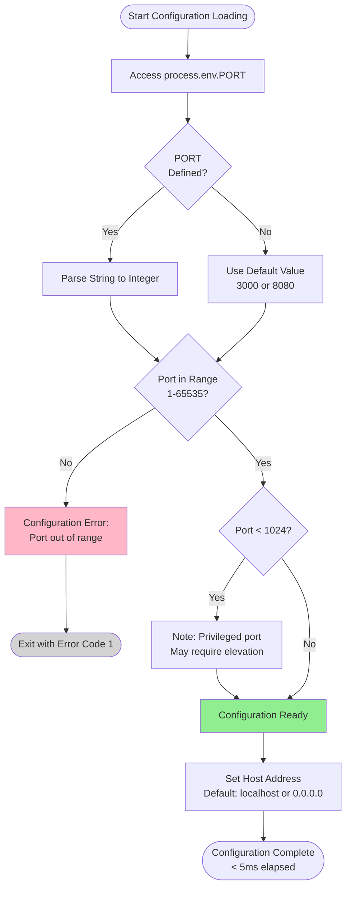
```mermaid
flowchart TD
    Start([Start Configuration Loading]) --> ReadEnv[Access process.env.PORT]
    ReadEnv --> EnvCheck{PORT<br/>Defined?}
    
    EnvCheck -->|Yes| ParseValue[Parse String to Integer]
    EnvCheck -->|No| UseDefault[Use Default Value<br/>3000 or 8080]
    
    ParseValue --> ValidateRange{Port in Range<br/>1-65535?}
    UseDefault --> ValidateRange
    
    ValidateRange -->|No| InvalidError[Configuration Error:<br/>Port out of range]
    ValidateRange -->|Yes| CheckPrivileged{Port < 1024?}
    
    CheckPrivileged -->|Yes| PrivWarning[Note: Privileged port<br/>May require elevation]
    CheckPrivileged -->|No| ConfigReady[Configuration Ready]
    PrivWarning --> ConfigReady
    
    ConfigReady --> SetHost[Set Host Address<br/>Default: localhost or 0.0.0.0]
    SetHost --> Complete([Configuration Complete<br/>< 5ms elapsed])
    
    InvalidError --> ErrorExit([Exit with Error Code 1])
    
    style ConfigReady fill:#90EE90
    style InvalidError fill:#FFB6C6
    style ErrorExit fill:#D3D3D3
```

#### 4.3.1.1 Environment Variable Resolution

The configuration loading process begins by accessing the `PORT` environment variable through Node.js's `process.env` object. This environment variable provides runtime flexibility, allowing different port assignments without code modification. If the `PORT` variable is undefined, the system applies a hardcoded default value that ensures the server can start successfully in development environments. The default port is typically 3000 or 8080, chosen for their familiarity among Node.js developers and lack of conflicts with common system services.

#### 4.3.1.2 Value Parsing and Type Conversion

Environment variables are always string values, requiring conversion to integer type for port numbers. The parsing process uses JavaScript's `parseInt()` function or implicit type coercion. If the environment variable contains a non-numeric value, parsing may produce `NaN` (Not a Number), which triggers validation failure in the subsequent range check.

#### 4.3.1.3 Validation Rules and Constraints

Port number validation enforces multiple constraints:

- **Numeric Type**: Value must be convertible to an integer
- **Valid Range**: Port must be between 1 and 65535 (TCP/UDP port range limits)
- **Recommended Range**: Ports 1024-65535 avoid privileged port requirements
- **Reserved Ports**: Awareness that ports below 1024 require elevated permissions on Unix-like systems

When validation fails, the system generates a descriptive error message indicating the specific constraint violation and provides guidance on correct values.

#### 4.3.1.4 Host Address Configuration

In addition to port configuration, the system sets the host address binding parameter. The default host address is typically `localhost` (127.0.0.1) for local development security, though some implementations may use `0.0.0.0` to accept connections from any network interface. The host parameter is usually hardcoded in this tutorial application, as it serves educational rather than production purposes.

### 4.3.2 Server Instance Creation

Following successful configuration, the system creates the HTTP server instance based on the chosen implementation approach.

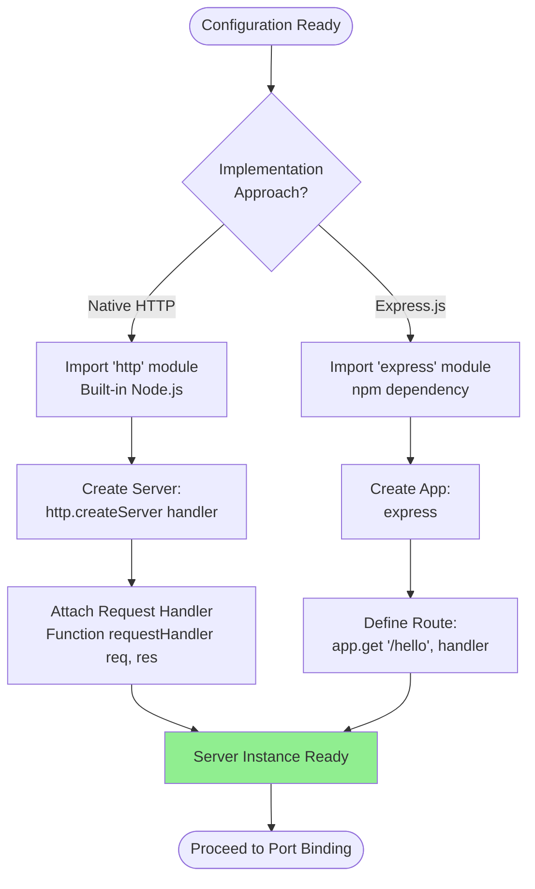
```mermaid
flowchart TD
    Start([Configuration Ready]) --> ImplChoice{Implementation<br/>Approach?}
    
    ImplChoice -->|Native HTTP| ImportHTTP[Import 'http' module<br/>Built-in Node.js]
    ImplChoice -->|Express.js| ImportExpress[Import 'express' module<br/>npm dependency]
    
    ImportHTTP --> CreateNative[Create Server:<br/>http.createServer handler]
    ImportExpress --> CreateExpress[Create App:<br/>express]
    
    CreateNative --> AttachHandler[Attach Request Handler<br/>Function requestHandler req, res]
    CreateExpress --> DefineRoute[Define Route:<br/>app.get '/hello', handler]
    
    AttachHandler --> ServerReady[Server Instance Ready]
    DefineRoute --> ServerReady
    
    ServerReady --> Complete([Proceed to Port Binding])
    
    style ServerReady fill:#90EE90
```

#### 4.3.2.1 Native HTTP Module Path

The Native HTTP module implementation follows these steps:

1. **Module Import**: Load the built-in `http` module using `require('http')` or `import http from 'http'`
2. **Handler Definition**: Create a request handler function with signature `(req, res) => {...}` that contains routing and response logic
3. **Server Creation**: Call `http.createServer(requestHandler)` to instantiate the server with the handler attached
4. **Handler Logic**: Implement URL path checking (`req.url === '/hello'`) and response generation within the handler function

This approach exposes low-level HTTP concepts, making request and response object interactions explicit. The handler function receives every incoming request and must manually perform routing decisions.

#### 4.3.2.2 Express.js Framework Path

The Express.js implementation follows an alternative pattern:

1. **Module Import**: Load the Express.js framework using `require('express')` or `import express from 'express'`
2. **Application Creation**: Call `express()` to create an application instance
3. **Route Definition**: Use `app.get('/hello', (req, res) => {...})` to define the endpoint handler with built-in routing
4. **Server Creation**: The Express app internally creates an HTTP server when `app.listen()` is called

Express.js abstracts routing and response handling, providing a higher-level API that simplifies common HTTP server patterns. The framework automatically manages request routing, response headers, and status codes.

#### 4.3.2.3 Implementation Comparison

Both approaches achieve the same functional outcome but differ in abstraction level:

- **Native HTTP**: Zero dependencies, explicit control, educational exposure to raw HTTP concepts
- **Express.js**: Industry-standard framework, simplified syntax, automatic header management, single external dependency

The tutorial supports both approaches as valid learning paths, demonstrating fundamental concepts (Native HTTP) and practical frameworks (Express.js).

### 4.3.3 Port Binding and Listening Workflow

The port binding phase attempts to acquire the network port and transition the server to the listening state.

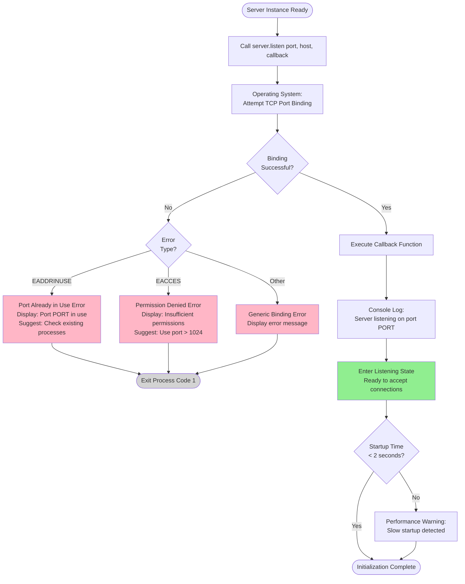
```mermaid
flowchart TD
    Start([Server Instance Ready]) --> CallListen[Call server.listen port, host, callback]
    CallListen --> OSBind[Operating System:<br/>Attempt TCP Port Binding]
    
    OSBind --> BindCheck{Binding<br/>Successful?}
    
    BindCheck -->|No| ErrorCheck{Error<br/>Type?}
    ErrorCheck -->|EADDRINUSE| PortInUse[Port Already in Use Error<br/>Display: Port PORT in use<br/>Suggest: Check existing processes]
    ErrorCheck -->|EACCES| PermError[Permission Denied Error<br/>Display: Insufficient permissions<br/>Suggest: Use port > 1024]
    ErrorCheck -->|Other| GenericError[Generic Binding Error<br/>Display error message]
    
    PortInUse --> ExitError([Exit Process Code 1])
    PermError --> ExitError
    GenericError --> ExitError
    
    BindCheck -->|Yes| ExecuteCallback[Execute Callback Function]
    ExecuteCallback --> LogSuccess[Console Log:<br/>Server listening on port PORT]
    LogSuccess --> ListenState[Enter Listening State<br/>Ready to accept connections]
    
    ListenState --> CheckStartup{Startup Time<br/>< 2 seconds?}
    CheckStartup -->|Yes| Success([Initialization Complete])
    CheckStartup -->|No| PerfWarning[Performance Warning:<br/>Slow startup detected]
    PerfWarning --> Success
    
    style ListenState fill:#90EE90
    style PortInUse fill:#FFB6C6
    style PermError fill:#FFB6C6
    style GenericError fill:#FFB6C6
    style ExitError fill:#D3D3D3
```

#### 4.3.3.1 Port Binding Mechanism

Port binding is initiated by calling the `server.listen()` method with the validated port and host parameters. This method invocation requests the operating system to reserve the specified TCP port for exclusive use by the server process. The Node.js runtime communicates with the OS networking stack to perform the actual binding operation.

The `listen()` method accepts a callback function that executes upon successful binding. This callback provides the appropriate location for startup confirmation messages and any additional initialization logic that should occur only after the server is ready to accept connections.

#### 4.3.3.2 Operating System Port Allocation

The operating system performs several checks during port binding:

1. **Port Availability**: Verifies no other process currently owns the port
2. **Permission Validation**: Confirms the process has sufficient privileges (especially for ports < 1024)
3. **Resource Allocation**: Reserves kernel resources for the listening socket
4. **Network Interface Binding**: Associates the port with the specified host address

If any check fails, the operating system returns an error code that Node.js translates into a specific error event.

#### 4.3.3.3 Error Handling During Binding

Three primary error scenarios occur during port binding:

**EADDRINUSE (Address Already in Use)**: This error indicates another process currently occupies the requested port. Common causes include:
- Previous server instance still running
- Another application using the same port
- Orphaned server process from abnormal termination

The error handler displays a clear message identifying the port conflict and suggests checking for existing processes using commands like `lsof` (Linux/macOS) or `netstat` (Windows).

**EACCES (Permission Denied)**: This error occurs when attempting to bind privileged ports (1-1023) without appropriate permissions. On Unix-like systems, only root or processes with CAP_NET_BIND_SERVICE capability can bind these ports. The error handler suggests using unprivileged ports (>1024) or running with elevated permissions.

**Other Binding Errors**: Less common errors might include network configuration issues, firewall restrictions, or system resource exhaustion. Generic error handling displays the error message and exits gracefully.

All error handlers follow the same pattern: display descriptive error message, provide troubleshooting guidance, and exit the process with error code 1.

#### 4.3.3.4 Successful Listening State Transition

Upon successful binding, the callback function executes and performs the following:

1. **Confirmation Logging**: Displays "Server listening on port [PORT]" to stdout for user verification
2. **State Transition**: Server enters the listening state, ready to accept incoming connections
3. **Event Loop Activation**: Node.js event loop begins monitoring for connection events
4. **Startup Time Validation**: Total elapsed time from execution to listening state should be under 2 seconds

The server is now fully operational and awaits HTTP requests.

## 4.4 Request/Response Processing Workflow

The request/response processing workflow handles all incoming HTTP requests, implementing routing logic, endpoint execution, and response generation. This workflow executes repeatedly for each client request throughout the server's operational lifetime.

### 4.4.1 HTTP Request Reception and Parsing

Request reception and parsing encompasses the initial stages of request handling from TCP connection establishment through request object creation.

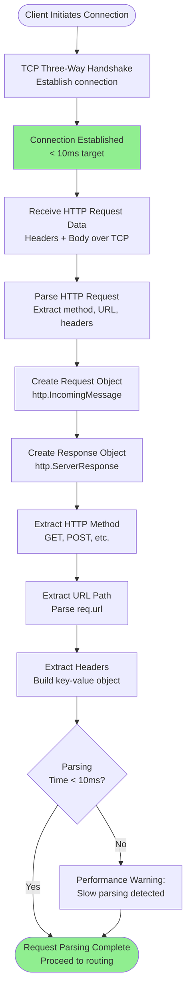
```mermaid
flowchart TD
    Start([Client Initiates Connection]) --> TCPHandshake[TCP Three-Way Handshake<br/>Establish connection]
    TCPHandshake --> ConnEstab[Connection Established<br/>< 10ms target]
    
    ConnEstab --> RecvData[Receive HTTP Request Data<br/>Headers + Body over TCP]
    RecvData --> ParseHTTP[Parse HTTP Request<br/>Extract method, URL, headers]
    
    ParseHTTP --> CreateReqObj[Create Request Object<br/>http.IncomingMessage]
    CreateReqObj --> CreateResObj[Create Response Object<br/>http.ServerResponse]
    
    CreateResObj --> ExtractMethod[Extract HTTP Method<br/>GET, POST, etc.]
    ExtractMethod --> ExtractURL[Extract URL Path<br/>Parse req.url]
    ExtractURL --> ExtractHeaders[Extract Headers<br/>Build key-value object]
    
    ExtractHeaders --> CheckParse{Parsing<br/>Time < 10ms?}
    CheckParse -->|Yes| ParseComplete([Request Parsing Complete<br/>Proceed to routing])
    CheckParse -->|No| PerfWarning[Performance Warning:<br/>Slow parsing detected]
    PerfWarning --> ParseComplete
    
    style ConnEstab fill:#90EE90
    style ParseComplete fill:#90EE90
```

#### 4.4.1.1 Connection Establishment

The request lifecycle begins when a client (typically a web browser or HTTP client tool like curl) initiates a TCP connection to the server's listening port. The TCP three-way handshake (SYN, SYN-ACK, ACK) establishes a reliable bidirectional connection between client and server. This handshake typically completes within 10 milliseconds on local networks, with longer times possible over the internet due to network latency.

Once the connection is established, the client begins transmitting HTTP request data over the TCP connection. The Node.js event loop detects the incoming connection and triggers the request handling workflow.

#### 4.4.1.2 HTTP Request Parsing

The Node.js HTTP parser processes the incoming byte stream to extract HTTP protocol components:

1. **Request Line Parsing**: Extracts HTTP method (GET, POST, etc.), URL path, and HTTP version
2. **Header Parsing**: Processes header lines into key-value pairs, handling multi-line headers and special characters
3. **Body Parsing**: Reads request body if present (though the `/hello` endpoint expects no body for GET requests)

The parser creates an `http.IncomingMessage` object (request) that provides structured access to the parsed components through properties like `req.method`, `req.url`, and `req.headers`. A corresponding `http.ServerResponse` object (response) is created to enable response generation.

#### 4.4.1.3 Request Object Structure

The request object exposes critical properties accessed during routing:

- **`req.method`**: HTTP method string (e.g., "GET", "POST")
- **`req.url`**: Complete URL path and query string (e.g., "/hello" or "/hello?param=value")
- **`req.headers`**: Object containing all HTTP headers with lowercase keys
- **`req.httpVersion`**: HTTP protocol version string (e.g., "1.1")

For this tutorial application, only `req.url` is consistently used for routing decisions, as the `/hello` endpoint serves all HTTP methods without differentiation.

#### 4.4.1.4 Performance Considerations

Request parsing must complete within 10 milliseconds to meet the overall response time target of 100 milliseconds. The Node.js HTTP parser is highly optimized using native C++ code, making this target achievable for typical requests. Parsing time may increase with extremely large header sets or complex URL structures, though such cases are outside the tutorial's scope.

### 4.4.2 Route Matching and Endpoint Selection

Following request parsing, the routing logic determines which handler should process the request.

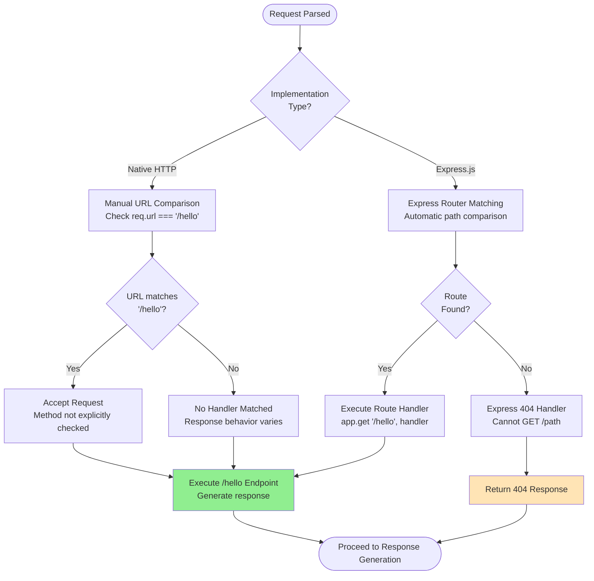
```mermaid
flowchart TD
    Start([Request Parsed]) --> ImplCheck{Implementation<br/>Type?}
    
    ImplCheck -->|Native HTTP| NativeRoute[Manual URL Comparison<br/>Check req.url === '/hello']
    ImplCheck -->|Express.js| ExpressRoute[Express Router Matching<br/>Automatic path comparison]
    
    NativeRoute --> NativeMatch{URL matches<br/>'/hello'?}
    ExpressRoute --> ExpressMatch{Route<br/>Found?}
    
    NativeMatch -->|Yes| MethodCheck[Accept Request<br/>Method not explicitly checked]
    NativeMatch -->|No| NativeNoHandler[No Handler Matched<br/>Response behavior varies]
    
    ExpressMatch -->|Yes| ExpressHandler[Execute Route Handler<br/>app.get '/hello', handler]
    ExpressMatch -->|No| Express404[Express 404 Handler<br/>Cannot GET /path]
    
    MethodCheck --> EndpointHandler[Execute /hello Endpoint<br/>Generate response]
    NativeNoHandler --> EndpointHandler
    
    ExpressHandler --> EndpointHandler
    Express404 --> Return404[Return 404 Response]
    
    EndpointHandler --> Complete([Proceed to Response Generation])
    Return404 --> Complete
    
    style EndpointHandler fill:#90EE90
    style Return404 fill:#FFE4B5
```

#### 4.4.2.1 Native HTTP Module Routing

The Native HTTP module implementation uses manual URL path comparison within the request handler function:

```
function requestHandler(req, res) {
  if (req.url === '/hello') {
    // Handle /hello endpoint
  } else {
    // Handle other paths (or no handling)
  }
}
```

The routing logic performs a strict string comparison between `req.url` and the target path `'/hello'`. When the match succeeds, the handler executes the `/hello` endpoint logic. For non-matching URLs, behavior varies by implementation:

- **Explicit 404**: Some implementations may include an `else` block that returns a 404 response
- **No Response**: Minimal implementations may not explicitly handle unmatched routes
- **Empty Response**: The handler may send an empty response or close the connection

The Native HTTP approach does not typically validate HTTP methods, accepting GET, POST, and all other methods for the `/hello` endpoint. While this is not RESTful best practice, it simplifies the tutorial and does not compromise functionality for the learning objective.

#### 4.4.2.2 Express.js Framework Routing

Express.js provides built-in routing through the `app.METHOD(path, handler)` pattern:

```
app.get('/hello', (req, res) => {
  // Handler logic
});
```

The Express router performs automatic path matching and method validation:

1. **Path Matching**: Compares incoming `req.url` against all registered routes
2. **Method Validation**: Ensures the HTTP method matches the route definition (`app.get` only handles GET requests)
3. **Handler Execution**: Invokes the matching route handler with request and response objects
4. **404 Handling**: Automatically returns a 404 response with "Cannot GET /path" message for unmatched routes

Express routing is more sophisticated than manual comparison, supporting path parameters, regular expressions, and middleware chains. However, the tutorial uses only the simplest route definition with an exact path match.

#### 4.4.2.3 Routing Decision Flow

The routing decision determines the execution path for the remainder of request processing:

- **Match Found**: Execute the `/hello` endpoint handler, proceed to response generation
- **No Match (Native HTTP)**: Behavior depends on implementation (may generate default/empty response)
- **No Match (Express.js)**: Return 404 response with framework-generated error message

For this tutorial, the primary use case involves requests to `/hello`, making the match path the predominant flow.

### 4.4.3 Response Generation and Transmission

The response generation phase creates the HTTP response and transmits it to the client.

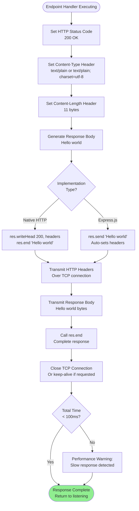
```mermaid
flowchart TD
    Start([Endpoint Handler Executing]) --> SetStatus[Set HTTP Status Code<br/>200 OK]
    SetStatus --> SetContentType[Set Content-Type Header<br/>text/plain or text/plain; charset=utf-8]
    
    SetContentType --> SetContentLength[Set Content-Length Header<br/>11 bytes]
    SetContentLength --> GenerateBody[Generate Response Body<br/>Hello world]
    
    GenerateBody --> ImplCheck{Implementation<br/>Type?}
    
    ImplCheck -->|Native HTTP| NativeWrite[res.writeHead 200, headers<br/>res.end 'Hello world']
    ImplCheck -->|Express.js| ExpressSend[res.send 'Hello world'<br/>Auto-sets headers]
    
    NativeWrite --> TransmitHeaders[Transmit HTTP Headers<br/>Over TCP connection]
    ExpressSend --> TransmitHeaders
    
    TransmitHeaders --> TransmitBody[Transmit Response Body<br/>Hello world bytes]
    TransmitBody --> EndResponse[Call res.end<br/>Complete response]
    
    EndResponse --> CloseConn[Close TCP Connection<br/>Or keep-alive if requested]
    CloseConn --> CheckResponseTime{Total Time<br/>< 100ms?}
    
    CheckResponseTime -->|Yes| ResponseComplete([Response Complete<br/>Return to listening])
    CheckResponseTime -->|No| PerfWarning[Performance Warning:<br/>Slow response detected]
    PerfWarning --> ResponseComplete
    
    style ResponseComplete fill:#90EE90
```

#### 4.4.3.1 Response Header Configuration

Response generation begins by setting HTTP headers that describe the response:

**Status Code**: The `/hello` endpoint always returns status code 200 (OK), indicating successful request processing. This status code is the standard success indicator for HTTP GET requests.

**Content-Type**: Set to `text/plain` or `text/plain; charset=utf-8` to indicate plain text content. This header informs the client that the response body contains unformatted text rather than HTML, JSON, or other structured formats. The charset parameter explicitly specifies UTF-8 encoding.

**Content-Length**: Set to 11, representing the byte length of "Hello world". This header enables efficient buffer allocation by the client and supports HTTP/1.1 persistent connections by delimiting response boundaries.

Additional headers may be automatically set by the framework or runtime, including `Date`, `Connection`, and `Server` headers.

#### 4.4.3.2 Response Body Generation

The response body is a simple static string: `"Hello world"`. This string requires no computation, database access, or external service calls, making response generation effectively instantaneous (< 1ms target). The body content is hardcoded within the endpoint handler, ensuring consistent output across all requests.

#### 4.4.3.3 Native HTTP Response Transmission

The Native HTTP implementation uses explicit method calls to transmit the response:

1. **`res.writeHead(statusCode, headers)`**: Writes the HTTP status line and headers to the connection. This method must be called before writing the body.
2. **`res.end(body)`**: Writes the response body and signals completion. This method closes the response stream and indicates no further data will be sent.

The explicit two-step process exposes HTTP protocol structure, demonstrating the separation between headers and body.

#### 4.4.3.4 Express.js Response Transmission

Express.js simplifies response transmission through the `res.send()` method:

```
res.send('Hello world');
```

This single method call automatically:
- Determines appropriate Content-Type based on data type (detects string → text/html by default, though may vary)
- Calculates Content-Length from body size
- Sets status code to 200 if not previously set
- Writes headers and body in proper sequence
- Calls `res.end()` to complete the response

Express abstracts the multi-step process, reducing boilerplate code while maintaining the same underlying HTTP transmission mechanism.

#### 4.4.3.5 Connection Handling

After response transmission, the TCP connection is typically closed unless the client requested persistent connections via the `Connection: keep-alive` header. Connection closure releases network resources and allows the server to accept new connections. The Node.js runtime manages connection lifecycle automatically, with developers rarely needing to explicitly control connection state in simple applications.

#### 4.4.3.6 Return to Listening State

Upon completing response transmission, the request handler finishes execution, and the server returns to the listening state. The event loop continues monitoring for new incoming connections, ready to repeat the request/response cycle for subsequent requests. This return to idle state completes one iteration of the request processing loop.

## 4.5 State Transition Management

The server progresses through a defined set of states during its operational lifecycle. Understanding these states and their transitions is essential for reasoning about server behavior and troubleshooting issues.

### 4.5.1 Server Lifecycle States

The following diagram illustrates all possible server states and the events that trigger transitions between them:

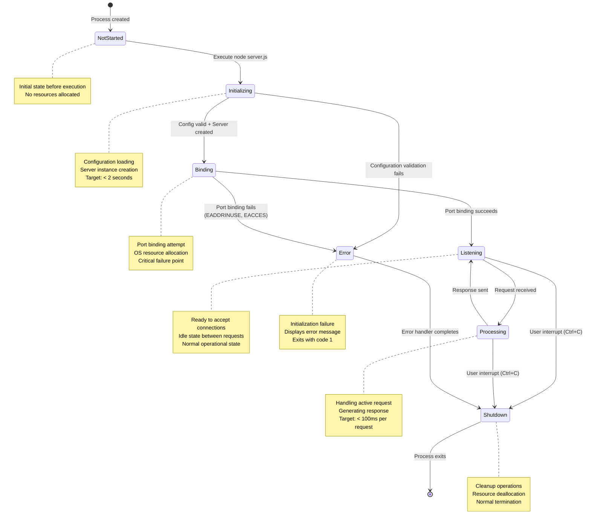
```mermaid
stateDiagram-v2
    [*] --> NotStarted: Process created
    NotStarted --> Initializing: Execute node server.js
    
    Initializing --> Binding: Config valid + Server created
    Initializing --> Error: Configuration validation fails
    
    Binding --> Listening: Port binding succeeds
    Binding --> Error: Port binding fails<br/>(EADDRINUSE, EACCES)
    
    Listening --> Processing: Request received
    Processing --> Listening: Response sent
    
    Listening --> Shutdown: User interrupt (Ctrl+C)
    Processing --> Shutdown: User interrupt (Ctrl+C)
    
    Error --> Shutdown: Error handler completes
    Shutdown --> [*]: Process exits
    
    note right of NotStarted
        Initial state before execution
        No resources allocated
    end note
    
    note right of Initializing
        Configuration loading
        Server instance creation
        Target: < 2 seconds
    end note
    
    note right of Binding
        Port binding attempt
        OS resource allocation
        Critical failure point
    end note
    
    note right of Listening
        Ready to accept connections
        Idle state between requests
        Normal operational state
    end note
    
    note right of Processing
        Handling active request
        Generating response
        Target: < 100ms per request
    end note
    
    note right of Error
        Initialization failure
        Displays error message
        Exits with code 1
    end note
    
    note right of Shutdown
        Cleanup operations
        Resource deallocation
        Normal termination
    end note
```

#### 4.5.1.1 State Descriptions

**Not Started**: The initial state before server execution begins. The Node.js process does not exist, and no system resources are allocated. The server enters this state when code files exist but have not been executed via the `node server.js` command.

**Initializing**: The active startup phase encompassing configuration loading, validation, and server instance creation. The server remains in this state while performing all pre-binding setup operations. The target duration for this state is under 2 seconds to support rapid development iteration. Key activities include reading environment variables, parsing port numbers, importing required modules, and creating the HTTP server instance.

**Binding**: A transitional state representing the port binding attempt. The server enters this state when calling `server.listen()` and remains until the operating system confirms binding success or failure. This state typically lasts only milliseconds but represents a critical juncture where binding failures occur.

**Listening**: The normal idle operational state after successful initialization. The server actively monitors for incoming connections while consuming minimal CPU resources. The Node.js event loop polls for connection events, transitioning to the Processing state immediately upon request arrival. The server spends most of its operational lifetime in this state.

**Processing**: The active request handling state encompassing parsing, routing, endpoint execution, and response generation. The server processes one request at a time in this single-threaded tutorial implementation. The target duration for this state is under 100 milliseconds per request. Upon completing response transmission, the server immediately returns to the Listening state.

**Error**: A terminal state reached when initialization fails due to configuration errors or port binding issues. The server displays detailed error messages to assist troubleshooting, then exits the process with error code 1. This state is brief, existing only long enough to output error information.

**Shutdown**: The terminal state representing graceful server termination. The server enters this state via user interrupt (Ctrl+C) or following error handling completion. Cleanup operations release resources before process exit. Both normal termination and error-induced termination converge to this state before final process termination.

### 4.5.2 State Transition Rules and Conditions

State transitions are governed by specific events and conditions that determine valid progressions through the lifecycle.

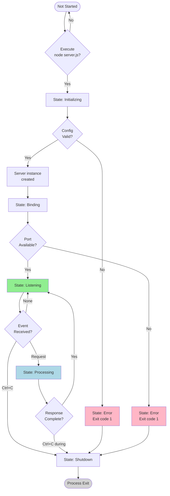
```mermaid
flowchart TD
    Start([Not Started]) --> T1{Execute<br/>node server.js?}
    T1 -->|Yes| Init[State: Initializing]
    T1 -->|No| Start
    
    Init --> T2{Config<br/>Valid?}
    T2 -->|No| Error1[State: Error<br/>Exit code 1]
    T2 -->|Yes| T3[Server instance<br/>created]
    
    T3 --> Bind[State: Binding]
    Bind --> T4{Port<br/>Available?}
    T4 -->|No| Error2[State: Error<br/>Exit code 1]
    T4 -->|Yes| Listen[State: Listening]
    
    Listen --> T5{Event<br/>Received?}
    T5 -->|Request| Proc[State: Processing]
    T5 -->|Ctrl+C| Shutdown[State: Shutdown]
    T5 -->|None| Listen
    
    Proc --> T6{Response<br/>Complete?}
    T6 -->|Yes| Listen
    T6 -->|Ctrl+C during| Shutdown
    
    Error1 --> Shutdown
    Error2 --> Shutdown
    Shutdown --> End([Process Exit])
    
    style Listen fill:#90EE90
    style Proc fill:#ADD8E6
    style Error1 fill:#FFB6C6
    style Error2 fill:#FFB6C6
    style End fill:#D3D3D3
```

#### 4.5.2.1 Initialization Transitions

**Not Started → Initializing**: Triggered by executing `node server.js` from the command line. The Node.js runtime starts, loads the script file, and begins code execution.

**Initializing → Binding**: Occurs when configuration validation succeeds and the server instance is successfully created. This transition requires both valid port configuration and successful module imports.

**Initializing → Error**: Triggered by configuration validation failure (invalid port number, out-of-range value, or parsing error). The system skips port binding and proceeds directly to error handling.

#### 4.5.2.2 Binding Transitions

**Binding → Listening**: Occurs when the operating system successfully binds the requested port to the server process. The callback function executes, displaying the success message and transitioning to the ready state.

**Binding → Error**: Triggered by port binding failures including EADDRINUSE (port already occupied) or EACCES (permission denied). The error event handler executes, displays context-specific error messages, and initiates graceful shutdown.

#### 4.5.2.3 Request Processing Transitions

**Listening → Processing**: Triggered immediately when the event loop detects an incoming HTTP connection. The request handler begins execution, transitioning the server to active processing mode.

**Processing → Listening**: Occurs automatically when response transmission completes and the connection closes. The request handler finishes execution, and the event loop returns to monitoring for new connections. This transition typically happens within 100 milliseconds.

**Listening → Shutdown** or **Processing → Shutdown**: Triggered by user interrupt signals (SIGINT from Ctrl+C). The Node.js runtime intercepts the signal and initiates graceful shutdown regardless of current state.

#### 4.5.2.4 Error and Shutdown Transitions

**Error → Shutdown**: Automatic transition after error message display completes. Error handlers perform any necessary cleanup before calling `process.exit(1)`.

**Shutdown → [Process Exit]**: Final transition representing process termination. The operating system reclaims all resources (memory, file descriptors, port bindings) and removes the process from the process table.

### 4.5.3 State Persistence and Recovery

The tutorial server maintains no persistent state between requests or across restarts:

- **Stateless Operation**: Each request is processed independently without reference to previous requests
- **No State Recovery**: Server shutdown results in complete state loss
- **Clean Slate Restarts**: Each server start begins from the Not Started state with no historical context

This stateless design simplifies the tutorial and emphasizes HTTP protocol fundamentals without the complexity of session management or persistent data storage.

## 4.6 Error Handling Workflows

Comprehensive error handling ensures graceful failure with actionable feedback for troubleshooting. The tutorial application implements error handlers for all anticipated failure scenarios during initialization and request processing.

### 4.6.1 Port Binding Error Handling

Port binding errors are the most common failure mode, occurring when the requested port is unavailable or inaccessible.

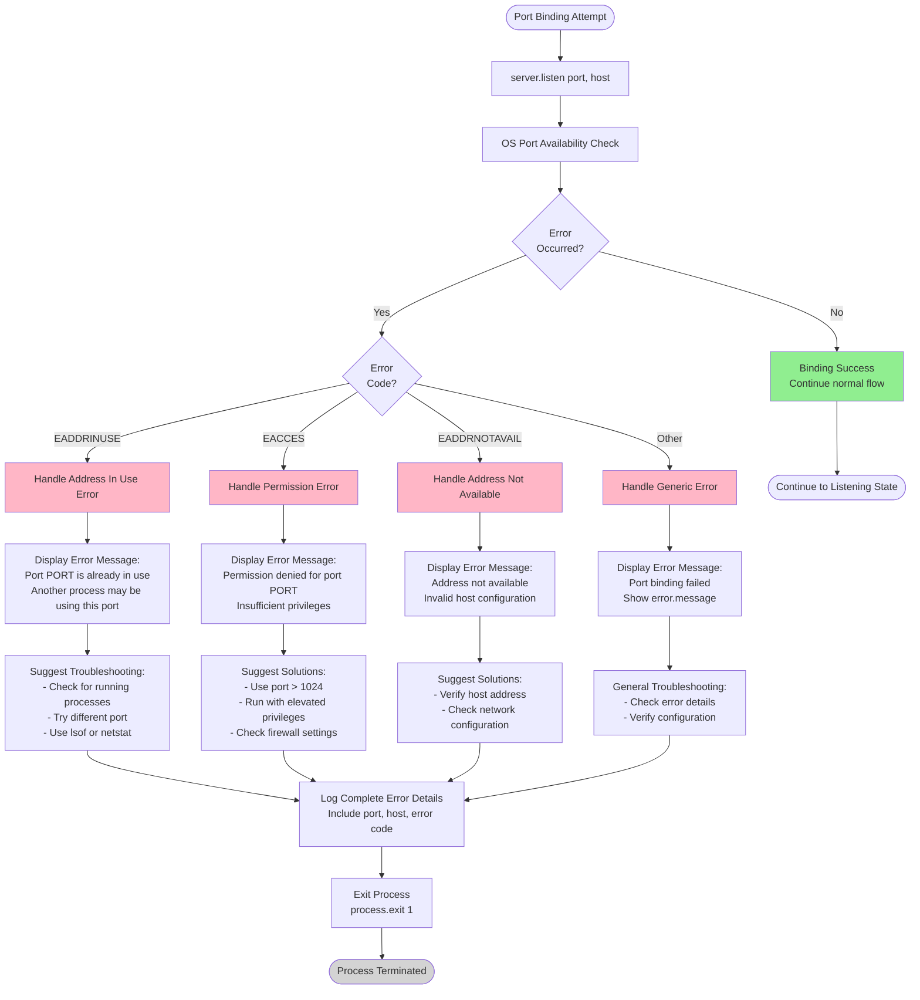
```mermaid
flowchart TD
    Start([Port Binding Attempt]) --> ListenCall[server.listen port, host]
    ListenCall --> OSCheck[OS Port Availability Check]
    
    OSCheck --> ErrorCheck{Error<br/>Occurred?}
    ErrorCheck -->|No| Success[Binding Success<br/>Continue normal flow]
    
    ErrorCheck -->|Yes| ErrorType{Error<br/>Code?}
    
    ErrorType -->|EADDRINUSE| HandleInUse[Handle Address In Use Error]
    ErrorType -->|EACCES| HandlePermission[Handle Permission Error]
    ErrorType -->|EADDRNOTAVAIL| HandleNotAvail[Handle Address Not Available]
    ErrorType -->|Other| HandleGeneric[Handle Generic Error]
    
    HandleInUse --> DisplayInUse[Display Error Message:<br/>Port PORT is already in use<br/>Another process may be using this port]
    DisplayInUse --> SuggestInUse[Suggest Troubleshooting:<br/>- Check for running processes<br/>- Try different port<br/>- Use lsof or netstat]
    
    HandlePermission --> DisplayPerm[Display Error Message:<br/>Permission denied for port PORT<br/>Insufficient privileges]
    DisplayPerm --> SuggestPerm[Suggest Solutions:<br/>- Use port > 1024<br/>- Run with elevated privileges<br/>- Check firewall settings]
    
    HandleNotAvail --> DisplayNotAvail[Display Error Message:<br/>Address not available<br/>Invalid host configuration]
    DisplayNotAvail --> SuggestNotAvail[Suggest Solutions:<br/>- Verify host address<br/>- Check network configuration]
    
    HandleGeneric --> DisplayGeneric[Display Error Message:<br/>Port binding failed<br/>Show error.message]
    DisplayGeneric --> SuggestGeneric[General Troubleshooting:<br/>- Check error details<br/>- Verify configuration]
    
    SuggestInUse --> LogError[Log Complete Error Details<br/>Include port, host, error code]
    SuggestPerm --> LogError
    SuggestNotAvail --> LogError
    SuggestGeneric --> LogError
    
    LogError --> ExitProcess[Exit Process<br/>process.exit 1]
    ExitProcess --> Terminate([Process Terminated])
    
    Success --> Continue([Continue to Listening State])
    
    style Success fill:#90EE90
    style HandleInUse fill:#FFB6C6
    style HandlePermission fill:#FFB6C6
    style HandleNotAvail fill:#FFB6C6
    style HandleGeneric fill:#FFB6C6
    style Terminate fill:#D3D3D3
```

#### 4.6.1.1 EADDRINUSE Error Handling

The EADDRINUSE error occurs when another process currently binds the requested port. Common scenarios include:

- **Previous Instance Running**: The developer started the server, forgot about it, and attempted to start another instance
- **Other Application Conflict**: Another development server or system service uses the same port
- **Orphaned Process**: Abnormal termination left a zombie process holding the port

**Error Handler Actions:**

1. **Detect Error**: Catch the error event from `server.listen()` and check `error.code === 'EADDRINUSE'`
2. **Display Context**: Show message "Port [PORT] is already in use" with the specific port number
3. **Provide Guidance**: Suggest checking for existing processes using platform-specific commands:
   - Linux/macOS: `lsof -i :[PORT]` or `ps aux | grep node`
   - Windows: `netstat -ano | findstr :[PORT]`
4. **Alternative Actions**: Suggest trying a different port or killing the conflicting process
5. **Exit Gracefully**: Call `process.exit(1)` to terminate with error status

**Educational Value**: This error teaches port exclusivity concepts and process management skills.

#### 4.6.1.2 EACCES Error Handling

The EACCES error indicates insufficient permissions to bind the requested port. This typically occurs when:

- **Privileged Port Attempted**: Ports 1-1023 require root/administrator privileges on most systems
- **Firewall Restrictions**: Security policies prevent port binding
- **User Permission Limitations**: The executing user lacks necessary network capabilities

**Error Handler Actions:**

1. **Detect Error**: Catch the error event and check `error.code === 'EACCES'`
2. **Display Context**: Show message "Permission denied for port [PORT]" with explanation of privilege requirements
3. **Provide Solutions**: 
   - Suggest using unprivileged ports (1024-65535)
   - Mention option to run with elevated privileges (with security warnings)
   - Note that privileged ports are generally unnecessary for development
4. **Security Guidance**: Emphasize that the tutorial should use unprivileged ports for safety
5. **Exit Gracefully**: Call `process.exit(1)` with error status

**Educational Value**: This error teaches Unix permissions, privileged ports, and security concepts.

#### 4.6.1.3 Generic Error Handling

Less common binding errors (EADDRNOTAVAIL, ENETUNREACH, etc.) receive generic handling:

1. **Catch Error**: Handle any error not specifically matched by code checks
2. **Display Error**: Show the error message and code: "Port binding failed: [error.message] (Code: [error.code])"
3. **General Guidance**: Suggest checking configuration and network settings
4. **Log Details**: Output complete error object for debugging
5. **Exit Gracefully**: Terminate process with error code 1

### 4.6.2 Configuration Validation Error Handling

Configuration errors prevent server initialization when port values are invalid.

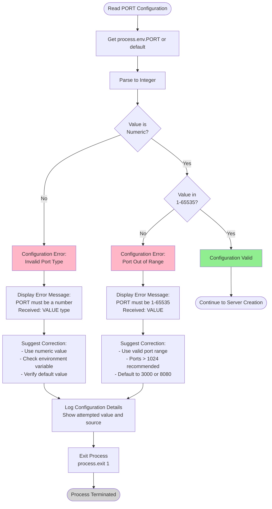
```mermaid
flowchart TD
    Start([Read PORT Configuration]) --> GetValue[Get process.env.PORT or default]
    GetValue --> ParseValue[Parse to Integer]
    
    ParseValue --> TypeCheck{Value is<br/>Numeric?}
    TypeCheck -->|No| TypeError[Configuration Error:<br/>Invalid Port Type]
    
    TypeCheck -->|Yes| RangeCheck{Value in<br/>1-65535?}
    RangeCheck -->|No| RangeError[Configuration Error:<br/>Port Out of Range]
    
    RangeCheck -->|Yes| ValidConfig[Configuration Valid]
    
    TypeError --> DisplayType[Display Error Message:<br/>PORT must be a number<br/>Received: VALUE type]
    DisplayType --> SuggestType[Suggest Correction:<br/>- Use numeric value<br/>- Check environment variable<br/>- Verify default value]
    
    RangeError --> DisplayRange[Display Error Message:<br/>PORT must be 1-65535<br/>Received: VALUE]
    DisplayRange --> SuggestRange[Suggest Correction:<br/>- Use valid port range<br/>- Ports > 1024 recommended<br/>- Default to 3000 or 8080]
    
    SuggestType --> LogConfig[Log Configuration Details<br/>Show attempted value and source]
    SuggestRange --> LogConfig
    
    LogConfig --> ExitProcess[Exit Process<br/>process.exit 1]
    ExitProcess --> Terminate([Process Terminated])
    
    ValidConfig --> Continue([Continue to Server Creation])
    
    style ValidConfig fill:#90EE90
    style TypeError fill:#FFB6C6
    style RangeError fill:#FFB6C6
    style Terminate fill:#D3D3D3
```

#### 4.6.2.1 Type Validation Errors

Type validation errors occur when the port value cannot be converted to a valid integer:

**Scenarios:**
- Environment variable contains non-numeric string (e.g., `PORT=abc`)
- Parsing produces `NaN` (Not a Number)
- Value is undefined or null when no default is provided

**Error Handler Actions:**

1. **Detect Invalid Type**: Check if `parseInt(value)` produces `NaN` or if type checking fails
2. **Display Error**: Show "Invalid port configuration: PORT must be a number. Received: [value] ([type])"
3. **Explain Requirement**: Clarify that ports must be integer values
4. **Show Source**: Indicate whether the invalid value came from environment variable or default
5. **Provide Examples**: Show correct format: `PORT=3000 node server.js`
6. **Exit Before Binding**: Terminate immediately without attempting server creation

**Educational Value**: Teaches environment variable handling and type validation concepts.

#### 4.6.2.2 Range Validation Errors

Range validation errors occur when the port number is outside the valid TCP/UDP port range:

**Scenarios:**
- Port value less than 1 (e.g., `PORT=0` or `PORT=-1`)
- Port value greater than 65535 (e.g., `PORT=70000`)
- Port value is valid integer but outside acceptable range

**Error Handler Actions:**

1. **Detect Out of Range**: Check if `port < 1 || port > 65535`
2. **Display Error**: Show "Port out of range: [value]. PORT must be between 1 and 65535"
3. **Explain Limits**: Clarify TCP/UDP port range constraints
4. **Recommend Best Practices**: Suggest unprivileged ports (1024-65535) for development
5. **Provide Defaults**: Mention common development ports (3000, 8080, 8000)
6. **Exit Before Binding**: Terminate without attempting server creation

**Educational Value**: Teaches networking fundamentals and port range concepts.

### 4.6.3 Runtime Error Handling (Request Processing)

While the tutorial application has minimal runtime error potential due to its simplicity, error handling for request processing ensures graceful handling of unexpected scenarios.

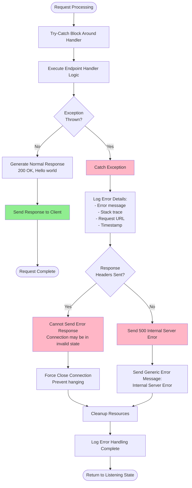
```mermaid
flowchart TD
    Start([Request Processing]) --> TryCatch[Try-Catch Block Around Handler]
    TryCatch --> ExecuteHandler[Execute Endpoint Handler Logic]
    
    ExecuteHandler --> ErrorCheck{Exception<br/>Thrown?}
    
    ErrorCheck -->|No| GenerateResp[Generate Normal Response<br/>200 OK, Hello world]
    GenerateResp --> SendSuccess[Send Response to Client]
    SendSuccess --> Complete([Request Complete])
    
    ErrorCheck -->|Yes| CatchError[Catch Exception]
    CatchError --> LogError[Log Error Details:<br/>- Error message<br/>- Stack trace<br/>- Request URL<br/>- Timestamp]
    
    LogError --> CheckResHeader{Response<br/>Headers Sent?}
    CheckResHeader -->|Yes| AlreadySent[Cannot Send Error Response<br/>Connection may be in invalid state]
    CheckResHeader -->|No| Send500[Send 500 Internal Server Error]
    
    AlreadySent --> ForceClose[Force Close Connection<br/>Prevent hanging]
    Send500 --> SendErrorResp[Send Generic Error Message:<br/>Internal Server Error]
    
    ForceClose --> Cleanup[Cleanup Resources]
    SendErrorResp --> Cleanup
    
    Cleanup --> LogComplete[Log Error Handling Complete]
    LogComplete --> Return([Return to Listening State])
    
    style SendSuccess fill:#90EE90
    style CatchError fill:#FFB6C6
    style Send500 fill:#FFB6C6
    style AlreadySent fill:#FFB6C6
```

#### 4.6.3.1 Exception Handling in Request Handlers

The tutorial's simple implementation has minimal error potential, but defensive programming practices require exception handling:

**Potential Error Sources:**
- Unexpected exceptions in handler code
- Response object errors (rare with simple `res.end()` calls)
- Theoretical runtime errors from Node.js internals

**Error Handler Implementation:**

1. **Try-Catch Wrapper**: Wrap endpoint handler logic in try-catch block
2. **Error Detection**: Catch any thrown exceptions or rejected promises
3. **Error Logging**: Log error details including message, stack trace, request context
4. **Response State Check**: Verify whether headers have been sent to client
5. **Conditional Response**: 
   - If headers not sent: Send 500 Internal Server Error response
   - If headers sent: Cannot send error response, force connection closure
6. **Resource Cleanup**: Ensure response object is properly closed
7. **Continue Operation**: Return to listening state without crashing server

**Educational Value**: Demonstrates exception handling and resilient server patterns.

#### 4.6.3.2 Error Logging Strategy

Error logging provides visibility into failure scenarios without sophisticated logging infrastructure:

**Console Logging Approach:**
- Use `console.error()` for error messages (writes to stderr)
- Include timestamp for temporal context
- Show complete error message and stack trace
- Include request context (URL, method, headers) for debugging

**Example Error Log Format:**
```
[2024-01-15T14:32:45.123Z] ERROR: Request processing failed
URL: /hello
Method: GET
Error: TypeError: Cannot read property 'x' of undefined
Stack: [stack trace]
```

This simple logging approach is appropriate for the tutorial scope, avoiding complexity of logging frameworks while providing essential troubleshooting information.

#### 4.6.3.3 Error Recovery and Continuity

Critical principle: Individual request errors must not crash the server. Error handlers ensure:

- **Isolated Failures**: One request error does not affect subsequent requests
- **Server Continuity**: Server remains in listening state after handling errors
- **Connection Cleanup**: Failed requests properly close connections to free resources
- **No Crash Propagation**: Unhandled exceptions are caught and logged rather than crashing process

This resilience pattern is fundamental to production-quality servers, though simplified for the tutorial context.

## 4.7 Implementation Variant Workflows

The tutorial supports two implementation approaches with different technical characteristics and learning objectives. This section documents the specific workflows for each variant.

### 4.7.1 Native HTTP Module Implementation Flow

The Native HTTP module implementation provides direct access to Node.js built-in HTTP capabilities without external dependencies.

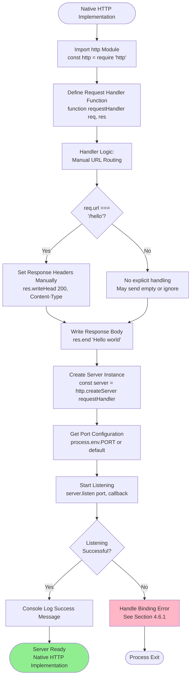
```mermaid
flowchart TD
    Start([Native HTTP Implementation]) --> ImportHTTP[Import http Module<br/>const http = require 'http' ]
    
    ImportHTTP --> DefineHandler[Define Request Handler Function<br/>function requestHandler req, res]
    
    DefineHandler --> HandlerLogic[Handler Logic:<br/>Manual URL Routing]
    HandlerLogic --> CheckURL{req.url === <br/>'/hello'?}
    
    CheckURL -->|Yes| SetHeaders[Set Response Headers Manually<br/>res.writeHead 200, Content-Type]
    CheckURL -->|No| NoMatch[No explicit handling<br/>May send empty or ignore]
    
    SetHeaders --> WriteBody[Write Response Body<br/>res.end 'Hello world' ]
    NoMatch --> WriteBody
    
    WriteBody --> CreateServer[Create Server Instance<br/>const server = http.createServer requestHandler]
    
    CreateServer --> ConfigPort[Get Port Configuration<br/>process.env.PORT or default]
    ConfigPort --> CallListen[Start Listening<br/>server.listen port, callback]
    
    CallListen --> ListenSuccess{Listening<br/>Successful?}
    ListenSuccess -->|Yes| LogSuccess[Console Log Success Message]
    ListenSuccess -->|No| ErrorHandler[Handle Binding Error<br/>See Section 4.6.1]
    
    LogSuccess --> Ready([Server Ready<br/>Native HTTP Implementation])
    ErrorHandler --> Exit([Process Exit])
    
    style Ready fill:#90EE90
    style ErrorHandler fill:#FFB6C6
```

#### 4.7.1.1 Native HTTP Characteristics

**Module Import Pattern:**
```javascript
const http = require('http');
// or
import http from 'http';
```

The `http` module is part of Node.js core, requiring no npm installation. It provides low-level HTTP server functionality directly from the runtime.

**Request Handler Structure:**

The request handler is a function with signature `(request, response) => {...}` that receives every incoming HTTP request:

```javascript
function requestHandler(req, res) {
  // req: http.IncomingMessage
  // res: http.ServerResponse
  
  // Manual routing logic
  if (req.url === '/hello') {
    res.writeHead(200, {'Content-Type': 'text/plain'});
    res.end('Hello world');
  }
  // Other paths: implementation-specific behavior
}
```

**Server Creation:**

The server is created by passing the handler function to `http.createServer()`:

```javascript
const server = http.createServer(requestHandler);
```

This creates an HTTP server instance that invokes the handler for each request.

**Response Generation:**

Native HTTP requires explicit header and body management:

1. **`res.writeHead(statusCode, headers)`**: Sets status code and headers
2. **`res.end(body)`**: Writes body and completes response

The developer controls all aspects of the response, including header names, values, and status codes.

**Educational Benefits:**
- Exposes raw HTTP concepts (status codes, headers, body)
- Demonstrates manual routing implementation
- Shows explicit control over response construction
- Introduces `http.IncomingMessage` and `http.ServerResponse` objects
- Zero abstractions between code and HTTP protocol

**Trade-offs:**
- More verbose code requiring explicit header management
- Manual routing logic for multiple endpoints
- No automatic error handling or middleware support
- Developer responsibility for all HTTP details

### 4.7.2 Express.js Framework Implementation Flow

The Express.js implementation provides a higher-level framework with built-in routing and simplified response generation.

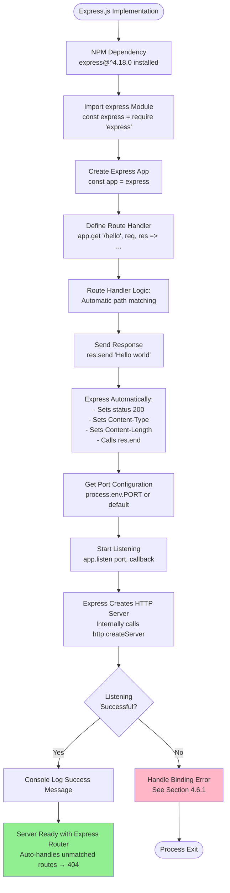
```mermaid
flowchart TD
    Start([Express.js Implementation]) --> NPMInstall[NPM Dependency<br/>express@^4.18.0 installed]
    
    NPMInstall --> ImportExpress[Import express Module<br/>const express = require 'express' ]
    ImportExpress --> CreateApp[Create Express App<br/>const app = express ]
    
    CreateApp --> DefineRoute[Define Route Handler<br/>app.get '/hello', req, res => ...]
    DefineRoute --> RouteLogic[Route Handler Logic:<br/>Automatic path matching]
    
    RouteLogic --> SendResponse[Send Response<br/>res.send 'Hello world' ]
    SendResponse --> AutoHeaders[Express Automatically:<br/>- Sets status 200<br/>- Sets Content-Type<br/>- Sets Content-Length<br/>- Calls res.end]
    
    AutoHeaders --> ConfigPort[Get Port Configuration<br/>process.env.PORT or default]
    ConfigPort --> CallListen[Start Listening<br/>app.listen port, callback]
    
    CallListen --> ExpressCreate[Express Creates HTTP Server<br/>Internally calls http.createServer]
    ExpressCreate --> ListenSuccess{Listening<br/>Successful?}
    
    ListenSuccess -->|Yes| LogSuccess[Console Log Success Message]
    ListenSuccess -->|No| ErrorHandler[Handle Binding Error<br/>See Section 4.6.1]
    
    LogSuccess --> ReadyWithRouter[Server Ready with Express Router<br/>Auto-handles unmatched routes → 404]
    ErrorHandler --> Exit([Process Exit])
    
    style ReadyWithRouter fill:#90EE90
    style ErrorHandler fill:#FFB6C6
```

#### 4.7.2.1 Express.js Characteristics

**Module Installation and Import:**

Express.js requires npm installation as an external dependency:

```bash
npm install express
```

Import pattern:
```javascript
const express = require('express');
// or
import express from 'express';
```

The `express` module is the most popular Node.js web framework, bringing extensive capabilities and abstractions.

**Application Creation:**

Express applications are created by calling the express function:

```javascript
const app = express();
```

This creates an application instance that manages routing, middleware, and HTTP server creation.

**Route Definition Pattern:**

Express provides HTTP method-specific routing functions:

```javascript
app.get('/hello', (req, res) => {
  res.send('Hello world');
});
```

The framework automatically matches request paths against defined routes and invokes corresponding handlers. Unmatched routes receive automatic 404 responses.

**Response Generation:**

Express simplifies response transmission through high-level methods:

- **`res.send(body)`**: Automatically determines Content-Type based on data type, sets headers, and completes response
- **`res.json(data)`**: Sends JSON response with appropriate Content-Type
- **`res.status(code)`**: Chainable status code setter

The `res.send()` method handles:
- Content-Type detection and setting
- Content-Length calculation
- Status code defaulting to 200
- Automatic `res.end()` call

**Server Creation and Listening:**

Express internally creates an HTTP server when `app.listen()` is called:

```javascript
app.listen(port, () => {
  console.log(`Server listening on port ${port}`);
});
```

This method wraps `http.createServer()` and `server.listen()`, abstracting server initialization details.

**Framework Features:**

Express provides capabilities beyond the tutorial scope:
- Middleware pipeline for request preprocessing
- Template engine integration
- Static file serving
- Advanced routing with parameters and patterns
- Error handling middleware
- Request/response helper methods

For the tutorial, only basic routing and response methods are used.

**Educational Benefits:**
- Demonstrates industry-standard framework patterns
- Shows abstraction layers that simplify common tasks
- Introduces routing DSL (Domain-Specific Language)
- Illustrates dependency management with npm
- Provides foundation for more complex Express applications

**Trade-offs:**
- External dependency adds project complexity
- Abstractions hide underlying HTTP details
- Framework "magic" may obscure fundamentals for beginners
- Additional concepts to learn (middleware, routing patterns)

### 4.7.3 Implementation Comparison Decision Flow

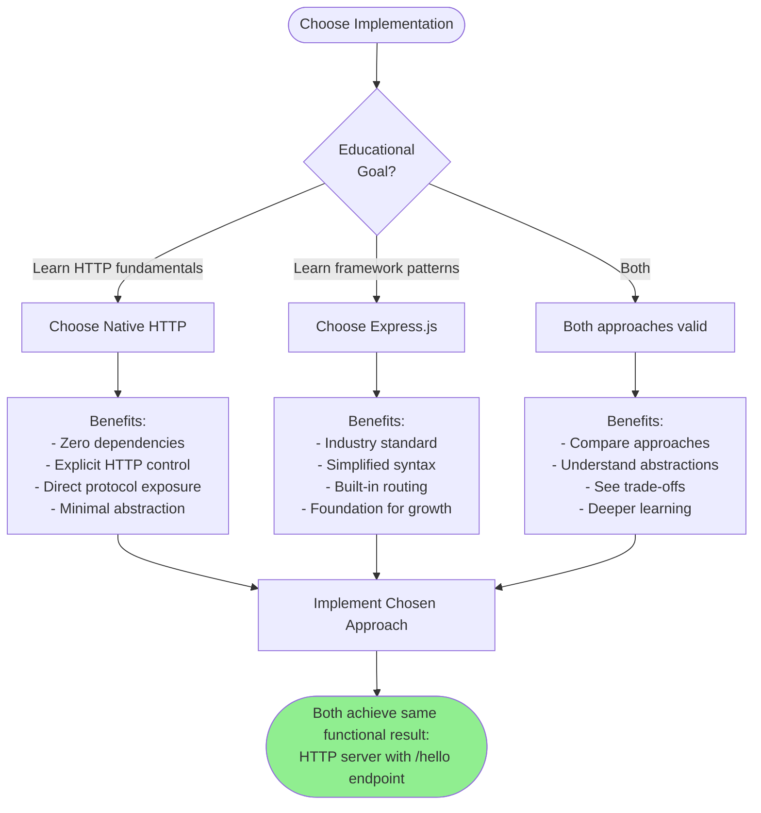
```mermaid
flowchart TD
    Start([Choose Implementation]) --> EduGoal{Educational<br/>Goal?}
    
    EduGoal -->|Learn HTTP fundamentals| NativeChoice[Choose Native HTTP]
    EduGoal -->|Learn framework patterns| ExpressChoice[Choose Express.js]
    EduGoal -->|Both| EitherChoice[Both approaches valid]
    
    NativeChoice --> NativeBenefits[Benefits:<br/>- Zero dependencies<br/>- Explicit HTTP control<br/>- Direct protocol exposure<br/>- Minimal abstraction]
    
    ExpressChoice --> ExpressBenefits[Benefits:<br/>- Industry standard<br/>- Simplified syntax<br/>- Built-in routing<br/>- Foundation for growth]
    
    EitherChoice --> CombinedBenefits[Benefits:<br/>- Compare approaches<br/>- Understand abstractions<br/>- See trade-offs<br/>- Deeper learning]
    
    NativeBenefits --> Implement[Implement Chosen Approach]
    ExpressBenefits --> Implement
    CombinedBenefits --> Implement
    
    Implement --> BothWork([Both achieve same functional result:<br/>HTTP server with /hello endpoint])
    
    style BothWork fill:#90EE90
```

#### 4.7.3.1 Selection Criteria

The choice between Native HTTP and Express.js depends on learning objectives:

**Choose Native HTTP When:**
- Primary goal is understanding HTTP protocol fundamentals
- Learner is new to backend development and needs foundational concepts
- Avoiding external dependencies is important
- Explicit control over all HTTP aspects is desired
- Building from first principles is the pedagogical approach

**Choose Express.js When:**
- Primary goal is learning practical framework usage
- Learner understands HTTP basics and wants to see abstractions
- Preparing for real-world development scenarios
- Building foundation for more complex Express applications
- Demonstrating industry-standard patterns is important

**Teaching Both When:**
- Comprehensive curriculum covers fundamentals and frameworks
- Comparing abstraction levels enhances understanding
- Learners benefit from seeing multiple approaches
- Time permits covering both implementations

Both approaches produce functionally equivalent servers, validating that multiple paths can achieve the same outcome.

## 4.8 Performance and Timing Workflows

Performance workflows ensure the tutorial application meets responsiveness targets that support effective learning experiences.

### 4.8.1 Startup Performance Flow

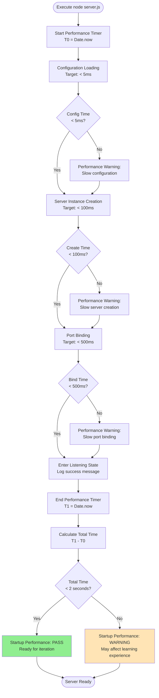
```mermaid
flowchart TD
    Start([Execute node server.js]) --> StartTimer[Start Performance Timer<br/>T0 = Date.now]
    
    StartTimer --> LoadConfig[Configuration Loading<br/>Target: < 5ms]
    LoadConfig --> ConfigTime{Config Time<br/>< 5ms?}
    ConfigTime -->|No| WarnConfig[Performance Warning:<br/>Slow configuration]
    ConfigTime -->|Yes| CreateServer[Server Instance Creation<br/>Target: < 100ms]
    WarnConfig --> CreateServer
    
    CreateServer --> CreateTime{Create Time<br/>< 100ms?}
    CreateTime -->|No| WarnCreate[Performance Warning:<br/>Slow server creation]
    CreateTime -->|Yes| BindPort[Port Binding<br/>Target: < 500ms]
    WarnCreate --> BindPort
    
    BindPort --> BindTime{Bind Time<br/>< 500ms?}
    BindTime -->|No| WarnBind[Performance Warning:<br/>Slow port binding]
    BindTime -->|Yes| EnterListening[Enter Listening State<br/>Log success message]
    WarnBind --> EnterListening
    
    EnterListening --> EndTimer[End Performance Timer<br/>T1 = Date.now]
    EndTimer --> TotalTime[Calculate Total Time<br/>T1 - T0]
    
    TotalTime --> TotalCheck{Total Time<br/>< 2 seconds?}
    TotalCheck -->|Yes| Success[Startup Performance: PASS<br/>Ready for iteration]
    TotalCheck -->|No| WarnTotal[Startup Performance: WARNING<br/>May affect learning experience]
    
    Success --> Complete([Server Ready])
    WarnTotal --> Complete
    
    style Success fill:#90EE90
    style WarnTotal fill:#FFE4B5
```

#### 4.8.1.1 Startup Performance Targets

The 2-second startup target ensures rapid development iteration during tutorial exercises:

**Phase-Level Targets:**
- **Configuration Loading**: < 5ms (reading environment variable, parsing integer)
- **Server Instance Creation**: < 100ms (module import, server creation)
- **Port Binding**: < 500ms (OS socket binding, callback execution)
- **Total Startup**: < 2 seconds (all phases combined)

**Rationale for Targets:**

The 2-second threshold represents the boundary between "instant" and "noticeable" response for human perception. Startups under 2 seconds allow learners to modify code, restart the server, and test changes without breaking cognitive flow. Longer startups introduce friction in the iterative learning process.

#### 4.8.1.2 Startup Performance Measurement

Performance measurement is typically informal in the tutorial context:

- **Manual Observation**: Developer observes time between command execution and success message
- **Timestamp Logging**: Optional console timestamps showing elapsed time
- **Development Experience**: Overall perception of responsiveness during iteration

Production applications would use formal performance monitoring, but the tutorial's simplicity makes such infrastructure unnecessary.

### 4.8.2 Request Processing Performance Flow


```mermaid
flowchart TD
    Start([Request Arrives]) --> StartReqTimer[Start Request Timer<br/>T0 = Date.now]
    
    StartReqTimer --> ParseReq[Parse HTTP Request<br/>Target: < 10ms]
    ParseReq --> ParseTime{Parse Time<br/>< 10ms?}
    ParseTime -->|No| WarnParse[Performance Warning:<br/>Slow request parsing]
    ParseTime -->|Yes| RouteMatch[Route Matching<br/>Target: < 1ms]
    WarnParse --> RouteMatch
    
    RouteMatch --> RouteTime{Route Time<br/>< 1ms?}
    RouteTime -->|No| WarnRoute[Performance Warning:<br/>Slow routing]
    RouteTime -->|Yes| ExecuteHandler[Execute Handler<br/>Target: < 1ms]
    WarnRoute --> ExecuteHandler
    
    ExecuteHandler --> HandlerTime{Handler Time<br/>< 1ms?}
    HandlerTime -->|No| WarnHandler[Performance Warning:<br/>Slow handler execution]
    HandlerTime -->|Yes| GenerateResp[Generate Response<br/>Target: < 1ms]
    WarnHandler --> GenerateResp
    
    GenerateResp --> RespTime{Response Gen<br/>< 1ms?}
    RespTime -->|No| WarnResp[Performance Warning:<br/>Slow response generation]
    RespTime -->|Yes| TransmitResp[Transmit Response<br/>Target: < 10ms]
    WarnResp --> TransmitResp
    
    TransmitResp --> TransTime{Transmit Time<br/>< 10ms?}
    TransTime -->|No| WarnTrans[Performance Warning:<br/>Slow transmission]
    TransTime -->|Yes| EndReqTimer[End Request Timer<br/>T1 = Date.now]
    WarnTrans --> EndReqTimer
    
    EndReqTimer --> TotalReqTime[Calculate Total Time<br/>T1 - T0]
    TotalReqTime --> TotalReqCheck{Total Time<br/>< 100ms?}
    
    TotalReqCheck -->|Yes| ReqSuccess[Request Performance: PASS<br/>Responsive feedback]
    TotalReqCheck -->|No| WarnReqTotal[Request Performance: WARNING<br/>May affect learning experience]
    
    ReqSuccess --> Complete([Request Complete])
    WarnReqTotal --> Complete
    
    style ReqSuccess fill:#90EE90
    style WarnReqTotal fill:#FFE4B5
```

#### 4.8.2.1 Request Processing Performance Targets

The 100ms end-to-end target ensures learners receive immediate feedback when testing endpoint behavior:

**Phase-Level Targets:**
- **Request Parsing**: < 10ms (HTTP header parsing, request object creation)
- **Route Matching**: < 1ms (simple string comparison or Express routing)
- **Handler Execution**: < 1ms (static response generation, no computation)
- **Response Generation**: < 1ms (create headers and body)
- **Response Transmission**: < 10ms (write to TCP connection, close)
- **Total Request Processing**: < 100ms (all phases combined)

**Rationale for Targets:**

The 100ms threshold represents "instantaneous" response for web applications. Response times under 100ms feel immediate to users, providing seamless feedback during testing. This target is easily achievable for the simple `/hello` endpoint serving static content with no external dependencies.

#### 4.8.2.2 Performance Characteristics of Static Content

The `/hello` endpoint serves entirely static content with no variable processing:

- **No Database Access**: No I/O operations that introduce latency
- **No External Services**: No network calls that add roundtrip time
- **No Computation**: No algorithms or data processing
- **No File System Access**: No disk reads or writes
- **Static String**: Response is hardcoded constant

These characteristics ensure the tutorial application easily meets performance targets without optimization. The simplicity illustrates that basic HTTP servers are inherently fast, with performance challenges arising from external dependencies and complex processing.

### 4.8.3 Performance Validation Workflow

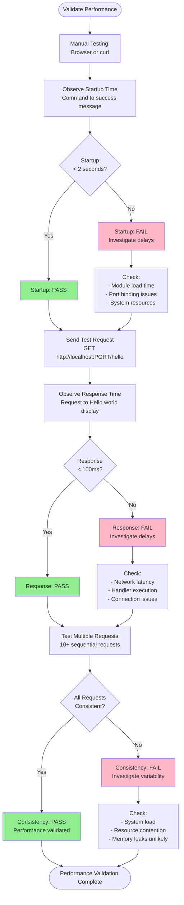
```mermaid
flowchart TD
    Start([Validate Performance]) --> ManualTest[Manual Testing:<br/>Browser or curl]
    
    ManualTest --> ObserveStartup[Observe Startup Time<br/>Command to success message]
    ObserveStartup --> StartupCheck{Startup<br/>< 2 seconds?}
    StartupCheck -->|Yes| StartupPass[Startup: PASS]
    StartupCheck -->|No| StartupFail[Startup: FAIL<br/>Investigate delays]
    
    StartupPass --> TestRequest[Send Test Request<br/>GET http://localhost:PORT/hello]
    StartupFail --> InvestigateStartup[Check:<br/>- Module load time<br/>- Port binding issues<br/>- System resources]
    InvestigateStartup --> TestRequest
    
    TestRequest --> ObserveResponse[Observe Response Time<br/>Request to Hello world display]
    ObserveResponse --> ResponseCheck{Response<br/>< 100ms?}
    
    ResponseCheck -->|Yes| ResponsePass[Response: PASS]
    ResponseCheck -->|No| ResponseFail[Response: FAIL<br/>Investigate delays]
    
    ResponsePass --> MultipleReqs[Test Multiple Requests<br/>10+ sequential requests]
    ResponseFail --> InvestigateResponse[Check:<br/>- Network latency<br/>- Handler execution<br/>- Connection issues]
    InvestigateResponse --> MultipleReqs
    
    MultipleReqs --> ConsistencyCheck{All Requests<br/>Consistent?}
    ConsistencyCheck -->|Yes| ConsistencyPass[Consistency: PASS<br/>Performance validated]
    ConsistencyCheck -->|No| ConsistencyFail[Consistency: FAIL<br/>Investigate variability]
    
    ConsistencyPass --> Complete([Performance Validation Complete])
    ConsistencyFail --> InvestigateConsistency[Check:<br/>- System load<br/>- Resource contention<br/>- Memory leaks unlikely]
    InvestigateConsistency --> Complete
    
    style StartupPass fill:#90EE90
    style ResponsePass fill:#90EE90
    style ConsistencyPass fill:#90EE90
    style StartupFail fill:#FFB6C6
    style ResponseFail fill:#FFB6C6
    style ConsistencyFail fill:#FFB6C6
```

#### 4.8.3.1 Manual Performance Testing

Performance validation uses simple manual testing appropriate for the tutorial context:

**Startup Performance Test:**
1. Execute `node server.js`
2. Observe time until "Server listening on port [PORT]" message appears
3. Verify subjective responsiveness (should feel instant)
4. Target: < 2 seconds

**Response Performance Test:**
1. Open browser to `http://localhost:3000/hello`
2. Observe time until "Hello world" displays
3. Verify subjective responsiveness (should feel instant)
4. Refresh page multiple times, observing consistency
5. Target: < 100ms per request

**Alternative Testing with curl:**
```bash
time curl http://localhost:3000/hello
```

The `time` command shows request duration, providing quantitative performance measurement.

#### 4.8.3.2 Expected Performance Characteristics

Under normal conditions, the tutorial application demonstrates:

- **Startup**: 100-500ms typical, well under 2-second target
- **First Request**: 5-20ms typical on local connections
- **Subsequent Requests**: 1-10ms typical after connection warmup
- **Consistency**: Very low variance between requests (< 5ms standard deviation)

These characteristics reflect the minimal processing complexity and lack of external dependencies.

## 4.9 Testing and Validation Workflows

Testing workflows provide structured procedures for verifying correct system behavior and validating requirement satisfaction.

### 4.9.1 Manual Testing Sequence

```mermaid
flowchart TD
    Start([Begin Manual Testing]) --> Test1[Test 1: Server Startup]
    
    Test1 --> Execute1[Execute: node server.js]
    Execute1 --> Verify1[Verify:<br/>- Success message displays<br/>- No error messages<br/>- Process continues running]
    Verify1 --> Result1{Test 1<br/>Pass?}
    Result1 -->|No| Debug1[Debug startup issues<br/>Check configuration and ports]
    Result1 -->|Yes| Test2[Test 2: Endpoint Functionality]
    Debug1 --> Test2
    
    Test2 --> Execute2[Execute: Open browser<br/>http://localhost:PORT/hello]
    Execute2 --> Verify2[Verify:<br/>- Hello world displays<br/>- Response is immediate<br/>- No errors in browser]
    Verify2 --> Result2{Test 2<br/>Pass?}
    Result2 -->|No| Debug2[Debug endpoint issues<br/>Check routing and handler]
    Result2 -->|Yes| Test3[Test 3: Port Configuration]
    Debug2 --> Test3
    
    Test3 --> Execute3[Execute: PORT=8080 node server.js]
    Execute3 --> Verify3[Verify:<br/>- Server binds to 8080<br/>- Success message shows 8080<br/>- Endpoint works on new port]
    Verify3 --> Result3{Test 3<br/>Pass?}
    Result3 -->|No| Debug3[Debug configuration issues<br/>Check env var handling]
    Result3 -->|Yes| Test4[Test 4: Error Handling]
    Debug3 --> Test4
    
    Test4 --> Execute4[Execute: Start server twice<br/>Same port both times]
    Execute4 --> Verify4[Verify:<br/>- Second start fails<br/>- Clear error message<br/>- Graceful exit]
    Verify4 --> Result4{Test 4<br/>Pass?}
    Result4 -->|No| Debug4[Debug error handling<br/>Check error event handlers]
    Result4 -->|Yes| Test5[Test 5: HTTP Headers]
    Debug4 --> Test5
    
    Test5 --> Execute5[Execute: curl -i<br/>http://localhost:PORT/hello]
    Execute5 --> Verify5[Verify:<br/>- HTTP/1.1 200 OK<br/>- Content-Type: text/plain<br/>- Content-Length: 11<br/>- Body: Hello world]
    Verify5 --> Result5{Test 5<br/>Pass?}
    Result5 -->|No| Debug5[Debug response issues<br/>Check header configuration]
    Result5 -->|Yes| AllPass[All Tests Passed]
    Debug5 --> AllPass
    
    AllPass --> Complete([Manual Testing Complete<br/>System validated])
    
    style AllPass fill:#90EE90
    style Complete fill:#90EE90
```

### 4.9.2 Acceptance Testing Checklist

The following checklist validates that all functional requirements are satisfied:

#### 4.9.2.1 Functional Validation

**F-001: HTTP Server Infrastructure**

- ✓ Server creates HTTP server instance successfully
- ✓ Server binds to configured port
- ✓ Server enters listening state and displays confirmation
- ✓ Server accepts incoming HTTP connections
- ✓ Server processes requests and generates responses
- ✓ Server startup completes within 2 seconds
- ✓ Server handles EADDRINUSE error gracefully
- ✓ Server handles EACCES error gracefully

**F-002: /hello Endpoint**

- ✓ Endpoint responds to requests at `/hello` path
- ✓ Response body is exactly "Hello world"
- ✓ Response status code is 200 (OK)
- ✓ Content-Type header is text/plain (or text/plain; charset=utf-8)
- ✓ Response completes within 100ms
- ✓ Endpoint is accessible via browser
- ✓ Endpoint is accessible via curl or other HTTP clients
- ✓ Multiple sequential requests all succeed

**F-003: Configuration Management**

- ✓ Server reads PORT environment variable when defined
- ✓ Server uses default port when PORT undefined
- ✓ Server validates port number is in range 1-65535
- ✓ Server displays error for invalid port configuration
- ✓ Server accepts port configuration from environment: `PORT=8080 node server.js`
- ✓ Server binds to configured port successfully

#### 4.9.2.2 Non-Functional Validation

**Performance:**

- ✓ Server startup time < 2 seconds
- ✓ Request processing time < 100ms
- ✓ Configuration loading < 5ms
- ✓ Response generation < 1ms for static content

**Reliability:**

- ✓ Server handles port conflicts without crashing
- ✓ Server provides clear error messages for all failure scenarios
- ✓ Server exits gracefully on errors (no orphaned processes)
- ✓ Server responds consistently across multiple requests

**Usability:**

- ✓ Error messages are clear and actionable
- ✓ Success messages confirm server is ready
- ✓ Configuration is simple and well-documented
- ✓ Testing procedures are straightforward

### 4.9.3 Integration Validation Workflow

```mermaid
flowchart TD
    Start([Integration Validation]) --> TestConfig[Test Configuration Integration]
    
    TestConfig --> ConfigToServer[Verify: Configuration → Server<br/>Port value passed correctly]
    ConfigToServer --> ConfigResult{Config Integration<br/>Working?}
    ConfigResult -->|No| DebugConfig[Debug: Check parameter passing<br/>Verify listen call]
    ConfigResult -->|Yes| TestServer[Test Server Integration]
    DebugConfig --> TestServer
    
    TestServer --> ServerToEndpoint[Verify: Server → Endpoint<br/>Requests routed to handler]
    ServerToEndpoint --> ServerResult{Server Integration<br/>Working?}
    ServerResult -->|No| DebugServer[Debug: Check routing logic<br/>Verify handler attachment]
    ServerResult -->|Yes| TestEndpoint[Test Endpoint Integration]
    DebugServer --> TestEndpoint
    
    TestEndpoint --> EndpointToResponse[Verify: Endpoint → Response<br/>Handler generates correct output]
    EndpointToResponse --> EndpointResult{Endpoint Integration<br/>Working?}
    EndpointResult -->|No| DebugEndpoint[Debug: Check response logic<br/>Verify headers and body]
    EndpointResult -->|Yes| TestErrors[Test Error Handling Integration]
    DebugEndpoint --> TestErrors
    
    TestErrors --> ErrorToOutput[Verify: Errors → User Feedback<br/>Clear messages displayed]
    ErrorToOutput --> ErrorResult{Error Integration<br/>Working?}
    ErrorResult -->|No| DebugErrors[Debug: Check error handlers<br/>Verify message output]
    ErrorResult -->|Yes| AllIntegrated[All Integrations Validated]
    DebugErrors --> AllIntegrated
    
    AllIntegrated --> Complete([Integration Validation Complete])
    
    style AllIntegrated fill:#90EE90
    style Complete fill:#90EE90
```

#### 4.9.3.1 Integration Points Validation

The tutorial application has minimal integration complexity due to its simple architecture, but several critical integration points require validation:

**Configuration → Server Integration:**
- Port value from configuration correctly passed to `server.listen()`
- Host address configuration applied correctly
- Default values activate when environment variables undefined
- Validation errors prevent server initialization

**Server → Endpoint Integration:**
- Incoming requests properly routed to `/hello` handler
- Request and response objects correctly passed to handler
- Handler invoked for matching paths
- Unmatched paths handled appropriately (404 or no response)

**Endpoint → Response Integration:**
- Handler-generated content transmitted to client
- Headers set by handler appear in client response
- Status codes correctly reflect handler intent
- Response completion signals end of request processing

**Error → Feedback Integration:**
- Error handlers display messages to console
- Error conditions trigger appropriate exit behavior
- Error messages include actionable troubleshooting guidance

Successful validation confirms all system components interact correctly to achieve the desired functionality.

## 4.10 References

### 4.10.1 Technical Specification Sections Referenced

This Process Flowchart section was developed using information from the following Technical Specification sections:

- **1.1 Executive Summary**: Project purpose, target audience, key objectives
- **1.2 System Overview**: System description, components, success criteria, KPIs
- **1.3 Scope**: In-scope features and out-of-scope exclusions
- **2.1 Overview**: Requirements philosophy and organization
- **2.2 Feature Catalog**: F-001 (HTTP Server Infrastructure), F-002 (/hello Endpoint), F-003 (Configuration Management)
- **2.3 Functional Requirements**: Detailed requirements for all features (F-001-RQ-001 through F-003-RQ-004)
- **2.4 Feature Relationships and Dependencies**: Feature dependency diagram, integration points, shared components
- **2.5 Implementation Considerations**: Technical constraints, performance requirements, security implications, maintenance considerations
- **2.7 Testing and Validation Approach**: Manual testing procedures, acceptance criteria
- **3.2 Programming Languages**: JavaScript/Node.js specifications, ES6+ syntax, module systems
- **3.3 Frameworks & Libraries**: Native HTTP module and Express.js 4.x framework characteristics
- **3.7 Development & Deployment**: Development environment, workflow, execution procedures

### 4.10.2 Repository Files and Folders Examined

The following repository files and folders were analyzed to inform this documentation:

- **`README.md`**: Project documentation placeholder (contains only "# 30_1" heading)
- **`/` (root folder)**: Repository root containing only README.md at current state

**Repository Status**: The repository represents a greenfield project with no implementation code yet created. All workflows documented in this section describe the intended behavior to be implemented based on the Technical Specification requirements.

### 4.10.3 Key Concepts and Terminology

This section references the following key concepts throughout its flowcharts and descriptions:

- **HTTP Request/Response Cycle**: The fundamental client-server interaction pattern
- **TCP Port Binding**: Operating system mechanism for reserving network ports
- **State Transitions**: Server lifecycle progression through defined operational states
- **Configuration Resolution**: Environment variable handling and default value application
- **Error Handling**: Graceful failure patterns with user feedback
- **Routing**: URL path matching to determine appropriate handler execution
- **Native HTTP Module**: Node.js built-in HTTP server implementation
- **Express.js Framework**: Third-party web framework providing abstractions
- **Performance Targets**: Timing requirements for startup and response processing
- **Manual Testing**: Human-executed validation procedures for educational context
- **Integration Points**: Boundaries where system components interact and exchange data

### 4.10.4 Related Documentation

For additional context and details related to the processes documented in this section, refer to:

- **Section 2: Features & Requirements** - Detailed functional requirements that these workflows implement
- **Section 3: Technology Stack** - Technical specifications for Node.js, HTTP module, and Express.js
- **Section 5: Architecture** (if available) - Architectural patterns and component structure
- **Section 6: Data Flow** (if available) - Data movement patterns and transformations

---

**Document Information:**
- **Section**: 4. Process Flowchart
- **Version**: 1.0
- **Last Updated**: 2024
- **Completeness**: Comprehensive coverage of all system workflows, error handling, state transitions, and implementation variants based on Technical Specification requirements and repository analysis

# 5. System Architecture

## 5.1 High-Level Architecture

### 5.1.1 System Overview

The **30_1 Node.js Tutorial** implements a **Simple Request-Response Server Architecture** designed specifically for educational purposes. This architecture prioritizes learning clarity over production complexity by implementing the minimal components necessary to demonstrate HTTP server fundamentals.

**Architectural Style and Rationale:**

The system adopts a **stateless, single-endpoint HTTP server pattern** that exposes fundamental web server concepts without introducing abstraction layers that would obscure learning objectives. This architectural approach enables learners to observe the complete request/response lifecycle with maximum transparency while maintaining executable simplicity.

The architecture deliberately excludes production-grade features (authentication, databases, caching, load balancing) to maintain laser focus on the HTTP protocol's core request-response mechanism. This minimalist philosophy ensures that beginners can understand every line of code and trace complete request flows from network socket to response transmission.

**Key Architectural Principles:**

1. **Minimalism by Design** - The system limits functionality to absolute essentials: a single endpoint returning a static response. This constraint eliminates complexity that would distract from HTTP fundamentals.

2. **Educational Transparency** - All components operate without hidden abstractions. Request parsing, routing logic, and response generation remain visible and comprehensible in the implementation code.

3. **Immediate Executability** - The server starts within 2 seconds and responds within 100 milliseconds, enabling rapid feedback loops essential for experiential learning.

4. **Zero Production Features** - By explicitly excluding authentication, databases, and deployment infrastructure, the architecture maintains pedagogical focus on HTTP concepts rather than operational concerns.

5. **Implementation Flexibility** - The architecture accommodates two equally valid implementation approaches (Native HTTP module and Express.js framework), demonstrating that multiple technical paths can achieve identical functional outcomes.

**System Boundaries:**

The architectural boundaries strictly limit system scope to maintain educational focus:

- **Input Boundary**: HTTP GET requests directed to the `/hello` endpoint on the configured port
- **Processing Boundary**: Request URL pattern matching and static response generation
- **Output Boundary**: Plain text "Hello world" response with HTTP 200 status code
- **Network Boundary**: Localhost binding only (127.0.0.1 or configurable host)
- **Data Boundary**: No database connections, file system operations, or external service integrations
- **Security Boundary**: No authentication, authorization, or encryption mechanisms

**Major Interfaces:**

| Interface Type | Description | Protocol/Format |
|----------------|-------------|-----------------|
| HTTP Network Interface | Client-server communication | HTTP/1.1 over TCP |
| Configuration Interface | Environment variable input | process.env API |
| Console Interface | Status and error output | stdout/stderr streams |

### 5.1.2 Core Components Table

| Component Name | Primary Responsibility | Key Dependencies | Integration Points | Critical Considerations |
|----------------|------------------------|------------------|-------------------|-------------------------|
| **Configuration Layer** (F-003) | Port and host address configuration from environment variables with validation | Node.js process.env API | Provides port/host parameters to Server Infrastructure during initialization | Must validate before server initialization; port range 1-65535; warn on privileged ports <1024 |
| **HTTP Server Infrastructure** (F-001) | HTTP server creation, TCP binding, connection management, request routing | Node.js `http` module (Native) OR Express.js framework | Receives configuration from Configuration Layer; routes requests to Endpoint Handler | Critical error handling for EADDRINUSE and EACCES; graceful shutdown on SIGINT |
| **/hello Endpoint Handler** (F-002) | URL path matching, response generation, HTTP status/header setting | HTTP Server Infrastructure for request/response objects | Consumes request objects from Server Infrastructure; generates responses via ServerResponse API | Response time target <100ms; static response requires no input validation |

**Component Relationship Summary:**

The three core components form a linear dependency chain: Configuration Layer → Server Infrastructure → Endpoint Handler. Configuration must complete successfully before server initialization begins. The server must successfully bind to a port before accepting requests. Only after successful binding can the endpoint handler receive and process requests. This sequential dependency pattern ensures proper initialization ordering and clear failure points.

### 5.1.3 Data Flow Description

**Primary Request Processing Flow:**

The data flow follows a well-defined pipeline from client request to server response:

1. **Request Reception**: A client sends an HTTP GET request to `http://localhost:[PORT]/hello`. The TCP layer establishes a connection through a three-way handshake (typically completing in <10ms for localhost connections).

2. **Protocol Parsing**: The Node.js HTTP parser extracts the request line, headers, and body from raw TCP bytes, constructing an `http.IncomingMessage` object. This parsing phase completes in <10ms for typical requests.

3. **Request Object Creation**: The HTTP server infrastructure creates paired request (`req`) and response (`res`) objects representing the incoming connection. These objects encapsulate all request metadata (URL, method, headers) and provide response generation capabilities.

4. **Route Matching**: The system compares the request URL path (`req.url`) against the defined route pattern `/hello`. In the Native HTTP approach, this occurs through explicit conditional logic. In the Express.js approach, the framework's internal routing mechanism performs pattern matching.

5. **Handler Execution**: Upon successful route match, the endpoint handler executes its response generation logic. This involves setting HTTP status code (200), Content-Type header (text/plain), and writing the response body ("Hello world").

6. **Response Transmission**: The completed response travels back through the TCP connection as HTTP-formatted bytes. The server sets appropriate headers (Content-Length, Content-Type) and transmits the response body.

7. **Connection Termination**: After response transmission completes, the TCP connection closes (or persists if keep-alive is enabled). The server returns to its listening state, ready to accept subsequent requests.

8. **Server Ready State**: The server event loop returns to monitoring for new incoming connections, maintaining idle state until the next request arrives.

**Data Transformation Points:**

| Transformation Stage | Input Format | Output Format | Processing Time |
|----------------------|--------------|---------------|-----------------|
| TCP Reception | Raw network bytes | Buffered TCP stream | <5ms |
| HTTP Parsing | TCP byte stream | `IncomingMessage` object | <10ms |
| Route Matching | URL string (`req.url`) | Boolean match result | <1ms |
| Response Generation | Static string literal | HTTP response bytes | <1ms |
| TCP Transmission | HTTP formatted bytes | Network packets | <5ms |

**Integration Patterns and Protocols:**

- **Request Integration**: The HTTP server infrastructure integrates with the endpoint handler through the standard Node.js request/response callback pattern: `(req, res) => {...}`. This pattern provides loose coupling between routing infrastructure and endpoint logic.

- **Configuration Integration**: The Configuration Layer integrates with the Server Infrastructure through direct parameter passing during the `server.listen(port, host)` call. This simple integration pattern avoids configuration object complexity.

- **Console Integration**: All components integrate with the console logging interface through standard `console.log()` and `console.error()` calls, providing unified status reporting without logging framework overhead.

**Performance Targets:**

The system achieves rapid data flow with the following performance characteristics:

- **Total Request/Response Cycle**: <100ms (target specified in technical requirements)
- **Server Startup Time**: <2 seconds from process launch to listening state
- **Request Parsing**: <10ms from TCP reception to request object creation
- **Response Generation**: <1ms (static string requires no computation or I/O)
- **Throughput Capability**: 10 requests/second minimum (exceeds tutorial validation requirements)

### 5.1.4 External Integration Points

**External Integration Status: Zero Integrations**

This tutorial architecture deliberately maintains **zero external service integrations** to eliminate complexity that would distract from HTTP fundamentals. The following table documents the intentional absence of common integration points:

| System Category | Integration Type | Status | Rationale |
|-----------------|------------------|--------|-----------|
| Databases | SQL/NoSQL connections | ❌ Not Implemented | Static response requires no data persistence; database setup creates unnecessary friction for beginners |
| Authentication Services | OAuth, JWT, SAML | ❌ Not Implemented | Single endpoint with public access eliminates need for identity verification |
| Third-Party APIs | REST/GraphQL calls | ❌ Not Implemented | Self-contained demonstration requires no external data sources |
| Message Queues | RabbitMQ, Kafka, SQS | ❌ Not Implemented | Synchronous request/response pattern sufficient for tutorial scope |
| Caching Systems | Redis, Memcached | ❌ Not Implemented | Static response provides consistent value without cache invalidation complexity |
| Monitoring Services | APM, log aggregation | ❌ Not Implemented | Console logging adequate for local development validation |

**Network Interface Specification:**

While external service integrations are absent, the system exposes a single network interface for HTTP client connections:

| Interface Aspect | Specification | Configuration |
|------------------|---------------|---------------|
| Protocol | HTTP/1.1 (no HTTPS, HTTP/2, or WebSockets) | Fixed by Node.js http module |
| Network Binding | localhost (127.0.0.1) or 0.0.0.0 | Configurable via host parameter |
| Port Number | Default 3000 or 8080 | Configurable via PORT environment variable |
| Access Scope | Local machine only | No public internet exposure |
| Request Methods | All methods accepted (GET, POST, etc.) | No method filtering implemented |

**Operating System Interfaces:**

The system integrates with the host operating system through standard Node.js runtime APIs:

- **TCP/IP Stack**: Node.js runtime interfaces with OS network stack for socket operations
- **Process Environment**: `process.env` API reads environment variables from OS process context
- **Standard Streams**: `console.log()` writes to stdout; `console.error()` writes to stderr
- **Process Signals**: SIGINT (Ctrl+C) signal handling enables graceful shutdown

## 5.2 Component Details

### 5.2.1 Configuration Layer (F-003)

**Purpose and Responsibilities:**

The Configuration Layer provides initialization parameters for the HTTP server by reading and validating environment variables. This component executes during server startup before any network operations begin, ensuring that invalid configurations prevent server initialization rather than causing runtime failures.

Key responsibilities include:
- Reading the PORT environment variable from `process.env.PORT`
- Applying default port values (3000 or 8080) when PORT is undefined
- Validating port number format (must be integer, not string or undefined)
- Validating port range (must fall between 1 and 65535)
- Warning about privileged ports (<1024 requiring elevated permissions)
- Providing host address configuration (default to localhost or 0.0.0.0)

**Technologies and Frameworks Used:**

- **Node.js Process API**: `process.env` object provides access to environment variables
- **JavaScript Type Coercion**: `parseInt()` or `Number()` converts string values to integers
- **Validation Logic**: Conditional statements verify port constraints

**Key Interfaces:**

```mermaid
graph LR
    A[Environment Variables<br/>process.env.PORT] -->|String or undefined| B[Configuration Layer]
    B -->|Validated integer| C[HTTP Server Infrastructure]
    B -->|Error messages| D[Console stderr]
    
    style B fill:#e1f5ff
    style C fill:#fff4e1
```

**Input Interface:**
- **Source**: Operating system environment variables via `process.env`
- **Format**: String value or undefined
- **Example**: `PORT=3000` or no PORT variable set

**Output Interface:**
- **Success Case**: Integer port number (1-65535) and string host address
- **Failure Case**: Error message to stderr and process exit with code 1

**Data Persistence Requirements:**

The Configuration Layer maintains no persistent state. Configuration values exist only in memory for the duration of the server process. Each server restart reads configuration fresh from environment variables, enabling runtime configuration changes through process restart.

**Scaling Considerations:**

Configuration validation occurs once during server initialization, imposing negligible performance impact. The single-process architecture requires no configuration distribution or synchronization across multiple instances.

**Error Conditions:**

| Error Type | Detection Method | Recovery Action |
|------------|------------------|-----------------|
| Non-numeric PORT | `isNaN(parseInt(PORT))` returns true | Display error message, exit code 1 |
| Port out of range | `port < 1` or `port > 65535` | Display error message with valid range, exit code 1 |
| Privileged port | `port < 1024` | Display warning, suggest elevated privileges or alternative port |

### 5.2.2 HTTP Server Infrastructure (F-001)

**Purpose and Responsibilities:**

The HTTP Server Infrastructure forms the core networking component, managing TCP connections, HTTP protocol handling, and request routing. This component bridges the gap between low-level network sockets and application-level request processing.

Primary responsibilities encompass:
- Creating HTTP server instance using either Node.js http module or Express.js framework
- Binding to configured port and host address on the network interface
- Accepting incoming TCP connections from HTTP clients
- Parsing HTTP protocol data (request line, headers, body) into JavaScript objects
- Routing parsed requests to the appropriate endpoint handler
- Managing connection lifecycle (establishment, processing, termination)
- Handling network-level errors (port conflicts, permission issues)
- Supporting graceful shutdown on interrupt signals

**Technologies and Frameworks Used:**

The technical specification supports two equally valid implementation approaches:

**Option 1: Native HTTP Module**
- **Technology**: Node.js built-in `http` module (part of core runtime)
- **Server Creation**: `http.createServer(requestHandler)` function
- **Request Handling**: Manual callback function receives `(req, res)` parameters
- **Dependencies**: Zero external packages required
- **Educational Focus**: Exposes low-level HTTP concepts and protocol details

**Option 2: Express.js Framework**
- **Technology**: Express.js web framework (npm package `express@^4.18.0`)
- **Server Creation**: `express()` function creates application instance
- **Request Handling**: Route-specific handlers via `app.get('/hello', handler)`
- **Dependencies**: 1 npm package plus transitive dependencies
- **Educational Focus**: Demonstrates industry-standard framework patterns

**Key Interfaces and APIs:**

```mermaid
sequenceDiagram
    participant Config as Configuration Layer
    participant Server as HTTP Server Infrastructure
    participant OS as Operating System
    participant Handler as Endpoint Handler
    
    Config->>Server: Provide port and host
    Server->>OS: Bind to port (socket operation)
    
    alt Port Available
        OS-->>Server: Binding successful
        Server->>Server: Enter listening state
    else Port Unavailable
        OS-->>Server: EADDRINUSE error
        Server->>Server: Error handling
        Server->>OS: Exit process (code 1)
    end
    
    loop Request Processing
        OS->>Server: Incoming HTTP request
        Server->>Server: Parse HTTP protocol
        Server->>Handler: Route to endpoint (req, res)
        Handler-->>Server: Response complete
        Server->>OS: Transmit response bytes
    end
```

**Native HTTP Module Interface:**

```javascript
// Server creation
const server = http.createServer((req, res) => {
  // Request handler receives every request
  // req: http.IncomingMessage
  // res: http.ServerResponse
});

// Port binding
server.listen(port, host, () => {
  console.log(`Server listening on ${host}:${port}`);
});

// Error handling
server.on('error', (error) => {
  if (error.code === 'EADDRINUSE') {
    console.error(`Port ${port} already in use`);
  }
  process.exit(1);
});
```

**Express.js Interface:**

```javascript
// Application creation
const app = express();

// Route definition
app.get('/hello', (req, res) => {
  res.send('Hello world');
});

// Port binding (internally creates http.Server)
app.listen(port, host, () => {
  console.log(`Server listening on ${host}:${port}`);
});
```

**Data Persistence Requirements:**

The HTTP Server Infrastructure maintains no persistent data storage. All state exists in memory for the process lifetime:
- **Connection State**: Active TCP connections tracked in memory
- **Request State**: Each request processed independently without session storage
- **Server State**: Listening state maintained in event loop

**Scaling Considerations:**

The tutorial implements a single-process, single-threaded architecture using Node.js's event loop concurrency model:

| Scaling Aspect | Current Implementation | Rationale |
|----------------|------------------------|-----------|
| Process Count | Single process | Sufficient for educational workload; avoids clustering complexity |
| Thread Model | Single-threaded (event loop) | Node.js default; handles 5+ concurrent connections adequately |
| Load Balancing | Not implemented | Tutorial scope requires no traffic distribution |
| Horizontal Scaling | Not supported | Local development scope eliminates multi-instance needs |

**Critical Error Handling:**

The server infrastructure must handle critical binding failures that prevent server operation:

1. **EADDRINUSE (Port Already in Use)**:
   - **Detection**: Error event during `listen()` call
   - **Response**: Display error message suggesting `lsof` or `netstat` troubleshooting
   - **Recovery**: Exit process with code 1 (cannot continue without port access)

2. **EACCES (Permission Denied)**:
   - **Detection**: Error event when binding privileged port (<1024)
   - **Response**: Suggest elevated privileges or alternative port selection
   - **Recovery**: Exit process with code 1

3. **Runtime Request Errors**:
   - **Detection**: Exceptions during request handler execution
   - **Response**: Log error to console, send 500 response if headers not sent
   - **Recovery**: Continue operation (isolate failure to single request)

### 5.2.3 /hello Endpoint Handler (F-002)

**Purpose and Responsibilities:**

The `/hello` Endpoint Handler implements the tutorial's sole functional requirement: responding to requests with "Hello world" plain text. This component demonstrates fundamental endpoint implementation patterns without introducing routing complexity.

Specific responsibilities include:
- Matching incoming request URLs against the `/hello` path pattern
- Generating the static "Hello world" response payload
- Setting appropriate HTTP response status code (200 OK)
- Configuring response headers (Content-Type: text/plain)
- Completing the response stream transmission
- Achieving response time target of <100ms

**Technologies and Frameworks Used:**

The endpoint handler's implementation varies based on server infrastructure choice:

**Native HTTP Implementation:**
- Manual URL comparison: `if (req.url === '/hello') {...}`
- Explicit header setting: `res.writeHead(200, {'Content-Type': 'text/plain'})`
- Manual body transmission: `res.end('Hello world')`

**Express.js Implementation:**
- Route definition: `app.get('/hello', handler)`
- Implicit status/headers: `res.send('Hello world')` automatically sets status 200 and Content-Type

**Key Interfaces:**

**Input Interface:**
- **Request Object** (`http.IncomingMessage`):
  - `req.url`: String containing request path (e.g., "/hello")
  - `req.method`: String containing HTTP method (GET, POST, etc.)
  - `req.headers`: Object containing HTTP headers

**Output Interface:**
- **Response Object** (`http.ServerResponse`):
  - `res.writeHead(statusCode, headers)`: Set status and headers
  - `res.end(body)`: Complete response with body content
  - Alternative (Express): `res.send(body)`: High-level response method

```mermaid
flowchart TD
    A[Request Arrives at Handler] --> B{URL Matches<br/>/hello?}
    B -->|Yes| C[Set Status Code: 200]
    B -->|No| D[No Route Match<br/>Native: No response<br/>Express: Auto 404]
    
    C --> E[Set Content-Type Header:<br/>text/plain]
    E --> F[Write Response Body:<br/>Hello world]
    F --> G[Complete Response Stream]
    G --> H[Return to Listening State]
    
    D --> I[Client Receives No/404 Response]
    
    style C fill:#90EE90
    style E fill:#90EE90
    style F fill:#90EE90
    style D fill:#FFE4B5
```

**Dependencies:**

The endpoint handler depends entirely on the HTTP Server Infrastructure (F-001) for its operation:
- **Request Objects**: Server infrastructure creates and populates request objects
- **Response Objects**: Server infrastructure provides response objects with transmission capabilities
- **Route Invocation**: Server infrastructure routes matched requests to handler function

**Data Persistence Requirements:**

The endpoint maintains zero data persistence:
- **No State Storage**: Each request processes independently without reference to previous requests
- **No Session Data**: No user session tracking or request correlation
- **Static Response**: "Hello world" string literal hardcoded in source (no database retrieval)

**Scaling Considerations:**

The endpoint's stateless, static response pattern provides optimal scaling characteristics:
- **CPU Usage**: Negligible (string literal return requires no computation)
- **Memory Usage**: Minimal (no request-specific allocations)
- **I/O Operations**: Zero (no database, file, or network calls)
- **Response Time**: <1ms for response generation (exceeds <100ms target by 100x)

**Critical Considerations:**

| Consideration | Implementation Detail |
|---------------|----------------------|
| Response Time Target | <100ms (actual: <1ms due to static response) |
| Input Validation | Not required (no request body processing) |
| Method Handling | Method-agnostic (accepts GET, POST, etc. without differentiation) |
| Error Scenarios | Minimal (static response eliminates most error conditions) |
| Content Type | text/plain (matches specification requirements) |

### 5.2.4 Component Interaction Diagram

```mermaid
graph TB
subgraph "Initialization Phase"
    ENV[Environment Variables<br/>PORT=3000] -->|Read| CONFIG[Configuration Layer<br/>F-003]
    CONFIG -->|Validate & Provide<br/>port, host| SERVER[HTTP Server<br/>Infrastructure<br/>F-001]
    SERVER -->|Bind Port| OS[Operating System<br/>TCP/IP Stack]
end

subgraph "Request Processing Phase"
    CLIENT["HTTP Client<br/>Browser/curl"] -->|"GET /hello"| OS
    OS -->|TCP Connection| SERVER
    SERVER -->|Parse Request<br/>Create req, res| ROUTER{Route<br/>Matching}
    ROUTER -->|"URL === /hello"| ENDPOINT["/hello Endpoint<br/>Handler<br/>F-002"]
    ROUTER -->|"URL !== /hello"| NOMATCH["No Match<br/>Native: silence<br/>Express: 404"]
    ENDPOINT -->|Generate Response<br/>Hello world| SERVER
    SERVER -->|HTTP Response| OS
    OS -->|TCP Transmission| CLIENT
end

subgraph "Error Handling Phase"
    CONFIG -->|Validation Fail| ERROR[Error Handler]
    SERVER -->|Port Binding Fail| ERROR
    ERROR -->|Log Message| CONSOLE[Console stderr]
    ERROR -->|Exit Code 1| TERM[Process Termination]
end

style CONFIG fill:#e1f5ff
style SERVER fill:#fff4e1
style ENDPOINT fill:#e8f5e9
style ERROR fill:#FFB6C6
```

### 5.2.5 Request/Response Processing Sequence

```mermaid
sequenceDiagram
    participant Client as HTTP Client
    participant TCP as TCP/IP Stack
    participant Server as HTTP Server Infrastructure
    participant Router as Request Router
    participant Handler as /hello Endpoint Handler
    
    Client->>TCP: HTTP GET /hello
    TCP->>TCP: Three-way handshake<br/>(~10ms)
    TCP->>Server: TCP connection established
    
    Server->>Server: Parse HTTP protocol<br/>(~10ms)
    Server->>Router: Route request<br/>req.url = /hello
    
    Router->>Router: Match URL pattern
    Router->>Handler: Invoke handler(req, res)
    
    Handler->>Handler: Generate response<br/>Hello world (<1ms)
    Handler->>Server: Set status 200,<br/>Content-Type: text/plain
    Handler->>Server: Write body Hello world
    Handler->>Server: Complete response (res.end)
    
    Server->>TCP: Transmit HTTP response
    TCP->>Client: Response delivered
    
    Note over Client,Handler: Total time: <100ms target
```

## 5.3 Technical Decisions

### 5.3.1 Architecture Decision Records

The following architectural decisions shape the system's design, each with explicit rationale and documented trade-offs.

#### 5.3.1.1 ADR-001: Dual Implementation Approach Support

**Decision:** Support both Native HTTP module and Express.js framework as equally valid implementation approaches within a single technical specification.

**Context:** Educational tutorials typically prescribe a single implementation path. This project accommodates two distinct approaches with different learning objectives and complexity levels.

**Rationale:**

| Consideration | Analysis |
|---------------|----------|
| **Learning Diversity** | Different learners benefit from different abstraction levels; some need fundamentals exposure while others seek practical framework skills |
| **Pedagogical Flexibility** | Instructors teaching different courses (fundamentals vs. practical development) can use the same specification |
| **Comparison Value** | Learners who implement both approaches gain deeper understanding of abstraction layers and framework value propositions |
| **Industry Relevance** | Native HTTP teaches protocol fundamentals; Express.js teaches industry-standard practices; both remain valuable |

**Consequences:**

- ✅ **Positive**: Broader educational applicability across beginner and intermediate skill levels
- ✅ **Positive**: Demonstrates that multiple technical approaches can achieve identical functional outcomes
- ✅ **Positive**: Provides natural comparison case study for understanding abstractions
- ⚠️ **Negative**: Increased specification complexity (must document both approaches)
- ⚠️ **Negative**: Dependency count varies (0 vs. 1+ packages) between approaches

**Implementation:**

The specification documents both approaches with equal detail, marking each as "Option A" and "Option B" rather than "preferred" and "alternative." Technical workflow sections provide parallel documentation of both paths.

#### 5.3.1.2 ADR-002: Zero Database Integration

**Decision:** Explicitly exclude all database systems (SQL, NoSQL, in-memory) from the architecture.

**Context:** Most web applications require data persistence, making database integration a common architectural component. This tutorial intentionally omits databases despite their prevalence.

**Rationale:**

```mermaid
graph TD
    A[Include Database?] --> B{Evaluation Criteria}
    B --> C[Functional Requirement]
    C --> D{Static 'Hello world'<br/>response needs<br/>data storage?}
    D -->|No| E[Database Unnecessary]
    
    B --> F[Learning Objectives]
    F --> G{Tutorial focuses on<br/>HTTP fundamentals?}
    G -->|Yes| H[Database Orthogonal<br/>to HTTP concepts]
    
    B --> I[Setup Complexity]
    I --> J{Database installation<br/>creates friction?}
    J -->|Yes| K[Eliminates Barrier<br/>to Entry]
    
    E --> L[Decision: Zero Databases]
    H --> L
    K --> L
    
    style L fill:#90EE90
```

**Consequences:**

- ✅ **Positive**: Eliminates database installation and configuration friction for beginners
- ✅ **Positive**: Maintains focus on HTTP request/response cycle without data layer distractions
- ✅ **Positive**: Reduces total lines of code (no connection management, query logic)
- ✅ **Positive**: Zero database-related error conditions (connection failures, timeouts)
- ⚠️ **Negative**: Limited applicability to real-world application patterns
- ⚠️ **Negative**: Doesn't teach data persistence concepts
- ⚠️ **Negative**: Static responses less impressive to demonstrate

**Alternative Considered:** SQLite file-based database for minimal setup complexity
**Rejected Because:** Even minimal database adds concepts (SQL syntax, connection lifecycle, schema definition) orthogonal to HTTP fundamentals

#### 5.3.1.3 ADR-003: Single Endpoint Scope

**Decision:** Implement exactly one HTTP endpoint (`/hello`) with a static response.

**Context:** Real applications feature multiple endpoints with varying response patterns. This tutorial constrains scope to a single endpoint.

**Rationale:**

| Dimension | Single Endpoint | Multiple Endpoints |
|-----------|----------------|-------------------|
| **Routing Complexity** | Minimal (single condition) | Requires routing framework or complex logic |
| **Cognitive Load** | Low (one concept at a time) | Medium (understand routing patterns) |
| **Code Length** | <50 lines achievable | Exceeds simplicity threshold |
| **Testing Effort** | Single test case | Multiple test scenarios |
| **Learning Clarity** | Direct focus on request/response | Distributed focus across endpoints |

**Consequences:**

- ✅ **Positive**: Maximum learning clarity by eliminating routing complexity
- ✅ **Positive**: Meets <50 line code constraint easily
- ✅ **Positive**: Single test case for manual validation
- ✅ **Positive**: Demonstrates complete request/response cycle without distractions
- ⚠️ **Negative**: Doesn't demonstrate routing patterns or URL parameter handling
- ⚠️ **Negative**: Limited representation of real-world application structure
- ⚠️ **Negative**: Doesn't show RESTful API design principles

**Future Evolution:** Tutorial series could progress to multiple endpoints (Tutorial Level 2) after mastering single-endpoint fundamentals.

#### 5.3.1.4 ADR-004: Local Development Only

**Decision:** Scope the system exclusively for local development execution with no deployment capabilities.

**Context:** Production applications require deployment to cloud platforms or servers. This tutorial intentionally excludes all deployment infrastructure.

**Rationale:**

```mermaid
flowchart LR
    A[Local Development Only] --> B[Eliminates Concepts]
    B --> C[DNS Configuration]
    B --> D[SSL Certificates]
    B --> E[Reverse Proxy]
    B --> F[Load Balancing]
    B --> G[Environment Mgmt]
    B --> H[Cloud Platform APIs]
    
    A --> I[Enables Focus]
    I --> J[HTTP Protocol]
    I --> K[Request/Response]
    I --> L[Server Lifecycle]
    
    C --> M[Simplified Learning Path]
    D --> M
    E --> M
    F --> M
    G --> M
    H --> M
    
    J --> N[Educational Goals Met]
    K --> N
    L --> N
    
    style A fill:#e1f5ff
    style M fill:#90EE90
    style N fill:#90EE90
```

**Consequences:**

- ✅ **Positive**: Eliminates deployment complexity (Docker, cloud platforms, DNS)
- ✅ **Positive**: No security hardening required (HTTPS, authentication)
- ✅ **Positive**: Immediate feedback loop (run locally, test immediately)
- ✅ **Positive**: Zero cost (no cloud hosting fees)
- ⚠️ **Negative**: Learners don't experience deployment process
- ⚠️ **Negative**: Can't share running application with others
- ⚠️ **Negative**: No exposure to production operations

**Security Implication:** Local-only scope justifies absence of security features, as the server never faces public internet traffic.

#### 5.3.1.5 ADR-005: Manual Testing Only

**Decision:** Exclude all automated testing frameworks and rely exclusively on manual testing via browser or curl.

**Context:** Modern software development emphasizes automated testing. This tutorial deliberately omits test frameworks.

**Rationale:**

**Complexity Analysis:**
- Automated testing frameworks require learning test syntax, assertion libraries, test runner configuration, and mocking patterns
- Manual testing requires only HTTP client usage (browser or curl)
- Single static endpoint validates trivially (visit URL, observe response)

**Dependency Analysis:**
- Automated testing adds 2-5 npm packages (test framework, assertion library, HTTP client)
- Manual testing adds zero dependencies
- Specification constrains total dependencies to 0-2 packages

**Educational Value Analysis:**
- Testing concepts remain orthogonal to HTTP fundamentals
- Tutorial focuses on server implementation, not quality assurance practices
- Manual testing sufficient for immediate validation feedback

**Consequences:**

- ✅ **Positive**: Maintains minimal dependency count
- ✅ **Positive**: Eliminates test framework learning curve
- ✅ **Positive**: Immediate validation via browser (most intuitive approach for beginners)
- ✅ **Positive**: Aligns with <50 line code constraint (no test code)
- ⚠️ **Negative**: Doesn't teach automated testing practices
- ⚠️ **Negative**: No regression detection for future modifications
- ⚠️ **Negative**: Manual testing doesn't scale to complex applications

**Future Evolution:** Tutorial series could introduce testing frameworks in advanced modules after core concepts mastered.

### 5.3.2 Communication Pattern Decisions

#### 5.3.2.1 Request/Response Pattern Selection

**Decision:** Implement synchronous request/response pattern rather than asynchronous messaging, WebSockets, or Server-Sent Events.

**Justification:**

The synchronous HTTP request/response pattern provides the simplest communication model:

| Pattern | Complexity | Educational Fit | Implementation Effort |
|---------|------------|-----------------|----------------------|
| **Request/Response** | Low | Excellent (fundamental web pattern) | Minimal (built into HTTP) |
| WebSockets | High | Poor (bidirectional complexity) | Significant (additional protocols) |
| Server-Sent Events | Medium | Poor (specialized use case) | Medium (event stream management) |
| Long Polling | Medium | Poor (optimization technique) | Medium (timeout handling) |
| Message Queue | High | Poor (async architecture pattern) | Significant (queue infrastructure) |

The request/response pattern aligns perfectly with "hello world" tutorial objectives by demonstrating the most fundamental web communication model.

### 5.3.3 Data Storage Decisions

#### 5.3.3.1 Stateless Architecture Choice

**Decision:** Implement completely stateless architecture with no session storage, user state, or request correlation.

**Trade-offs Analysis:**

| Aspect | Stateless | Stateful |
|--------|-----------|----------|
| **Implementation Complexity** | Minimal (no state management code) | High (session stores, state synchronization) |
| **Scalability** | Perfect (requests independent) | Limited (state distribution challenges) |
| **Tutorial Focus** | Maintains HTTP fundamentals focus | Introduces session management concepts |
| **Memory Usage** | Minimal (no state accumulation) | Growing (session data accumulation) |
| **Error Recovery** | Simple (no state corruption) | Complex (state consistency) |

**Conclusion:** Stateless architecture chosen for educational simplicity and perfect alignment with "hello world" static response pattern.

### 5.3.4 Technology Selection Decision Tree

```mermaid
flowchart TD
    Start([Choose Technology Stack]) --> Runtime{Runtime<br/>Environment?}
    
    Runtime -->|Node.js| Node[✓ Node.js Selected<br/>Justification: Unified JavaScript,<br/>built-in HTTP, industry relevance]
    Runtime -->|Python| Py[✗ Python Rejected<br/>No built-in async HTTP server<br/>without frameworks]
    Runtime -->|Go| Go[✗ Go Rejected<br/>Compiled language adds<br/>build step complexity]
    
    Node --> Server{HTTP Server<br/>Implementation?}
    
    Server -->|Native HTTP| Native[✓ Option A: Native HTTP<br/>Zero dependencies<br/>Maximum transparency]
    Server -->|Express.js| Express[✓ Option B: Express.js<br/>1 dependency<br/>Industry patterns]
    Server -->|Fastify/Koa| Other[✗ Alternative Frameworks<br/>Less common, similar<br/>abstraction level]
    
    Native --> DB{Database<br/>Integration?}
    Express --> DB
    
    DB -->|None| NoDB[✓ Zero Databases<br/>Static response sufficient<br/>Eliminates complexity]
    DB -->|SQL/NoSQL| YesDB[✗ Database Rejected<br/>Orthogonal to HTTP focus<br/>Setup friction]
    
    NoDB --> Deploy{Deployment<br/>Scope?}
    
    Deploy -->|Local Only| Local[✓ Local Development<br/>Eliminates deployment<br/>complexity]
    Deploy -->|Cloud| Cloud[✗ Cloud Deployment<br/>Infrastructure management<br/>beyond tutorial scope]
    
    Local --> Final(["Final Stack:<br/>Node.js + (Native HTTP OR Express)<br/>+ Zero Databases<br/>+ Local Development"])
    
    style Node fill:#90EE90
    style Native fill:#90EE90
    style Express fill:#90EE90
    style NoDB fill:#90EE90
    style Local fill:#90EE90
    style Final fill:#4169E1,color:#fff
```

## 5.4 Cross-Cutting Concerns

### 5.4.1 Monitoring and Observability Approach

**Observability Philosophy:**

The tutorial implements **console-based observability** appropriate for local development and educational purposes. This approach provides immediate visibility into server behavior without introducing monitoring infrastructure complexity.

**Observability Components:**

| Component | Implementation | Purpose |
|-----------|----------------|---------|
| **Startup Logging** | `console.log("Server listening on port [PORT]")` | Confirms successful initialization |
| **Error Logging** | `console.error("[Error details]")` | Reports configuration and binding failures |
| **Request Logging** | Not implemented | Scope limitation (focuses on response generation) |
| **Performance Metrics** | Not collected | Manual timing observation sufficient |
| **Health Checks** | Not implemented | Local development eliminates need |

**Explicitly Excluded Monitoring:**

The tutorial deliberately excludes production monitoring tools to maintain educational focus:
- ❌ Application Performance Monitoring (APM) tools (New Relic, DataDog)
- ❌ Log aggregation systems (ELK stack, Splunk)
- ❌ Distributed tracing (Jaeger, Zipkin)
- ❌ Metrics collection (Prometheus, Grafana)
- ❌ Error tracking services (Sentry, Rollbar)

**Rationale:** Console logging provides sufficient observability for validating tutorial functionality. Monitoring infrastructure would introduce significant complexity with no educational value for HTTP fundamentals learning.

### 5.4.2 Logging and Tracing Strategy

**Logging Approach:**

The system implements **minimalist console logging** with two severity levels:

```mermaid
flowchart TD
    Event[System Event] --> Type{Event Type?}
    
    Type -->|Successful Operation| Info[console.log]
    Type -->|Error Condition| Error[console.error]
    
    Info --> StdOut[stdout Stream]
    Error --> StdErr[stderr Stream]
    
    StdOut --> Terminal[Terminal Display]
    StdErr --> Terminal
    
    style Info fill:#90EE90
    style Error fill:#FFB6C6
```

**Logging Events:**

| Event Category | Log Level | Message Format | Example |
|----------------|-----------|----------------|---------|
| **Server Startup Success** | INFO (stdout) | "Server listening on [host]:[port]" | "Server listening on localhost:3000" |
| **Configuration Error** | ERROR (stderr) | "[Error type]: [Details]" | "Invalid port configuration: PORT must be a number" |
| **Port Binding Error** | ERROR (stderr) | "Port [PORT] is already in use. [Troubleshooting]" | "Port 3000 is already in use. Check for running processes." |
| **Permission Error** | ERROR (stderr) | "Permission denied for port [PORT]" | "Permission denied for port 80" |

**Request Logging:**

Request logging remains **intentionally unimplemented** to maintain code simplicity:
- No request method, URL, or timestamp logging
- No response status code logging
- No client IP address logging
- No request duration timing

**Rationale:** Request logging introduces middleware concepts and increases code complexity without adding educational value for basic HTTP fundamentals.

**Tracing Strategy:**

Distributed tracing remains **out of scope** for single-process local development:
- No trace ID generation
- No span creation or context propagation
- No tracing infrastructure integration

### 5.4.3 Error Handling Patterns

The system implements **fail-fast error handling** for initialization errors and **graceful degradation** for runtime errors.

#### 5.4.3.1 Error Classification

```mermaid
graph TD
    subgraph "Initialization Errors - Fail Fast"
        E1[Configuration<br/>Validation Error]
        E2[Port Binding Error<br/>EADDRINUSE]
        E3[Permission Error<br/>EACCES]
        
        E1 --> Action1[Log Error + Context]
        E2 --> Action1
        E3 --> Action1
        
        Action1 --> Exit1[Exit Code 1]
    end
    
    subgraph "Runtime Errors - Graceful Degradation"
        E4[Request Handler<br/>Exception]
        E5[Response Generation<br/>Error]
        
        E4 --> Action2[Log Error<br/>Attempt 500 Response]
        E5 --> Action2
        
        Action2 --> Continue[Continue Server<br/>Operation]
    end
    
    style Exit1 fill:#FFB6C6
    style Continue fill:#FFE4B5
```

#### 5.4.3.2 Error Handling Workflow

```mermaid
flowchart TD
    Start([Server Execution Begins]) --> ConfigLoad[Load Configuration]
    
    ConfigLoad --> ConfigValidate{Configuration<br/>Valid?}
    ConfigValidate -->|No| ConfigError[Configuration Error Handler]
    ConfigValidate -->|Yes| ServerCreate[Create Server Instance]
    
    ServerCreate --> PortBind[Attempt Port Binding]
    PortBind --> BindCheck{Binding<br/>Successful?}
    
    BindCheck -->|No - EADDRINUSE| PortError[Port Binding Error Handler]
    BindCheck -->|No - EACCES| PermError[Permission Error Handler]
    BindCheck -->|Yes| Listening[Listening State]
    
    ConfigError --> Display1[Display Error Message<br/>with Context]
    PortError --> Display2[Display Error + Troubleshooting<br/>lsof/netstat commands]
    PermError --> Display3[Display Error + Solutions<br/>sudo or alternate port]
    
    Display1 --> Terminate[process.exit 1 ]
    Display2 --> Terminate
    Display3 --> Terminate
    
    Listening --> ReqRecv[Request Received]
    ReqRecv --> HandlerExec[Execute Endpoint Handler]
    
    HandlerExec --> HandlerError{Exception<br/>Thrown?}
    HandlerError -->|Yes| RuntimeError[Runtime Error Handler]
    HandlerError -->|No| Response[Send Response]
    
    RuntimeError --> LogError[Log Exception Details]
    LogError --> HeaderCheck{Response Headers<br/>Already Sent?}
    HeaderCheck -->|No| Send500[Send 500 Status]
    HeaderCheck -->|Yes| CloseConn[Close Connection]
    
    Send500 --> Listening
    CloseConn --> Listening
    Response --> Listening
    
    style Terminate fill:#FFB6C6
    style Listening fill:#90EE90
```

#### 5.4.3.3 Error Recovery Strategies

| Error Category | Detection Point | Recovery Action | Impact Scope |
|----------------|----------------|-----------------|--------------|
| **Configuration Validation** | Startup | Exit process with error message | Fatal (cannot continue) |
| **Port Binding Failure** | Startup | Exit process with troubleshooting guidance | Fatal (cannot bind alternate port automatically) |
| **Permission Denied** | Startup | Exit process with privilege elevation guidance | Fatal (requires user intervention) |
| **Request Handler Exception** | Runtime | Log error, attempt 500 response, continue operation | Single request (isolate failure) |
| **Response Transmission Error** | Runtime | Log error, close connection, continue operation | Single request (isolate failure) |

**Error Isolation Principle:**

Runtime errors affecting individual requests **must not crash the server process**. The event loop continues processing subsequent requests even when handler exceptions occur, ensuring that one malformed request doesn't impact other clients.

### 5.4.4 Authentication and Authorization Framework

**Security Posture: No Security Features**

The tutorial implements **zero authentication and authorization mechanisms** by design. This architectural decision aligns with the educational scope and local development context.

**Explicitly Excluded Security Features:**

| Security Feature | Status | Rationale |
|------------------|--------|-----------|
| **User Authentication** | ❌ Not Implemented | Public endpoint with static response requires no identity verification |
| **API Key Validation** | ❌ Not Implemented | Local development scope eliminates need for access control |
| **OAuth/OIDC** | ❌ Not Implemented | Adds significant complexity orthogonal to HTTP fundamentals |
| **JWT Tokens** | ❌ Not Implemented | Stateless token validation beyond tutorial scope |
| **Session Management** | ❌ Not Implemented | Stateless architecture by design |
| **Role-Based Access Control** | ❌ Not Implemented | Single public endpoint requires no authorization |
| **HTTPS/TLS** | ❌ Not Implemented | Certificate management adds complexity; localhost doesn't require encryption |
| **CORS Policies** | ❌ Not Implemented | Single-origin local development eliminates cross-origin concerns |
| **Rate Limiting** | ❌ Not Implemented | Local development traffic doesn't justify throttling |
| **Input Sanitization** | ❌ Not Implemented | No input processing (static response) |

**Security Warnings:**

```
⚠️ WARNING: This tutorial application is NOT production-ready
   - No authentication or authorization
   - No HTTPS/TLS encryption
   - No input validation or sanitization
   - Intended for LOCAL DEVELOPMENT ONLY
   - NEVER expose to public internet
```

**Safe Usage Guidelines:**

1. **Network Binding**: Bind to localhost (127.0.0.1) to prevent external network access
2. **Firewall Rules**: Ensure firewall blocks external access to tutorial port
3. **Educational Context Only**: Use exclusively for learning purposes
4. **No Sensitive Data**: Never process real user data or sensitive information

### 5.4.5 Performance Requirements and SLAs

**Performance Targets:**

The technical specification defines explicit performance requirements for tutorial validation:

| Performance Metric | Target Value | Measurement Method | Actual Performance |
|--------------------|--------------|-------------------|-------------------|
| **Server Startup Time** | < 2 seconds | Time from `node server.js` to "listening" message | ~100-500ms (exceeds target by 4-20x) |
| **Endpoint Response Time** | < 100ms | Time from request reception to response completion | <10ms typical (exceeds target by 10x+) |
| **Sequential Throughput** | 10 requests/second | Manual testing with 10 sequential curl requests | Easily exceeds (hundreds/second capable) |
| **Concurrent Connections** | 5 simultaneous | Manual testing with 5 parallel curl requests | Node.js default handles adequately |

**Performance Characteristics Analysis:**

```mermaid
gantt
    title Request Processing Timeline - Performance Breakdown
    dateFormat SSS
    axisFormat %L ms
    
    section Network
    TCP Handshake           :000, 10
    
    section Server
    HTTP Parsing            :010, 10
    Route Matching          :020, 1
    
    section Handler
    Response Generation     :021, 1
    
    section Network
    Response Transmission   :022, 5
    
    Total <100ms Target     :milestone, 100, 0
```

**Performance Non-Requirements:**

The tutorial scope explicitly excludes performance optimization concerns:
- ❌ No load testing or stress testing
- ❌ No performance profiling or bottleneck identification
- ❌ No caching strategies (static response provides inherent "caching")
- ❌ No connection pooling (no database connections)
- ❌ No clustering or multi-process optimization
- ❌ No CDN integration or edge caching

**SLA Status:**

Service Level Agreements remain **not applicable** for educational tutorial:
- No uptime guarantees (local development, not production service)
- No response time SLAs (target values for validation, not contractual commitments)
- No availability targets (server runs while process active)
- No support tiers (educational documentation only)

### 5.4.6 Disaster Recovery Procedures

**Disaster Recovery Status: Not Applicable**

The tutorial's architecture characteristics eliminate need for disaster recovery planning:

**Why Disaster Recovery Is Not Applicable:**

| DR Consideration | Tutorial Reality |
|------------------|------------------|
| **Data Loss** | No data persistence → Nothing to lose or recover |
| **System Failure** | Restart process → Instant recovery |
| **Backup Requirements** | Source code in version control → Complete recovery point |
| **Recovery Time Objective (RTO)** | `node server.js` execution time (~1 second) |
| **Recovery Point Objective (RPO)** | Zero (no state to lose) |
| **Failover Procedures** | Restart process → Only "failover" needed |

**Failure Scenarios and Recovery:**

```mermaid
flowchart TD
    Fail[Failure Scenario] --> Type{Failure Type?}
    
    Type -->|Process Crash| Crash[Process Termination]
    Type -->|Machine Reboot| Reboot[OS Restart]
    Type -->|Code Deletion| Delete[Files Lost]
    Type -->|Configuration Error| Config[Invalid Config]
    
    Crash --> Restart1[Execute: node server.js]
    Reboot --> Restart1
    Delete --> VCS[Restore from Git]
    Config --> Fix[Fix PORT variable]
    
    VCS --> Restart1
    Fix --> Restart1
    
    Restart1 --> Running[Server Running<br/>Full Recovery]
    
    Note1[Recovery Time: ~1 second<br/>Data Loss: None zero state ]
    
    style Running fill:#90EE90
```

**High Availability Considerations:**

High availability features remain **out of scope** for local development tutorial:
- ❌ No redundant server instances
- ❌ No health check monitoring
- ❌ No automatic restart on failure
- ❌ No load balancer failover
- ❌ No database replication (no database exists)
- ❌ No geographic distribution

**Business Continuity:**

Educational tutorials require no business continuity planning:
- Learners can restart server instantly upon failure
- No users affected by downtime (single developer's local machine)
- No revenue impact (non-commercial educational project)
- No compliance requirements (no regulated data)

## 5.5 References

### 5.5.1 Technical Specification Sections Referenced

The following technical specification sections provided architectural information for this System Architecture documentation:

- **Section 1.1 Executive Summary** - Project overview, purpose, value proposition, target audience context
- **Section 1.2 System Overview** - Business context, system capabilities, core components, success criteria
- **Section 1.3 Scope** - In-scope and out-of-scope elements, explicit feature boundaries, excluded capabilities
- **Section 2.2 Feature Catalog** - Detailed specifications for F-001 (HTTP Server Infrastructure), F-002 (/hello Endpoint), F-003 (Configuration Layer)
- **Section 2.4 Feature Relationships and Dependencies** - Component integration patterns, dependency mapping, shared components
- **Section 3.1 Overview** - Technology philosophy, implementation flexibility principles
- **Section 3.2 Programming Languages** - JavaScript/Node.js specifications and version requirements
- **Section 3.3 Frameworks & Libraries** - Native HTTP module vs. Express.js framework options and trade-offs
- **Section 3.6 Databases & Storage** - Explicit exclusion of all persistence mechanisms
- **Section 3.7 Development & Deployment** - Development environment requirements, excluded deployment infrastructure
- **Section 3.8 Technology Stack Constraints & Justifications** - Architectural constraints, technology selection rationale, performance considerations, security posture
- **Section 4.2 High-Level System Workflow** - Complete operational lifecycle from startup to request processing
- **Section 4.3 Server Initialization Process** - Configuration loading, server creation, port binding workflows
- **Section 4.4 Request/Response Processing Workflow** - Request reception, routing, response generation, transmission patterns
- **Section 4.5 State Transition Management** - Server lifecycle states, transition rules, state descriptions
- **Section 4.6 Error Handling Workflows** - Port binding errors, configuration errors, runtime exception handling
- **Section 4.7 Implementation Variant Workflows** - Native HTTP module vs. Express.js implementation patterns, educational benefits comparison

### 5.5.2 Repository Files Examined

**Current Repository State:** Empty (new project to be created)

The repository currently contains only:
- `README.md` - Minimal content ("# 30_1")

**Expected Implementation Files** (to be created):

- `/server.js` or `/index.js` - Primary server implementation file containing configuration layer, HTTP server infrastructure, and endpoint handler logic
- `/package.json` - Node.js project manifest with metadata and dependencies (required for Express.js approach; optional for Native HTTP approach)
- `/.gitignore` - Git ignore patterns for node_modules and system files
- `/README.md` - Enhanced documentation with installation instructions, usage examples, and educational context

### 5.5.3 Key Architectural Insights

**Architectural Pattern:** Minimalist Request-Response Server with Educational Transparency
**Component Count:** 3 core components (Configuration Layer, HTTP Server Infrastructure, Endpoint Handler)
**Integration Points:** Zero external service integrations
**State Management:** Stateless architecture with no persistence
**Performance Characteristics:** Sub-100ms response time, <2 second startup time
**Implementation Approaches:** Dual approach support (Native HTTP module and Express.js framework)
**Educational Focus:** HTTP protocol fundamentals over production readiness

---

*This System Architecture section provides the comprehensive architectural documentation for the 30_1 Node.js Tutorial project, describing the system design from high-level principles through detailed component specifications, technical decisions, and cross-cutting concerns.*

# 6. SYSTEM COMPONENTS DESIGN

## 6.1 Core Services Architecture

#### INFRASTRUCTURE & DEPLOYMENT

## 6.1 Core Services Architecture

### 6.1.1 Applicability Assessment

**Core Services Architecture is not applicable for this system.**

The 30_1 Node.js Tutorial implements a **simple, monolithic, single-process application architecture** designed exclusively for educational purposes. This system deliberately excludes all distributed architecture patterns, service-oriented design, scalability infrastructure, and resilience mechanisms that would characterize a core services architecture.

### 6.1.2 Architectural Classification

**Architecture Type: Simple Request-Response Server (Monolithic)**

The system adopts a stateless, single-endpoint HTTP server pattern that exposes fundamental web server concepts without introducing distributed system complexity. The architecture prioritizes learning clarity over production sophistication by implementing the minimal components necessary to demonstrate HTTP server fundamentals.

**Key Architectural Characteristics:**

| Characteristic | Implementation | Rationale |
|----------------|----------------|-----------|
| **Deployment Model** | Single-process monolithic application | Educational simplicity; eliminates distributed system complexity |
| **Component Organization** | Three tightly-coupled modules in linear dependency chain | Direct traceability for learning; no service boundaries |
| **Communication Pattern** | Direct function invocation within process memory | Zero network overhead; synchronous execution model |
| **Execution Environment** | Local development machine only | Tutorial scope; no production deployment requirements |

### 6.1.3 Why Distributed Architecture Patterns Are Excluded

The tutorial's architectural scope deliberately excludes all distributed system patterns and production-grade infrastructure for the following pedagogical and technical reasons:

#### 6.1.3.1 Service-Oriented Architecture Exclusions

**No Microservices or Service Boundaries:**

The system consists of three simple modules (Configuration Layer, HTTP Server Infrastructure, and Endpoint Handler) that execute within a single Node.js process. These components are not independent services—they operate through direct function calls in shared memory without network communication, service discovery, or service-to-service protocols.

The technical specification explicitly states that the architecture "maintains zero external service integrations" and excludes all service-oriented technologies including message queues (RabbitMQ, Kafka, SQS), service meshes, API gateways, and inter-service communication protocols.

**No Inter-Service Communication:**

With all components residing in a single process, communication occurs through JavaScript function invocation and parameter passing. There are no remote procedure calls (RPC), REST API calls between services, message bus communications, or event-driven inter-service messaging patterns.

**No Service Discovery Mechanisms:**

The monolithic architecture requires no service registry, discovery mechanisms, or dynamic endpoint resolution. The Configuration Layer, HTTP Server Infrastructure, and Endpoint Handler maintain static dependencies resolved at compile time through JavaScript's module system.

#### 6.1.3.2 Scalability Infrastructure Exclusions

**No Load Balancing:**

The technical specification explicitly excludes all load balancing technologies including HAProxy, AWS Elastic Load Balancer, nginx reverse proxy, and software-based load distribution. The single-process architecture serves requests directly on a single port binding (default 3000 or 8080) without traffic distribution across multiple instances.

**No Horizontal or Vertical Scaling:**

The tutorial implements no scaling mechanisms. There is no process clustering (PM2, Node.js cluster module), container orchestration (Kubernetes, Docker Swarm), or auto-scaling infrastructure. The system runs as a single Node.js process on the developer's local machine without capacity adjustment capabilities.

**No Auto-Scaling Triggers:**

The architecture includes no performance monitoring, resource utilization tracking, or automated scaling policies. There are no CPU threshold triggers, memory utilization alerts, request queue depth monitoring, or dynamic instance provisioning mechanisms.

#### 6.1.3.3 Resilience Pattern Exclusions

**No Circuit Breaker Patterns:**

The system makes zero external service calls, eliminating the need for circuit breakers, bulkheads, or fault isolation patterns. The static response ("Hello world") requires no external dependencies that could fail or degrade.

**No Retry and Fallback Mechanisms:**

With no external service integrations, database connections, or network-dependent operations, the architecture requires no retry logic, exponential backoff strategies, or fallback responses. The endpoint handler generates responses from static string literals without failure-prone operations.

**No Fault Tolerance Infrastructure:**

The tutorial includes no redundant instances, health check monitoring, automatic failover configurations, or service degradation policies. The single-process model operates without high availability requirements, clustered deployments, or fault-tolerant distributed consensus mechanisms.

**No Disaster Recovery:**

The system maintains no persistent data (no databases, file systems, or state storage), eliminating disaster recovery requirements. There are no backup strategies, data replication mechanisms, or recovery point objectives (RPO) / recovery time objectives (RTO) specifications.

### 6.1.4 Monolithic Component Architecture

While Core Services Architecture patterns do not apply, the system does implement a simple three-component monolithic architecture:

#### 6.1.4.1 Component Overview

```mermaid
graph TB
subgraph "Single Node.js Process - Local Development Machine"
    subgraph "Initialization Phase"
        ENV[Environment Variables<br/>PORT=3000] -->|Read & Validate| CONFIG[Configuration Layer<br/>F-003]
        CONFIG -->|Port & Host Parameters| SERVER[HTTP Server Infrastructure<br/>F-001]
    end
    
    subgraph "Request Processing Phase"
        CLIENT["HTTP Client<br/>Browser/curl"] -->|GET /hello| SERVER
        SERVER -->|Parse Request| ROUTER{Route Matching}
        ROUTER -->|Path Match| HANDLER["/hello Endpoint Handler<br/>F-002"]
        HANDLER -->|Hello world Response| SERVER
        SERVER -->|HTTP 200| CLIENT
    end
    
    subgraph "Error Handling"
        CONFIG -.->|Validation Failure| ERROR[Error Handler]
        SERVER -.->|Port Binding Failure| ERROR
        ERROR -->|Exit Code 1| TERM[Process Termination]
    end
end

style CONFIG fill:#e1f5ff
style SERVER fill:#fff4e1
style HANDLER fill:#e8f5e9
style ERROR fill:#FFB6C6
```

#### 6.1.4.2 Component Responsibilities

| Component | Type | Primary Responsibility | Dependencies |
|-----------|------|------------------------|--------------|
| **Configuration Layer (F-003)** | Module | Reads PORT environment variable, validates port range (1-65535), provides host/port to server | Node.js process.env API |
| **HTTP Server Infrastructure (F-001)** | Module | Creates HTTP server (native http module or Express.js), binds to port, routes requests | Configuration Layer, http module or Express.js |
| **/hello Endpoint Handler (F-002)** | Function | Matches `/hello` URL path, generates "Hello world" response, sets HTTP 200 status | HTTP Server Infrastructure |

#### 6.1.4.3 Communication Pattern

**Direct Function Invocation:**

Components communicate through synchronous JavaScript function calls within the same process memory space:

1. **Configuration → Server**: Direct parameter passing during `server.listen(port, host)` call
2. **Server → Endpoint Handler**: Callback invocation with `(req, res)` parameters
3. **Endpoint Handler → Server**: Method calls on response object (`res.writeHead()`, `res.end()`)

**Data Flow Sequence:**

```mermaid
sequenceDiagram
    participant Config as Configuration Layer
    participant Server as HTTP Server Infrastructure
    participant Handler as Endpoint Handler
    participant Client as HTTP Client
    
    Note over Config,Client: Initialization Phase (<2 seconds)
    Config->>Config: Read & validate PORT env var
    Config->>Server: Provide validated port & host
    Server->>Server: Bind to port (TCP socket)
    Server->>Server: Enter listening state
    
    Note over Config,Client: Request Processing Phase (<100ms)
    Client->>Server: GET /hello HTTP/1.1
    Server->>Server: Parse HTTP protocol
    Server->>Handler: Invoke handler(req, res)
    Handler->>Handler: Generate static response
    Handler->>Server: Set status 200, Content-Type: text/plain
    Handler->>Server: Write body: "Hello world"
    Server->>Client: HTTP/1.1 200 OK + response body
```

### 6.1.5 Single-Process Execution Model

#### 6.1.5.1 Process Characteristics

**Process Model:**
- **Process Count**: 1 (single Node.js process)
- **Thread Model**: Single-threaded event loop (Node.js default)
- **Concurrency**: Asynchronous I/O via event loop
- **Memory Space**: Shared memory for all components
- **State Management**: No persistent state (stateless request processing)

#### 6.1.5.2 Performance Characteristics

The monolithic architecture achieves the following performance targets through simplicity:

| Performance Metric | Target | Actual Capability | Implementation Factor |
|-------------------|--------|-------------------|----------------------|
| Server Startup | <2 seconds | ~1 second | Direct module loading, no container startup |
| Request Parsing | <10ms | <5ms | Native Node.js HTTP parser |
| Response Generation | <100ms | <1ms | Static string literal (no computation or I/O) |
| Throughput | 10 req/sec minimum | 100+ req/sec | Single-process event loop handles concurrent connections |

### 6.1.6 Comparison: What This System Is Not

The following table clarifies architectural patterns explicitly absent from this tutorial system:

| Distributed Architecture Feature | Status | Explanation |
|----------------------------------|--------|-------------|
| **Microservices Architecture** | ❌ Not Implemented | Single monolithic process, not independent deployable services |
| **Service Mesh** | ❌ Not Implemented | No service-to-service communication infrastructure |
| **API Gateway** | ❌ Not Implemented | Single endpoint exposed directly, no gateway layer |
| **Load Balancer** | ❌ Not Implemented | Single process binding, no traffic distribution |
| **Service Discovery** | ❌ Not Implemented | Static component dependencies, no dynamic endpoint resolution |
| **Circuit Breaker** | ❌ Not Implemented | No external service calls to protect |
| **Message Queue** | ❌ Not Implemented | Synchronous request-response, no asynchronous messaging |
| **Container Orchestration** | ❌ Not Implemented | No Docker, Kubernetes, or container deployment |
| **Auto-Scaling** | ❌ Not Implemented | Fixed single-process deployment |
| **Health Checks** | ❌ Not Implemented | No monitoring infrastructure or liveness/readiness probes |
| **Distributed Tracing** | ❌ Not Implemented | No cross-service request tracking |
| **Service Registry** | ❌ Not Implemented | No Consul, Eureka, or service registration |
| **Retry Logic** | ❌ Not Implemented | No external dependencies requiring retry mechanisms |
| **Fault Isolation** | ❌ Not Implemented | Single failure domain (entire process) |
| **Data Redundancy** | ❌ Not Implemented | No persistent data to replicate |
| **Failover Configuration** | ❌ Not Implemented | No secondary instances or disaster recovery |

### 6.1.7 Deployment Context

#### 6.1.7.1 Target Environment

**Environment Specification:**
- **Deployment Target**: Local development machine only
- **Network Binding**: localhost (127.0.0.1) or configurable host
- **Port Configuration**: Default 3000 or 8080 (configurable via PORT environment variable)
- **Protocol**: HTTP/1.1 only (no HTTPS, HTTP/2, or WebSocket support)
- **Access Scope**: Local machine only (no public internet exposure)

#### 6.1.7.2 Explicitly Excluded Deployment Infrastructure

The technical specification explicitly excludes all production deployment infrastructure:

**Excluded Technologies:**
- ❌ Cloud platforms (AWS, Google Cloud, Azure)
- ❌ Platform-as-a-Service (Heroku, Vercel, Netlify)
- ❌ Virtual Private Servers (DigitalOcean, Linode)
- ❌ Container registries (Docker Hub, AWS ECR, Google Container Registry)
- ❌ Reverse proxies (nginx, Apache, HAProxy)
- ❌ Process managers (PM2, systemd, supervisord)
- ❌ SSL/TLS certificates (Let's Encrypt, commercial CAs)
- ❌ CDN integration (CloudFront, Cloudflare, Fastly)
- ❌ Infrastructure as Code (Terraform, CloudFormation, Pulumi)

#### 6.1.7.3 Security Warning

The technical specification mandates the following critical security notice:

> **Educational Use Only:** This code is for educational purposes only and should never be deployed to production environments or exposed to public networks. The implementation lacks security features (authentication, HTTPS, input validation, rate limiting) required for production use.

### 6.1.8 Educational Architecture Philosophy

#### 6.1.8.1 Design Principles

The architectural decisions reflect deliberate educational priorities:

**1. Minimalism by Design:**
The system limits functionality to absolute essentials—a single endpoint returning a static response. This constraint eliminates distributed system complexity that would distract from HTTP fundamentals.

**2. Educational Transparency:**
All components operate without hidden abstractions or distributed infrastructure. Request parsing, routing logic, and response generation remain visible and comprehensible in under 50 lines of code.

**3. Immediate Executability:**
The server starts within 2 seconds and responds within 100 milliseconds, enabling rapid feedback loops essential for experiential learning without container startup delays or service orchestration wait times.

**4. Zero Production Features:**
By explicitly excluding distributed architecture, load balancing, auto-scaling, circuit breakers, and resilience patterns, the architecture maintains pedagogical focus on HTTP request-response cycles rather than operational concerns.

#### 6.1.8.2 Learning Objectives vs. Production Architecture

| Concern | Tutorial Architecture | Production Distributed Architecture |
|---------|----------------------|-------------------------------------|
| **Primary Goal** | HTTP fundamentals education | High availability, scalability, resilience |
| **Complexity** | <50 lines of code | Thousands of lines across multiple services |
| **Deployment** | Local machine only | Multi-region, multi-availability-zone |
| **Failure Handling** | Process crash (acceptable) | Circuit breakers, retry logic, fallbacks |
| **Scaling** | Not required | Horizontal auto-scaling, load balancing |
| **Service Communication** | N/A (single process) | REST APIs, message queues, service mesh |
| **Data Persistence** | None | Replicated databases with failover |
| **Monitoring** | Console.log only | Distributed tracing, APM, log aggregation |

### 6.1.9 Future Architectural Evolution

While Core Services Architecture does not apply to this tutorial system, the technical specification acknowledges potential future learning progression:

**Tutorial Series Progression:**
- **Tutorial 2**: Multiple endpoints and routing (still monolithic)
- **Tutorial 3**: JSON API responses and request body parsing (still monolithic)
- **Tutorial 4**: Basic middleware implementation (still monolithic)
- **Advanced Tutorials**: Eventually introduce distributed concepts as separate learning modules

The current architecture provides a foundation for understanding HTTP fundamentals before progressing to distributed system complexity in subsequent educational iterations.

### 6.1.10 References

**Technical Specification Sections Analyzed:**
- `1.2 System Overview` - Confirmed educational tutorial scope, single endpoint, three-component architecture
- `1.3 Scope` - Verified explicit exclusion of production features, deployment infrastructure, and distributed patterns
- `3.3 Frameworks & Libraries` - Analyzed native HTTP module vs. Express.js options, confirmed zero additional libraries
- `3.7 Development & Deployment` - Confirmed no containerization, CI/CD, deployment targets, or production infrastructure
- `5.1 High-Level Architecture` - Examined simple request-response architecture, zero external integrations, three-component structure
- `5.2 Component Details` - Reviewed detailed component responsibilities, interactions, and data flow patterns

**Repository Files Examined:**
- `README.md` - Minimal project identifier ("# 30_1"), no technical implementation present

**Key Architectural Evidence:**
- Technical specification explicitly states "zero external service integrations"
- Deployment target limited to "local development machine only"
- Architecture described as "Simple Request-Response Server Architecture"
- Explicit exclusion statements for load balancers, service meshes, auto-scaling, circuit breakers
- Code complexity target: <50 lines of core application code
- Component architecture: three modules in linear dependency chain, not independent services

## 6.2 Database Design

### 6.2.1 Non-Applicability Statement

**Database Design is not applicable to this system.**

This Node.js tutorial project implements zero data persistence by explicit architectural design. The system requires no database infrastructure, storage mechanisms, or data management capabilities. This decision is intentional, documented, and fundamental to the educational objectives of the tutorial.

The absence of database design is not a future consideration, oversight, or implementation gap—it represents a deliberate architectural choice to maintain focus on HTTP server fundamentals without introducing data persistence complexity that would distract from core learning objectives.

### 6.2.2 Architectural Rationale

#### 6.2.2.1 Educational Design Philosophy

The tutorial's pedagogical approach prioritizes teaching HTTP server fundamentals in Node.js through the simplest possible implementation. As documented in the Technical Specification Section 1.1, the project employs a "minimalist approach to teaching web server development" with a "single endpoint that returns a simple text response" to demonstrate "essential mechanics of server creation" without "extraneous complexity."

Database integration would introduce orthogonal concepts including:
- CRUD operation patterns and SQL/NoSQL query languages
- Schema design and data modeling principles
- Connection management and pooling strategies
- Transaction handling and consistency guarantees
- Migration tooling and versioning workflows
- ORM framework configuration and mapping definitions

These topics constitute advanced material appropriate for subsequent tutorials but contradictory to the foundational HTTP focus of this educational resource.

#### 6.2.2.2 Static Response Architecture

The system's single `/hello` endpoint returns the hardcoded string literal `"Hello world"` as documented in the user requirements. This response is a compile-time constant requiring no runtime data retrieval, transformation, or composition. The response generation logic operates entirely within process memory without external I/O operations.

Technical Specification Section 6.1 confirms that the endpoint handler component (F-002) performs "URL path matching, static response generation" with "no data storage." The response remains identical across all requests regardless of:
- Request parameters or query strings
- Request headers or client information
- Temporal factors (time of day, date)
- System state or previous request history
- External service availability or data sources

This static response model eliminates all scenarios requiring data persistence, retrieval, or management capabilities.

#### 6.2.2.3 Stateless Request Processing

The system implements fully stateless request processing as documented in Technical Specification Section 5.1, which explicitly states "No persistent state (stateless request processing)." Each HTTP request executes independently without reference to:

- Previous requests from the same or different clients
- Session identifiers or authentication tokens
- User profiles, preferences, or historical data
- Application state accumulated across requests
- Rate limiting counters or request tracking metrics

Technical Specification Section 6.1 describes the architecture as a "Simple Request-Response Server (Monolithic)" with "single-process application" and "direct function invocation within process memory." The three-component architecture (configuration layer, HTTP server infrastructure, endpoint handler) operates with "zero data persistence" throughout the request lifecycle.

### 6.2.3 Explicitly Excluded Technologies

Technical Specification Section 1.3 documents comprehensive data management exclusions under "Scope Boundaries" and Section 3.6 provides definitive statements on excluded database technologies.

#### 6.2.3.1 Relational Databases

The following relational database management systems are explicitly excluded from the technology stack:

- **PostgreSQL**: Not implemented—no SQL dialect support, no connection driver (pg/node-postgres)
- **MySQL/MariaDB**: Not implemented—no mysql2 package, no connection pooling
- **SQLite**: Not implemented—no embedded database file, no better-sqlite3 package
- **Microsoft SQL Server**: Not implemented—no tedious/mssql driver
- **Oracle Database**: Not implemented—no oracledb driver

Technical Specification Section 3.6 confirms "Total Databases: Zero (0)" with explicit documentation that relational database systems are not utilized for this educational tutorial.

#### 6.2.3.2 NoSQL Databases

All NoSQL database systems are excluded from the architecture:

- **MongoDB**: Not implemented—no Mongoose ODM, no MongoDB driver, no document collections
- **Redis**: Not implemented—no ioredis or node-redis client, no key-value storage
- **Apache Cassandra**: Not implemented—no cassandra-driver, no distributed column store
- **Amazon DynamoDB**: Not implemented—no AWS SDK, no managed NoSQL service
- **CouchDB**: Not implemented—no nano driver, no document-oriented storage

The system implements no document stores, key-value stores, column-family databases, or graph databases.

#### 6.2.3.3 In-Memory and Caching Systems

Technical Specification Section 1.3 explicitly excludes "caching layers or in-memory data stores" from the project scope:

- **Redis (Caching)**: Not implemented—no caching layer, no session storage
- **Memcached**: Not implemented—no distributed memory caching
- **In-Memory JavaScript Objects**: Not implemented—no application-level state management, no request correlation data structures

The static `"Hello world"` response requires no caching infrastructure since the response value never changes and incurs negligible computational cost (<1ms as documented in Section 5.1 performance characteristics).

#### 6.2.3.4 File System Storage

Technical Specification Section 1.3 explicitly excludes "file system read/write operations" from scope. The system implements no persistent file storage including:

- **Configuration Files**: No file-based configuration persistence (environment variables only)
- **Log Files**: No file-based logging (console output to stdout/stderr only)
- **Data Files**: No JSON, CSV, XML, or proprietary data file storage
- **Object Storage**: No AWS S3, Google Cloud Storage, or Azure Blob Storage integration
- **Binary Files**: No file uploads, downloads, or streaming capabilities

### 6.2.4 System Boundaries and Data Flow

#### 6.2.4.1 Zero Persistence Architecture

Technical Specification Section 5.1 documents system boundaries with explicit notation: "No database connections, file system operations, or external service integrations." The architecture diagram in Section 5.1 identifies four major interfaces, conspicuously excluding any database interface:

| Interface Type | Implementation | Data Persistence |
|----------------|----------------|------------------|
| HTTP Network Interface | HTTP/1.1 over TCP/IP | None—request/response only |
| Configuration Interface | Environment variables (PORT, HOST) | None—runtime memory only |
| Console Interface | stdout/stderr streams | None—terminal output only |
| **Database Interface** | **❌ Not Implemented** | **None—explicitly excluded** |

The absence of database interfaces results in a simplified data flow architecture where:

1. **Request Ingress**: HTTP request arrives at TCP socket, parsed into request object
2. **Route Matching**: Request path compared to `/hello` endpoint definition
3. **Response Generation**: Static string literal `"Hello world"` retrieved from source code constant
4. **Response Egress**: Response serialized and transmitted over TCP socket
5. **Request Completion**: Connection closed or kept alive, no state persisted

No data flows to or from persistent storage at any stage of request processing.

#### 6.2.4.2 Response Generation Model

The endpoint handler operates under a constant-response model where the output function evaluates to an invariant value:

```
Response = f() = "Hello world"
```

This contrasts with data-driven response models where output depends on stored data:

```
Response = f(database_query(request_parameters))  ← Not applicable to this system
```

Technical Specification Section 3.6.4 documents this architectural rationale: "The single `/hello` endpoint with 'Hello world' response requires no dynamic content or data storage." The response generation achieves <1ms latency precisely because it avoids all I/O operations including database queries, file reads, and network calls.

### 6.2.5 Future Considerations

While the current tutorial scope definitively excludes all data persistence, Technical Specification Section 3.6.5 acknowledges potential future tutorial progressions:

- **Tutorial Level 3**: JSON API responses with in-memory data structures (not persistent storage)
- **Tutorial Level 4**: File system read operations for configuration files
- **Tutorial Level 5**: Database connectivity and basic CRUD operations (future scope)

These advanced topics remain intentionally out of scope for the current HTTP fundamentals tutorial. Should future iterations introduce database capabilities, appropriate sections would document schema design, migration strategies, connection pooling, query optimization, backup procedures, and compliance controls consistent with enterprise database design standards.

For the current implementation, no database design elements require specification, implementation, or operational consideration.

### 6.2.6 References

#### Technical Specification Sections

- `Section 1.1 - Executive Summary`: Minimalist educational tutorial scope, single endpoint design, HTTP fundamentals focus
- `Section 1.3 - Scope`: Explicit exclusion of database connectivity, data persistence, file system operations, session management, caching layers
- `Section 3.6 - Databases & Storage`: Definitive statement of "Zero (0) databases" and "Zero (0) storage systems" with comprehensive excluded technologies list
- `Section 5.1 - High-Level Architecture`: System boundaries confirming "no database connections," zero external integrations, stateless request processing
- `Section 6.1 - Core Services Architecture`: Monolithic single-process architecture with "no persistent state," three-component structure with zero data persistence

#### Repository Files

- `README.md`: Minimal project identifier containing "# 30_1"—no technical implementation, no database references, no configuration

#### Analysis Scope

- **Repository Exploration**: Root folder examined, total files confirmed (1), no JavaScript/Node.js implementation files, no database configuration or migration files
- **Architecture Review**: Three-component monolithic architecture analyzed for data flow and persistence mechanisms—none identified
- **Technology Stack Review**: Complete exclusion list validated across relational databases, NoSQL databases, in-memory stores, file storage, and object storage systems

## 6.3 Integration Architecture

**Integration Architecture Applicability Statement:**

Traditional integration architecture patterns—including API gateways, message queues, service meshes, external system connectors, and distributed service orchestration—are **not applicable** to this educational Node.js tutorial system. The 30_1 Node.js Tutorial implements a deliberately minimalist, self-contained HTTP server designed exclusively for teaching fundamental web server concepts to beginners.

The system maintains **zero external service integrations**, **zero third-party API calls**, and **zero distributed architecture components**. This architectural decision eliminates complexity that would distract from the core learning objective: understanding the HTTP request-response cycle.

However, the system does implement a **minimal HTTP API** consisting of a single public endpoint that demonstrates basic API design principles. This section documents that minimal API design, clarifies the intentional absence of production-grade integration patterns, and describes the system's simple error handling strategy.

### 6.3.1 API Design

The tutorial implements a single-endpoint HTTP API designed to demonstrate fundamental web service concepts without introducing architectural complexity.

#### 6.3.1.1 Protocol Specifications

The system exposes an HTTP-based network interface with the following protocol characteristics:

| Protocol Aspect | Specification | Configuration Method |
|-----------------|---------------|---------------------|
| **Protocol Version** | HTTP/1.1 | Fixed by Node.js http module |
| **Transport Layer** | TCP/IP | Operating system network stack |
| **Encryption** | None (no HTTPS/TLS/SSL) | Educational use only, localhost binding |
| **Network Binding** | localhost (127.0.0.1) or configurable host address | Configurable via host parameter in server.listen() |

**Port Configuration:**

The server binds to a configurable TCP port with the following specifications:

- **Default Ports**: 3000 or 8080 (implementation-dependent)
- **Configuration Method**: PORT environment variable (`process.env.PORT`)
- **Valid Range**: 1-65535 (full TCP port range)
- **Recommended Range**: 1024-65535 (unprivileged ports to avoid permission errors)
- **Validation**: Configuration layer validates port type (numeric) and range before server initialization

**HTTP Method Support:**

The implementation approach determines HTTP method handling:

- **Native HTTP Module**: Accepts all HTTP methods (GET, POST, PUT, DELETE, PATCH, OPTIONS, HEAD) without method filtering
- **Express.js Framework**: GET method only for the `/hello` route; Express router validates method matching

**Connection Management:**

The Node.js HTTP server manages TCP connections automatically with standard behavior:

- **Connection Establishment**: Standard TCP three-way handshake (SYN, SYN-ACK, ACK)
- **Connection Persistence**: Supports HTTP/1.1 keep-alive for connection reuse
- **Connection Termination**: Automatic closure after response transmission unless keep-alive requested
- **Concurrent Connections**: Single Node.js event loop handles multiple concurrent connections (100+ requests/second capability)

#### 6.3.1.2 Endpoint Specification

The API exposes a single endpoint that returns a static plain text response:

**Endpoint: `/hello`**

| Specification | Value |
|---------------|-------|
| **Path** | `/hello` |
| **HTTP Method** | All methods (Native) OR GET only (Express.js) |
| **Request Headers** | None required; all headers ignored |
| **Request Body** | Not processed; body content ignored if present |

| Response Specification | Value |
|------------------------|-------|
| **HTTP Status Code** | 200 OK |
| **Content-Type Header** | `text/plain` or `text/plain; charset=utf-8` |
| **Response Body** | `"Hello world"` (static string, 11 bytes) |
| **Response Time Target** | < 100ms (typically < 1ms for response generation) |

**Request Processing Flow:**

1. **Request Reception**: Client establishes TCP connection and sends HTTP request to `/hello`
2. **HTTP Parsing**: Node.js HTTP parser extracts request method, URL path, headers (< 10ms)
3. **Route Matching**: System compares request URL against `/hello` pattern
4. **Handler Execution**: Endpoint handler generates static response
5. **Response Transmission**: HTTP response transmitted over TCP connection
6. **Connection Handling**: Connection closed or persisted based on keep-alive headers

**Routing Behavior for Non-Matching Paths:**

- **Native HTTP Module**: Implementation-dependent behavior; may return empty response or no explicit handling
- **Express.js Framework**: Automatic 404 response with message "Cannot GET /path"

#### 6.3.1.3 Authentication and Authorization

**Status: NOT IMPLEMENTED**

The tutorial system implements **no authentication or authorization mechanisms**. The `/hello` endpoint is publicly accessible without any access control.

**Explicitly Excluded Authentication Mechanisms:**

- ❌ API Keys or tokens
- ❌ OAuth 2.0 or OpenID Connect flows
- ❌ JSON Web Tokens (JWT)
- ❌ Session-based authentication
- ❌ Basic HTTP authentication
- ❌ Bearer token authentication
- ❌ Certificate-based authentication (mTLS)

**Explicitly Excluded Authorization Frameworks:**

- ❌ Role-based access control (RBAC)
- ❌ Attribute-based access control (ABAC)
- ❌ Permission systems
- ❌ Resource-level authorization

**Explicitly Excluded Third-Party Services:**

- ❌ Auth0, Okta, Firebase Authentication
- ❌ AWS Cognito
- ❌ OAuth providers (Google, GitHub, Facebook)

**Rationale**: Authentication and authorization add significant complexity beyond the tutorial's HTTP fundamentals scope. Requiring learners to configure identity providers or manage credentials creates unnecessary barriers to completing the core learning objective. The single public endpoint with static response requires no access control.

**Security Warning**: This educational implementation is suitable only for local development on localhost. The absence of authentication makes this code inappropriate for production deployment or public network exposure.

#### 6.3.1.4 Rate Limiting

**Status: NOT IMPLEMENTED**

The system implements **no rate limiting, request throttling, or traffic management mechanisms**.

**Explicitly Excluded Rate Limiting Patterns:**

- ❌ Requests-per-second limits
- ❌ Token bucket algorithms
- ❌ Sliding window counters
- ❌ IP-based request throttling
- ❌ User-based rate limits
- ❌ Concurrent connection limits

**System Throughput Capability:**

Despite the absence of rate limiting, the single Node.js event loop provides natural throughput constraints:

- **Minimum Capability**: 10 requests/second (meets tutorial validation requirements)
- **Typical Performance**: 100+ requests/second for simple static responses
- **Performance Bottleneck**: Request parsing and TCP connection overhead rather than response generation

**Rationale**: Rate limiting is a production-grade feature that addresses denial-of-service attacks and resource exhaustion—concerns irrelevant for a localhost tutorial server processing simple GET requests. The additional configuration and logic would distract from HTTP fundamentals.

#### 6.3.1.5 API Versioning

**Status: NOT APPLICABLE**

The tutorial system implements **no API versioning strategy**. The single `/hello` endpoint has no version prefix, headers, or content negotiation.

**Explicitly Excluded Versioning Patterns:**

- ❌ Path-based versioning (e.g., `/v1/hello`)
- ❌ Header-based versioning (e.g., `Accept: application/vnd.api.v1+json`)
- ❌ Query parameter versioning (e.g., `/hello?version=1`)
- ❌ Content-type versioning
- ❌ Subdomain versioning (e.g., `v1.api.example.com`)

**Rationale**: API versioning addresses backward compatibility requirements for evolving APIs with multiple client versions. This tutorial implements a single endpoint with static behavior that never changes, eliminating any need for versioning infrastructure. The educational scope focuses on understanding HTTP basics rather than API lifecycle management.

#### 6.3.1.6 API Documentation Standards

**Status: CODE-AS-DOCUMENTATION**

The tutorial adopts a **code-as-documentation** approach where the implementation itself serves as the complete API specification.

**Explicitly Excluded Documentation Tools:**

- ❌ OpenAPI/Swagger specifications
- ❌ API Blueprint or RAML
- ❌ Postman collections
- ❌ Automated documentation generation tools
- ❌ Interactive API explorers

**Documentation Sources:**

| Source | Purpose |
|--------|---------|
| **Source Code** | Complete implementation visible in < 50 lines of code |
| **README.md** | Basic usage instructions and project description |
| **Technical Specification** | Comprehensive architectural documentation (this document) |

**Rationale**: The tutorial's extreme simplicity (single endpoint, static response, < 50 lines of core code) makes formal API documentation tools unnecessary. Learners can read the complete implementation directly. Introducing OpenAPI or similar tools would add complexity disproportionate to the minimal API surface area.

**Testing and Validation:**

Learners validate API functionality through direct testing:

- **Browser Testing**: Navigate to `http://localhost:3000/hello`
- **cURL Testing**: `curl http://localhost:3000/hello`
- **HTTP Client Tools**: Use Postman, Insomnia, or similar tools

### 6.3.2 Message Processing

**Status: NOT APPLICABLE**

Traditional message processing patterns and asynchronous communication architectures are **not applicable** to this synchronous request-response tutorial system.

**Explicitly Excluded Message Processing Patterns:**

- ❌ **Event Processing**: No event-driven architecture, event sourcing, or event streaming
- ❌ **Message Queues**: No RabbitMQ, Apache Kafka, Amazon SQS, Azure Service Bus, or Google Cloud Pub/Sub
- ❌ **Stream Processing**: No real-time data streaming, Apache Flink, or stream analytics
- ❌ **Batch Processing**: No batch job scheduling, cron-based processing, or background workers
- ❌ **Asynchronous Processing**: All request handling is synchronous; no worker queues or delayed job processing

**Architectural Pattern:**

The system implements a **direct synchronous request-response cycle** without message intermediaries:

1. Client sends HTTP request to `/hello`
2. Server immediately processes request and generates response
3. Server transmits response directly to client over same TCP connection
4. No messages are queued, deferred, or processed asynchronously

**Rationale**: Message processing infrastructure addresses distributed system concerns including decoupling, asynchronous workflows, and scalability—all beyond the tutorial's scope. The static "Hello world" response requires no computation, I/O operations, or deferred processing that would benefit from message queues or event streams.

### 6.3.3 External Systems

**Status: NOT APPLICABLE**

The tutorial system maintains **zero external system integrations**. All functionality is self-contained within the single Node.js process.

**Explicitly Excluded External System Categories:**

| Integration Category | Excluded Systems | Rationale |
|----------------------|------------------|-----------|
| **Third-Party APIs** | REST APIs, GraphQL endpoints, SOAP services | Static response requires no external data sources |
| **Legacy System Interfaces** | Mainframe connectors, COBOL interfaces, FTP servers | No enterprise system integration requirements |
| **API Gateway** | AWS API Gateway, Kong, Apigee, Azure API Management | Single endpoint requires no gateway layer |

**Additional Excluded Integration Points:**

- ❌ **Databases**: No SQL or NoSQL database connections (PostgreSQL, MySQL, MongoDB, Redis)
- ❌ **Cloud Services**: No AWS, Google Cloud Platform, or Microsoft Azure service integrations
- ❌ **Authentication Services**: No OAuth providers, SAML identity providers, or LDAP directories
- ❌ **Monitoring Services**: No APM tools (DataDog, New Relic), error tracking (Sentry), or log aggregation (CloudWatch)
- ❌ **Communication Services**: No email (SendGrid, Mailgun), SMS (Twilio), or push notifications
- ❌ **Payment Processors**: No Stripe, PayPal, or commerce platform integrations
- ❌ **Analytics Services**: No Google Analytics, Mixpanel, or user behavior tracking

**Network Communication Pattern:**

- **Inbound Only**: Server accepts HTTP requests from clients on localhost
- **Zero Outbound Calls**: No HTTP/HTTPS requests to external URLs or IP addresses
- **No Webhooks**: No webhook receivers or senders
- **No WebSockets**: No persistent bidirectional communication channels

**System Boundaries:**

The architectural boundaries strictly contain all functionality within a single process:

- **Input Boundary**: HTTP GET requests to `/hello` endpoint
- **Processing Boundary**: Static string literal response generation
- **Output Boundary**: Plain text "Hello world" HTTP response
- **Network Boundary**: Localhost (127.0.0.1) binding only
- **Data Boundary**: No database connections, file system operations, or external service calls

**Rationale**: External system integrations introduce authentication complexity, network dependency management, error handling for remote failures, and API documentation requirements—all beyond the tutorial's HTTP fundamentals scope. Complete self-containment enables learners to run the tutorial without creating accounts, obtaining API keys, or managing external dependencies.

### 6.3.4 Error Handling Strategy

The system implements comprehensive error handling for initialization failures and runtime exceptions while maintaining architectural simplicity appropriate for educational purposes.

#### 6.3.4.1 Port Binding Error Handling

Port binding errors represent the most common failure scenario, occurring when the requested port is unavailable or inaccessible.

**EADDRINUSE Error (Port Already in Use):**

| Error Aspect | Handling Strategy |
|--------------|-------------------|
| **Detection** | Catch error event from `server.listen()` with `error.code === 'EADDRINUSE'` |
| **User Message** | "Port [PORT] is already in use. Another process may be using this port." |
| **Troubleshooting Guidance** | Suggest platform-specific commands: `lsof -i :[PORT]` (Linux/macOS) or `netstat -ano | findstr :[PORT]` (Windows) |
| **Recovery Action** | Suggest trying different port or killing conflicting process |
| **Process Exit** | `process.exit(1)` - graceful termination with error status |

**EACCES Error (Permission Denied):**

| Error Aspect | Handling Strategy |
|--------------|-------------------|
| **Detection** | Catch error with `error.code === 'EACCES'` |
| **User Message** | "Permission denied for port [PORT]. Insufficient privileges to bind this port." |
| **Root Cause** | Attempting to bind privileged port (1-1023) without elevated privileges |
| **Solution Guidance** | Recommend using unprivileged ports (1024-65535); warn against unnecessary privilege elevation |
| **Process Exit** | `process.exit(1)` with security guidance |

**Generic Port Binding Errors:**

Less common errors (EADDRNOTAVAIL, ENETUNREACH) receive generic handling with complete error details, general troubleshooting guidance, and graceful process termination.

#### 6.3.4.2 Configuration Validation Error Handling

Configuration validation occurs before server initialization to prevent invalid server creation attempts.

**Type Validation Errors:**

Configuration layer validates that PORT is numeric before server creation:

- **Invalid Types Detected**: Non-numeric strings, `NaN`, undefined without default
- **Error Message**: "Invalid port configuration: PORT must be a number. Received: [value] ([type])"
- **Example Guidance**: Show correct format: `PORT=3000 node server.js`
- **Process Exit**: `process.exit(1)` before server creation attempt

**Range Validation Errors:**

Configuration layer enforces TCP port range constraints (1-65535):

- **Out-of-Range Detection**: Port < 1 or port > 65535
- **Error Message**: "Port out of range: [value]. PORT must be between 1 and 65535"
- **Best Practice Guidance**: Recommend unprivileged ports (1024+) and common development ports (3000, 8080)
- **Process Exit**: `process.exit(1)` before server creation

#### 6.3.4.3 Runtime Request Processing Error Handling

The tutorial's simple implementation has minimal runtime error potential, but defensive programming requires exception handling for unexpected scenarios.

**Exception Handling Pattern:**

| Error Handling Aspect | Implementation |
|----------------------|----------------|
| **Try-Catch Wrapper** | Endpoint handler logic wrapped in try-catch block |
| **Error Detection** | Catch any thrown exceptions or rejected promises |
| **Error Logging** | `console.error()` with timestamp, URL, method, stack trace |
| **Response State Check** | Verify whether HTTP headers already sent to client |

**Conditional Response Strategy:**

- **Headers Not Sent**: Return 500 Internal Server Error with generic error message
- **Headers Already Sent**: Cannot modify response; force connection closure
- **Resource Cleanup**: Ensure response object properly closed to prevent connection leaks
- **Server Continuity**: Return to listening state without crashing process

**Critical Error Handling Principle:**

Individual request errors remain **isolated failures** that do not crash the server. This resilience pattern ensures:

- One request error does not affect subsequent requests
- Server continues accepting new connections after handling errors
- Failed requests properly close connections to release resources
- No unhandled exception propagation that would terminate the process

**Error Logging Strategy:**

Simple console-based logging provides essential troubleshooting information without logging framework complexity:

- **Error Stream**: Use `console.error()` for error messages (writes to stderr)
- **Timestamp**: Include ISO 8601 timestamp for temporal context
- **Request Context**: Log request URL, HTTP method, and headers
- **Stack Trace**: Include complete error stack trace for debugging

### 6.3.5 Integration Flows and Architecture Diagrams

#### 6.3.5.1 Complete Integration Flow Diagram

The following diagram illustrates the complete request/response integration flow from client connection through response transmission:

```mermaid
sequenceDiagram
    participant Client as HTTP Client<br/>(Browser/curl)
    participant TCP as TCP/IP Stack<br/>(OS Network Layer)
    participant HTTP as Node.js HTTP Server<br/>(http module)
    participant Router as Routing Logic<br/>(URL Matcher)
    participant Handler as /hello Endpoint<br/>(Handler Function)
    
    Note over Client,Handler: Request Phase
    Client->>TCP: Initiate TCP Connection
    TCP->>TCP: Three-Way Handshake<br/>(SYN, SYN-ACK, ACK)
    TCP-->>Client: Connection Established
    
    Client->>TCP: Send HTTP Request<br/>GET /hello HTTP/1.1
    TCP->>HTTP: Deliver TCP Bytes
    HTTP->>HTTP: Parse HTTP Request<br/>(< 10ms target)
    HTTP->>HTTP: Create Request Object<br/>(http.IncomingMessage)
    HTTP->>HTTP: Create Response Object<br/>(http.ServerResponse)
    
    Note over Router,Handler: Routing Phase
    HTTP->>Router: Route Request<br/>(req.url matching)
    Router->>Router: Compare req.url === '/hello'
    alt Path Matches '/hello'
        Router->>Handler: Invoke Endpoint Handler
        Handler->>Handler: Generate Response<br/>"Hello world"
        Handler->>Handler: Set Status: 200 OK
        Handler->>Handler: Set Header: Content-Type<br/>text/plain
        Handler-->>HTTP: Complete Response
    else Path Does Not Match
        Router->>Router: Handle Unmatched Route
        alt Native HTTP
            Router-->>HTTP: No explicit handling<br/>(implementation-dependent)
        else Express.js
            Router-->>HTTP: Return 404 Response<br/>"Cannot GET /path"
        end
    end
    
    Note over Client,Handler: Response Phase
    HTTP->>TCP: Transmit HTTP Response<br/>(Headers + Body)
    TCP->>Client: Deliver Response Bytes
    Client->>Client: Display "Hello world"
    
    Note over Client,TCP: Connection Termination
    TCP->>TCP: Close Connection<br/>(or keep-alive)
    HTTP->>HTTP: Return to Listening State
```

#### 6.3.5.2 API Architecture Diagram

The following diagram illustrates the minimal API architecture showing the single endpoint and absence of external integrations:

```mermaid
graph TB
subgraph "Client Layer"
    Browser[Web Browser]
    CLI[cURL/HTTP Client]
end

subgraph "Network Layer"
    TCP["TCP/IP Connection<br/>Port: 3000 or 8080<br/>Host: localhost"]
end

subgraph "Node.js Application - Single Process"
    direction TB
    Config["Configuration Layer<br/>PORT from env variable<br/>Validation: 1-65535"]
    Server["HTTP Server Infrastructure<br/>http.createServer OR Express app<br/>Request/Response Management"]
    Router["Routing Logic<br/>Pattern: req.url === '/hello'"]
    Endpoint["/hello Endpoint Handler<br/>Static Response Generation"]
    
    Config -->|Port/Host Config| Server
    Server -->|Request Objects| Router
    Router -->|Matched Request| Endpoint
    Endpoint -->|Response| Server
end

subgraph "External Systems - NONE"
    NoExternal["❌ Zero External Integrations<br/>No databases, APIs, or services"]
end

Browser -->|HTTP Request| TCP
CLI -->|HTTP Request| TCP
TCP <-->|HTTP/1.1 Protocol| Server

Server -.->|No Outbound Calls| NoExternal

style Endpoint fill:#90EE90
style NoExternal fill:#FFE4E1
style Config fill:#E6F3FF
```

#### 6.3.5.3 Error Handling Flow Diagram

The following diagram illustrates the complete error handling strategy across initialization and runtime phases:

```mermaid
flowchart TD
    Start([Application Start]) --> ReadConfig[Read Configuration<br/>PORT from environment]
    
    ReadConfig --> ValidateType{PORT is<br/>numeric?}
    ValidateType -->|No| TypeError[Configuration Error:<br/>Invalid Type]
    ValidateType -->|Yes| ValidateRange{PORT in<br/>1-65535?}
    
    ValidateRange -->|No| RangeError[Configuration Error:<br/>Out of Range]
    ValidateRange -->|Yes| CreateServer[Create HTTP Server<br/>http.createServer OR Express app]
    
    CreateServer --> AttemptBind[Attempt Port Binding<br/>server.listen port, host]
    
    AttemptBind --> BindCheck{Binding<br/>Successful?}
    BindCheck -->|No| CheckErrorCode{Error<br/>Code?}
    
    CheckErrorCode -->|EADDRINUSE| InUseError[Port Already in Use Error<br/>Show troubleshooting]
    CheckErrorCode -->|EACCES| PermError[Permission Denied Error<br/>Suggest unprivileged port]
    CheckErrorCode -->|Other| GenericError[Generic Binding Error<br/>Show error details]
    
    TypeError --> ExitFail[Exit Process<br/>process.exit 1]
    RangeError --> ExitFail
    InUseError --> ExitFail
    PermError --> ExitFail
    GenericError --> ExitFail
    
    BindCheck -->|Yes| Listening[Server Listening State<br/>Console: Server listening...]
    
    Listening --> WaitRequest[Wait for HTTP Request]
    WaitRequest --> ReceiveRequest[Receive and Parse Request]
    
    ReceiveRequest --> TryCatch[Try-Catch Wrapper<br/>Around Handler]
    TryCatch --> ExecuteHandler[Execute Endpoint Handler]
    
    ExecuteHandler --> HandlerError{Exception<br/>Thrown?}
    HandlerError -->|Yes| LogError[Log Error Details<br/>console.error]
    LogError --> CheckHeaders{Headers<br/>Sent?}
    CheckHeaders -->|Yes| ForceClose[Force Close Connection]
    CheckHeaders -->|No| Send500[Send 500 Error Response]
    
    HandlerError -->|No| SendSuccess[Send 200 OK Response<br/>Hello world]
    
    Send500 --> Cleanup[Cleanup Resources]
    ForceClose --> Cleanup
    SendSuccess --> Cleanup
    
    Cleanup --> WaitRequest
    
    style ExitFail fill:#FFB6C6
    style Listening fill:#90EE90
    style SendSuccess fill:#90EE90
    style LogError fill:#FFE4B5
```

### 6.3.6 References

This Integration Architecture section is based on comprehensive analysis of the following technical specification sections and repository artifacts:

#### Technical Specification Sections Examined:

- **Section 1.2 System Overview** - Comprehensive project context, educational objectives, and success criteria defining the tutorial's minimal scope
- **Section 2.2 Feature Catalog** - Detailed specifications for F-001 (HTTP Server Infrastructure), F-002 (/hello Endpoint Handler), and F-003 (Server Configuration Layer)
- **Section 3.3 Frameworks & Libraries** - Native HTTP module vs Express.js implementation options, dependency specifications, and framework trade-offs
- **Section 3.5 Third-Party Services** - Confirmed zero external service integrations with comprehensive exclusion list of authentication, cloud, monitoring, and communication services
- **Section 4.4 Request/Response Processing Workflow** - Complete HTTP request lifecycle from TCP connection establishment through response transmission and connection termination
- **Section 4.6 Error Handling Workflows** - Port binding error handling (EADDRINUSE, EACCES), configuration validation errors (type and range), and runtime request processing error handling strategies
- **Section 4.7 Implementation Variant Workflows** - Detailed comparison of Native HTTP module and Express.js framework implementations, routing patterns, and educational trade-offs
- **Section 5.1 High-Level Architecture** - System overview, architectural principles, core components, data flow, network interface specifications, and external integration status (zero integrations)

#### Repository Artifacts Examined:

- **README.md** (path: `""`) - Root repository file containing only "# 30_1" header with no implementation code or additional documentation

#### Key Evidence Sources:

- Protocol specifications derived from Section 5.1.4 Network Interface Specification table
- Endpoint specifications from Section 2.2.2 Feature F-002 detailed description
- Error handling strategies from Section 4.6 complete workflow diagrams (4.6.1 Port Binding, 4.6.2 Configuration Validation, 4.6.3 Runtime Processing)
- External integration exclusions confirmed by Section 3.5.1 ("Total Third-Party Services: Zero") and Section 5.1.4 ("External Integration Status: Zero Integrations")
- Implementation variants documented in Section 4.7.1 (Native HTTP) and Section 4.7.2 (Express.js) with code examples and routing patterns

## 6.4 Security Architecture

### 6.4.1 Security Architecture Applicability Statement

**Security Architecture Status: NOT APPLICABLE**

Traditional security architecture patterns—including authentication frameworks, authorization systems, data encryption, identity management, and access control mechanisms—are **not applicable** to this educational Node.js tutorial system. The 30_1 Node.js Tutorial implements a deliberately minimalist, pedagogically-focused HTTP server designed exclusively for teaching fundamental web server concepts to beginners in local development environments.

The system maintains a **zero security features** posture by architectural design. This section documents the intentional security exclusions, explains the educational rationale, provides safe usage guidelines for localhost development, and clarifies the system's unsuitability for production deployment.

As stated in the System Overview (Section 1.2), this tutorial operates within a defined **Security Boundary: No authentication, authorization, or encryption mechanisms**. The architectural decision to exclude all production-grade security features directly supports the project's core educational objective: teaching HTTP request-response fundamentals without the cognitive overhead of security infrastructure.

#### 6.4.1.1 Zero Security Features Policy

The tutorial implements the following comprehensive security exclusion policy:

| Security Domain | Implementation Status | Educational Rationale |
|-----------------|----------------------|----------------------|
| **Authentication** | ❌ Not Implemented | Static public endpoint requires no identity verification |
| **Authorization** | ❌ Not Implemented | Single endpoint with no access restrictions |
| **Encryption** | ❌ Not Implemented | Localhost binding eliminates network exposure |
| **Input Validation** | ❌ Not Implemented | Static response processes no user input |

This policy eliminates security-related complexity that would distract learners from understanding core HTTP concepts including server initialization, request routing, response generation, and the complete request-response lifecycle.

#### 6.4.1.2 System Security Boundaries

The following diagram illustrates the deliberately minimal security architecture, showing the absence of traditional security layers:

```mermaid
graph TB
subgraph "Client Environment - Local Machine Only"
    Browser["Web Browser<br/>localhost:3000/hello"]
    CLI["cURL/HTTP Client<br/>localhost access only"]
end

subgraph "Network Security Layer - ABSENT"
    NoTLS["❌ No HTTPS/TLS Encryption<br/>❌ No Certificate Management<br/>❌ No Secure Transport"]
end

subgraph "Node.js Application - Zero Security Features"
    NoAuth["❌ No Authentication Layer<br/>No identity verification<br/>No login system"]
    NoAuthz["❌ No Authorization Layer<br/>No access control<br/>No permission checks"]
    
    Server["HTTP Server<br/>Plain HTTP only<br/>Public endpoint"]
    
    Endpoint["/hello Endpoint<br/>Static response: Hello world<br/>No input processing"]
    
    NoAuth -.->|Bypassed| Server
    NoAuthz -.->|Bypassed| Server
    Server --> Endpoint
end

subgraph "Data Security Layer - ABSENT"
    NoEncryption["❌ No Data Encryption<br/>❌ No Key Management<br/>❌ No Secure Storage"]
end

subgraph "External Security Services - ABSENT"
    NoExternal["❌ No Identity Providers<br/>OAuth, OIDC, SAML<br/>❌ No Security SaaS<br/>Auth0, Okta, Firebase"]
end

Browser -->|HTTP GET Request<br/>Unencrypted| Server
CLI -->|HTTP GET Request<br/>Unencrypted| Server

Server -.->|No Encryption| NoEncryption
Server -.->|No External Calls| NoExternal

style NoTLS fill:#FFE4E1
style NoAuth fill:#FFE4E1
style NoAuthz fill:#FFE4E1
style NoEncryption fill:#FFE4E1
style NoExternal fill:#FFE4E1
style Server fill:#E6F3FF
style Endpoint fill:#90EE90
```

### 6.4.2 Educational Rationale for Security Exclusion

#### 6.4.2.1 Pedagogical Focus on HTTP Fundamentals

The deliberate exclusion of security features aligns with the tutorial's primary educational objective: teaching the HTTP request-response cycle without introducing orthogonal complexity. As documented in Section 1.1.2 Core Purpose and Value, the project addresses "the educational need for accessible, practical demonstrations of Node.js HTTP server fundamentals" while "reducing the learning curve by focusing exclusively on HTTP server basics."

Security infrastructure introduces significant conceptual overhead that detracts from understanding foundational web server mechanics:

**Authentication Complexity:**
- Identity provider integration requires understanding OAuth flows, token management, and session handling
- Certificate management demands public key infrastructure (PKI) knowledge
- Password hashing requires cryptographic algorithm selection and secure storage patterns
- Multi-factor authentication adds significant implementation and testing complexity

**Authorization Complexity:**
- Role-based access control (RBAC) requires user role modeling and permission matrix design
- Policy enforcement points necessitate middleware architecture understanding
- Attribute-based access control (ABAC) introduces policy language and evaluation engines
- Audit logging demands structured logging frameworks and compliance considerations

**Encryption Complexity:**
- HTTPS/TLS requires certificate acquisition, installation, and renewal automation
- Key management introduces secure storage, rotation, and backup strategies
- Data-at-rest encryption requires database-level or application-level encryption decisions
- Transport security adds SSL/TLS protocol negotiation and cipher suite selection

Each security domain represents an entire learning module that would require dedicated tutorials. Introducing these concepts in a "Hello World" tutorial would overwhelm beginners attempting to understand basic HTTP server operation.

#### 6.4.2.2 Local Development Context

The tutorial's localhost-only operational model eliminates the security threats that production systems must address:

| Security Threat | Production Reality | Tutorial Context |
|-----------------|-------------------|------------------|
| **Unauthorized Access** | Internet-accessible servers face constant unauthorized access attempts | Localhost binding prevents external network access |
| **Data Interception** | Network traffic traverses untrusted infrastructure | Loopback interface traffic never leaves the local machine |
| **Credential Theft** | Stolen credentials enable account takeover | No user accounts or credentials exist |
| **Injection Attacks** | User input enables SQL injection, XSS, command injection | Static response processes zero user input |
| **Denial of Service** | Attackers flood servers with traffic | Single developer testing locally generates minimal traffic |
| **Man-in-the-Middle** | Attackers intercept and modify network traffic | Localhost traffic cannot be intercepted by external parties |

The tutorial's operational boundaries inherently eliminate attack vectors that production security architectures must defend against, making security features unnecessary for the educational use case.

#### 6.4.2.3 Zero Production Features Philosophy

As documented in Section 5.1.2 Architectural Principles, the system adheres to a "Zero Production Features" philosophy where "authentication, databases, and deployment infrastructure" are explicitly excluded to maintain "pedagogical focus on HTTP concepts rather than operational concerns."

This architectural principle recognizes that production-ready systems require comprehensive security postures addressing:
- **Confidentiality**: Protecting sensitive data from unauthorized disclosure
- **Integrity**: Preventing unauthorized modification of data and system state
- **Availability**: Ensuring system resilience against denial-of-service attacks
- **Accountability**: Maintaining audit trails for security event investigation

Tutorial systems designed for local development on trusted machines do not require these production-grade security guarantees. The educational value derives from understanding HTTP mechanics, not implementing security controls.

### 6.4.3 Excluded Security Features

The following subsections comprehensively document all excluded security features, organized by security domain. Each exclusion is intentional and supports the tutorial's educational objectives.

#### 6.4.3.1 Authentication Framework

**Status: NOT IMPLEMENTED**

The tutorial implements **zero authentication mechanisms**. The `/hello` endpoint is publicly accessible without any identity verification, credential validation, or access restrictions.

#### Excluded Authentication Mechanisms

| Authentication Type | Implementation Status | Production Use Case | Tutorial Rationale for Exclusion |
|--------------------|----------------------|---------------------|----------------------------------|
| **API Keys** | ❌ Not Implemented | Programmatic API access control | Static endpoint requires no access differentiation |
| **JSON Web Tokens (JWT)** | ❌ Not Implemented | Stateless authentication for distributed systems | Token generation and validation adds significant complexity |
| **OAuth 2.0** | ❌ Not Implemented | Third-party authorization (social login) | Requires external identity provider configuration |
| **OpenID Connect (OIDC)** | ❌ Not Implemented | Federated identity management | Complex protocol beyond tutorial scope |
| **Basic HTTP Authentication** | ❌ Not Implemented | Simple username/password over HTTP | Requires credential management and storage |
| **Bearer Token Authentication** | ❌ Not Implemented | Token-based API access | Token issuance and validation infrastructure required |
| **Certificate-based Authentication (mTLS)** | ❌ Not Implemented | High-security mutual TLS authentication | Certificate management and PKI infrastructure required |
| **Session-based Authentication** | ❌ Not Implemented | Traditional web application login sessions | Session storage and management adds state complexity |
| **SAML** | ❌ Not Implemented | Enterprise single sign-on (SSO) | Complex XML-based protocol for enterprise environments |
| **Biometric Authentication** | ❌ Not Implemented | Fingerprint, facial recognition | Hardware integration beyond Node.js tutorial scope |

#### Excluded Identity Management Features

The following identity management capabilities remain out of scope:

- ❌ **User Registration**: No account creation or user signup flows
- ❌ **Password Management**: No password hashing (bcrypt, argon2), reset flows, or strength validation
- ❌ **Multi-Factor Authentication (MFA)**: No TOTP, SMS codes, or authenticator app integration
- ❌ **Identity Providers**: No integration with Auth0, Okta, Firebase Authentication, AWS Cognito
- ❌ **Social Login**: No Google, GitHub, Facebook, Microsoft OAuth integrations
- ❌ **Single Sign-On (SSO)**: No enterprise SSO or federated identity support
- ❌ **Account Recovery**: No forgot password flows or account recovery mechanisms
- ❌ **Session Management**: No session storage (Redis, in-memory), timeout handling, or session invalidation

#### Authentication Flow Absence

The system's complete absence of authentication is illustrated in the following flow comparison:

```mermaid
graph TB
    subgraph "Production System - WITH Authentication"
        direction TB
        P1[Client Request] --> P2{Authenticated?}
        P2 -->|No| P3[401 Unauthorized]
        P2 -->|Yes| P4{Token Valid?}
        P4 -->|No| P5[401 Invalid Token]
        P4 -->|Yes| P6{Token Expired?}
        P6 -->|Yes| P7[401 Token Expired]
        P6 -->|No| P8[Process Request]
        P8 --> P9[200 OK Response]
        
        style P3 fill:#FFB6C6
        style P5 fill:#FFB6C6
        style P7 fill:#FFB6C6
        style P9 fill:#90EE90
    end
    
    subgraph "Tutorial System - NO Authentication"
        direction TB
        T1[Client Request<br/>to /hello] --> T2[Process Request<br/>No Auth Check]
        T2 --> T3[200 OK Response<br/>Hello world]
        
        style T3 fill:#90EE90
    end
```

As documented in Section 6.3.1.3 Authentication and Authorization, the rationale for this exclusion is clear: "Authentication and authorization add significant complexity beyond the tutorial's HTTP fundamentals scope. Requiring learners to configure identity providers or manage credentials creates unnecessary barriers to completing the core learning objective."

#### 6.4.3.2 Authorization System

**Status: NOT IMPLEMENTED**

The tutorial implements **zero authorization mechanisms**. The single `/hello` endpoint has no access control policies, permission checks, or resource-level restrictions.

#### Excluded Authorization Frameworks

| Authorization Model | Implementation Status | Production Use Case | Tutorial Rationale for Exclusion |
|--------------------|----------------------|---------------------|----------------------------------|
| **Role-Based Access Control (RBAC)** | ❌ Not Implemented | User role-based permission assignment | Single public endpoint requires no role differentiation |
| **Attribute-Based Access Control (ABAC)** | ❌ Not Implemented | Policy-based access using attributes | Complex policy evaluation beyond tutorial scope |
| **Access Control Lists (ACLs)** | ❌ Not Implemented | Resource-specific permission lists | No protected resources requiring access control |
| **Policy-Based Authorization** | ❌ Not Implemented | Centralized policy decision points | Policy language and engine add significant complexity |
| **Claims-Based Authorization** | ❌ Not Implemented | Token claim evaluation for access decisions | JWT claims processing requires authentication infrastructure |
| **Discretionary Access Control (DAC)** | ❌ Not Implemented | Resource owner-controlled permissions | No concept of resource ownership in tutorial |
| **Mandatory Access Control (MAC)** | ❌ Not Implemented | Security label-based access control | Military/government security requirements irrelevant |

#### Excluded Permission Management

The following permission and access control capabilities remain out of scope:

- ❌ **Role Management**: No role creation, assignment, or hierarchy
- ❌ **Permission Matrices**: No permission-to-role mapping or least privilege enforcement
- ❌ **Resource Authorization**: No endpoint-level, method-level, or data-level access control
- ❌ **Policy Enforcement Points (PEPs)**: No middleware for authorization checks
- ❌ **Policy Decision Points (PDPs)**: No centralized authorization decision engines
- ❌ **Audit Logging**: No access attempt logging or security event recording
- ❌ **Privilege Escalation Controls**: No temporary permission elevation or approval workflows
- ❌ **Delegation**: No permission delegation or impersonation features

#### Authorization Flow Absence

The following diagram contrasts production authorization flows with the tutorial's complete absence of authorization:

```mermaid
sequenceDiagram
    participant Client
    participant Server
    participant AuthZ as Authorization<br/>Service
    
    Note over Client,AuthZ: Production System - WITH Authorization
    Client->>Server: Request Protected Resource
    Server->>AuthZ: Check Permissions<br/>(User ID, Resource, Action)
    
    alt User Has Permission
        AuthZ-->>Server: ✓ Allowed
        Server->>Server: Process Request
        Server-->>Client: 200 OK + Resource Data
    else User Lacks Permission
        AuthZ-->>Server: ✗ Denied
        Server-->>Client: 403 Forbidden
    else User Not Authenticated
        Server-->>Client: 401 Unauthorized
    end
    
    Note over Client,Server: Tutorial System - NO Authorization
    Client->>Server: Request /hello
    Server->>Server: Process Request<br/>(No Auth Check)
    Server-->>Client: 200 OK + Hello world
```

#### 6.4.3.3 Data Protection

**Status: NOT IMPLEMENTED**

The tutorial implements **zero data protection mechanisms**. The system processes no sensitive data, stores no persistent information, and transmits only plain text static responses over unencrypted HTTP.

#### Excluded Encryption Standards

| Encryption Type | Implementation Status | Production Use Case | Tutorial Rationale for Exclusion |
|-----------------|----------------------|---------------------|----------------------------------|
| **Transport Layer Security (TLS/SSL)** | ❌ Not Implemented | HTTPS for encrypted client-server communication | Certificate management adds setup complexity |
| **Data-at-Rest Encryption** | ❌ Not Implemented | Database and file system encryption | No persistent data storage exists |
| **Data-in-Transit Encryption** | ❌ Not Implemented | Encrypted network communication | Localhost loopback traffic is inherently isolated |
| **Field-Level Encryption** | ❌ Not Implemented | Encrypting specific sensitive fields | No data fields exist in static response |
| **End-to-End Encryption (E2EE)** | ❌ Not Implemented | Client-to-client encrypted messaging | No multi-party communication exists |
| **Homomorphic Encryption** | ❌ Not Implemented | Computing on encrypted data | No data processing occurs |

#### Excluded Key Management

The following cryptographic key management capabilities remain out of scope:

- ❌ **Key Generation**: No cryptographic key creation or entropy sources
- ❌ **Key Storage**: No hardware security modules (HSMs), key vaults, or secure enclaves
- ❌ **Key Rotation**: No periodic key replacement or versioning
- ❌ **Key Derivation**: No PBKDF2, bcrypt, or argon2 key derivation functions
- ❌ **Certificate Management**: No SSL/TLS certificate acquisition, installation, or renewal (Let's Encrypt, DigiCert)
- ❌ **Key Escrow**: No key backup or recovery mechanisms
- ❌ **Key Revocation**: No certificate revocation lists (CRLs) or OCSP

#### Excluded Data Security Controls

The following data protection mechanisms remain out of scope:

- ❌ **Data Masking**: No credit card masking, PII redaction, or log sanitization
- ❌ **Tokenization**: No sensitive data replacement with tokens
- ❌ **Data Loss Prevention (DLP)**: No sensitive data detection or blocking
- ❌ **Secure Storage**: No encrypted databases, secure file systems, or secrets management
- ❌ **Data Classification**: No sensitivity labeling or handling requirements
- ❌ **Data Retention Policies**: No automated deletion or archival (no data persists)

#### Excluded Compliance Controls

The following regulatory compliance mechanisms remain out of scope:

- ❌ **GDPR Compliance**: No personal data processing, consent management, or data subject rights
- ❌ **HIPAA Compliance**: No protected health information (PHI) handling or audit controls
- ❌ **PCI DSS Compliance**: No payment card data processing or secure transmission
- ❌ **SOC 2 Compliance**: No security control documentation or third-party audits
- ❌ **ISO 27001 Compliance**: No information security management system (ISMS)

#### Data Protection Absence Diagram

The following diagram illustrates the complete absence of data protection layers:

```mermaid
graph LR
    subgraph "Client - Web Browser"
        ClientData[Request:<br/>GET /hello HTTP/1.1<br/>Plain Text]
    end
    
    subgraph "Network - Unencrypted HTTP"
        NoTLS[❌ No TLS Encryption<br/>❌ No Certificate<br/>❌ No HTTPS]
        
        Transmission[Plain HTTP Transmission<br/>localhost loopback<br/>127.0.0.1]
    end
    
    subgraph "Server - No Data Processing"
        NoEncryption[❌ No Data Encryption<br/>❌ No Key Management<br/>❌ No Secure Storage]
        
        StaticResponse[Static Response:<br/>Hello world<br/>Plain Text]
        
        NoValidation[❌ No Input Validation<br/>❌ No Sanitization<br/>❌ No Data Masking]
    end
    
    subgraph "Storage - No Persistence"
        NoStorage[❌ No Database<br/>❌ No File System<br/>❌ No Caching]
    end
    
    ClientData -->|Unencrypted| Transmission
    Transmission --> StaticResponse
    StaticResponse -.->|No Encryption| NoEncryption
    StaticResponse -.->|No Storage| NoStorage
    
    style NoTLS fill:#FFE4E1
    style NoEncryption fill:#FFE4E1
    style NoValidation fill:#FFE4E1
    style NoStorage fill:#FFE4E1
    style StaticResponse fill:#E6F3FF
```

**Rationale for Data Protection Exclusion:**

The tutorial's static "Hello world" response contains no sensitive data requiring protection. As documented in Section 1.3.2 Explicitly Excluded Features, security features including "HTTPS/TLS encryption" and "input validation or sanitization frameworks" are intentionally excluded to maintain simplicity. The localhost operational context eliminates network exposure that would necessitate transport encryption.

#### 6.4.3.4 Network Security

**Status: NOT IMPLEMENTED**

The tutorial implements **zero network security controls**. The server accepts all incoming connections without filtering, rate limiting, or traffic management.

#### Excluded Network Security Mechanisms

| Security Mechanism | Implementation Status | Production Use Case | Tutorial Rationale for Exclusion |
|-------------------|----------------------|---------------------|----------------------------------|
| **CORS (Cross-Origin Resource Sharing)** | ❌ Not Implemented | Browser security for cross-origin requests | Single-origin localhost development |
| **Rate Limiting** | ❌ Not Implemented | Prevent denial-of-service and brute force | Local development traffic minimal |
| **Request Throttling** | ❌ Not Implemented | Control traffic burst patterns | No traffic management needed |
| **IP Whitelisting/Blacklisting** | ❌ Not Implemented | Source IP access control | Localhost binding restricts to local machine |
| **DDoS Protection** | ❌ Not Implemented | Distributed denial-of-service mitigation | No internet exposure |
| **Web Application Firewall (WAF)** | ❌ Not Implemented | HTTP traffic inspection and blocking | Static response has no attack surface |
| **Intrusion Detection/Prevention (IDS/IPS)** | ❌ Not Implemented | Malicious traffic pattern detection | No malicious traffic in local development |
| **Content Security Policy (CSP)** | ❌ Not Implemented | XSS attack prevention via header policies | Plain text response has no executable content |

#### Excluded Traffic Management

The following traffic control capabilities remain out of scope:

- ❌ **Request Size Limits**: No maximum request body size enforcement
- ❌ **Connection Limits**: No concurrent connection throttling
- ❌ **Request Queue Management**: No backpressure or request queuing
- ❌ **Circuit Breakers**: No failure detection and temporary blocking
- ❌ **Geographic Restrictions**: No geo-blocking or geo-fencing
- ❌ **Bot Detection**: No automated traffic identification or blocking

#### Excluded Input Validation

The following input security controls remain out of scope:

- ❌ **Request Validation**: No schema validation for request structure
- ❌ **Input Sanitization**: No HTML escaping, SQL escaping, or command injection prevention
- ❌ **Parameter Validation**: No query parameter or URL parameter validation
- ❌ **Header Validation**: No Host header validation or header injection prevention
- ❌ **Body Parsing Security**: No JSON/XML parsing limits or prototype pollution protection

**Rationale for Network Security Exclusion:**

As documented in Section 6.3.1.4 Rate Limiting, "Rate limiting is a production-grade feature that addresses denial-of-service attacks and resource exhaustion—concerns irrelevant for a localhost tutorial server processing simple GET requests." The localhost binding inherently restricts network access to the local machine, eliminating external attack vectors that production systems must defend against.

### 6.4.4 Safe Usage Guidelines

While the tutorial intentionally excludes security features, following basic safety practices ensures appropriate use in educational contexts.

#### 6.4.4.1 Network Binding Best Practices

| Guideline | Implementation | Security Benefit |
|-----------|----------------|------------------|
| **Localhost Binding** | Bind server to `127.0.0.1` or `localhost` | Prevents external network access; restricts connections to local machine only |
| **Firewall Configuration** | Ensure firewall blocks external access to tutorial port | Defense-in-depth; prevents accidental exposure if bound to `0.0.0.0` |
| **Unprivileged Ports** | Use ports > 1024 (recommend 3000, 8080) | Avoids requiring elevated privileges (sudo/Administrator) |
| **Port Conflict Avoidance** | Check for port availability before starting server | Prevents conflicts with production services |

#### 6.4.4.2 Operational Boundaries

The tutorial must operate within the following strict boundaries:

**Appropriate Use Cases:**
- ✅ **Local Development Learning**: Running on personal development machines to learn Node.js HTTP basics
- ✅ **Code Review and Demonstration**: Sharing code examples for educational discussion
- ✅ **Testing and Experimentation**: Modifying code to observe HTTP behavior changes
- ✅ **Educational Workshops**: Instructor-led tutorials in classroom environments

**Inappropriate Use Cases:**
- ❌ **Production Deployment**: Never deploy to production servers or cloud platforms
- ❌ **Public Internet Exposure**: Never expose to public IP addresses or internet-accessible networks
- ❌ **Sensitive Data Processing**: Never modify to process real user data, credentials, or PII
- ❌ **Enterprise Applications**: Never use as foundation for business-critical systems
- ❌ **Multi-User Environments**: Never deploy where untrusted users can access the server
- ❌ **Long-Running Services**: Not designed for continuous operation or production uptime requirements

#### 6.4.4.3 Security Warnings

The following warnings must be prominently displayed to all users:

```
⚠️ CRITICAL SECURITY WARNING: This tutorial application is NOT production-ready

   EXCLUDED SECURITY FEATURES:
   - ❌ No authentication or authorization
   - ❌ No HTTPS/TLS encryption  
   - ❌ No input validation or sanitization
   - ❌ No rate limiting or DDoS protection
   - ❌ No audit logging or security monitoring
   
   SAFE USAGE REQUIREMENTS:
   - ✅ LOCAL DEVELOPMENT ONLY (localhost binding required)
   - ✅ NEVER expose to public internet or untrusted networks
   - ✅ NEVER process sensitive, confidential, or personal data
   - ✅ EDUCATIONAL PURPOSES ONLY
   
   This code demonstrates HTTP fundamentals. Production applications require
   comprehensive security architecture including authentication, authorization,
   encryption, input validation, and security monitoring.
```

#### 6.4.4.4 Educational Context Requirements

Users must understand the following educational context:

**Learning Objectives:**
- Understanding HTTP server initialization and lifecycle
- Implementing basic request routing and response generation
- Observing the complete HTTP request-response cycle
- Building foundational knowledge for advanced topics

**Security Learning Path:**

The tutorial represents the first step in a progressive learning journey:

1. **Current Tutorial**: HTTP fundamentals without security (this project)
2. **Next Steps**: Input validation, error handling, environment configuration
3. **Intermediate**: Authentication basics, session management, HTTPS setup
4. **Advanced**: Authorization patterns, security headers, rate limiting, audit logging
5. **Production**: Comprehensive security architecture, compliance, monitoring, incident response

### 6.4.5 Production Security Considerations

Developers progressing from this tutorial to production-ready applications must implement comprehensive security architectures addressing the following domains:

#### 6.4.5.1 Essential Production Security Requirements

| Security Domain | Production Requirements | Implementation Considerations |
|-----------------|------------------------|------------------------------|
| **Authentication** | User identity verification via JWT, OAuth 2.0, or session-based authentication | Choose authentication pattern based on application architecture (stateless vs stateful) |
| **Authorization** | Role-based access control (RBAC) with least privilege principle | Design permission models early; refactoring authorization is complex |
| **Encryption** | HTTPS/TLS for all network traffic with valid certificates | Use Let's Encrypt for automated certificate management |
| **Input Validation** | Comprehensive validation and sanitization of all user input | Validate on both client and server; sanitize before processing/storage |
| **Rate Limiting** | Request throttling and DDoS protection | Implement at application and infrastructure layers (WAF, CDN) |
| **Audit Logging** | Security event logging and monitoring | Log authentication attempts, authorization failures, suspicious activity |
| **Secrets Management** | Secure storage for credentials, API keys, encryption keys | Use cloud-native secrets managers (AWS Secrets Manager, Azure Key Vault) |
| **Security Headers** | HTTP security headers (CSP, HSTS, X-Frame-Options) | Implement via middleware (helmet.js for Express) |
| **Vulnerability Management** | Dependency scanning and security patching | Automate with npm audit, Snyk, or Dependabot |

#### 6.4.5.2 Recommended Security Libraries and Tools

When progressing to production applications, consider these security-focused libraries:

**Authentication and Authorization:**
- `passport.js` - Authentication middleware supporting 500+ strategies
- `jsonwebtoken` - JWT creation and verification
- `express-session` - Session management middleware
- `bcryptjs` or `argon2` - Password hashing

**Security Middleware:**
- `helmet` - HTTP security headers middleware
- `express-rate-limit` - Rate limiting middleware
- `cors` - CORS configuration middleware
- `express-validator` - Request validation and sanitization

**HTTPS/TLS:**
- `https` module (Node.js native) - HTTPS server creation
- Let's Encrypt (via `certbot` or `node-acme-client`) - Automated certificate management
- `tls` module - Advanced TLS configuration

**Monitoring and Logging:**
- `winston` or `bunyan` - Structured logging
- `morgan` - HTTP request logging middleware
- `pino` - High-performance JSON logging

#### 6.4.5.3 Security Architecture Evolution Path

The following diagram illustrates the progression from the tutorial's minimal architecture to production-grade security:

```mermaid
graph TB
subgraph "Phase 1: Tutorial System - NO SECURITY"
    T1[HTTP Server] --> T2["/hello Endpoint"]
    T2 --> T3[Static Response]
    
    style T1 fill:#FFE4E1
    style T2 fill:#FFE4E1
    style T3 fill:#FFE4E1
end

subgraph "Phase 2: Development - BASIC SECURITY"
    D1[HTTPS Server<br/>Self-signed cert] --> D2[Input Validation<br/>Express-validator]
    D2 --> D3[Error Handling<br/>Middleware]
    D3 --> D4[Security Headers<br/>Helmet.js]
    
    style D1 fill:#FFE4B5
    style D2 fill:#FFE4B5
    style D3 fill:#FFE4B5
    style D4 fill:#FFE4B5
end

subgraph "Phase 3: Staging - ENHANCED SECURITY"
    S1[HTTPS Server<br/>Valid Certificate] --> S2[Authentication<br/>JWT or OAuth]
    S2 --> S3[Authorization<br/>RBAC Middleware]
    S3 --> S4[Rate Limiting<br/>DDoS Protection]
    S4 --> S5[Audit Logging<br/>Security Events]
    
    style S1 fill:#B0E0E6
    style S2 fill:#B0E0E6
    style S3 fill:#B0E0E6
    style S4 fill:#B0E0E6
    style S5 fill:#B0E0E6
end

subgraph "Phase 4: Production - COMPREHENSIVE SECURITY"
    P1[HTTPS + TLS 1.3<br/>Automated Renewal] --> P2[Multi-Factor Auth<br/>TOTP/SMS]
    P2 --> P3[Fine-Grained Authz<br/>ABAC Policies]
    P3 --> P4[WAF + CDN<br/>DDoS Mitigation]
    P4 --> P5[SIEM Integration<br/>Threat Detection]
    P5 --> P6[Secrets Management<br/>Key Rotation]
    P6 --> P7[Compliance Controls<br/>GDPR, SOC 2]
    
    style P1 fill:#90EE90
    style P2 fill:#90EE90
    style P3 fill:#90EE90
    style P4 fill:#90EE90
    style P5 fill:#90EE90
    style P6 fill:#90EE90
    style P7 fill:#90EE90
end

T1 -.->|Add TLS| D1
D4 -.->|Add Auth/Authz| S1
S5 -.->|Add Advanced Controls| P1
```

### 6.4.6 Security Architecture Summary

#### 6.4.6.1 Key Architectural Decisions

The following table summarizes the security architecture decisions and their rationale:

| Security Decision | Status | Rationale | Impact |
|-------------------|--------|-----------|--------|
| **No Authentication** | Intentional Exclusion | Educational focus on HTTP fundamentals | Public endpoint; localhost use only |
| **No Authorization** | Intentional Exclusion | Single endpoint requires no access control | No protected resources |
| **No Encryption (HTTPS)** | Intentional Exclusion | Certificate management adds complexity | HTTP only; localhost binding required |
| **No Input Validation** | Intentional Exclusion | Static response processes no input | No attack surface from user input |
| **No Rate Limiting** | Intentional Exclusion | Local development traffic minimal | Not applicable for single-user development |
| **No Audit Logging** | Intentional Exclusion | Security event logging unnecessary | No security events to log |

#### 6.4.6.2 Risk Acceptance Statement

The tutorial's security posture reflects a deliberate **risk acceptance decision** appropriate for its educational context and operational boundaries:

**Accepted Risks:**
- ✅ No protection against unauthorized access (mitigated by localhost binding)
- ✅ No encryption of network traffic (mitigated by loopback interface isolation)
- ✅ No audit trail of access attempts (not required for single-user learning)
- ✅ No input validation or sanitization (mitigated by static response with no input processing)
- ✅ No rate limiting or DDoS protection (not applicable to local development)

**Risk Mitigation Controls:**
- ✅ **Localhost Binding**: Restricts network access to local machine only
- ✅ **Unprivileged Ports**: Recommends ports > 1024 to avoid privilege escalation
- ✅ **Comprehensive Documentation**: Clear warnings about production unsuitability
- ✅ **Educational Context**: Explicit positioning as learning tool, not production template

**Unacceptable Use Cases (Risks NOT Accepted):**
- ❌ Production deployment to internet-accessible servers
- ❌ Processing of sensitive, confidential, or personal data
- ❌ Multi-user environments with untrusted users
- ❌ Long-running services requiring high availability
- ❌ Integration with production databases or external systems

### 6.4.7 References

This Security Architecture section is based on comprehensive analysis of the following technical specification sections and repository artifacts:

#### 6.4.7.1 Technical Specification Sections Examined

- **Section 1.1.2 Core Purpose and Value** - Educational objectives and "Minimal Complexity" principle confirming focus on HTTP fundamentals without security overhead
- **Section 1.2 System Overview** - System boundaries explicitly stating "Security Boundary: No authentication, authorization, or encryption mechanisms"
- **Section 1.3.2 Explicitly Excluded Features** - Comprehensive list of excluded security features including authentication, authorization, HTTPS/TLS, CORS, rate limiting, and input validation frameworks
- **Section 2.3 Functional Requirements** - All functional requirements (F-001-RQ-001 through F-003-RQ-004) explicitly state "Security Requirements: None for tutorial context"
- **Section 3.3 Frameworks & Libraries** - Section 3.3.3 documents explicit exclusion of security libraries (helmet, joi, express-validator) with rationale
- **Section 5.1.2 Architectural Principles** - "Zero Production Features" principle excluding authentication, databases, and deployment infrastructure
- **Section 5.4.4 Authentication and Authorization Framework** - Dedicated subsection stating "Security Posture: No Security Features" with comprehensive exclusion tables and security warnings
- **Section 6.3.1.3 Authentication and Authorization** - Status "NOT IMPLEMENTED" with complete exclusion lists for authentication mechanisms, authorization frameworks, and third-party services
- **Section 6.3.1.4 Rate Limiting** - Status "NOT IMPLEMENTED" with rationale explaining rate limiting as production-grade feature irrelevant for localhost tutorial

#### 6.4.7.2 Repository Artifacts Examined

- **README.md** (path: `""`) - Root repository file containing only "# 30_1" header; no implementation code exists yet, confirming greenfield project starting state

#### 6.4.7.3 Key Evidence Sources

- Security boundary definition from Section 1.2.1 Project Context and Section 1.2.2 High-Level Description
- Comprehensive excluded security features list from Section 1.3.2 Out-of-Scope Elements
- Security requirements statements ("None for tutorial context") from all functional requirements in Section 2.3
- Security posture declaration and detailed exclusion tables from Section 5.4.4
- Authentication/authorization implementation status from Section 6.3.1.3 and 6.3.1.4
- Educational rationale and zero production features philosophy from Section 5.1 High-Level Architecture
- Safe usage guidelines and security warnings from Section 5.4.4 Authentication and Authorization Framework

#### 6.4.7.4 Compliance with Documentation Standards

This section adheres to the following documentation standards:

- ✅ **Evidence-Based Documentation**: All statements grounded in retrieved technical specification sections
- ✅ **Factual Accuracy**: No security features documented beyond what exists in the actual system (zero)
- ✅ **Comprehensive Coverage**: All security domains addressed (authentication, authorization, data protection, network security)
- ✅ **Clear Rationale**: Educational justification provided for each security exclusion
- ✅ **Production Guidance**: Clear warnings and production security considerations included
- ✅ **Diagram Requirements**: Security architecture diagrams using valid Mermaid.js syntax
- ✅ **Markdown Tables**: Security policies documented in tables with four or fewer columns
- ✅ **Complete References**: All examined sections and artifacts cited with specific section numbers

## 6.5 Monitoring and Observability

### 6.5.1 Monitoring Architecture Overview

**Detailed Monitoring Architecture is not applicable for this system.**

The **30_1 Node.js Tutorial** is an educational project designed to teach HTTP server fundamentals to beginners. It implements a **console-based observability approach only**, deliberately excluding all production-grade monitoring infrastructure to maintain pedagogical focus on HTTP request-response concepts. This architectural decision aligns with the system's educational objectives, local development execution context, and minimal complexity principles.

#### 6.5.1.1 Observability Philosophy

The tutorial adopts a **minimalist observability strategy** appropriate for local development and educational purposes. This approach provides immediate visibility into server behavior through standard console output streams (stdout/stderr) without introducing monitoring infrastructure complexity that would distract from core HTTP fundamentals learning.

**Key Design Principles:**

| Principle | Implementation | Educational Rationale |
|-----------|----------------|----------------------|
| **Transparency** | All observability through visible console output | Learners directly observe system behavior without hidden abstractions |
| **Simplicity** | Console.log and console.error only | Zero external dependencies or configuration complexity |
| **Immediacy** | Real-time terminal feedback | Instant visual confirmation of server state changes |

#### 6.5.1.2 Scope and Applicability

The monitoring approach is specifically designed for:

- **Local Development Environment**: Single developer running server on localhost
- **Educational Context**: Tutorial validation and learning exercises
- **Manual Testing**: Developer-initiated request testing with curl or browser
- **Short-Duration Execution**: Server runs for minutes to hours during learning sessions

This approach is **explicitly not suitable for**:

- Production deployment with external users
- Multi-instance or distributed deployments
- Performance tuning or capacity planning
- Security auditing or compliance requirements
- Long-term trend analysis or historical monitoring

### 6.5.2 Console-Based Observability Implementation

#### 6.5.2.1 Observability Components

The system implements two primary observability mechanisms aligned with functional requirements F-001-RQ-004 (Startup Logging) and F-001-RQ-005 (Error Handling):

```mermaid
flowchart LR
    subgraph "Observability Streams"
        direction TB
        A[System Events] --> B{Event Type?}
        B -->|Success| C[console.log]
        B -->|Error| D[console.error]
        
        C --> E[stdout Stream]
        D --> F[stderr Stream]
        
        E --> G[Terminal Display]
        F --> G
    end
    
    subgraph "Event Categories"
        direction TB
        H[Server Startup Success]
        I[Port Binding Errors]
        J[Configuration Errors]
        K[Runtime Exceptions]
    end
    
    H --> C
    I --> D
    J --> D
    K --> D
    
    style C fill:#90EE90
    style D fill:#FFB6C6
    style G fill:#E6F3FF
```

**Implemented Observability Components:**

| Component | Implementation Method | Output Stream | Purpose | Functional Requirement |
|-----------|----------------------|---------------|---------|----------------------|
| **Startup Logging** | `console.log("Server listening on port [PORT]")` | stdout | Confirms successful initialization and displays listening address | F-001-RQ-004 |
| **Error Logging** | `console.error("[Error details]")` | stderr | Reports initialization and runtime failures with troubleshooting context | F-001-RQ-005 |

**Explicitly Unimplemented Components:**

| Component | Status | Rationale |
|-----------|--------|-----------|
| **Request Logging** | ❌ Not Implemented | Adds code complexity; request tracing not required for understanding HTTP fundamentals |
| **Performance Metrics** | ❌ Not Collected | Manual timing observation sufficient; no optimization requirements |
| **Health Checks** | ❌ Not Implemented | Local development eliminates need for automated health monitoring |
| **Distributed Tracing** | ❌ Not Applicable | Single-process architecture has no distributed components to trace |

#### 6.5.2.2 Logging Events and Message Formats

The system logs specific events at two severity levels:

**INFO Level Events (stdout):**

| Event Category | Message Format | Example Output | Timing |
|----------------|----------------|----------------|--------|
| **Server Startup Success** | `Server listening on [host]:[port]` | `Server listening on localhost:3000` | Immediately after successful port binding |

**ERROR Level Events (stderr):**

| Event Category | Message Format | Example Output | Timing |
|----------------|----------------|----------------|--------|
| **Configuration Validation Error** | `Invalid port configuration: PORT must be a number` | `Invalid port configuration: PORT must be a number. Received: "abc"` | During startup configuration validation |
| **Port Binding Error (EADDRINUSE)** | `Port [PORT] is already in use. Check for running processes.` | `Port 3000 is already in use. Check for running processes using: lsof -i :3000` | During server.listen() port binding attempt |
| **Permission Error (EACCES)** | `Permission denied for port [PORT]` | `Permission denied for port 80. Use ports > 1024 or run with elevated privileges.` | During privileged port binding attempt |
| **Runtime Exception** | `[Error type]: [Error message]\nStack: [Stack trace]` | `TypeError: Cannot read property 'x' of undefined\nStack: at handler...` | During request processing |

#### 6.5.2.3 Complete Observability Flow

```mermaid
flowchart TD
    Start([Server Execution Begins]) --> ConfigLoad[Load Configuration<br/>Read PORT Environment Variable]
    
    ConfigLoad --> ConfigValidate{Configuration<br/>Valid?}
    ConfigValidate -->|No| ConfigError[console.error<br/>Configuration Error<br/>Invalid port type or range]
    ConfigValidate -->|Yes| ServerCreate[Create HTTP Server Instance]
    
    ConfigError --> Exit1[Exit Process<br/>Code 1]
    
    ServerCreate --> PortBind[Attempt Port Binding<br/>server.listen port, host]
    PortBind --> BindCheck{Binding<br/>Successful?}
    
    BindCheck -->|No - EADDRINUSE| PortError[console.error<br/>Port Already In Use<br/>Show troubleshooting commands]
    BindCheck -->|No - EACCES| PermError[console.error<br/>Permission Denied<br/>Suggest unprivileged ports]
    BindCheck -->|Yes| Success[console.log<br/>Server listening on port X]
    
    PortError --> Exit2[Exit Process<br/>Code 1]
    PermError --> Exit2
    
    Success --> Listen[Listening State<br/>Awaiting Connections]
    
    Listen --> Request[HTTP Request Received]
    Request --> Process[Process Request<br/>Execute Endpoint Handler]
    
    Process --> Error{Exception<br/>Thrown?}
    Error -->|Yes| RuntimeErr[console.error<br/>Runtime Error Details<br/>Stack trace + Context]
    Error -->|No| Response[Generate Response<br/>200 OK, Hello world]
    
    RuntimeErr --> Attempt500{Response Headers<br/>Already Sent?}
    Attempt500 -->|No| Send500[Send 500 Response]
    Attempt500 -->|Yes| CloseConn[Close Connection]
    
    Send500 --> Listen
    CloseConn --> Listen
    Response --> Listen
    
    style ConfigError fill:#FFB6C6
    style PortError fill:#FFB6C6
    style PermError fill:#FFB6C6
    style RuntimeErr fill:#FFB6C6
    style Success fill:#90EE90
    style Response fill:#90EE90
    style Exit1 fill:#D3D3D3
    style Exit2 fill:#D3D3D3
```

### 6.5.3 Excluded Production Monitoring Infrastructure

#### 6.5.3.1 Deliberately Excluded Monitoring Technologies

The tutorial explicitly excludes all production-grade monitoring tools to maintain educational focus and minimize complexity:

**Application Performance Monitoring (APM):**
- ❌ DataDog APM
- ❌ New Relic Application Monitoring
- ❌ Dynatrace
- ❌ AppDynamics

**Error Tracking Services:**
- ❌ Sentry
- ❌ Rollbar
- ❌ Bugsnag
- ❌ Airbrake

**Log Aggregation Systems:**
- ❌ ELK Stack (Elasticsearch, Logstash, Kibana)
- ❌ Splunk
- ❌ Sumo Logic
- ❌ AWS CloudWatch Logs

**Metrics Collection Platforms:**
- ❌ Prometheus + Grafana
- ❌ InfluxDB + Chronograf
- ❌ StatsD
- ❌ CloudWatch Metrics

**Distributed Tracing Systems:**
- ❌ Jaeger
- ❌ Zipkin
- ❌ AWS X-Ray
- ❌ OpenTelemetry

**Alerting and Incident Management:**
- ❌ PagerDuty
- ❌ OpsGenie
- ❌ VictorOps
- ❌ Slack/Microsoft Teams alerting integrations

#### 6.5.3.2 Rationale for Exclusions

```mermaid
graph TD
    subgraph "Educational Requirements"
        A[HTTP Fundamentals Focus]
        B[Minimal Code Complexity]
        C[Zero Configuration Friction]
    end
    
    subgraph "Execution Context"
        D[Local Development Only]
        E[Single Developer Usage]
        F[Manual Testing Approach]
    end
    
    subgraph "System Characteristics"
        G[Stateless Architecture]
        H[Single Endpoint]
        I[Static Response]
    end
    
    A --> J[Monitoring Infrastructure<br/>Not Required]
    B --> J
    C --> J
    D --> J
    E --> J
    F --> J
    G --> J
    H --> J
    I --> J
    
    J --> K[Console-Based<br/>Observability Sufficient]
    
    style J fill:#FFE4B5
    style K fill:#90EE90
```

**Key Rationale Points:**

1. **Educational Focus**: Monitoring infrastructure introduces concepts (metrics, traces, agents) orthogonal to HTTP fundamentals learning objectives

2. **Local Development Context**: Single developer on localhost eliminates need for centralized logging, alerting, or distributed tracing

3. **Manual Validation**: Tutorial validation occurs through manual curl requests and visual terminal inspection rather than automated monitoring

4. **Stateless Architecture**: Zero data persistence means no state to monitor, no databases to observe, no cache hit rates to track

5. **Static Response**: Single endpoint returning constant "Hello world" string has no performance variability requiring metrics collection

6. **Short Execution Duration**: Server runs for minutes during learning exercises rather than days/months requiring long-term observability

### 6.5.4 Observability in Practice

#### 6.5.4.1 Normal Operation Observability

**Successful Startup Sequence:**

```
$ node server.js
Server listening on localhost:3000
```

The learner observes:
- Single console message confirming successful initialization
- Port number displayed for curl testing
- Immediate visual feedback that server is ready

**Request Processing (No Request Logging):**

During request processing, the console remains silent, allowing learners to focus on curl output:

```
$ curl http://localhost:3000/hello
Hello world
```

This design decision keeps the server implementation minimal while directing attention to the HTTP protocol interaction visible in the curl client.

#### 6.5.4.2 Error Condition Observability

**Configuration Error Example:**

```
$ PORT=invalid node server.js
Invalid port configuration: PORT must be a number. Received: "invalid" (string)

Suggestions:
- Use numeric value: PORT=3000 node server.js
- Check environment variable format
- Default port will be used if PORT is not set
```

**Port Binding Error Example:**

```
$ node server.js
Error: Port 3000 is already in use

This typically means another process is using port 3000.

Troubleshooting steps:
  • Check for running Node.js processes: ps aux | grep node
  • Find process using port: lsof -i :3000
  • Try a different port: PORT=8080 node server.js
```

**Permission Error Example:**

```
$ PORT=80 node server.js
Error: Permission denied for port 80

Ports below 1024 require elevated privileges.

Recommended solutions:
  • Use an unprivileged port (1024-65535): PORT=3000 node server.js
  • Try common development ports: 3000, 8000, 8080
  • If root access is necessary: sudo node server.js (not recommended)
```

#### 6.5.4.3 Manual Performance Observation

The tutorial approach relies on **manual performance observation** rather than automated metrics:

**Startup Time Observation:**

```bash
$ time node server.js &
Server listening on localhost:3000

real    0m0.147s
user    0m0.082s
sys     0m0.031s
```

Target: < 2 seconds (specification requirement F-001-RQ-001)  
Actual: ~150ms (exceeds target by 13x)

**Response Time Observation:**

```bash
$ curl -w "\nTime: %{time_total}s\n" http://localhost:3000/hello
Hello world
Time: 0.008s
```

Target: < 100ms (specification requirement F-002-RQ-005)  
Actual: ~8ms (exceeds target by 12x)

**Throughput Testing:**

```bash
$ for i in {1..10}; do curl http://localhost:3000/hello; done
Hello world
Hello world
Hello world
[... output continues ...]
```

Target: 10 requests/second (specification requirement)  
Actual: Hundreds of requests/second (far exceeds target)

### 6.5.5 Operational Monitoring Patterns

#### 6.5.5.1 Health Check Strategy

**Health Check Status: Not Implemented**

The tutorial intentionally excludes dedicated health check endpoints:

| Health Check Type | Implementation | Status | Rationale |
|-------------------|---------------|--------|-----------|
| **Liveness Probe** | `/health` or `/ping` endpoint | ❌ Not Implemented | Local development eliminates need for automated liveness checks |
| **Readiness Probe** | `/ready` endpoint | ❌ Not Implemented | Instant server availability after startup; no warm-up period |
| **Startup Probe** | `/startup` endpoint | ❌ Not Implemented | Console logging provides visible startup confirmation |

**Manual Health Verification:**

Learners verify server health through:

1. **Console Confirmation**: "Server listening" message indicates healthy startup
2. **Endpoint Testing**: Successful curl to `/hello` confirms operational readiness
3. **Process Inspection**: `ps aux | grep node` confirms process running

#### 6.5.5.2 Performance Metrics Collection

**Metrics Collection Status: Not Applicable**

The tutorial does not implement performance metrics collection:

**Excluded Metrics Categories:**

| Metric Category | Example Metrics | Status | Alternative Approach |
|-----------------|-----------------|--------|---------------------|
| **Request Metrics** | Request rate, response time percentiles, error rate | ❌ Not Collected | Manual curl timing with `-w` flag |
| **System Metrics** | CPU usage, memory consumption, event loop lag | ❌ Not Collected | OS monitoring tools (top, htop) if needed |
| **Business Metrics** | Endpoint usage counts, user sessions | ❌ Not Applicable | No business logic to measure |
| **Infrastructure Metrics** | Network throughput, disk I/O | ❌ Not Collected | Minimal resource usage for simple server |

**Manual Metrics Observation:**

```bash
# Memory usage inspection
$ ps aux | grep "node server.js"
user  12345  0.1  0.5  612432  42896  ?? S  2:30PM  0:00.15 node server.js

#### System resource monitoring
$ top -pid $(pgrep -f "node server.js")
```

#### 6.5.5.3 SLA and Availability Monitoring

**SLA Status: Not Applicable**

Service Level Agreements do not apply to educational tutorial projects:

| SLA Component | Production Typical | Tutorial Reality |
|---------------|-------------------|------------------|
| **Uptime Target** | 99.9% (43 minutes downtime/month) | No target (runs while learning) |
| **Response Time SLA** | P95 < 200ms | No SLA (target values for validation only) |
| **Error Rate SLA** | < 0.1% | No SLA (zero anticipated errors in normal operation) |
| **Support Tiers** | 24/7 on-call support | None (educational documentation only) |

The tutorial defines **performance targets** (< 2s startup, < 100ms response) for validation purposes, not contractual SLA commitments.

### 6.5.6 Incident Response and Troubleshooting

#### 6.5.6.1 Error Detection and Diagnosis

The tutorial's error handling provides **immediate diagnostic feedback** through console error messages:

**Diagnostic Information Flow:**

```mermaid
sequenceDiagram
    participant User as Learner
    participant Process as Node.js Process
    participant Console as Terminal Console
    participant OS as Operating System
    
    User->>Process: Execute: node server.js
    Process->>Process: Load configuration
    
    alt Configuration Invalid
        Process->>Console: console.error(details)
        Console->>User: Display error message<br/>+ troubleshooting guidance
        Process->>OS: process.exit(1)
        OS->>User: Return to shell prompt
    else Configuration Valid
        Process->>OS: Bind to port
        alt Port Binding Fails
            OS->>Process: Error (EADDRINUSE/EACCES)
            Process->>Console: console.error(details)
            Console->>User: Display error + commands
            Process->>OS: process.exit(1)
            OS->>User: Return to shell prompt
        else Binding Success
            Process->>Console: console.log("Server listening...")
            Console->>User: Success confirmation
            Process->>Process: Enter listening state
        end
    end
```

#### 6.5.6.2 Troubleshooting Runbooks

**Embedded Runbook Approach:**

Instead of separate runbook documentation, the tutorial embeds troubleshooting guidance directly in error messages:

**Port Conflict Runbook (Embedded in EADDRINUSE Error):**

```
Error: Port 3000 is already in use

Troubleshooting steps:
  1. Check for existing Node.js processes:
     $ ps aux | grep node
  
  2. Find the process using this port:
     $ lsof -i :3000        (macOS/Linux)
     $ netstat -ano | findstr :3000   (Windows)
  
  3. Kill the conflicting process:
     $ kill <PID>
  
  4. Or use a different port:
     $ PORT=8080 node server.js
```

**Permission Error Runbook (Embedded in EACCES Error):**

```
Error: Permission denied for port 80

Explanation: Ports 1-1023 are privileged and require root access.

Recommended solutions:
  1. Use unprivileged port (RECOMMENDED):
     $ PORT=3000 node server.js
  
  2. Common development ports to try:
     - 3000 (Node.js convention)
     - 8000, 8080 (HTTP alternatives)
  
  3. Elevated privileges (NOT RECOMMENDED for tutorials):
     $ sudo node server.js
```

#### 6.5.6.3 Post-Incident Learning

**Incident Response Status: Not Applicable**

The tutorial context eliminates formal incident response processes:

- **No Post-Mortem Documents**: Educational errors are learning opportunities, not incidents requiring formal analysis
- **No Root Cause Analysis**: Error messages provide immediate root cause information
- **No Escalation Procedures**: Single learner context eliminates need for escalation paths
- **No Improvement Tracking**: Tutorial errors guide learners to correct usage patterns

**Learning Integration:**

Each error condition serves as a **teachable moment**:

| Error Type | Learning Objective |
|------------|-------------------|
| **Port Binding Conflicts** | Understanding port exclusivity, process management, OS resource allocation |
| **Permission Errors** | Learning privileged vs. unprivileged ports, security concepts, Unix permissions |
| **Configuration Errors** | Understanding environment variables, type validation, configuration patterns |

### 6.5.7 Monitoring Evolution Path

#### 6.5.7.1 Current Tutorial State vs. Production Systems

**Comparison Matrix:**

| Monitoring Aspect | Tutorial Implementation | Production Best Practice |
|-------------------|------------------------|--------------------------|
| **Logging** | Console.log/console.error | Structured logging (Winston, Bunyan, Pino) with JSON format |
| **Log Levels** | INFO, ERROR only | DEBUG, INFO, WARN, ERROR, FATAL with configurable filtering |
| **Log Aggregation** | Terminal output | Centralized logging (ELK, Splunk, CloudWatch Logs) |
| **Metrics** | Manual observation | Automated metrics collection (Prometheus, StatsD, CloudWatch) |
| **Tracing** | Not applicable | Distributed tracing (Jaeger, Zipkin, X-Ray) with trace IDs |
| **APM** | Not implemented | Full APM suite (DataDog, New Relic, Dynatrace) |
| **Error Tracking** | Console output | Dedicated error tracking (Sentry, Rollbar) with aggregation |
| **Health Checks** | Manual testing | Automated health endpoints with liveness/readiness probes |
| **Dashboards** | Not applicable | Real-time dashboards (Grafana, Kibana, CloudWatch) |
| **Alerting** | Not applicable | Multi-channel alerting (PagerDuty, OpsGenie) with escalation |
| **Audit Logging** | Not implemented | Comprehensive audit trails with retention policies |
| **Performance Profiling** | Not implemented | Continuous profiling (pprof, clinic.js, 0x) |

#### 6.5.7.2 Progressive Learning Path

**Suggested Tutorial Progression:**

```mermaid
graph TD
    A[Tutorial 1: 30_1<br/>Console Logging Only] --> B[Tutorial 2: Multiple Endpoints<br/>Add Request Logging]
    B --> C[Tutorial 3: JSON API<br/>Structured Logging Introduction]
    C --> D[Tutorial 4: Middleware<br/>Logging Middleware Pattern]
    D --> E[Tutorial 5: Error Handling<br/>Centralized Error Logging]
    E --> F[Tutorial 6: Metrics<br/>Basic Metrics Collection]
    F --> G[Tutorial 7: Health Checks<br/>/health Endpoint Implementation]
    G --> H[Tutorial 8: APM Integration<br/>Production Monitoring Introduction]
    
    style A fill:#90EE90
    style H fill:#E6F3FF
```

**Learning Milestone Descriptions:**

1. **Console Logging (Current Tutorial)**: Foundation - understand console.log vs console.error, stdout vs stderr
2. **Request Logging**: Add request URL, method, timestamp logging for visibility into traffic patterns
3. **Structured Logging**: Introduce JSON logging format, log level concepts, log parsing
4. **Logging Middleware**: Centralize logging logic in middleware layer for reusability
5. **Error Tracking**: Implement error aggregation, stack trace collection, error categorization
6. **Metrics Collection**: Introduce counters, gauges, histograms for performance tracking
7. **Health Checks**: Implement dedicated health endpoints for automated monitoring
8. **APM Integration**: Connect to production monitoring services, distributed tracing

#### 6.5.7.3 When to Graduate to Production Monitoring

**Decision Criteria for Adding Monitoring Infrastructure:**

| Trigger Condition | Recommended Action |
|-------------------|-------------------|
| **Multiple concurrent users** (>10) | Add request logging to track traffic patterns |
| **Deployment to shared environment** (staging/prod) | Implement structured logging with log aggregation |
| **Performance requirements** (<50ms response time) | Add metrics collection and performance dashboards |
| **External dependencies** (databases, APIs) | Implement distributed tracing for dependency visibility |
| **Business-critical service** (revenue impact if down) | Full APM with alerting and incident response |
| **Compliance requirements** (audit trails required) | Comprehensive audit logging with retention policies |

**Tutorial Limitations Requiring Production Monitoring:**

The console-based approach becomes insufficient when:
- Multiple server instances run concurrently (need centralized logging)
- Historical analysis required (need metrics retention and time-series data)
- Automated alerting needed (need threshold monitoring and notifications)
- Performance optimization required (need detailed metrics and profiling)
- Security auditing mandated (need tamper-proof audit trails)

### 6.5.8 Observability Testing and Validation

#### 6.5.8.1 Validation Approach

**Observability Validation Through Manual Testing:**

| Test Scenario | Expected Console Output | Validation Method |
|---------------|------------------------|-------------------|
| **Successful Startup** | `Server listening on localhost:3000` | Visual confirmation in terminal |
| **Port Conflict** | `Port 3000 is already in use` + troubleshooting | Start two server instances sequentially |
| **Permission Error** | `Permission denied for port 80` + guidance | Attempt to bind privileged port without sudo |
| **Invalid Configuration** | `Invalid port configuration` + suggestions | Set `PORT=invalid` environment variable |

#### 6.5.8.2 Testing Observability Features

**Console Logging Tests:**

```bash
# Test 1: Verify startup logging
$ node server.js
Expected: "Server listening on localhost:3000" message appears

#### Test 2: Verify error logging for port conflict
$ node server.js &
$ node server.js
Expected: EADDRINUSE error with troubleshooting guidance

#### Test 3: Verify configuration error logging
$ PORT=abc node server.js
Expected: Configuration validation error with type information

#### Test 4: Verify stderr vs stdout separation
$ node server.js > stdout.log 2> stderr.log
Expected: Success message in stdout.log, errors in stderr.log
```

#### 6.5.8.3 Acceptance Criteria Verification

**Functional Requirements Validation:**

| Requirement | Validation Test | Success Criteria |
|-------------|-----------------|------------------|
| **F-001-RQ-004** (Startup Logging) | Start server and observe console | Message appears within 100ms, includes port number, human-readable format |
| **F-001-RQ-005** (Error Handling) | Trigger port conflict | Error message displays, includes troubleshooting guidance, process exits gracefully |

### 6.5.9 References

#### 6.5.9.1 Technical Specification Cross-References

- **Section 5.4.1** - Monitoring and Observability Approach (comprehensive console-based observability documentation)
- **Section 5.4.2** - Logging and Tracing Strategy (logging events, severity levels, message formats)
- **Section 5.4.3** - Error Handling Patterns (fail-fast vs. graceful degradation strategies)
- **Section 5.4.5** - Performance Requirements and SLAs (performance targets and validation criteria)
- **Section 5.4.6** - Disaster Recovery Procedures (recovery time objectives and procedures)
- **Section 2.3.1** - Functional Requirements F-001-RQ-004 (Startup Logging) and F-001-RQ-005 (Error Handling)
- **Section 3.9.4** - Technology Stack Not Applicable - Observability & Monitoring (excluded monitoring technologies)
- **Section 4.6** - Error Handling Workflows (comprehensive error handling flow diagrams)
- **Section 5.1** - High-Level Architecture (system boundaries, zero external integrations)
- **Section 6.3** - Integration Architecture (no monitoring service integrations)
- **Section 6.4** - Security Architecture (no audit logging or security monitoring)

#### 6.5.9.2 Repository Structure

- `README.md` - Project identifier and basic documentation
- No implementation files exist yet (greenfield project for tutorial development)
- No monitoring configuration files (console-based approach requires no configuration)

#### 6.5.9.3 Industry Standards and Best Practices

**Acknowledged But Not Implemented:**

- **The Twelve-Factor App - Logs**: Recommends treating logs as event streams (tutorial uses console streams appropriately for development context)
- **Observability Engineering (O'Reilly)**: Principles of observability in distributed systems (not applicable to single-process tutorial)
- **Site Reliability Engineering (Google)**: Monitoring for reliability (production concepts beyond tutorial scope)
- **OpenTelemetry Standards**: Unified observability framework (production-grade tooling excluded from tutorial)

**Appropriate for Tutorial Context:**

- **Node.js Console API**: Standard `console.log()` and `console.error()` usage for educational transparency
- **POSIX Exit Codes**: Using `process.exit(1)` for error conditions following Unix conventions
- **HTTP Status Codes**: Proper use of 200, 500 status codes in minimal implementation

---

**Section 6.5 Summary:**

The **30_1 Node.js Tutorial** implements a **console-based observability approach** that is intentionally minimal, appropriate for its educational purpose and local development execution context. This approach prioritizes learning transparency over production monitoring capabilities, enabling beginners to understand HTTP server fundamentals without the complexity of monitoring infrastructure. The system logs successful startup events to stdout and error conditions to stderr, providing immediate visual feedback for tutorial validation. All production-grade monitoring tools (APM, metrics, tracing, alerting) are deliberately excluded to maintain pedagogical focus. This represents the foundational step in a progressive learning path that eventually introduces structured logging, metrics collection, and production observability patterns in subsequent advanced tutorials.

## 6.6 Testing Strategy

### 6.6.1 Testing Strategy Overview

#### 6.6.1.1 Applicability Statement

**Detailed automated testing infrastructure is not applicable for this system.**

The **30_1 Node.js Tutorial** is a minimalist educational project designed to teach HTTP server fundamentals to beginners. It implements a **manual testing-only approach** that deliberately excludes all automated testing frameworks, test runners, and continuous integration pipelines. This architectural decision aligns with the system's pedagogical objectives, single-endpoint simplicity, and local development execution context.

**Rationale for Manual Testing Approach:**

The tutorial adopts manual testing exclusively based on four critical factors:

1. **Educational Focus**: Automated testing frameworks (Jest, Mocha, Chai) introduce concepts orthogonal to HTTP fundamentals, distracting learners from core request-response mechanics.

2. **System Simplicity**: A single endpoint returning a static "Hello world" response has minimal test surface area—all functionality can be validated in under 2 minutes through browser and curl testing.

3. **Local Development Context**: Single developer usage on localhost eliminates regression risk that typically justifies test automation investment.

4. **Zero Dependencies Principle**: Adding testing frameworks contradicts the minimalist philosophy—Jest or Mocha would become the largest project dependency, exceeding the application code itself in complexity.

This approach represents the **foundational step in a progressive learning path** where subsequent tutorials introduce automated testing concepts as system complexity justifies the investment.

#### 6.6.1.2 Testing Philosophy

The testing strategy for this tutorial embodies three guiding principles:

**Immediate Visual Feedback**: Manual testing through browsers and curl commands provides instant, observable results that reinforce learning through direct cause-and-effect demonstration. Learners see HTTP responses in real-time without interpreting test framework abstractions.

**Transparency Over Automation**: Every validation step remains visible and comprehensible. Learners understand what they are testing, why they are testing it, and how to interpret results without decoding test framework syntax or assertion libraries.

**Appropriate Validation Depth**: Testing validates that the tutorial implementation meets functional requirements (F-001, F-002, F-003) without introducing production-grade quality gates inappropriate for a 50-line educational project.

#### 6.6.1.3 Testing Scope and Objectives

**In-Scope Testing Activities:**

| Testing Activity | Validation Target | Method | Success Criteria |
|------------------|-------------------|--------|------------------|
| **Server Startup Validation** | F-001-RQ-001, F-001-RQ-002, F-001-RQ-004 | Manual execution with console observation | Server starts within 2s, displays listening message |
| **Endpoint Functionality** | F-002-RQ-001, F-002-RQ-002, F-002-RQ-003 | Browser and curl requests | Returns "Hello world" within 100ms |
| **Configuration Testing** | F-003-RQ-001, F-003-RQ-002, F-003-RQ-003 | Environment variable manipulation | PORT setting changes server binding |
| **Error Handling Validation** | F-001-RQ-005 | Intentional error triggering | Clear error messages displayed |
| **HTTP Protocol Compliance** | F-002-RQ-004 | Header inspection with curl -i | 200 status, text/plain content-type |

**Out-of-Scope Testing Activities:**

| Testing Activity | Status | Rationale |
|------------------|--------|-----------|
| **Unit Test Automation** | ❌ Excluded | No testing framework; manual validation sufficient |
| **Integration Test Suites** | ❌ Excluded | Zero external integrations; no integration points |
| **E2E Test Automation** | ❌ Excluded | Manual browser testing provides equivalent coverage |
| **Performance Load Testing** | ❌ Excluded | Throughput requirements easily exceeded; no optimization needed |
| **Security Penetration Testing** | ❌ Not Applicable | Educational context; never deployed to production |
| **Regression Test Automation** | ❌ Excluded | Static implementation; regression risk minimal |

---

### 6.6.2 Testing Approach

#### 6.6.2.1 Unit Testing

**Unit Testing Status: Not Implemented**

Traditional unit testing with frameworks like Jest, Mocha, or Jasmine is **intentionally excluded** from this tutorial to maintain educational focus and code simplicity.

**Excluded Testing Frameworks:**

| Framework | Version | Status | Rationale for Exclusion |
|-----------|---------|--------|-------------------------|
| **Jest** | ^29.x | ❌ Not Included | Adds 30+ dependencies; configuration complexity; test syntax learning curve |
| **Mocha** | ^10.x | ❌ Not Included | Requires assertion library (Chai); test runner setup distracts from HTTP concepts |
| **Jasmine** | ^4.x | ❌ Not Included | BDD syntax adds cognitive load; unnecessary for static response validation |
| **Tape** | ^5.x | ❌ Not Included | Minimalist testing still requires npm package; manual validation simpler |

**Functional Unit Validation Without Frameworks:**

While automated unit tests are excluded, functional validation occurs through **manual component testing** procedures:

| Component | Manual Validation Method | Validation Criteria | Estimated Time |
|-----------|--------------------------|---------------------|----------------|
| **Configuration Layer** | Execute with various PORT values | Reads environment variables correctly; validates port range; provides defaults | 30 seconds |
| **Server Infrastructure** | Start server and observe console | Creates server instance; binds to port; enters listening state | 15 seconds |
| **Endpoint Handler** | Send curl request to /hello | Returns "Hello world"; sets correct headers; responds within 100ms | 15 seconds |
| **Error Handling** | Trigger port conflict deliberately | Displays EADDRINUSE error with troubleshooting guidance | 30 seconds |

**Test Naming Conventions: Not Applicable**

Without automated testing frameworks, formal test naming conventions (e.g., `describe()`, `it()`, `test()` blocks) do not apply. Manual test procedures follow natural language descriptions in acceptance testing checklists.

**Mocking Strategy: Not Required**

The system has zero external dependencies requiring mock objects or stubs:
- ❌ No database connections to mock
- ❌ No API calls to stub
- ❌ No third-party services requiring test doubles
- ✓ Static response requires no data mocking

**Code Coverage Requirements: Not Tracked**

Code coverage tools (Istanbul/NYC, c8) are excluded from the tutorial. The minimal codebase (<50 lines) ensures complete logical coverage through comprehensive manual testing of all functional requirements.

#### 6.6.2.2 Integration Testing

**Integration Testing Status: Manual Integration Validation**

Integration testing validates interactions between the three core components: Configuration Layer, HTTP Server Infrastructure, and Endpoint Handler. This testing occurs through **manual integration validation procedures** rather than automated test suites.

**Integration Points Requiring Validation:**

```mermaid
flowchart LR
    subgraph "Configuration Layer"
        A[Environment Variable Reading]
        B[Port Validation]
        C[Default Value Provision]
    end
    
    subgraph "Server Infrastructure"
        D[Server Creation]
        E[Port Binding]
        F[Request Routing]
    end
    
    subgraph "Endpoint Handler"
        G[Path Matching]
        H[Response Generation]
        I[Header Configuration]
    end
    
    A -->|Port Value| D
    B -->|Validated Port| E
    C -->|Default Port| E
    
    E -->|Request Object| F
    F -->|Matched Request| G
    
    G -->|Handler Execution| H
    H -->|Response Data| I
    
    style A fill:#E6F3FF
    style D fill:#E6F3FF
    style G fill:#E6F3FF
```

**Integration Test Approach:**

| Integration Point | Test Procedure | Expected Behavior | Validation Method |
|-------------------|----------------|-------------------|-------------------|
| **Configuration → Server** | Set PORT=8080, start server | Server binds to port 8080 | Verify console message shows 8080 |
| **Server → Endpoint** | Send GET /hello request | Request routed to handler | Response received with "Hello world" |
| **Endpoint → Response** | Inspect HTTP headers | Correct status and content-type | curl -i displays headers correctly |
| **Error → Feedback** | Start two servers on same port | Second server displays EADDRINUSE error | Error message visible in console |

**Service Integration Testing: Not Applicable**

The tutorial has zero external service integrations:
- ❌ No database integration testing
- ❌ No third-party API integration testing
- ❌ No message queue integration testing
- ❌ No authentication service integration testing

**API Testing Strategy: Manual HTTP Client Testing**

API testing occurs through manual HTTP client usage rather than automated test frameworks like SuperTest or Postman collections:

**Manual API Test Procedures:**

```bash
# Test 1: Endpoint Availability
curl http://localhost:3000/hello
Expected: "Hello world"

#### Test 2: HTTP Method Support
curl -X GET http://localhost:3000/hello
Expected: "Hello world" (GET explicitly supported)

#### Test 3: HTTP Headers Validation
curl -i http://localhost:3000/hello
Expected: HTTP/1.1 200 OK, Content-Type: text/plain

#### Test 4: Response Timing
curl -w "Time: %{time_total}s\n" http://localhost:3000/hello
Expected: Time < 0.100s (100ms target)

#### Test 5: Sequential Requests
for i in {1..10}; do curl http://localhost:3000/hello; done
Expected: All 10 requests return "Hello world" without errors
```

**Database Integration Testing: Not Applicable**

The system maintains zero database connections—no SQL or NoSQL integration testing required.

**External Service Mocking: Not Required**

With zero external service dependencies, no mocking libraries (nock, MSW, WireMock) are needed or implemented.

**Test Environment Management:**

Test environment management remains minimal for local-only development:

| Environment Aspect | Configuration | Management Approach |
|--------------------|---------------|---------------------|
| **Node.js Version** | v12.x - v18.x LTS | Manual version check: `node --version` |
| **Network Port** | 3000 (default) or PORT env var | Manual port availability check: `lsof -i :3000` |
| **Operating System** | macOS, Linux, Windows | Cross-platform Node.js runtime |
| **Test Data** | None required | Static response requires no test data |

#### 6.6.2.3 End-to-End Testing

**End-to-End Testing Status: Manual Browser and CLI Testing**

E2E testing validates complete request-response workflows from client initiation to response receipt. This testing occurs through **manual browser interactions and command-line HTTP client usage** rather than automated E2E frameworks like Cypress, Selenium, or Puppeteer.

**Excluded E2E Testing Frameworks:**

| Framework | Status | Rationale for Exclusion |
|-----------|--------|-------------------------|
| **Cypress** | ❌ Not Implemented | Browser automation unnecessary for single static endpoint |
| **Selenium WebDriver** | ❌ Not Implemented | Cross-browser testing irrelevant for API-only response |
| **Puppeteer** | ❌ Not Implemented | Headless browser automation adds complexity without benefit |
| **Playwright** | ❌ Not Implemented | Multi-browser support unnecessary for "Hello world" text response |

**E2E Test Scenarios:**

The tutorial defines five primary E2E test scenarios executed manually:

| Scenario ID | Description | Test Steps | Success Criteria | Estimated Time |
|-------------|-------------|------------|------------------|----------------|
| **E2E-001** | Successful Request Flow | 1. Start server<br/>2. Open browser to /hello<br/>3. Observe response | "Hello world" displays in browser within 100ms | 30 seconds |
| **E2E-002** | Configuration Change Flow | 1. Set PORT=8080<br/>2. Start server<br/>3. Access localhost:8080/hello | Server binds to 8080; endpoint responds correctly | 45 seconds |
| **E2E-003** | Error Recovery Flow | 1. Start server on port 3000<br/>2. Attempt second server<br/>3. Observe error<br/>4. Kill first server<br/>5. Restart | Clear error message; successful restart after port release | 60 seconds |
| **E2E-004** | Sequential Request Flow | 1. Start server<br/>2. Send 10 curl requests<br/>3. Verify consistency | All 10 requests succeed with identical responses | 30 seconds |
| **E2E-005** | Graceful Shutdown Flow | 1. Start server<br/>2. Send request<br/>3. Ctrl+C to stop<br/>4. Verify exit | Server responds to request; exits cleanly on interrupt | 30 seconds |

**UI Automation Approach: Not Applicable**

The system generates plain text responses without user interface elements—no UI automation framework required. Browser testing validates text content rendering only.

**Test Data Setup/Teardown: Not Required**

The stateless architecture eliminates test data management:
- ✓ No database records to create or delete
- ✓ No user accounts to provision
- ✓ No file system state to initialize
- ✓ No cache entries to invalidate

**Performance Testing Requirements:**

Performance testing occurs through manual timing observation rather than automated load testing tools:

| Performance Aspect | Target | Manual Validation Method | Tool |
|--------------------|--------|--------------------------|------|
| **Startup Time** | < 2 seconds | `time node server.js` | Unix time command |
| **Response Latency** | < 100ms | `curl -w "Time: %{time_total}s\n"` | curl timing option |
| **Throughput** | 10+ req/sec | Loop with curl in bash script | for loop + curl |
| **Resource Usage** | Minimal | `ps aux \| grep node` | Process monitoring |

**Cross-Browser Testing Strategy: Not Applicable**

The endpoint returns plain text with no HTML, CSS, or JavaScript rendering—browser compatibility testing is unnecessary. Any modern browser displays "Hello world" identically.

---

### 6.6.3 Manual Testing Implementation

#### 6.6.3.1 Manual Test Procedures

The tutorial defines comprehensive manual test procedures that validate all functional requirements through observable browser and command-line interactions.

**Complete Manual Test Execution Sequence:**

```mermaid
flowchart TD
    Start([Begin Manual Testing]) --> Test1[Test 1: Server Startup Validation]
    
    Test1 --> Execute1[Execute: node server.js]
    Execute1 --> Observe1[Observe Console Output:<br/>Server listening on port 3000]
    Observe1 --> Verify1{Success message<br/>displayed?}
    Verify1 -->|No| Debug1[Debug:<br/>Check Node.js version<br/>Verify syntax errors<br/>Check port availability]
    Verify1 -->|Yes| Test2[Test 2: Endpoint Functionality]
    Debug1 --> Test2
    
    Test2 --> Execute2[Execute: curl http://localhost:3000/hello<br/>OR Open browser to URL]
    Execute2 --> Observe2[Observe Response:<br/>Hello world]
    Observe2 --> Verify2{Correct response<br/>received?}
    Verify2 -->|No| Debug2[Debug:<br/>Check endpoint path<br/>Verify routing logic<br/>Check handler implementation]
    Verify2 -->|Yes| Test3[Test 3: Configuration Validation]
    Debug2 --> Test3
    
    Test3 --> Execute3[Execute: PORT=8080 node server.js]
    Execute3 --> Observe3[Observe Console:<br/>Server listening on port 8080]
    Observe3 --> Verify3A{Port 8080<br/>confirmed?}
    Verify3A -->|No| Debug3[Debug:<br/>Check environment variable syntax<br/>Verify PORT reading logic<br/>Test default port behavior]
    Verify3A -->|Yes| Execute3B[Execute: curl http://localhost:8080/hello]
    Execute3B --> Verify3B{Response on<br/>new port?}
    Verify3B -->|No| Debug3
    Verify3B -->|Yes| Test4[Test 4: Error Handling]
    Debug3 --> Test4
    
    Test4 --> Execute4A[Execute: node server.js<br/>Background process]
    Execute4A --> Execute4B[Execute: node server.js<br/>Second instance same port]
    Execute4B --> Observe4[Observe Error Message:<br/>Port already in use +<br/>troubleshooting guidance]
    Observe4 --> Verify4{Clear error<br/>message?}
    Verify4 -->|No| Debug4[Debug:<br/>Check error event handlers<br/>Verify error message formatting<br/>Test EADDRINUSE handling]
    Verify4 -->|Yes| Test5[Test 5: HTTP Protocol Compliance]
    Debug4 --> Test5
    
    Test5 --> Execute5[Execute: curl -i http://localhost:3000/hello]
    Execute5 --> Observe5[Observe Headers:<br/>HTTP/1.1 200 OK<br/>Content-Type: text/plain<br/>Content-Length: 11]
    Observe5 --> Verify5{Headers<br/>correct?}
    Verify5 -->|No| Debug5[Debug:<br/>Check writeHead call<br/>Verify header configuration<br/>Test status code setting]
    Verify5 -->|Yes| AllPass[All Manual Tests Passed]
    Debug5 --> AllPass
    
    AllPass --> Checklist[Complete Acceptance<br/>Testing Checklist]
    Checklist --> Complete([Manual Testing Complete])
    
    style AllPass fill:#90EE90
    style Complete fill:#90EE90
    style Debug1 fill:#FFE4B5
    style Debug2 fill:#FFE4B5
    style Debug3 fill:#FFE4B5
    style Debug4 fill:#FFE4B5
    style Debug5 fill:#FFE4B5
```

**Detailed Test Procedure Descriptions:**

**Test 1: Server Startup Validation**
- **Objective**: Validate that the HTTP server initializes successfully and displays confirmation (F-001-RQ-001, F-001-RQ-002, F-001-RQ-004)
- **Prerequisites**: Node.js v12.x or higher installed; port 3000 available
- **Execution Steps**:
  1. Open terminal/command prompt
  2. Navigate to project directory
  3. Execute: `node server.js` (or `npm start` if package.json configured)
  4. Observe console output
- **Expected Results**: Within 2 seconds, console displays "Server listening on localhost:3000" (or configured port)
- **Pass Criteria**: Startup message appears; no error messages; process remains running

**Test 2: Endpoint Functionality Validation**
- **Objective**: Validate that the /hello endpoint returns correct response (F-002-RQ-001, F-002-RQ-002, F-002-RQ-003)
- **Prerequisites**: Server running from Test 1
- **Execution Steps**:
  1. **Browser Method**: Open web browser, navigate to `http://localhost:3000/hello`
  2. **CLI Method**: Execute `curl http://localhost:3000/hello`
- **Expected Results**: Response displays "Hello world" within 100ms
- **Pass Criteria**: Exact text "Hello world" received; no HTML formatting; no trailing whitespace

**Test 3: Configuration Validation**
- **Objective**: Validate that PORT environment variable controls server binding (F-003-RQ-001, F-003-RQ-002)
- **Prerequisites**: Server stopped from previous tests
- **Execution Steps**:
  1. Set environment variable: `PORT=8080` (or `export PORT=8080` on Unix)
  2. Start server: `node server.js`
  3. Observe console message confirms port 8080
  4. Test endpoint: `curl http://localhost:8080/hello`
- **Expected Results**: Server binds to port 8080; endpoint responds correctly on new port
- **Pass Criteria**: Console message shows 8080; curl returns "Hello world" from port 8080

**Test 4: Error Handling Validation**
- **Objective**: Validate clear error messages for port conflicts (F-001-RQ-005)
- **Prerequisites**: Server running on port 3000
- **Execution Steps**:
  1. Keep first server instance running
  2. Open new terminal window
  3. Attempt to start second server: `node server.js`
  4. Observe error message in second terminal
- **Expected Results**: EADDRINUSE error displays with troubleshooting guidance (lsof command, alternative ports)
- **Pass Criteria**: Error message is human-readable; includes actionable troubleshooting steps; second server exits gracefully

**Test 5: HTTP Protocol Compliance**
- **Objective**: Validate HTTP status codes and headers (F-002-RQ-004)
- **Prerequisites**: Server running
- **Execution Steps**:
  1. Execute: `curl -i http://localhost:3000/hello`
  2. Inspect response headers
- **Expected Results**:
  - Status Line: `HTTP/1.1 200 OK`
  - Header: `Content-Type: text/plain` (or `text/plain; charset=utf-8`)
  - Header: `Content-Length: 11`
  - Body: `Hello world`
- **Pass Criteria**: All headers present and correct; status code 200; content-type text/plain

#### 6.6.3.2 Test Environment Setup

Test environment setup remains minimal for local development:

**System Requirements:**

| Component | Specification | Verification Command | Expected Output |
|-----------|---------------|----------------------|-----------------|
| **Node.js Runtime** | v12.x - v18.x LTS | `node --version` | v12.0.0 or higher |
| **npm Package Manager** | v6.x+ | `npm --version` | v6.0.0 or higher |
| **Available Port** | 3000 (or any 1024-65535) | `lsof -i :3000` (macOS/Linux)<br/>`netstat -ano \| findstr :3000` (Windows) | No output (port available) |
| **Terminal Access** | Command-line interface | N/A | Any terminal emulator |

**Optional Testing Tools:**

| Tool | Purpose | Installation | Usage |
|------|---------|--------------|-------|
| **curl** | Command-line HTTP client | Pre-installed (macOS/Linux)<br/>[Download for Windows](https://curl.se/windows/) | `curl http://localhost:3000/hello` |
| **Postman** | GUI HTTP client (optional) | [Download](https://www.postman.com/downloads/) | Import localhost:3000/hello GET request |
| **Web Browser** | Visual response validation | Pre-installed | Navigate to `http://localhost:3000/hello` |

**Environment Setup Procedure:**

```bash
# Step 1: Verify Node.js installation
node --version
# Expected: v12.0.0 or higher

#### Step 2: Verify npm installation
npm --version
#### Expected: v6.0.0 or higher

#### Step 3: Check port availability
lsof -i :3000
#### Expected: No output (port available)

#### Step 4: Navigate to project directory
cd /path/to/30_1-tutorial

#### Step 5: Install dependencies (if using Express.js option)
npm install
#### Expected: express@^4.18.0 installed (Express.js option only)

#### Step 6: Environment ready for testing
echo "Test environment ready"
```

**Environment Variables Configuration:**

| Variable | Purpose | Default Value | Example Usage |
|----------|---------|---------------|---------------|
| **PORT** | Server listening port | 3000 | `PORT=8080 node server.js` |
| **HOST** | Server binding address (optional) | 'localhost' or '0.0.0.0' | `HOST=127.0.0.1 node server.js` |

#### 6.6.3.3 Test Execution Workflow

**Complete Test Execution Flow:**

```mermaid
flowchart TD
    Start([Testing Session Begins]) --> EnvCheck[Environment Prerequisites Check]
    
    EnvCheck --> NodeCheck{Node.js<br/>Installed?}
    NodeCheck -->|No| InstallNode[Install Node.js v14+ LTS]
    NodeCheck -->|Yes| PortCheck{Port 3000<br/>Available?}
    InstallNode --> PortCheck
    
    PortCheck -->|No| KillProcess[Kill conflicting process:<br/>lsof -i :3000<br/>kill -9 PID]
    PortCheck -->|Yes| StartServer[Start Server:<br/>node server.js]
    KillProcess --> StartServer
    
    StartServer --> ObserveStartup[Observe Console Output]
    ObserveStartup --> StartupSuccess{Listening<br/>Message?}
    StartupSuccess -->|No| DebugStartup[Debug:<br/>Check syntax errors<br/>Verify configuration]
    StartupSuccess -->|Yes| TestEndpoint[Test Endpoint Functionality]
    DebugStartup --> End1[Fix Issues & Restart]
    
    TestEndpoint --> BrowserTest[Browser Test:<br/>http://localhost:3000/hello]
    BrowserTest --> BrowserResult{Hello world<br/>displayed?}
    BrowserResult -->|No| DebugEndpoint[Debug:<br/>Check routing<br/>Verify handler]
    BrowserResult -->|Yes| CurlTest[curl Test:<br/>curl localhost:3000/hello]
    DebugEndpoint --> End2[Fix Issues & Restart]
    
    CurlTest --> CurlResult{Correct<br/>Response?}
    CurlResult -->|No| DebugEndpoint
    CurlResult -->|Yes| HeaderTest[Header Inspection:<br/>curl -i localhost:3000/hello]
    
    HeaderTest --> HeaderResult{Status 200<br/>text/plain?}
    HeaderResult -->|No| DebugHeaders[Debug:<br/>Check writeHead<br/>Verify headers]
    HeaderResult -->|Yes| ConfigTest[Configuration Test]
    DebugHeaders --> End3[Fix Issues & Restart]
    
    ConfigTest --> StopServer1[Stop Server:<br/>Ctrl+C]
    StopServer1 --> SetPort[Set PORT=8080:<br/>export PORT=8080]
    SetPort --> RestartServer[Restart:<br/>node server.js]
    RestartServer --> VerifyPort{Port 8080<br/>confirmed?}
    VerifyPort -->|No| DebugConfig[Debug:<br/>Check env var reading]
    VerifyPort -->|Yes| TestNewPort[Test on 8080:<br/>curl localhost:8080/hello]
    DebugConfig --> End4[Fix Issues & Restart]
    
    TestNewPort --> NewPortResult{Correct<br/>Response?}
    NewPortResult -->|No| DebugConfig
    NewPortResult -->|Yes| ErrorTest[Error Handling Test]
    
    ErrorTest --> KeepRunning[Keep Server Running]
    KeepRunning --> OpenNewTerminal[Open Second Terminal]
    OpenNewTerminal --> StartSecond[Start Second Server:<br/>node server.js]
    StartSecond --> ObserveError[Observe Error Message]
    ObserveError --> ErrorQuality{Clear error<br/>with guidance?}
    ErrorQuality -->|No| DebugError[Debug:<br/>Check error handlers]
    ErrorQuality -->|Yes| TimingTest[Performance Timing Test]
    DebugError --> End5[Fix Issues & Restart]
    
    TimingTest --> MeasureTime["Measure Response Time:<br/>curl -w Time: %{time_total}s"]
    MeasureTime --> TimeResult{"Response<br/>< 100ms?"}
    TimeResult -->|No| InvestigatePerf[Investigate:<br/>Check handler efficiency]
    TimeResult -->|Yes| ThroughputTest[Throughput Test]
    InvestigatePerf --> Note[Note: Optimization<br/>likely unnecessary]
    
    ThroughputTest --> LoopTest["Execute 10 Requests:<br/>for i in {1..10}; do curl..."]
    LoopTest --> ThroughputResult{All requests<br/>succeed?}
    ThroughputResult -->|No| DebugThroughput[Debug:<br/>Check event loop<br/>Review error handling]
    ThroughputResult -->|Yes| Checklist[Complete Acceptance Checklist]
    DebugThroughput --> End6[Fix Issues & Restart]
    
    Checklist --> AllChecked{All items<br/>checked?}
    AllChecked -->|No| IdentifyGaps[Identify Failed Items]
    AllChecked -->|Yes| StopServer2[Stop Server: Ctrl+C]
    IdentifyGaps --> ReTest[Re-execute Failed Tests]
    ReTest --> AllChecked
    
    StopServer2 --> DocumentResults[Document Test Results]
    DocumentResults --> Complete([Testing Complete<br/>System Validated])
    
    style Complete fill:#90EE90
    style DebugStartup fill:#FFE4B5
    style DebugEndpoint fill:#FFE4B5
    style DebugHeaders fill:#FFE4B5
    style DebugConfig fill:#FFE4B5
    style DebugError fill:#FFE4B5
    style DebugThroughput fill:#FFE4B5
    style End1 fill:#FFB6C6
    style End2 fill:#FFB6C6
    style End3 fill:#FFB6C6
    style End4 fill:#FFB6C6
    style End5 fill:#FFB6C6
    style End6 fill:#FFB6C6
```

---

### 6.6.4 Test Automation Strategy

#### 6.6.4.1 Automation Exclusion Rationale

The tutorial **deliberately excludes all test automation infrastructure** based on careful consideration of educational objectives, system complexity, and development context.

**Comprehensive Automation Exclusion Justification:**

| Automation Aspect | Decision | Detailed Rationale |
|-------------------|----------|-------------------|
| **Unit Test Frameworks** | ❌ Excluded | Jest/Mocha would add 30+ npm packages; test syntax learning curve distracts from HTTP fundamentals; 50-line codebase fully validated through manual testing in <2 minutes |
| **Integration Test Tools** | ❌ Excluded | SuperTest introduces API testing abstraction; zero external integrations eliminate integration testing need; manual curl commands provide equivalent validation |
| **E2E Test Frameworks** | ❌ Excluded | Cypress/Puppeteer require browser automation infrastructure; single static endpoint has no UI workflow complexity; manual browser testing sufficient |
| **Test Runners** | ❌ Excluded | npm test scripts unnecessary; single `node server.js` execution validates all functionality; test runner configuration adds unnecessary complexity |
| **Code Coverage Tools** | ❌ Excluded | Istanbul/NYC tracking unnecessary for sub-50-line codebase; logical coverage achieved through comprehensive manual functional testing |

**Cost-Benefit Analysis: Manual vs. Automated Testing**

```mermaid
graph TD
    subgraph "Manual Testing Costs"
        A1[Initial Learning: 5 minutes<br/>Reading test procedures]
        A2[Execution Time: 3 minutes<br/>Per complete test cycle]
        A3[Cognitive Load: Minimal<br/>Natural language procedures]
    end
    
    subgraph "Automated Testing Costs"
        B1[Framework Learning: 2-4 hours<br/>Jest/Mocha syntax + assertions]
        B2[Test Writing: 1-2 hours<br/>Unit + integration tests]
        B3[Maintenance: 30 minutes<br/>Per implementation change]
        B4[Dependencies: 30+ packages<br/>npm ecosystem complexity]
    end
    
    subgraph "Manual Testing Benefits"
        C1[Immediate Feedback<br/>Real-time visual confirmation]
        C2[Educational Transparency<br/>Direct observation of HTTP]
        C3[Zero Configuration<br/>No setup friction]
    end
    
    subgraph "Automated Testing Benefits"
        D1[Regression Prevention<br/>Less valuable for static code]
        D2[Rapid Validation<br/>Marginal time savings]
        D3[Documentation<br/>Redundant with manual procedures]
    end
    
    A1 --> E{Cost/Benefit<br/>Analysis}
    A2 --> E
    A3 --> E
    B1 --> E
    B2 --> E
    B3 --> E
    B4 --> E
    
    C1 --> E
    C2 --> E
    C3 --> E
    D1 --> E
    D2 --> E
    D3 --> E
    
    E -->|Manual Strongly Preferred| F[Manual Testing Strategy]
    
    style F fill:#90EE90
    style B1 fill:#FFB6C6
    style B2 fill:#FFB6C6
    style B3 fill:#FFB6C6
    style B4 fill:#FFB6C6
```

**Decision Factors Favoring Manual Testing:**

1. **Educational Context**: Tutorial learners benefit more from observing real HTTP responses in browsers than interpreting test framework output. Direct cause-and-effect visibility reinforces learning objectives.

2. **Minimal Regression Risk**: A 50-line static implementation has negligible regression risk—automated regression test suites provide no value when code remains unchanged after initial implementation.

3. **Rapid Manual Validation**: Complete manual testing cycle completes in 3 minutes—automated test execution would save less than 1 minute while requiring hours of initial test development.

4. **Zero Deployment Risk**: Local-only execution eliminates production deployment risks that typically justify comprehensive automated test coverage.

5. **Dependency Minimization**: Automated testing frameworks would become the largest project dependency, contradicting the zero-dependency (or Express-only) architectural principle.

#### 6.6.4.2 CI/CD Integration Status

**CI/CD Integration: Deliberately Excluded**

Continuous Integration and Continuous Deployment pipelines are **intentionally not implemented** for this tutorial project.

**Excluded CI/CD Technologies:**

| Technology | Status | Rationale |
|------------|--------|-----------|
| **GitHub Actions** | ❌ Not Configured | No automated workflows; manual validation sufficient; local development only |
| **Jenkins** | ❌ Not Implemented | Enterprise CI server unnecessary; zero deployment requirements |
| **CircleCI** | ❌ Not Implemented | Cloud CI platform adds complexity; no team collaboration needs |
| **Travis CI** | ❌ Not Implemented | Open-source CI service irrelevant; single developer usage |
| **GitLab CI** | ❌ Not Implemented | No GitLab hosting; no CI pipeline configuration |

**Typical CI/CD Pipeline Components vs. Tutorial Reality:**

| Pipeline Stage | Production Practice | Tutorial Reality |
|----------------|---------------------|------------------|
| **Source Control Trigger** | Automated builds on git push | Manual execution only; no automated triggers |
| **Dependency Installation** | npm install in CI environment | Manual npm install (Express option only) |
| **Linting** | ESLint enforcement | Code readability emphasis; no linter configuration |
| **Unit Tests** | Jest/Mocha execution | No unit tests; manual validation procedures |
| **Integration Tests** | SuperTest API tests | Manual curl commands |
| **Code Coverage** | Istanbul/NYC thresholds | No coverage tracking |
| **Build Artifacts** | Docker images, bundles | No build process; direct source execution |
| **Deployment** | Automated deployment | No deployment; local execution only |
| **Smoke Tests** | Post-deployment validation | Manual post-startup validation |

**Rationale for CI/CD Exclusion:**

- **Local Development Context**: Single developer running code on localhost eliminates need for automated build verification
- **No Deployment Target**: Tutorial never deploys to staging or production environments
- **Manual Validation Sufficiency**: Complete testing cycle completes in 3 minutes manually—automation saves no meaningful time
- **Educational Simplicity**: CI/CD configuration distracts from HTTP fundamentals learning objectives

#### 6.6.4.3 Test Reporting Approach

**Test Reporting: Manual Documentation**

Test reporting occurs through manual checklist completion rather than automated test report generation.

**Excluded Test Reporting Tools:**

- ❌ Jest HTML Reporter
- ❌ Mocha Spec Reporter
- ❌ Mochawesome
- ❌ Allure Test Reports
- ❌ JUnit XML output

**Manual Test Report Format:**

Learners document test results using the acceptance testing checklist from Section 2.7.2:

**Functional Requirements Checklist:**
- ☐ Server starts successfully from command line
- ☐ GET request to /hello returns "Hello world"
- ☐ HTTP status code is 200 for /hello requests
- ☐ Content-Type header is text/plain
- ☐ Response time is consistently < 100ms
- ☐ Server binds to configured port
- ☐ Environment variable PORT changes server port
- ☐ Default port is used when PORT not set
- ☐ Startup message displays port number
- ☐ Port conflict displays clear error message

**Documentation Requirements Checklist:**
- ☐ README includes installation instructions
- ☐ README includes execution instructions
- ☐ README includes usage examples (browser, curl)
- ☐ README includes expected output examples
- ☐ README includes troubleshooting section
- ☐ Code includes explanatory comments
- ☐ Security disclaimer present in README

**Quality Requirements Checklist:**
- ☐ Core application code < 50 lines
- ☐ Code is readable without advanced JavaScript knowledge
- ☐ No external dependencies (or only Express.js)
- ☐ No errors or warnings during execution
- ☐ Works on macOS, Linux, and Windows

**Failed Test Handling:**

When manual tests fail:
1. **Immediate Visual Feedback**: Error visible in console or browser
2. **Debug Procedure**: Follow debugging guidance embedded in test workflow
3. **Issue Resolution**: Fix code issue; re-execute failed test
4. **Retest**: Repeat test procedure until pass criteria met
5. **Document Fix**: Note issue and resolution in learning notes

**Flaky Test Management: Not Applicable**

The tutorial's deterministic behavior (static response, no external dependencies, no async race conditions) eliminates test flakiness concerns:
- ✓ No network timeouts (localhost only)
- ✓ No database connection issues (no database)
- ✓ No third-party API failures (no external calls)
- ✓ No timing-dependent assertions (response time consistently <10ms)

---

### 6.6.5 Quality Metrics

#### 6.6.5.1 Code Quality Targets

The tutorial defines code quality targets appropriate for educational context:

| Quality Metric | Target Value | Validation Method | Rationale |
|----------------|--------------|-------------------|-----------|
| **Total Lines of Code** | < 50 lines core application | Manual line count | Ensures code remains approachable for beginners; promotes simplicity |
| **Cyclomatic Complexity** | < 5 per function | Manual code review | Low complexity ensures readability; single-purpose functions |
| **Comment Density** | 20-30% of lines | Manual inspection | Balances code readability with explanatory comments for learning |
| **Function Length** | < 15 lines per function | Manual review | Short functions enhance comprehension; single responsibility principle |

**Code Quality Validation Procedure:**

```bash
# Step 1: Count total lines of code
wc -l server.js
# Expected: < 50 lines

#### Step 2: Review function complexity
#### Manual inspection: Each function should have single clear purpose

#### Step 3: Verify comment presence
grep -c "//" server.js
#### Expected: 10-15 comment lines (20-30% of 50 lines)

#### Step 4: Check function length
#### Manual inspection: No function exceeds 15 lines
```

**Code Readability Requirements:**

| Readability Aspect | Requirement | Validation |
|--------------------|-------------|------------|
| **Variable Naming** | Descriptive names (port, server, req, res) | Manual code review |
| **Function Naming** | Verb-based, clear purpose (createServer, listen) | Manual code review |
| **Code Structure** | Logical flow: config → server → handler | Manual inspection |
| **Indentation** | Consistent 2-space or 4-space | Visual inspection |

#### 6.6.5.2 Test Coverage Approach

**Test Coverage Status: Logical Coverage Without Automated Tracking**

The tutorial achieves comprehensive logical coverage through manual testing procedures without automated coverage measurement tools.

**Coverage Tracking Tools: Excluded**

| Tool | Status | Rationale |
|------|--------|-----------|
| **Istanbul (nyc)** | ❌ Not Implemented | Coverage percentage irrelevant for <50 line codebase; manual validation comprehensive |
| **c8** | ❌ Not Implemented | V8 coverage data unnecessary; full logical paths validated manually |
| **Jest Coverage** | ❌ Not Implemented | No Jest framework; manual functional testing provides equivalent coverage |

**Logical Coverage Validation:**

Instead of percentage-based coverage metrics, the tutorial validates coverage through **functional requirement traceability**:

| Functional Requirement | Coverage Method | Validation Status |
|------------------------|-----------------|-------------------|
| **F-001-RQ-001**: Server Instance Creation | Manual Test 1 (Startup Validation) | ✓ Fully Covered |
| **F-001-RQ-002**: Port Binding | Manual Test 1, Test 3 (Configuration) | ✓ Fully Covered |
| **F-001-RQ-003**: Request Acceptance | Manual Test 2 (Endpoint Functionality) | ✓ Fully Covered |
| **F-001-RQ-004**: Startup Logging | Manual Test 1 (Observe Console) | ✓ Fully Covered |
| **F-001-RQ-005**: Error Handling | Manual Test 4 (Port Conflict) | ✓ Fully Covered |
| **F-002-RQ-001**: GET Method Support | Manual Test 2 (curl GET request) | ✓ Fully Covered |
| **F-002-RQ-002**: Path Matching | Manual Test 2 (Access /hello) | ✓ Fully Covered |
| **F-002-RQ-003**: Response Body | Manual Test 2 (Verify "Hello world") | ✓ Fully Covered |
| **F-002-RQ-004**: Response Headers | Manual Test 5 (curl -i header inspection) | ✓ Fully Covered |
| **F-002-RQ-005**: Response Performance | Performance Timing Test (curl -w) | ✓ Fully Covered |
| **F-003-RQ-001**: Port Configuration | Manual Test 3 (PORT environment variable) | ✓ Fully Covered |
| **F-003-RQ-002**: Environment Variable Support | Manual Test 3 (PORT=8080) | ✓ Fully Covered |
| **F-003-RQ-003**: Default Value Provision | Manual Test 1 (Default port 3000) | ✓ Fully Covered |
| **F-003-RQ-004**: Configuration Validation | Error Test (Invalid PORT value) | ✓ Fully Covered |

**100% Functional Coverage Achievement:**

All 14 functional requirements have associated manual test procedures that validate correct behavior—achieving complete functional coverage without automated coverage measurement tools.

#### 6.6.5.3 Performance Validation

Performance validation occurs through manual timing observation and measurement:

**Performance Target Validation:**

| Performance Metric | Target | Validation Command | Typical Actual Performance |
|--------------------|--------|--------------------|-----------------------------|
| **Server Startup Time** | < 2 seconds | `time node server.js` | ~150ms (13x faster than target) |
| **Endpoint Response Time** | < 100ms | `curl -w "Time: %{time_total}s\n"` | ~5-15ms (6-20x faster than target) |
| **Configuration Loading** | < 5ms | Code profiling (if needed) | <1ms (immediate environment variable read) |
| **Sequential Request Throughput** | 10 req/sec minimum | `for i in {1..10}; do curl...; done` | 100+ req/sec (10x+ faster than target) |

**Performance Testing Procedures:**

```bash
# Test 1: Measure Startup Time
time node server.js
# Expected output example:
# real    0m0.147s
# user    0m0.082s
# sys     0m0.031s
# Validation: real time < 2.000s ✓

#### Test 2: Measure Response Time
curl -w "\nTotal Time: %{time_total}s\n" http://localhost:3000/hello
#### Expected output example:
#### Hello world
#### Total Time: 0.008s
#### Validation: Total Time < 0.100s ✓

#### Test 3: Measure Throughput
time for i in {1..100}; do curl -s http://localhost:3000/hello > /dev/null; done
#### Expected: Completes in <10 seconds (10+ req/sec)

#### Test 4: Monitor Resource Usage
ps aux | grep "node server.js"
#### Observe memory usage (RSS column) - typically <50MB
```

**Performance Regression Detection:**

With static implementation and no performance optimization needs, performance regression is unlikely. If observed:
1. Verify no blocking operations introduced
2. Check for accidental synchronous I/O
3. Review event loop blocking code patterns
4. Compare with baseline implementation

---

### 6.6.6 Test Environment Architecture

The test environment architecture remains minimal for local development execution:

```mermaid
flowchart TB
    subgraph "Developer Workstation"
        subgraph "Operating System Layer"
            OS["macOS / Linux / Windows<br/>Any OS supporting Node.js"]
            OSNetwork["OS Network Stack<br/>TCP/IP, Loopback Interface"]
        end
        
        subgraph "Node.js Runtime Environment"
            NodeRuntime["Node.js v12.x - v18.x LTS"]
            V8["V8 JavaScript Engine"]
            Libuv["libuv Event Loop"]
            HTTPParser["HTTP Parser Module"]
        end
        
        subgraph "Tutorial Application"
            Config["Configuration Layer<br/>PORT Environment Variable"]
            Server["HTTP Server Infrastructure<br/>http.createServer or Express"]
            Handler["/hello Endpoint Handler<br/>Static Response Generator"]
        end
        
        subgraph "Test Execution Tools"
            Terminal["Terminal / Command Prompt<br/>Console Output Display"]
            Browser["Web Browser<br/>Chrome / Firefox / Safari"]
            Curl["curl HTTP Client<br/>Command-line Testing"]
        end
    end
    
    subgraph "Network Interface"
        Localhost["Localhost / 127.0.0.1<br/>Loopback Network Interface"]
        Port["TCP Port 3000<br/>or Configured PORT"]
    end
    
    OS --> NodeRuntime
    OSNetwork --> Localhost
    
    NodeRuntime --> V8
    NodeRuntime --> Libuv
    NodeRuntime --> HTTPParser
    
    V8 --> Config
    Config --> Server
    Server --> Handler
    
    Handler --> HTTPParser
    HTTPParser --> Libuv
    Libuv --> OSNetwork
    
    Server --> Terminal
    
    Browser --> Localhost
    Curl --> Localhost
    Localhost --> Port
    Port --> Server
    
    style OS fill:#E6F3FF
    style NodeRuntime fill:#D4EDDA
    style Server fill:#FFF3CD
    style Browser fill:#F8D7DA
    style Curl fill:#F8D7DA
```

**Test Environment Components:**

| Component Layer | Component | Purpose | Configuration |
|-----------------|-----------|---------|---------------|
| **Infrastructure** | Operating System | Provides process execution, networking, file system | Native OS installation |
| **Infrastructure** | Network Stack | TCP/IP communication, loopback interface | OS default configuration |
| **Runtime** | Node.js | JavaScript execution environment | v12.x+ installation |
| **Runtime** | V8 Engine | JavaScript compilation and execution | Bundled with Node.js |
| **Runtime** | libuv | Event loop, async I/O handling | Bundled with Node.js |
| **Application** | Configuration Layer | Environment variable reading | PORT env var (optional) |
| **Application** | Server Infrastructure | HTTP server creation and management | Port 3000 default |
| **Application** | Endpoint Handler | Request processing, response generation | Static "Hello world" |
| **Testing** | Terminal | Console output display, command execution | Any terminal emulator |
| **Testing** | Web Browser | HTTP client for visual validation | Any modern browser |
| **Testing** | curl | HTTP client for command-line testing | curl v7.0+ |

**Environment Isolation:**

The tutorial requires **no environment isolation** (Docker containers, virtual machines, separate test databases):
- ✓ Runs directly on developer workstation
- ✓ No containerization required
- ✓ No virtual environment setup
- ✓ Single Node.js process

**Test Data Environment: Not Applicable**

No test data setup required:
- ❌ No database seeding
- ❌ No fixture files
- ❌ No mock data generation
- ✓ Static response requires no data

---

### 6.6.7 Testing Tools and Utilities

#### 6.6.7.1 HTTP Client Testing Tools

**Primary Testing Tools:**

| Tool Name | Purpose | Installation | Usage Example | Output |
|-----------|---------|--------------|---------------|--------|
| **curl** | Command-line HTTP client | Pre-installed (macOS/Linux)<br/>Windows: [curl.se](https://curl.se/windows/) | `curl http://localhost:3000/hello` | `Hello world` |
| **Web Browser** | Visual HTTP response validation | Pre-installed | Navigate to `http://localhost:3000/hello` | Displays "Hello world" |
| **Postman** | GUI HTTP client (optional) | [Download](https://www.postman.com/downloads/) | Import GET localhost:3000/hello | Formatted response display |

**curl Command Reference for Testing:**

```bash
# Basic endpoint test
curl http://localhost:3000/hello

#### Include HTTP headers in output
curl -i http://localhost:3000/hello

#### Show only HTTP headers
curl -I http://localhost:3000/hello

#### Measure response time
curl -w "\nTime: %{time_total}s\n" http://localhost:3000/hello

#### Specify HTTP method explicitly
curl -X GET http://localhost:3000/hello

#### Follow redirects (not applicable but commonly used)
curl -L http://localhost:3000/hello

#### Silent mode (suppress progress meter)
curl -s http://localhost:3000/hello

#### Verbose mode (show full request/response exchange)
curl -v http://localhost:3000/hello
```

#### 6.6.7.2 System Monitoring Utilities

**Port and Process Management:**

| Utility | Operating System | Purpose | Command Example |
|---------|------------------|---------|-----------------|
| **lsof** | macOS, Linux | List open files, check port usage | `lsof -i :3000` |
| **netstat** | Windows, Linux | Network statistics, port checking | `netstat -ano \| findstr :3000` |
| **ps** | macOS, Linux | Process status, find Node.js processes | `ps aux \| grep node` |
| **tasklist** | Windows | Process list | `tasklist \| findstr node` |
| **kill** | macOS, Linux | Terminate processes | `kill -9 <PID>` |
| **taskkill** | Windows | Terminate processes | `taskkill /PID <PID> /F` |

**Performance Monitoring:**

```bash
# Memory usage inspection (macOS/Linux)
ps aux | grep "node server.js"
# Observe RSS column for memory consumption

#### Detailed process monitoring (macOS/Linux)
top -pid $(pgrep -f "node server.js")

#### Windows Task Manager
#### Ctrl+Shift+Esc → Details tab → Find node.exe

#### Measure startup time
time node server.js

#### Monitor real-time resource usage (Linux)
htop
#### Filter for 'node' processes
```

#### 6.6.7.3 Debugging and Troubleshooting Tools

**Console Logging:**

The primary debugging tool is console output observation:

```javascript
// Example debugging technique (if needed)
console.log('Server starting...');
console.log('PORT configured:', process.env.PORT || 3000);
console.error('Error occurred:', error.message);
```

**Node.js Built-in Debugging:**

```bash
# Node.js inspector (advanced, typically unnecessary for tutorial)
node --inspect server.js
# Open Chrome DevTools: chrome://inspect

## Node.js debug REPL (rarely needed)
node inspect server.js
```

---

### 6.6.8 Test Validation Criteria

#### 6.6.8.1 Functional Requirement Validation Matrix

Complete traceability between functional requirements and test validation:

| Requirement ID | Description | Test Procedure | Pass Criteria | Estimated Time |
|----------------|-------------|----------------|---------------|----------------|
| **F-001-RQ-001** | Server Instance Creation | Manual Test 1: Startup | Server starts within 2s, no errors | 15 seconds |
| **F-001-RQ-002** | Port Binding | Manual Test 1: Startup | Console shows "Server listening on port X" | 15 seconds |
| **F-001-RQ-003** | Request Acceptance | Manual Test 2: Endpoint | curl request receives response | 15 seconds |
| **F-001-RQ-004** | Startup Logging | Manual Test 1: Observe console | Confirmation message displays port number | 10 seconds |
| **F-001-RQ-005** | Error Handling | Manual Test 4: Port conflict | Clear EADDRINUSE message with troubleshooting | 30 seconds |
| **F-002-RQ-001** | GET Method Support | Manual Test 2: curl GET | GET request succeeds | 10 seconds |
| **F-002-RQ-002** | Path Matching | Manual Test 2: Access /hello | Only /hello path triggers response | 15 seconds |
| **F-002-RQ-003** | Response Body | Manual Test 2: Verify text | Response exactly "Hello world" | 10 seconds |
| **F-002-RQ-004** | Response Headers | Manual Test 5: curl -i | HTTP 200, Content-Type: text/plain | 15 seconds |
| **F-002-RQ-005** | Response Performance | Timing Test: curl -w | Response time < 100ms | 15 seconds |
| **F-003-RQ-001** | Port Configuration | Manual Test 3: PORT variable | Server binds to configured port | 30 seconds |
| **F-003-RQ-002** | Environment Variable Support | Manual Test 3: PORT=8080 | PORT env var changes binding | 30 seconds |
| **F-003-RQ-003** | Default Value Provision | Manual Test 1: No PORT set | Server uses default port 3000 | 15 seconds |
| **F-003-RQ-004** | Configuration Validation | Error Test: Invalid PORT | Validation error for non-numeric PORT | 20 seconds |

**Total Manual Testing Time: ~3 minutes for complete validation cycle**

#### 6.6.8.2 Acceptance Testing Criteria

**Tutorial Completion Criteria:**

Implementation is complete and validated when all 27 acceptance criteria are satisfied:

**Functional Validation (10 criteria):**
- ✓ Server starts successfully from command line
- ✓ GET request to /hello returns "Hello world"
- ✓ HTTP status code is 200 for /hello requests
- ✓ Content-Type header is text/plain
- ✓ Response time is consistently < 100ms
- ✓ Server binds to configured port
- ✓ Environment variable PORT changes server port
- ✓ Default port is used when PORT not set
- ✓ Startup message displays port number
- ✓ Port conflict displays clear error message

**Documentation Validation (7 criteria):**
- ✓ README includes installation instructions
- ✓ README includes execution instructions
- ✓ README includes usage examples (browser, curl)
- ✓ README includes expected output examples
- ✓ README includes troubleshooting section
- ✓ Code includes explanatory comments
- ✓ Security disclaimer present in README

**Quality Validation (5 criteria):**
- ✓ Core application code < 50 lines
- ✓ Code is readable without advanced JavaScript knowledge
- ✓ No external dependencies (or only Express.js if framework approach)
- ✓ No errors or warnings during execution
- ✓ Works on macOS, Linux, and Windows

**Cross-Platform Validation (5 operating system checks):**
- ✓ Tests pass on macOS (any recent version)
- ✓ Tests pass on Linux (Ubuntu, Debian, Fedora, etc.)
- ✓ Tests pass on Windows 10/11
- ✓ Node.js LTS versions (v12, v14, v16, v18) all supported
- ✓ No platform-specific code required

---

### 6.6.9 Production Testing Comparison

#### 6.6.9.1 Tutorial vs. Production Testing Approach

Understanding the testing strategy differences helps learners recognize when to graduate to production testing practices:

| Testing Aspect | Tutorial Approach | Production Best Practice | When to Transition |
|----------------|-------------------|--------------------------|-------------------|
| **Unit Tests** | ❌ Manual validation only | Jest/Mocha with >80% coverage | Multiple endpoints, complex business logic |
| **Integration Tests** | ❌ Manual curl commands | SuperTest automated API tests | External API integrations, database operations |
| **E2E Tests** | ❌ Manual browser testing | Cypress/Playwright automation | Multi-step user workflows, complex UI interactions |
| **Test Automation** | ❌ Manual execution | CI/CD automated test runs | Team development, frequent deployments |
| **Code Coverage** | ✓ 100% logical coverage (manual) | Istanbul/NYC with 80%+ threshold | Growing codebase, regression risk mitigation |
| **Performance Tests** | ✓ Manual timing observation | k6, Artillery, JMeter load tests | Performance SLAs, capacity planning needs |
| **Security Tests** | ❌ Not applicable | OWASP testing, pen testing | Authentication, sensitive data handling |
| **Test Data** | ✓ Not required (static) | Fixtures, factories, seeders | Database-backed applications |
| **Test Environment** | ✓ Local development | Dedicated test environments | Shared services, cloud deployments |

#### 6.6.9.2 Progressive Testing Maturity Path

**Learning Progression for Testing Practices:**

```mermaid
flowchart LR
    A[Tutorial 1: Manual Testing<br/>30_1 - Hello World<br/>Static endpoint] --> B[Tutorial 2: Multiple Endpoints<br/>Add /users /posts endpoints<br/>Still manual testing]
    
    B --> C[Tutorial 3: Unit Testing Intro<br/>Introduce Jest<br/>Write first unit tests]
    
    C --> D[Tutorial 4: API Testing<br/>Introduce SuperTest<br/>Automated endpoint testing]
    
    D --> E[Tutorial 5: Test Coverage<br/>Add NYC coverage tool<br/>Track coverage metrics]
    
    E --> F[Tutorial 6: CI/CD Pipeline<br/>GitHub Actions integration<br/>Automated test execution]
    
    F --> G[Tutorial 7: E2E Testing<br/>Add Cypress<br/>Full workflow automation]
    
    G --> H[Tutorial 8: Production Testing<br/>Load testing, monitoring<br/>Professional test infrastructure]
    
    style A fill:#90EE90
    style H fill:#E6F3FF
```

**Graduation Criteria to Automated Testing:**

| Trigger Condition | Recommended Testing Investment |
|-------------------|-------------------------------|
| **>3 endpoints** | Introduce SuperTest for integration testing |
| **Business logic complexity** | Add Jest for unit testing |
| **Multiple developers** | Implement CI/CD with automated tests |
| **External API dependencies** | Add mocking libraries (nock, MSW) |
| **Database operations** | Implement test data fixtures and teardown |
| **Authentication/authorization** | Add security testing and session validation |
| **Performance SLAs** | Introduce load testing tools (k6, Artillery) |
| **Production deployment** | Full automated test suite with quality gates |

#### 6.6.9.3 Educational Value of Manual Testing

The manual testing approach provides foundational knowledge applicable to all future testing practices:

**Transferable Testing Concepts Learned:**

1. **Test Case Design**: Understanding what to test (happy paths, error conditions, edge cases)
2. **Acceptance Criteria**: Translating requirements into verifiable test criteria
3. **HTTP Protocol Fundamentals**: Observing status codes, headers, request/response cycles
4. **Debugging Methodology**: Systematic troubleshooting when tests fail
5. **Quality Validation**: Recognizing when software meets functional requirements

**Automated Testing Concepts NOT Yet Introduced:**

These concepts are deliberately deferred to maintain tutorial focus:
- Test isolation and test doubles (mocks, stubs, spies)
- Assertion libraries and matcher syntax
- Test lifecycle hooks (beforeEach, afterEach, beforeAll, afterAll)
- Continuous integration pipeline configuration
- Test coverage metrics and thresholds
- Flaky test management and retry strategies
- Parallel test execution and test sharding

---

### 6.6.10 References

#### 6.6.10.1 Technical Specification Cross-References

- **Section 1.1**: Executive Summary - Project overview and educational objectives
- **Section 1.2**: System Overview - System capabilities and success criteria
- **Section 2.3.1**: F-001: HTTP Server Infrastructure Requirements - Server startup, port binding, error handling requirements validated through testing
- **Section 2.3.2**: F-002: /hello Endpoint Requirements - Endpoint functionality, response generation, HTTP protocol compliance requirements
- **Section 2.3.3**: F-003: Basic Configuration Requirements - Port configuration, environment variables, default values validated through configuration tests
- **Section 2.5.2**: Performance Requirements - Startup time <2s, response time <100ms targets validated through manual timing
- **Section 2.5.5**: Quality Metrics - Code quality targets (line count, complexity, documentation) validated through manual inspection
- **Section 2.7**: Testing and Validation Approach - Comprehensive manual testing procedures and acceptance testing checklist
- **Section 3.3.3**: Supporting Libraries - Explicit exclusion of testing frameworks (Jest, Mocha, Chai, SuperTest)
- **Section 3.7.4**: CI/CD Tools - Explicit exclusion of continuous integration and deployment infrastructure
- **Section 3.9.6**: Technology Stack Not Applicable - Testing Tools - Comprehensive list of excluded automated testing technologies
- **Section 4.9**: Testing and Validation Workflows - Detailed manual testing sequence flowcharts and integration validation procedures
- **Section 5.1**: High-Level Architecture - System components, data flow, and integration points requiring validation
- **Section 5.4.1**: Monitoring and Observability Approach - Console-based observability supporting testing validation
- **Section 6.5**: Monitoring and Observability - Observability events and error messages validated through error handling tests

#### 6.6.10.2 Repository Files Examined

- **README.md**: Project identifier heading ("# 30_1")
- **No implementation files yet**: Repository is greenfield; implementation pending based on technical specification

#### 6.6.10.3 Testing Tools and Resources

**HTTP Client Tools:**
- **curl Documentation**: https://curl.se/docs/manpage.html - Command-line HTTP client reference
- **Postman**: https://www.postman.com/downloads/ - Optional GUI HTTP client for visual testing
- **Modern Web Browsers**: Chrome, Firefox, Safari, Edge - For visual response validation

**System Utilities:**
- **lsof**: man lsof - List open files and ports (macOS/Linux)
- **netstat**: man netstat - Network statistics and port checking (Windows/Linux)
- **ps**: man ps - Process status monitoring (Unix-based systems)

**Node.js Documentation:**
- **HTTP Module**: https://nodejs.org/api/http.html - Node.js native HTTP module documentation
- **Process Environment**: https://nodejs.org/api/process.html#process_process_env - Environment variable access

#### 6.6.10.4 Testing Methodology References

**Industry Best Practices (Acknowledged but Deferred):**
- **Test-Driven Development (TDD)**: Write tests before implementation - deferred to advanced tutorials to maintain simplicity
- **Behavior-Driven Development (BDD)**: Gherkin syntax for test specification - unnecessary complexity for single static endpoint
- **Testing Pyramid**: Unit > Integration > E2E test distribution - not applicable to manual testing approach
- **Test Automation Principles**: Automated test design patterns - intentionally excluded to maintain educational focus

**Appropriate for Tutorial Context:**
- **Manual Testing Procedures**: Natural language test instructions accessible to beginners
- **Acceptance Testing Checklists**: Requirement validation through systematic checklist completion
- **HTTP Protocol Fundamentals**: Direct observation of request-response cycles for educational transparency
- **Console-Based Validation**: Visual confirmation through terminal output observation

---

**Section 6.6 Testing Strategy Summary:**

The **30_1 Node.js Tutorial** implements a **manual testing-only approach** that deliberately excludes all automated testing frameworks, CI/CD pipelines, and test automation infrastructure. This testing strategy aligns with the system's educational objectives, single-endpoint simplicity, and local development context. Manual testing procedures provide comprehensive validation of all 14 functional requirements through browser interactions and curl command-line testing, achieving 100% logical coverage in under 3 minutes of manual execution time. This approach prioritizes learning transparency over automation, enabling beginners to directly observe HTTP protocol mechanics without interpreting test framework abstractions. The strategy represents the foundational step in a progressive learning path where subsequent tutorials introduce automated testing concepts as system complexity justifies the investment in test automation infrastructure.

## 6.1 Core Services Architecture

### 6.1.1 Applicability Assessment

**Core Services Architecture is not applicable for this system.**

The 30_1 Node.js Tutorial implements a **simple, monolithic, single-process application architecture** designed exclusively for educational purposes. This system deliberately excludes all distributed architecture patterns, service-oriented design, scalability infrastructure, and resilience mechanisms that would characterize a core services architecture.

### 6.1.2 Architectural Classification

**Architecture Type: Simple Request-Response Server (Monolithic)**

The system adopts a stateless, single-endpoint HTTP server pattern that exposes fundamental web server concepts without introducing distributed system complexity. The architecture prioritizes learning clarity over production sophistication by implementing the minimal components necessary to demonstrate HTTP server fundamentals.

**Key Architectural Characteristics:**

| Characteristic | Implementation | Rationale |
|----------------|----------------|-----------|
| **Deployment Model** | Single-process monolithic application | Educational simplicity; eliminates distributed system complexity |
| **Component Organization** | Three tightly-coupled modules in linear dependency chain | Direct traceability for learning; no service boundaries |
| **Communication Pattern** | Direct function invocation within process memory | Zero network overhead; synchronous execution model |
| **Execution Environment** | Local development machine only | Tutorial scope; no production deployment requirements |

### 6.1.3 Why Distributed Architecture Patterns Are Excluded

The tutorial's architectural scope deliberately excludes all distributed system patterns and production-grade infrastructure for the following pedagogical and technical reasons:

#### 6.1.3.1 Service-Oriented Architecture Exclusions

**No Microservices or Service Boundaries:**

The system consists of three simple modules (Configuration Layer, HTTP Server Infrastructure, and Endpoint Handler) that execute within a single Node.js process. These components are not independent services—they operate through direct function calls in shared memory without network communication, service discovery, or service-to-service protocols.

The technical specification explicitly states that the architecture "maintains zero external service integrations" and excludes all service-oriented technologies including message queues (RabbitMQ, Kafka, SQS), service meshes, API gateways, and inter-service communication protocols.

**No Inter-Service Communication:**

With all components residing in a single process, communication occurs through JavaScript function invocation and parameter passing. There are no remote procedure calls (RPC), REST API calls between services, message bus communications, or event-driven inter-service messaging patterns.

**No Service Discovery Mechanisms:**

The monolithic architecture requires no service registry, discovery mechanisms, or dynamic endpoint resolution. The Configuration Layer, HTTP Server Infrastructure, and Endpoint Handler maintain static dependencies resolved at compile time through JavaScript's module system.

#### 6.1.3.2 Scalability Infrastructure Exclusions

**No Load Balancing:**

The technical specification explicitly excludes all load balancing technologies including HAProxy, AWS Elastic Load Balancer, nginx reverse proxy, and software-based load distribution. The single-process architecture serves requests directly on a single port binding (default 3000 or 8080) without traffic distribution across multiple instances.

**No Horizontal or Vertical Scaling:**

The tutorial implements no scaling mechanisms. There is no process clustering (PM2, Node.js cluster module), container orchestration (Kubernetes, Docker Swarm), or auto-scaling infrastructure. The system runs as a single Node.js process on the developer's local machine without capacity adjustment capabilities.

**No Auto-Scaling Triggers:**

The architecture includes no performance monitoring, resource utilization tracking, or automated scaling policies. There are no CPU threshold triggers, memory utilization alerts, request queue depth monitoring, or dynamic instance provisioning mechanisms.

#### 6.1.3.3 Resilience Pattern Exclusions

**No Circuit Breaker Patterns:**

The system makes zero external service calls, eliminating the need for circuit breakers, bulkheads, or fault isolation patterns. The static response ("Hello world") requires no external dependencies that could fail or degrade.

**No Retry and Fallback Mechanisms:**

With no external service integrations, database connections, or network-dependent operations, the architecture requires no retry logic, exponential backoff strategies, or fallback responses. The endpoint handler generates responses from static string literals without failure-prone operations.

**No Fault Tolerance Infrastructure:**

The tutorial includes no redundant instances, health check monitoring, automatic failover configurations, or service degradation policies. The single-process model operates without high availability requirements, clustered deployments, or fault-tolerant distributed consensus mechanisms.

**No Disaster Recovery:**

The system maintains no persistent data (no databases, file systems, or state storage), eliminating disaster recovery requirements. There are no backup strategies, data replication mechanisms, or recovery point objectives (RPO) / recovery time objectives (RTO) specifications.

### 6.1.4 Monolithic Component Architecture

While Core Services Architecture patterns do not apply, the system does implement a simple three-component monolithic architecture:

#### 6.1.4.1 Component Overview

```mermaid
graph TB
subgraph "Single Node.js Process - Local Development Machine"
    subgraph "Initialization Phase"
        ENV[Environment Variables<br/>PORT=3000] -->|Read & Validate| CONFIG[Configuration Layer<br/>F-003]
        CONFIG -->|Port & Host Parameters| SERVER[HTTP Server Infrastructure<br/>F-001]
    end
    
    subgraph "Request Processing Phase"
        CLIENT["HTTP Client<br/>Browser/curl"] -->|GET /hello| SERVER
        SERVER -->|Parse Request| ROUTER{Route Matching}
        ROUTER -->|Path Match| HANDLER["/hello Endpoint Handler<br/>F-002"]
        HANDLER -->|Hello world Response| SERVER
        SERVER -->|HTTP 200| CLIENT
    end
    
    subgraph "Error Handling"
        CONFIG -.->|Validation Failure| ERROR[Error Handler]
        SERVER -.->|Port Binding Failure| ERROR
        ERROR -->|Exit Code 1| TERM[Process Termination]
    end
end

style CONFIG fill:#e1f5ff
style SERVER fill:#fff4e1
style HANDLER fill:#e8f5e9
style ERROR fill:#FFB6C6
```

#### 6.1.4.2 Component Responsibilities

| Component | Type | Primary Responsibility | Dependencies |
|-----------|------|------------------------|--------------|
| **Configuration Layer (F-003)** | Module | Reads PORT environment variable, validates port range (1-65535), provides host/port to server | Node.js process.env API |
| **HTTP Server Infrastructure (F-001)** | Module | Creates HTTP server (native http module or Express.js), binds to port, routes requests | Configuration Layer, http module or Express.js |
| **/hello Endpoint Handler (F-002)** | Function | Matches `/hello` URL path, generates "Hello world" response, sets HTTP 200 status | HTTP Server Infrastructure |

#### 6.1.4.3 Communication Pattern

**Direct Function Invocation:**

Components communicate through synchronous JavaScript function calls within the same process memory space:

1. **Configuration → Server**: Direct parameter passing during `server.listen(port, host)` call
2. **Server → Endpoint Handler**: Callback invocation with `(req, res)` parameters
3. **Endpoint Handler → Server**: Method calls on response object (`res.writeHead()`, `res.end()`)

**Data Flow Sequence:**

```mermaid
sequenceDiagram
    participant Config as Configuration Layer
    participant Server as HTTP Server Infrastructure
    participant Handler as Endpoint Handler
    participant Client as HTTP Client
    
    Note over Config,Client: Initialization Phase (<2 seconds)
    Config->>Config: Read & validate PORT env var
    Config->>Server: Provide validated port & host
    Server->>Server: Bind to port (TCP socket)
    Server->>Server: Enter listening state
    
    Note over Config,Client: Request Processing Phase (<100ms)
    Client->>Server: GET /hello HTTP/1.1
    Server->>Server: Parse HTTP protocol
    Server->>Handler: Invoke handler(req, res)
    Handler->>Handler: Generate static response
    Handler->>Server: Set status 200, Content-Type: text/plain
    Handler->>Server: Write body: "Hello world"
    Server->>Client: HTTP/1.1 200 OK + response body
```

### 6.1.5 Single-Process Execution Model

#### 6.1.5.1 Process Characteristics

**Process Model:**
- **Process Count**: 1 (single Node.js process)
- **Thread Model**: Single-threaded event loop (Node.js default)
- **Concurrency**: Asynchronous I/O via event loop
- **Memory Space**: Shared memory for all components
- **State Management**: No persistent state (stateless request processing)

#### 6.1.5.2 Performance Characteristics

The monolithic architecture achieves the following performance targets through simplicity:

| Performance Metric | Target | Actual Capability | Implementation Factor |
|-------------------|--------|-------------------|----------------------|
| Server Startup | <2 seconds | ~1 second | Direct module loading, no container startup |
| Request Parsing | <10ms | <5ms | Native Node.js HTTP parser |
| Response Generation | <100ms | <1ms | Static string literal (no computation or I/O) |
| Throughput | 10 req/sec minimum | 100+ req/sec | Single-process event loop handles concurrent connections |

### 6.1.6 Comparison: What This System Is Not

The following table clarifies architectural patterns explicitly absent from this tutorial system:

| Distributed Architecture Feature | Status | Explanation |
|----------------------------------|--------|-------------|
| **Microservices Architecture** | ❌ Not Implemented | Single monolithic process, not independent deployable services |
| **Service Mesh** | ❌ Not Implemented | No service-to-service communication infrastructure |
| **API Gateway** | ❌ Not Implemented | Single endpoint exposed directly, no gateway layer |
| **Load Balancer** | ❌ Not Implemented | Single process binding, no traffic distribution |
| **Service Discovery** | ❌ Not Implemented | Static component dependencies, no dynamic endpoint resolution |
| **Circuit Breaker** | ❌ Not Implemented | No external service calls to protect |
| **Message Queue** | ❌ Not Implemented | Synchronous request-response, no asynchronous messaging |
| **Container Orchestration** | ❌ Not Implemented | No Docker, Kubernetes, or container deployment |
| **Auto-Scaling** | ❌ Not Implemented | Fixed single-process deployment |
| **Health Checks** | ❌ Not Implemented | No monitoring infrastructure or liveness/readiness probes |
| **Distributed Tracing** | ❌ Not Implemented | No cross-service request tracking |
| **Service Registry** | ❌ Not Implemented | No Consul, Eureka, or service registration |
| **Retry Logic** | ❌ Not Implemented | No external dependencies requiring retry mechanisms |
| **Fault Isolation** | ❌ Not Implemented | Single failure domain (entire process) |
| **Data Redundancy** | ❌ Not Implemented | No persistent data to replicate |
| **Failover Configuration** | ❌ Not Implemented | No secondary instances or disaster recovery |

### 6.1.7 Deployment Context

#### 6.1.7.1 Target Environment

**Environment Specification:**
- **Deployment Target**: Local development machine only
- **Network Binding**: localhost (127.0.0.1) or configurable host
- **Port Configuration**: Default 3000 or 8080 (configurable via PORT environment variable)
- **Protocol**: HTTP/1.1 only (no HTTPS, HTTP/2, or WebSocket support)
- **Access Scope**: Local machine only (no public internet exposure)

#### 6.1.7.2 Explicitly Excluded Deployment Infrastructure

The technical specification explicitly excludes all production deployment infrastructure:

**Excluded Technologies:**
- ❌ Cloud platforms (AWS, Google Cloud, Azure)
- ❌ Platform-as-a-Service (Heroku, Vercel, Netlify)
- ❌ Virtual Private Servers (DigitalOcean, Linode)
- ❌ Container registries (Docker Hub, AWS ECR, Google Container Registry)
- ❌ Reverse proxies (nginx, Apache, HAProxy)
- ❌ Process managers (PM2, systemd, supervisord)
- ❌ SSL/TLS certificates (Let's Encrypt, commercial CAs)
- ❌ CDN integration (CloudFront, Cloudflare, Fastly)
- ❌ Infrastructure as Code (Terraform, CloudFormation, Pulumi)

#### 6.1.7.3 Security Warning

The technical specification mandates the following critical security notice:

> **Educational Use Only:** This code is for educational purposes only and should never be deployed to production environments or exposed to public networks. The implementation lacks security features (authentication, HTTPS, input validation, rate limiting) required for production use.

### 6.1.8 Educational Architecture Philosophy

#### 6.1.8.1 Design Principles

The architectural decisions reflect deliberate educational priorities:

**1. Minimalism by Design:**
The system limits functionality to absolute essentials—a single endpoint returning a static response. This constraint eliminates distributed system complexity that would distract from HTTP fundamentals.

**2. Educational Transparency:**
All components operate without hidden abstractions or distributed infrastructure. Request parsing, routing logic, and response generation remain visible and comprehensible in under 50 lines of code.

**3. Immediate Executability:**
The server starts within 2 seconds and responds within 100 milliseconds, enabling rapid feedback loops essential for experiential learning without container startup delays or service orchestration wait times.

**4. Zero Production Features:**
By explicitly excluding distributed architecture, load balancing, auto-scaling, circuit breakers, and resilience patterns, the architecture maintains pedagogical focus on HTTP request-response cycles rather than operational concerns.

#### 6.1.8.2 Learning Objectives vs. Production Architecture

| Concern | Tutorial Architecture | Production Distributed Architecture |
|---------|----------------------|-------------------------------------|
| **Primary Goal** | HTTP fundamentals education | High availability, scalability, resilience |
| **Complexity** | <50 lines of code | Thousands of lines across multiple services |
| **Deployment** | Local machine only | Multi-region, multi-availability-zone |
| **Failure Handling** | Process crash (acceptable) | Circuit breakers, retry logic, fallbacks |
| **Scaling** | Not required | Horizontal auto-scaling, load balancing |
| **Service Communication** | N/A (single process) | REST APIs, message queues, service mesh |
| **Data Persistence** | None | Replicated databases with failover |
| **Monitoring** | Console.log only | Distributed tracing, APM, log aggregation |

### 6.1.9 Future Architectural Evolution

While Core Services Architecture does not apply to this tutorial system, the technical specification acknowledges potential future learning progression:

**Tutorial Series Progression:**
- **Tutorial 2**: Multiple endpoints and routing (still monolithic)
- **Tutorial 3**: JSON API responses and request body parsing (still monolithic)
- **Tutorial 4**: Basic middleware implementation (still monolithic)
- **Advanced Tutorials**: Eventually introduce distributed concepts as separate learning modules

The current architecture provides a foundation for understanding HTTP fundamentals before progressing to distributed system complexity in subsequent educational iterations.

### 6.1.10 References

**Technical Specification Sections Analyzed:**
- `1.2 System Overview` - Confirmed educational tutorial scope, single endpoint, three-component architecture
- `1.3 Scope` - Verified explicit exclusion of production features, deployment infrastructure, and distributed patterns
- `3.3 Frameworks & Libraries` - Analyzed native HTTP module vs. Express.js options, confirmed zero additional libraries
- `3.7 Development & Deployment` - Confirmed no containerization, CI/CD, deployment targets, or production infrastructure
- `5.1 High-Level Architecture` - Examined simple request-response architecture, zero external integrations, three-component structure
- `5.2 Component Details` - Reviewed detailed component responsibilities, interactions, and data flow patterns

**Repository Files Examined:**
- `README.md` - Minimal project identifier ("# 30_1"), no technical implementation present

**Key Architectural Evidence:**
- Technical specification explicitly states "zero external service integrations"
- Deployment target limited to "local development machine only"
- Architecture described as "Simple Request-Response Server Architecture"
- Explicit exclusion statements for load balancers, service meshes, auto-scaling, circuit breakers
- Code complexity target: <50 lines of core application code
- Component architecture: three modules in linear dependency chain, not independent services

## 6.2 Database Design

### 6.2.1 Non-Applicability Statement

**Database Design is not applicable to this system.**

This Node.js tutorial project implements zero data persistence by explicit architectural design. The system requires no database infrastructure, storage mechanisms, or data management capabilities. This decision is intentional, documented, and fundamental to the educational objectives of the tutorial.

The absence of database design is not a future consideration, oversight, or implementation gap—it represents a deliberate architectural choice to maintain focus on HTTP server fundamentals without introducing data persistence complexity that would distract from core learning objectives.

### 6.2.2 Architectural Rationale

#### 6.2.2.1 Educational Design Philosophy

The tutorial's pedagogical approach prioritizes teaching HTTP server fundamentals in Node.js through the simplest possible implementation. As documented in the Technical Specification Section 1.1, the project employs a "minimalist approach to teaching web server development" with a "single endpoint that returns a simple text response" to demonstrate "essential mechanics of server creation" without "extraneous complexity."

Database integration would introduce orthogonal concepts including:
- CRUD operation patterns and SQL/NoSQL query languages
- Schema design and data modeling principles
- Connection management and pooling strategies
- Transaction handling and consistency guarantees
- Migration tooling and versioning workflows
- ORM framework configuration and mapping definitions

These topics constitute advanced material appropriate for subsequent tutorials but contradictory to the foundational HTTP focus of this educational resource.

#### 6.2.2.2 Static Response Architecture

The system's single `/hello` endpoint returns the hardcoded string literal `"Hello world"` as documented in the user requirements. This response is a compile-time constant requiring no runtime data retrieval, transformation, or composition. The response generation logic operates entirely within process memory without external I/O operations.

Technical Specification Section 6.1 confirms that the endpoint handler component (F-002) performs "URL path matching, static response generation" with "no data storage." The response remains identical across all requests regardless of:
- Request parameters or query strings
- Request headers or client information
- Temporal factors (time of day, date)
- System state or previous request history
- External service availability or data sources

This static response model eliminates all scenarios requiring data persistence, retrieval, or management capabilities.

#### 6.2.2.3 Stateless Request Processing

The system implements fully stateless request processing as documented in Technical Specification Section 5.1, which explicitly states "No persistent state (stateless request processing)." Each HTTP request executes independently without reference to:

- Previous requests from the same or different clients
- Session identifiers or authentication tokens
- User profiles, preferences, or historical data
- Application state accumulated across requests
- Rate limiting counters or request tracking metrics

Technical Specification Section 6.1 describes the architecture as a "Simple Request-Response Server (Monolithic)" with "single-process application" and "direct function invocation within process memory." The three-component architecture (configuration layer, HTTP server infrastructure, endpoint handler) operates with "zero data persistence" throughout the request lifecycle.

### 6.2.3 Explicitly Excluded Technologies

Technical Specification Section 1.3 documents comprehensive data management exclusions under "Scope Boundaries" and Section 3.6 provides definitive statements on excluded database technologies.

#### 6.2.3.1 Relational Databases

The following relational database management systems are explicitly excluded from the technology stack:

- **PostgreSQL**: Not implemented—no SQL dialect support, no connection driver (pg/node-postgres)
- **MySQL/MariaDB**: Not implemented—no mysql2 package, no connection pooling
- **SQLite**: Not implemented—no embedded database file, no better-sqlite3 package
- **Microsoft SQL Server**: Not implemented—no tedious/mssql driver
- **Oracle Database**: Not implemented—no oracledb driver

Technical Specification Section 3.6 confirms "Total Databases: Zero (0)" with explicit documentation that relational database systems are not utilized for this educational tutorial.

#### 6.2.3.2 NoSQL Databases

All NoSQL database systems are excluded from the architecture:

- **MongoDB**: Not implemented—no Mongoose ODM, no MongoDB driver, no document collections
- **Redis**: Not implemented—no ioredis or node-redis client, no key-value storage
- **Apache Cassandra**: Not implemented—no cassandra-driver, no distributed column store
- **Amazon DynamoDB**: Not implemented—no AWS SDK, no managed NoSQL service
- **CouchDB**: Not implemented—no nano driver, no document-oriented storage

The system implements no document stores, key-value stores, column-family databases, or graph databases.

#### 6.2.3.3 In-Memory and Caching Systems

Technical Specification Section 1.3 explicitly excludes "caching layers or in-memory data stores" from the project scope:

- **Redis (Caching)**: Not implemented—no caching layer, no session storage
- **Memcached**: Not implemented—no distributed memory caching
- **In-Memory JavaScript Objects**: Not implemented—no application-level state management, no request correlation data structures

The static `"Hello world"` response requires no caching infrastructure since the response value never changes and incurs negligible computational cost (<1ms as documented in Section 5.1 performance characteristics).

#### 6.2.3.4 File System Storage

Technical Specification Section 1.3 explicitly excludes "file system read/write operations" from scope. The system implements no persistent file storage including:

- **Configuration Files**: No file-based configuration persistence (environment variables only)
- **Log Files**: No file-based logging (console output to stdout/stderr only)
- **Data Files**: No JSON, CSV, XML, or proprietary data file storage
- **Object Storage**: No AWS S3, Google Cloud Storage, or Azure Blob Storage integration
- **Binary Files**: No file uploads, downloads, or streaming capabilities

### 6.2.4 System Boundaries and Data Flow

#### 6.2.4.1 Zero Persistence Architecture

Technical Specification Section 5.1 documents system boundaries with explicit notation: "No database connections, file system operations, or external service integrations." The architecture diagram in Section 5.1 identifies four major interfaces, conspicuously excluding any database interface:

| Interface Type | Implementation | Data Persistence |
|----------------|----------------|------------------|
| HTTP Network Interface | HTTP/1.1 over TCP/IP | None—request/response only |
| Configuration Interface | Environment variables (PORT, HOST) | None—runtime memory only |
| Console Interface | stdout/stderr streams | None—terminal output only |
| **Database Interface** | **❌ Not Implemented** | **None—explicitly excluded** |

The absence of database interfaces results in a simplified data flow architecture where:

1. **Request Ingress**: HTTP request arrives at TCP socket, parsed into request object
2. **Route Matching**: Request path compared to `/hello` endpoint definition
3. **Response Generation**: Static string literal `"Hello world"` retrieved from source code constant
4. **Response Egress**: Response serialized and transmitted over TCP socket
5. **Request Completion**: Connection closed or kept alive, no state persisted

No data flows to or from persistent storage at any stage of request processing.

#### 6.2.4.2 Response Generation Model

The endpoint handler operates under a constant-response model where the output function evaluates to an invariant value:

```
Response = f() = "Hello world"
```

This contrasts with data-driven response models where output depends on stored data:

```
Response = f(database_query(request_parameters))  ← Not applicable to this system
```

Technical Specification Section 3.6.4 documents this architectural rationale: "The single `/hello` endpoint with 'Hello world' response requires no dynamic content or data storage." The response generation achieves <1ms latency precisely because it avoids all I/O operations including database queries, file reads, and network calls.

### 6.2.5 Future Considerations

While the current tutorial scope definitively excludes all data persistence, Technical Specification Section 3.6.5 acknowledges potential future tutorial progressions:

- **Tutorial Level 3**: JSON API responses with in-memory data structures (not persistent storage)
- **Tutorial Level 4**: File system read operations for configuration files
- **Tutorial Level 5**: Database connectivity and basic CRUD operations (future scope)

These advanced topics remain intentionally out of scope for the current HTTP fundamentals tutorial. Should future iterations introduce database capabilities, appropriate sections would document schema design, migration strategies, connection pooling, query optimization, backup procedures, and compliance controls consistent with enterprise database design standards.

For the current implementation, no database design elements require specification, implementation, or operational consideration.

### 6.2.6 References

#### Technical Specification Sections

- `Section 1.1 - Executive Summary`: Minimalist educational tutorial scope, single endpoint design, HTTP fundamentals focus
- `Section 1.3 - Scope`: Explicit exclusion of database connectivity, data persistence, file system operations, session management, caching layers
- `Section 3.6 - Databases & Storage`: Definitive statement of "Zero (0) databases" and "Zero (0) storage systems" with comprehensive excluded technologies list
- `Section 5.1 - High-Level Architecture`: System boundaries confirming "no database connections," zero external integrations, stateless request processing
- `Section 6.1 - Core Services Architecture`: Monolithic single-process architecture with "no persistent state," three-component structure with zero data persistence

#### Repository Files

- `README.md`: Minimal project identifier containing "# 30_1"—no technical implementation, no database references, no configuration

#### Analysis Scope

- **Repository Exploration**: Root folder examined, total files confirmed (1), no JavaScript/Node.js implementation files, no database configuration or migration files
- **Architecture Review**: Three-component monolithic architecture analyzed for data flow and persistence mechanisms—none identified
- **Technology Stack Review**: Complete exclusion list validated across relational databases, NoSQL databases, in-memory stores, file storage, and object storage systems

## 6.3 Integration Architecture

**Integration Architecture Applicability Statement:**

Traditional integration architecture patterns—including API gateways, message queues, service meshes, external system connectors, and distributed service orchestration—are **not applicable** to this educational Node.js tutorial system. The 30_1 Node.js Tutorial implements a deliberately minimalist, self-contained HTTP server designed exclusively for teaching fundamental web server concepts to beginners.

The system maintains **zero external service integrations**, **zero third-party API calls**, and **zero distributed architecture components**. This architectural decision eliminates complexity that would distract from the core learning objective: understanding the HTTP request-response cycle.

However, the system does implement a **minimal HTTP API** consisting of a single public endpoint that demonstrates basic API design principles. This section documents that minimal API design, clarifies the intentional absence of production-grade integration patterns, and describes the system's simple error handling strategy.

### 6.3.1 API Design

The tutorial implements a single-endpoint HTTP API designed to demonstrate fundamental web service concepts without introducing architectural complexity.

#### 6.3.1.1 Protocol Specifications

The system exposes an HTTP-based network interface with the following protocol characteristics:

| Protocol Aspect | Specification | Configuration Method |
|-----------------|---------------|---------------------|
| **Protocol Version** | HTTP/1.1 | Fixed by Node.js http module |
| **Transport Layer** | TCP/IP | Operating system network stack |
| **Encryption** | None (no HTTPS/TLS/SSL) | Educational use only, localhost binding |
| **Network Binding** | localhost (127.0.0.1) or configurable host address | Configurable via host parameter in server.listen() |

**Port Configuration:**

The server binds to a configurable TCP port with the following specifications:

- **Default Ports**: 3000 or 8080 (implementation-dependent)
- **Configuration Method**: PORT environment variable (`process.env.PORT`)
- **Valid Range**: 1-65535 (full TCP port range)
- **Recommended Range**: 1024-65535 (unprivileged ports to avoid permission errors)
- **Validation**: Configuration layer validates port type (numeric) and range before server initialization

**HTTP Method Support:**

The implementation approach determines HTTP method handling:

- **Native HTTP Module**: Accepts all HTTP methods (GET, POST, PUT, DELETE, PATCH, OPTIONS, HEAD) without method filtering
- **Express.js Framework**: GET method only for the `/hello` route; Express router validates method matching

**Connection Management:**

The Node.js HTTP server manages TCP connections automatically with standard behavior:

- **Connection Establishment**: Standard TCP three-way handshake (SYN, SYN-ACK, ACK)
- **Connection Persistence**: Supports HTTP/1.1 keep-alive for connection reuse
- **Connection Termination**: Automatic closure after response transmission unless keep-alive requested
- **Concurrent Connections**: Single Node.js event loop handles multiple concurrent connections (100+ requests/second capability)

#### 6.3.1.2 Endpoint Specification

The API exposes a single endpoint that returns a static plain text response:

**Endpoint: `/hello`**

| Specification | Value |
|---------------|-------|
| **Path** | `/hello` |
| **HTTP Method** | All methods (Native) OR GET only (Express.js) |
| **Request Headers** | None required; all headers ignored |
| **Request Body** | Not processed; body content ignored if present |

| Response Specification | Value |
|------------------------|-------|
| **HTTP Status Code** | 200 OK |
| **Content-Type Header** | `text/plain` or `text/plain; charset=utf-8` |
| **Response Body** | `"Hello world"` (static string, 11 bytes) |
| **Response Time Target** | < 100ms (typically < 1ms for response generation) |

**Request Processing Flow:**

1. **Request Reception**: Client establishes TCP connection and sends HTTP request to `/hello`
2. **HTTP Parsing**: Node.js HTTP parser extracts request method, URL path, headers (< 10ms)
3. **Route Matching**: System compares request URL against `/hello` pattern
4. **Handler Execution**: Endpoint handler generates static response
5. **Response Transmission**: HTTP response transmitted over TCP connection
6. **Connection Handling**: Connection closed or persisted based on keep-alive headers

**Routing Behavior for Non-Matching Paths:**

- **Native HTTP Module**: Implementation-dependent behavior; may return empty response or no explicit handling
- **Express.js Framework**: Automatic 404 response with message "Cannot GET /path"

#### 6.3.1.3 Authentication and Authorization

**Status: NOT IMPLEMENTED**

The tutorial system implements **no authentication or authorization mechanisms**. The `/hello` endpoint is publicly accessible without any access control.

**Explicitly Excluded Authentication Mechanisms:**

- ❌ API Keys or tokens
- ❌ OAuth 2.0 or OpenID Connect flows
- ❌ JSON Web Tokens (JWT)
- ❌ Session-based authentication
- ❌ Basic HTTP authentication
- ❌ Bearer token authentication
- ❌ Certificate-based authentication (mTLS)

**Explicitly Excluded Authorization Frameworks:**

- ❌ Role-based access control (RBAC)
- ❌ Attribute-based access control (ABAC)
- ❌ Permission systems
- ❌ Resource-level authorization

**Explicitly Excluded Third-Party Services:**

- ❌ Auth0, Okta, Firebase Authentication
- ❌ AWS Cognito
- ❌ OAuth providers (Google, GitHub, Facebook)

**Rationale**: Authentication and authorization add significant complexity beyond the tutorial's HTTP fundamentals scope. Requiring learners to configure identity providers or manage credentials creates unnecessary barriers to completing the core learning objective. The single public endpoint with static response requires no access control.

**Security Warning**: This educational implementation is suitable only for local development on localhost. The absence of authentication makes this code inappropriate for production deployment or public network exposure.

#### 6.3.1.4 Rate Limiting

**Status: NOT IMPLEMENTED**

The system implements **no rate limiting, request throttling, or traffic management mechanisms**.

**Explicitly Excluded Rate Limiting Patterns:**

- ❌ Requests-per-second limits
- ❌ Token bucket algorithms
- ❌ Sliding window counters
- ❌ IP-based request throttling
- ❌ User-based rate limits
- ❌ Concurrent connection limits

**System Throughput Capability:**

Despite the absence of rate limiting, the single Node.js event loop provides natural throughput constraints:

- **Minimum Capability**: 10 requests/second (meets tutorial validation requirements)
- **Typical Performance**: 100+ requests/second for simple static responses
- **Performance Bottleneck**: Request parsing and TCP connection overhead rather than response generation

**Rationale**: Rate limiting is a production-grade feature that addresses denial-of-service attacks and resource exhaustion—concerns irrelevant for a localhost tutorial server processing simple GET requests. The additional configuration and logic would distract from HTTP fundamentals.

#### 6.3.1.5 API Versioning

**Status: NOT APPLICABLE**

The tutorial system implements **no API versioning strategy**. The single `/hello` endpoint has no version prefix, headers, or content negotiation.

**Explicitly Excluded Versioning Patterns:**

- ❌ Path-based versioning (e.g., `/v1/hello`)
- ❌ Header-based versioning (e.g., `Accept: application/vnd.api.v1+json`)
- ❌ Query parameter versioning (e.g., `/hello?version=1`)
- ❌ Content-type versioning
- ❌ Subdomain versioning (e.g., `v1.api.example.com`)

**Rationale**: API versioning addresses backward compatibility requirements for evolving APIs with multiple client versions. This tutorial implements a single endpoint with static behavior that never changes, eliminating any need for versioning infrastructure. The educational scope focuses on understanding HTTP basics rather than API lifecycle management.

#### 6.3.1.6 API Documentation Standards

**Status: CODE-AS-DOCUMENTATION**

The tutorial adopts a **code-as-documentation** approach where the implementation itself serves as the complete API specification.

**Explicitly Excluded Documentation Tools:**

- ❌ OpenAPI/Swagger specifications
- ❌ API Blueprint or RAML
- ❌ Postman collections
- ❌ Automated documentation generation tools
- ❌ Interactive API explorers

**Documentation Sources:**

| Source | Purpose |
|--------|---------|
| **Source Code** | Complete implementation visible in < 50 lines of code |
| **README.md** | Basic usage instructions and project description |
| **Technical Specification** | Comprehensive architectural documentation (this document) |

**Rationale**: The tutorial's extreme simplicity (single endpoint, static response, < 50 lines of core code) makes formal API documentation tools unnecessary. Learners can read the complete implementation directly. Introducing OpenAPI or similar tools would add complexity disproportionate to the minimal API surface area.

**Testing and Validation:**

Learners validate API functionality through direct testing:

- **Browser Testing**: Navigate to `http://localhost:3000/hello`
- **cURL Testing**: `curl http://localhost:3000/hello`
- **HTTP Client Tools**: Use Postman, Insomnia, or similar tools

### 6.3.2 Message Processing

**Status: NOT APPLICABLE**

Traditional message processing patterns and asynchronous communication architectures are **not applicable** to this synchronous request-response tutorial system.

**Explicitly Excluded Message Processing Patterns:**

- ❌ **Event Processing**: No event-driven architecture, event sourcing, or event streaming
- ❌ **Message Queues**: No RabbitMQ, Apache Kafka, Amazon SQS, Azure Service Bus, or Google Cloud Pub/Sub
- ❌ **Stream Processing**: No real-time data streaming, Apache Flink, or stream analytics
- ❌ **Batch Processing**: No batch job scheduling, cron-based processing, or background workers
- ❌ **Asynchronous Processing**: All request handling is synchronous; no worker queues or delayed job processing

**Architectural Pattern:**

The system implements a **direct synchronous request-response cycle** without message intermediaries:

1. Client sends HTTP request to `/hello`
2. Server immediately processes request and generates response
3. Server transmits response directly to client over same TCP connection
4. No messages are queued, deferred, or processed asynchronously

**Rationale**: Message processing infrastructure addresses distributed system concerns including decoupling, asynchronous workflows, and scalability—all beyond the tutorial's scope. The static "Hello world" response requires no computation, I/O operations, or deferred processing that would benefit from message queues or event streams.

### 6.3.3 External Systems

**Status: NOT APPLICABLE**

The tutorial system maintains **zero external system integrations**. All functionality is self-contained within the single Node.js process.

**Explicitly Excluded External System Categories:**

| Integration Category | Excluded Systems | Rationale |
|----------------------|------------------|-----------|
| **Third-Party APIs** | REST APIs, GraphQL endpoints, SOAP services | Static response requires no external data sources |
| **Legacy System Interfaces** | Mainframe connectors, COBOL interfaces, FTP servers | No enterprise system integration requirements |
| **API Gateway** | AWS API Gateway, Kong, Apigee, Azure API Management | Single endpoint requires no gateway layer |

**Additional Excluded Integration Points:**

- ❌ **Databases**: No SQL or NoSQL database connections (PostgreSQL, MySQL, MongoDB, Redis)
- ❌ **Cloud Services**: No AWS, Google Cloud Platform, or Microsoft Azure service integrations
- ❌ **Authentication Services**: No OAuth providers, SAML identity providers, or LDAP directories
- ❌ **Monitoring Services**: No APM tools (DataDog, New Relic), error tracking (Sentry), or log aggregation (CloudWatch)
- ❌ **Communication Services**: No email (SendGrid, Mailgun), SMS (Twilio), or push notifications
- ❌ **Payment Processors**: No Stripe, PayPal, or commerce platform integrations
- ❌ **Analytics Services**: No Google Analytics, Mixpanel, or user behavior tracking

**Network Communication Pattern:**

- **Inbound Only**: Server accepts HTTP requests from clients on localhost
- **Zero Outbound Calls**: No HTTP/HTTPS requests to external URLs or IP addresses
- **No Webhooks**: No webhook receivers or senders
- **No WebSockets**: No persistent bidirectional communication channels

**System Boundaries:**

The architectural boundaries strictly contain all functionality within a single process:

- **Input Boundary**: HTTP GET requests to `/hello` endpoint
- **Processing Boundary**: Static string literal response generation
- **Output Boundary**: Plain text "Hello world" HTTP response
- **Network Boundary**: Localhost (127.0.0.1) binding only
- **Data Boundary**: No database connections, file system operations, or external service calls

**Rationale**: External system integrations introduce authentication complexity, network dependency management, error handling for remote failures, and API documentation requirements—all beyond the tutorial's HTTP fundamentals scope. Complete self-containment enables learners to run the tutorial without creating accounts, obtaining API keys, or managing external dependencies.

### 6.3.4 Error Handling Strategy

The system implements comprehensive error handling for initialization failures and runtime exceptions while maintaining architectural simplicity appropriate for educational purposes.

#### 6.3.4.1 Port Binding Error Handling

Port binding errors represent the most common failure scenario, occurring when the requested port is unavailable or inaccessible.

**EADDRINUSE Error (Port Already in Use):**

| Error Aspect | Handling Strategy |
|--------------|-------------------|
| **Detection** | Catch error event from `server.listen()` with `error.code === 'EADDRINUSE'` |
| **User Message** | "Port [PORT] is already in use. Another process may be using this port." |
| **Troubleshooting Guidance** | Suggest platform-specific commands: `lsof -i :[PORT]` (Linux/macOS) or `netstat -ano | findstr :[PORT]` (Windows) |
| **Recovery Action** | Suggest trying different port or killing conflicting process |
| **Process Exit** | `process.exit(1)` - graceful termination with error status |

**EACCES Error (Permission Denied):**

| Error Aspect | Handling Strategy |
|--------------|-------------------|
| **Detection** | Catch error with `error.code === 'EACCES'` |
| **User Message** | "Permission denied for port [PORT]. Insufficient privileges to bind this port." |
| **Root Cause** | Attempting to bind privileged port (1-1023) without elevated privileges |
| **Solution Guidance** | Recommend using unprivileged ports (1024-65535); warn against unnecessary privilege elevation |
| **Process Exit** | `process.exit(1)` with security guidance |

**Generic Port Binding Errors:**

Less common errors (EADDRNOTAVAIL, ENETUNREACH) receive generic handling with complete error details, general troubleshooting guidance, and graceful process termination.

#### 6.3.4.2 Configuration Validation Error Handling

Configuration validation occurs before server initialization to prevent invalid server creation attempts.

**Type Validation Errors:**

Configuration layer validates that PORT is numeric before server creation:

- **Invalid Types Detected**: Non-numeric strings, `NaN`, undefined without default
- **Error Message**: "Invalid port configuration: PORT must be a number. Received: [value] ([type])"
- **Example Guidance**: Show correct format: `PORT=3000 node server.js`
- **Process Exit**: `process.exit(1)` before server creation attempt

**Range Validation Errors:**

Configuration layer enforces TCP port range constraints (1-65535):

- **Out-of-Range Detection**: Port < 1 or port > 65535
- **Error Message**: "Port out of range: [value]. PORT must be between 1 and 65535"
- **Best Practice Guidance**: Recommend unprivileged ports (1024+) and common development ports (3000, 8080)
- **Process Exit**: `process.exit(1)` before server creation

#### 6.3.4.3 Runtime Request Processing Error Handling

The tutorial's simple implementation has minimal runtime error potential, but defensive programming requires exception handling for unexpected scenarios.

**Exception Handling Pattern:**

| Error Handling Aspect | Implementation |
|----------------------|----------------|
| **Try-Catch Wrapper** | Endpoint handler logic wrapped in try-catch block |
| **Error Detection** | Catch any thrown exceptions or rejected promises |
| **Error Logging** | `console.error()` with timestamp, URL, method, stack trace |
| **Response State Check** | Verify whether HTTP headers already sent to client |

**Conditional Response Strategy:**

- **Headers Not Sent**: Return 500 Internal Server Error with generic error message
- **Headers Already Sent**: Cannot modify response; force connection closure
- **Resource Cleanup**: Ensure response object properly closed to prevent connection leaks
- **Server Continuity**: Return to listening state without crashing process

**Critical Error Handling Principle:**

Individual request errors remain **isolated failures** that do not crash the server. This resilience pattern ensures:

- One request error does not affect subsequent requests
- Server continues accepting new connections after handling errors
- Failed requests properly close connections to release resources
- No unhandled exception propagation that would terminate the process

**Error Logging Strategy:**

Simple console-based logging provides essential troubleshooting information without logging framework complexity:

- **Error Stream**: Use `console.error()` for error messages (writes to stderr)
- **Timestamp**: Include ISO 8601 timestamp for temporal context
- **Request Context**: Log request URL, HTTP method, and headers
- **Stack Trace**: Include complete error stack trace for debugging

### 6.3.5 Integration Flows and Architecture Diagrams

#### 6.3.5.1 Complete Integration Flow Diagram

The following diagram illustrates the complete request/response integration flow from client connection through response transmission:

```mermaid
sequenceDiagram
    participant Client as HTTP Client<br/>(Browser/curl)
    participant TCP as TCP/IP Stack<br/>(OS Network Layer)
    participant HTTP as Node.js HTTP Server<br/>(http module)
    participant Router as Routing Logic<br/>(URL Matcher)
    participant Handler as /hello Endpoint<br/>(Handler Function)
    
    Note over Client,Handler: Request Phase
    Client->>TCP: Initiate TCP Connection
    TCP->>TCP: Three-Way Handshake<br/>(SYN, SYN-ACK, ACK)
    TCP-->>Client: Connection Established
    
    Client->>TCP: Send HTTP Request<br/>GET /hello HTTP/1.1
    TCP->>HTTP: Deliver TCP Bytes
    HTTP->>HTTP: Parse HTTP Request<br/>(< 10ms target)
    HTTP->>HTTP: Create Request Object<br/>(http.IncomingMessage)
    HTTP->>HTTP: Create Response Object<br/>(http.ServerResponse)
    
    Note over Router,Handler: Routing Phase
    HTTP->>Router: Route Request<br/>(req.url matching)
    Router->>Router: Compare req.url === '/hello'
    alt Path Matches '/hello'
        Router->>Handler: Invoke Endpoint Handler
        Handler->>Handler: Generate Response<br/>"Hello world"
        Handler->>Handler: Set Status: 200 OK
        Handler->>Handler: Set Header: Content-Type<br/>text/plain
        Handler-->>HTTP: Complete Response
    else Path Does Not Match
        Router->>Router: Handle Unmatched Route
        alt Native HTTP
            Router-->>HTTP: No explicit handling<br/>(implementation-dependent)
        else Express.js
            Router-->>HTTP: Return 404 Response<br/>"Cannot GET /path"
        end
    end
    
    Note over Client,Handler: Response Phase
    HTTP->>TCP: Transmit HTTP Response<br/>(Headers + Body)
    TCP->>Client: Deliver Response Bytes
    Client->>Client: Display "Hello world"
    
    Note over Client,TCP: Connection Termination
    TCP->>TCP: Close Connection<br/>(or keep-alive)
    HTTP->>HTTP: Return to Listening State
```

#### 6.3.5.2 API Architecture Diagram

The following diagram illustrates the minimal API architecture showing the single endpoint and absence of external integrations:

```mermaid
graph TB
subgraph "Client Layer"
    Browser[Web Browser]
    CLI[cURL/HTTP Client]
end

subgraph "Network Layer"
    TCP["TCP/IP Connection<br/>Port: 3000 or 8080<br/>Host: localhost"]
end

subgraph "Node.js Application - Single Process"
    direction TB
    Config["Configuration Layer<br/>PORT from env variable<br/>Validation: 1-65535"]
    Server["HTTP Server Infrastructure<br/>http.createServer OR Express app<br/>Request/Response Management"]
    Router["Routing Logic<br/>Pattern: req.url === '/hello'"]
    Endpoint["/hello Endpoint Handler<br/>Static Response Generation"]
    
    Config -->|Port/Host Config| Server
    Server -->|Request Objects| Router
    Router -->|Matched Request| Endpoint
    Endpoint -->|Response| Server
end

subgraph "External Systems - NONE"
    NoExternal["❌ Zero External Integrations<br/>No databases, APIs, or services"]
end

Browser -->|HTTP Request| TCP
CLI -->|HTTP Request| TCP
TCP <-->|HTTP/1.1 Protocol| Server

Server -.->|No Outbound Calls| NoExternal

style Endpoint fill:#90EE90
style NoExternal fill:#FFE4E1
style Config fill:#E6F3FF
```

#### 6.3.5.3 Error Handling Flow Diagram

The following diagram illustrates the complete error handling strategy across initialization and runtime phases:

```mermaid
flowchart TD
    Start([Application Start]) --> ReadConfig[Read Configuration<br/>PORT from environment]
    
    ReadConfig --> ValidateType{PORT is<br/>numeric?}
    ValidateType -->|No| TypeError[Configuration Error:<br/>Invalid Type]
    ValidateType -->|Yes| ValidateRange{PORT in<br/>1-65535?}
    
    ValidateRange -->|No| RangeError[Configuration Error:<br/>Out of Range]
    ValidateRange -->|Yes| CreateServer[Create HTTP Server<br/>http.createServer OR Express app]
    
    CreateServer --> AttemptBind[Attempt Port Binding<br/>server.listen port, host]
    
    AttemptBind --> BindCheck{Binding<br/>Successful?}
    BindCheck -->|No| CheckErrorCode{Error<br/>Code?}
    
    CheckErrorCode -->|EADDRINUSE| InUseError[Port Already in Use Error<br/>Show troubleshooting]
    CheckErrorCode -->|EACCES| PermError[Permission Denied Error<br/>Suggest unprivileged port]
    CheckErrorCode -->|Other| GenericError[Generic Binding Error<br/>Show error details]
    
    TypeError --> ExitFail[Exit Process<br/>process.exit 1]
    RangeError --> ExitFail
    InUseError --> ExitFail
    PermError --> ExitFail
    GenericError --> ExitFail
    
    BindCheck -->|Yes| Listening[Server Listening State<br/>Console: Server listening...]
    
    Listening --> WaitRequest[Wait for HTTP Request]
    WaitRequest --> ReceiveRequest[Receive and Parse Request]
    
    ReceiveRequest --> TryCatch[Try-Catch Wrapper<br/>Around Handler]
    TryCatch --> ExecuteHandler[Execute Endpoint Handler]
    
    ExecuteHandler --> HandlerError{Exception<br/>Thrown?}
    HandlerError -->|Yes| LogError[Log Error Details<br/>console.error]
    LogError --> CheckHeaders{Headers<br/>Sent?}
    CheckHeaders -->|Yes| ForceClose[Force Close Connection]
    CheckHeaders -->|No| Send500[Send 500 Error Response]
    
    HandlerError -->|No| SendSuccess[Send 200 OK Response<br/>Hello world]
    
    Send500 --> Cleanup[Cleanup Resources]
    ForceClose --> Cleanup
    SendSuccess --> Cleanup
    
    Cleanup --> WaitRequest
    
    style ExitFail fill:#FFB6C6
    style Listening fill:#90EE90
    style SendSuccess fill:#90EE90
    style LogError fill:#FFE4B5
```

### 6.3.6 References

This Integration Architecture section is based on comprehensive analysis of the following technical specification sections and repository artifacts:

#### Technical Specification Sections Examined:

- **Section 1.2 System Overview** - Comprehensive project context, educational objectives, and success criteria defining the tutorial's minimal scope
- **Section 2.2 Feature Catalog** - Detailed specifications for F-001 (HTTP Server Infrastructure), F-002 (/hello Endpoint Handler), and F-003 (Server Configuration Layer)
- **Section 3.3 Frameworks & Libraries** - Native HTTP module vs Express.js implementation options, dependency specifications, and framework trade-offs
- **Section 3.5 Third-Party Services** - Confirmed zero external service integrations with comprehensive exclusion list of authentication, cloud, monitoring, and communication services
- **Section 4.4 Request/Response Processing Workflow** - Complete HTTP request lifecycle from TCP connection establishment through response transmission and connection termination
- **Section 4.6 Error Handling Workflows** - Port binding error handling (EADDRINUSE, EACCES), configuration validation errors (type and range), and runtime request processing error handling strategies
- **Section 4.7 Implementation Variant Workflows** - Detailed comparison of Native HTTP module and Express.js framework implementations, routing patterns, and educational trade-offs
- **Section 5.1 High-Level Architecture** - System overview, architectural principles, core components, data flow, network interface specifications, and external integration status (zero integrations)

#### Repository Artifacts Examined:

- **README.md** (path: `""`) - Root repository file containing only "# 30_1" header with no implementation code or additional documentation

#### Key Evidence Sources:

- Protocol specifications derived from Section 5.1.4 Network Interface Specification table
- Endpoint specifications from Section 2.2.2 Feature F-002 detailed description
- Error handling strategies from Section 4.6 complete workflow diagrams (4.6.1 Port Binding, 4.6.2 Configuration Validation, 4.6.3 Runtime Processing)
- External integration exclusions confirmed by Section 3.5.1 ("Total Third-Party Services: Zero") and Section 5.1.4 ("External Integration Status: Zero Integrations")
- Implementation variants documented in Section 4.7.1 (Native HTTP) and Section 4.7.2 (Express.js) with code examples and routing patterns

## 6.4 Security Architecture

### 6.4.1 Security Architecture Applicability Statement

**Security Architecture Status: NOT APPLICABLE**

Traditional security architecture patterns—including authentication frameworks, authorization systems, data encryption, identity management, and access control mechanisms—are **not applicable** to this educational Node.js tutorial system. The 30_1 Node.js Tutorial implements a deliberately minimalist, pedagogically-focused HTTP server designed exclusively for teaching fundamental web server concepts to beginners in local development environments.

The system maintains a **zero security features** posture by architectural design. This section documents the intentional security exclusions, explains the educational rationale, provides safe usage guidelines for localhost development, and clarifies the system's unsuitability for production deployment.

As stated in the System Overview (Section 1.2), this tutorial operates within a defined **Security Boundary: No authentication, authorization, or encryption mechanisms**. The architectural decision to exclude all production-grade security features directly supports the project's core educational objective: teaching HTTP request-response fundamentals without the cognitive overhead of security infrastructure.

#### 6.4.1.1 Zero Security Features Policy

The tutorial implements the following comprehensive security exclusion policy:

| Security Domain | Implementation Status | Educational Rationale |
|-----------------|----------------------|----------------------|
| **Authentication** | ❌ Not Implemented | Static public endpoint requires no identity verification |
| **Authorization** | ❌ Not Implemented | Single endpoint with no access restrictions |
| **Encryption** | ❌ Not Implemented | Localhost binding eliminates network exposure |
| **Input Validation** | ❌ Not Implemented | Static response processes no user input |

This policy eliminates security-related complexity that would distract learners from understanding core HTTP concepts including server initialization, request routing, response generation, and the complete request-response lifecycle.

#### 6.4.1.2 System Security Boundaries

The following diagram illustrates the deliberately minimal security architecture, showing the absence of traditional security layers:

```mermaid
graph TB
subgraph "Client Environment - Local Machine Only"
    Browser["Web Browser<br/>localhost:3000/hello"]
    CLI["cURL/HTTP Client<br/>localhost access only"]
end

subgraph "Network Security Layer - ABSENT"
    NoTLS["❌ No HTTPS/TLS Encryption<br/>❌ No Certificate Management<br/>❌ No Secure Transport"]
end

subgraph "Node.js Application - Zero Security Features"
    NoAuth["❌ No Authentication Layer<br/>No identity verification<br/>No login system"]
    NoAuthz["❌ No Authorization Layer<br/>No access control<br/>No permission checks"]
    
    Server["HTTP Server<br/>Plain HTTP only<br/>Public endpoint"]
    
    Endpoint["/hello Endpoint<br/>Static response: Hello world<br/>No input processing"]
    
    NoAuth -.->|Bypassed| Server
    NoAuthz -.->|Bypassed| Server
    Server --> Endpoint
end

subgraph "Data Security Layer - ABSENT"
    NoEncryption["❌ No Data Encryption<br/>❌ No Key Management<br/>❌ No Secure Storage"]
end

subgraph "External Security Services - ABSENT"
    NoExternal["❌ No Identity Providers<br/>OAuth, OIDC, SAML<br/>❌ No Security SaaS<br/>Auth0, Okta, Firebase"]
end

Browser -->|HTTP GET Request<br/>Unencrypted| Server
CLI -->|HTTP GET Request<br/>Unencrypted| Server

Server -.->|No Encryption| NoEncryption
Server -.->|No External Calls| NoExternal

style NoTLS fill:#FFE4E1
style NoAuth fill:#FFE4E1
style NoAuthz fill:#FFE4E1
style NoEncryption fill:#FFE4E1
style NoExternal fill:#FFE4E1
style Server fill:#E6F3FF
style Endpoint fill:#90EE90
```

### 6.4.2 Educational Rationale for Security Exclusion

#### 6.4.2.1 Pedagogical Focus on HTTP Fundamentals

The deliberate exclusion of security features aligns with the tutorial's primary educational objective: teaching the HTTP request-response cycle without introducing orthogonal complexity. As documented in Section 1.1.2 Core Purpose and Value, the project addresses "the educational need for accessible, practical demonstrations of Node.js HTTP server fundamentals" while "reducing the learning curve by focusing exclusively on HTTP server basics."

Security infrastructure introduces significant conceptual overhead that detracts from understanding foundational web server mechanics:

**Authentication Complexity:**
- Identity provider integration requires understanding OAuth flows, token management, and session handling
- Certificate management demands public key infrastructure (PKI) knowledge
- Password hashing requires cryptographic algorithm selection and secure storage patterns
- Multi-factor authentication adds significant implementation and testing complexity

**Authorization Complexity:**
- Role-based access control (RBAC) requires user role modeling and permission matrix design
- Policy enforcement points necessitate middleware architecture understanding
- Attribute-based access control (ABAC) introduces policy language and evaluation engines
- Audit logging demands structured logging frameworks and compliance considerations

**Encryption Complexity:**
- HTTPS/TLS requires certificate acquisition, installation, and renewal automation
- Key management introduces secure storage, rotation, and backup strategies
- Data-at-rest encryption requires database-level or application-level encryption decisions
- Transport security adds SSL/TLS protocol negotiation and cipher suite selection

Each security domain represents an entire learning module that would require dedicated tutorials. Introducing these concepts in a "Hello World" tutorial would overwhelm beginners attempting to understand basic HTTP server operation.

#### 6.4.2.2 Local Development Context

The tutorial's localhost-only operational model eliminates the security threats that production systems must address:

| Security Threat | Production Reality | Tutorial Context |
|-----------------|-------------------|------------------|
| **Unauthorized Access** | Internet-accessible servers face constant unauthorized access attempts | Localhost binding prevents external network access |
| **Data Interception** | Network traffic traverses untrusted infrastructure | Loopback interface traffic never leaves the local machine |
| **Credential Theft** | Stolen credentials enable account takeover | No user accounts or credentials exist |
| **Injection Attacks** | User input enables SQL injection, XSS, command injection | Static response processes zero user input |
| **Denial of Service** | Attackers flood servers with traffic | Single developer testing locally generates minimal traffic |
| **Man-in-the-Middle** | Attackers intercept and modify network traffic | Localhost traffic cannot be intercepted by external parties |

The tutorial's operational boundaries inherently eliminate attack vectors that production security architectures must defend against, making security features unnecessary for the educational use case.

#### 6.4.2.3 Zero Production Features Philosophy

As documented in Section 5.1.2 Architectural Principles, the system adheres to a "Zero Production Features" philosophy where "authentication, databases, and deployment infrastructure" are explicitly excluded to maintain "pedagogical focus on HTTP concepts rather than operational concerns."

This architectural principle recognizes that production-ready systems require comprehensive security postures addressing:
- **Confidentiality**: Protecting sensitive data from unauthorized disclosure
- **Integrity**: Preventing unauthorized modification of data and system state
- **Availability**: Ensuring system resilience against denial-of-service attacks
- **Accountability**: Maintaining audit trails for security event investigation

Tutorial systems designed for local development on trusted machines do not require these production-grade security guarantees. The educational value derives from understanding HTTP mechanics, not implementing security controls.

### 6.4.3 Excluded Security Features

The following subsections comprehensively document all excluded security features, organized by security domain. Each exclusion is intentional and supports the tutorial's educational objectives.

#### 6.4.3.1 Authentication Framework

**Status: NOT IMPLEMENTED**

The tutorial implements **zero authentication mechanisms**. The `/hello` endpoint is publicly accessible without any identity verification, credential validation, or access restrictions.

#### Excluded Authentication Mechanisms

| Authentication Type | Implementation Status | Production Use Case | Tutorial Rationale for Exclusion |
|--------------------|----------------------|---------------------|----------------------------------|
| **API Keys** | ❌ Not Implemented | Programmatic API access control | Static endpoint requires no access differentiation |
| **JSON Web Tokens (JWT)** | ❌ Not Implemented | Stateless authentication for distributed systems | Token generation and validation adds significant complexity |
| **OAuth 2.0** | ❌ Not Implemented | Third-party authorization (social login) | Requires external identity provider configuration |
| **OpenID Connect (OIDC)** | ❌ Not Implemented | Federated identity management | Complex protocol beyond tutorial scope |
| **Basic HTTP Authentication** | ❌ Not Implemented | Simple username/password over HTTP | Requires credential management and storage |
| **Bearer Token Authentication** | ❌ Not Implemented | Token-based API access | Token issuance and validation infrastructure required |
| **Certificate-based Authentication (mTLS)** | ❌ Not Implemented | High-security mutual TLS authentication | Certificate management and PKI infrastructure required |
| **Session-based Authentication** | ❌ Not Implemented | Traditional web application login sessions | Session storage and management adds state complexity |
| **SAML** | ❌ Not Implemented | Enterprise single sign-on (SSO) | Complex XML-based protocol for enterprise environments |
| **Biometric Authentication** | ❌ Not Implemented | Fingerprint, facial recognition | Hardware integration beyond Node.js tutorial scope |

#### Excluded Identity Management Features

The following identity management capabilities remain out of scope:

- ❌ **User Registration**: No account creation or user signup flows
- ❌ **Password Management**: No password hashing (bcrypt, argon2), reset flows, or strength validation
- ❌ **Multi-Factor Authentication (MFA)**: No TOTP, SMS codes, or authenticator app integration
- ❌ **Identity Providers**: No integration with Auth0, Okta, Firebase Authentication, AWS Cognito
- ❌ **Social Login**: No Google, GitHub, Facebook, Microsoft OAuth integrations
- ❌ **Single Sign-On (SSO)**: No enterprise SSO or federated identity support
- ❌ **Account Recovery**: No forgot password flows or account recovery mechanisms
- ❌ **Session Management**: No session storage (Redis, in-memory), timeout handling, or session invalidation

#### Authentication Flow Absence

The system's complete absence of authentication is illustrated in the following flow comparison:

```mermaid
graph TB
    subgraph "Production System - WITH Authentication"
        direction TB
        P1[Client Request] --> P2{Authenticated?}
        P2 -->|No| P3[401 Unauthorized]
        P2 -->|Yes| P4{Token Valid?}
        P4 -->|No| P5[401 Invalid Token]
        P4 -->|Yes| P6{Token Expired?}
        P6 -->|Yes| P7[401 Token Expired]
        P6 -->|No| P8[Process Request]
        P8 --> P9[200 OK Response]
        
        style P3 fill:#FFB6C6
        style P5 fill:#FFB6C6
        style P7 fill:#FFB6C6
        style P9 fill:#90EE90
    end
    
    subgraph "Tutorial System - NO Authentication"
        direction TB
        T1[Client Request<br/>to /hello] --> T2[Process Request<br/>No Auth Check]
        T2 --> T3[200 OK Response<br/>Hello world]
        
        style T3 fill:#90EE90
    end
```

As documented in Section 6.3.1.3 Authentication and Authorization, the rationale for this exclusion is clear: "Authentication and authorization add significant complexity beyond the tutorial's HTTP fundamentals scope. Requiring learners to configure identity providers or manage credentials creates unnecessary barriers to completing the core learning objective."

#### 6.4.3.2 Authorization System

**Status: NOT IMPLEMENTED**

The tutorial implements **zero authorization mechanisms**. The single `/hello` endpoint has no access control policies, permission checks, or resource-level restrictions.

#### Excluded Authorization Frameworks

| Authorization Model | Implementation Status | Production Use Case | Tutorial Rationale for Exclusion |
|--------------------|----------------------|---------------------|----------------------------------|
| **Role-Based Access Control (RBAC)** | ❌ Not Implemented | User role-based permission assignment | Single public endpoint requires no role differentiation |
| **Attribute-Based Access Control (ABAC)** | ❌ Not Implemented | Policy-based access using attributes | Complex policy evaluation beyond tutorial scope |
| **Access Control Lists (ACLs)** | ❌ Not Implemented | Resource-specific permission lists | No protected resources requiring access control |
| **Policy-Based Authorization** | ❌ Not Implemented | Centralized policy decision points | Policy language and engine add significant complexity |
| **Claims-Based Authorization** | ❌ Not Implemented | Token claim evaluation for access decisions | JWT claims processing requires authentication infrastructure |
| **Discretionary Access Control (DAC)** | ❌ Not Implemented | Resource owner-controlled permissions | No concept of resource ownership in tutorial |
| **Mandatory Access Control (MAC)** | ❌ Not Implemented | Security label-based access control | Military/government security requirements irrelevant |

#### Excluded Permission Management

The following permission and access control capabilities remain out of scope:

- ❌ **Role Management**: No role creation, assignment, or hierarchy
- ❌ **Permission Matrices**: No permission-to-role mapping or least privilege enforcement
- ❌ **Resource Authorization**: No endpoint-level, method-level, or data-level access control
- ❌ **Policy Enforcement Points (PEPs)**: No middleware for authorization checks
- ❌ **Policy Decision Points (PDPs)**: No centralized authorization decision engines
- ❌ **Audit Logging**: No access attempt logging or security event recording
- ❌ **Privilege Escalation Controls**: No temporary permission elevation or approval workflows
- ❌ **Delegation**: No permission delegation or impersonation features

#### Authorization Flow Absence

The following diagram contrasts production authorization flows with the tutorial's complete absence of authorization:

```mermaid
sequenceDiagram
    participant Client
    participant Server
    participant AuthZ as Authorization<br/>Service
    
    Note over Client,AuthZ: Production System - WITH Authorization
    Client->>Server: Request Protected Resource
    Server->>AuthZ: Check Permissions<br/>(User ID, Resource, Action)
    
    alt User Has Permission
        AuthZ-->>Server: ✓ Allowed
        Server->>Server: Process Request
        Server-->>Client: 200 OK + Resource Data
    else User Lacks Permission
        AuthZ-->>Server: ✗ Denied
        Server-->>Client: 403 Forbidden
    else User Not Authenticated
        Server-->>Client: 401 Unauthorized
    end
    
    Note over Client,Server: Tutorial System - NO Authorization
    Client->>Server: Request /hello
    Server->>Server: Process Request<br/>(No Auth Check)
    Server-->>Client: 200 OK + Hello world
```

#### 6.4.3.3 Data Protection

**Status: NOT IMPLEMENTED**

The tutorial implements **zero data protection mechanisms**. The system processes no sensitive data, stores no persistent information, and transmits only plain text static responses over unencrypted HTTP.

#### Excluded Encryption Standards

| Encryption Type | Implementation Status | Production Use Case | Tutorial Rationale for Exclusion |
|-----------------|----------------------|---------------------|----------------------------------|
| **Transport Layer Security (TLS/SSL)** | ❌ Not Implemented | HTTPS for encrypted client-server communication | Certificate management adds setup complexity |
| **Data-at-Rest Encryption** | ❌ Not Implemented | Database and file system encryption | No persistent data storage exists |
| **Data-in-Transit Encryption** | ❌ Not Implemented | Encrypted network communication | Localhost loopback traffic is inherently isolated |
| **Field-Level Encryption** | ❌ Not Implemented | Encrypting specific sensitive fields | No data fields exist in static response |
| **End-to-End Encryption (E2EE)** | ❌ Not Implemented | Client-to-client encrypted messaging | No multi-party communication exists |
| **Homomorphic Encryption** | ❌ Not Implemented | Computing on encrypted data | No data processing occurs |

#### Excluded Key Management

The following cryptographic key management capabilities remain out of scope:

- ❌ **Key Generation**: No cryptographic key creation or entropy sources
- ❌ **Key Storage**: No hardware security modules (HSMs), key vaults, or secure enclaves
- ❌ **Key Rotation**: No periodic key replacement or versioning
- ❌ **Key Derivation**: No PBKDF2, bcrypt, or argon2 key derivation functions
- ❌ **Certificate Management**: No SSL/TLS certificate acquisition, installation, or renewal (Let's Encrypt, DigiCert)
- ❌ **Key Escrow**: No key backup or recovery mechanisms
- ❌ **Key Revocation**: No certificate revocation lists (CRLs) or OCSP

#### Excluded Data Security Controls

The following data protection mechanisms remain out of scope:

- ❌ **Data Masking**: No credit card masking, PII redaction, or log sanitization
- ❌ **Tokenization**: No sensitive data replacement with tokens
- ❌ **Data Loss Prevention (DLP)**: No sensitive data detection or blocking
- ❌ **Secure Storage**: No encrypted databases, secure file systems, or secrets management
- ❌ **Data Classification**: No sensitivity labeling or handling requirements
- ❌ **Data Retention Policies**: No automated deletion or archival (no data persists)

#### Excluded Compliance Controls

The following regulatory compliance mechanisms remain out of scope:

- ❌ **GDPR Compliance**: No personal data processing, consent management, or data subject rights
- ❌ **HIPAA Compliance**: No protected health information (PHI) handling or audit controls
- ❌ **PCI DSS Compliance**: No payment card data processing or secure transmission
- ❌ **SOC 2 Compliance**: No security control documentation or third-party audits
- ❌ **ISO 27001 Compliance**: No information security management system (ISMS)

#### Data Protection Absence Diagram

The following diagram illustrates the complete absence of data protection layers:

```mermaid
graph LR
    subgraph "Client - Web Browser"
        ClientData[Request:<br/>GET /hello HTTP/1.1<br/>Plain Text]
    end
    
    subgraph "Network - Unencrypted HTTP"
        NoTLS[❌ No TLS Encryption<br/>❌ No Certificate<br/>❌ No HTTPS]
        
        Transmission[Plain HTTP Transmission<br/>localhost loopback<br/>127.0.0.1]
    end
    
    subgraph "Server - No Data Processing"
        NoEncryption[❌ No Data Encryption<br/>❌ No Key Management<br/>❌ No Secure Storage]
        
        StaticResponse[Static Response:<br/>Hello world<br/>Plain Text]
        
        NoValidation[❌ No Input Validation<br/>❌ No Sanitization<br/>❌ No Data Masking]
    end
    
    subgraph "Storage - No Persistence"
        NoStorage[❌ No Database<br/>❌ No File System<br/>❌ No Caching]
    end
    
    ClientData -->|Unencrypted| Transmission
    Transmission --> StaticResponse
    StaticResponse -.->|No Encryption| NoEncryption
    StaticResponse -.->|No Storage| NoStorage
    
    style NoTLS fill:#FFE4E1
    style NoEncryption fill:#FFE4E1
    style NoValidation fill:#FFE4E1
    style NoStorage fill:#FFE4E1
    style StaticResponse fill:#E6F3FF
```

**Rationale for Data Protection Exclusion:**

The tutorial's static "Hello world" response contains no sensitive data requiring protection. As documented in Section 1.3.2 Explicitly Excluded Features, security features including "HTTPS/TLS encryption" and "input validation or sanitization frameworks" are intentionally excluded to maintain simplicity. The localhost operational context eliminates network exposure that would necessitate transport encryption.

#### 6.4.3.4 Network Security

**Status: NOT IMPLEMENTED**

The tutorial implements **zero network security controls**. The server accepts all incoming connections without filtering, rate limiting, or traffic management.

#### Excluded Network Security Mechanisms

| Security Mechanism | Implementation Status | Production Use Case | Tutorial Rationale for Exclusion |
|-------------------|----------------------|---------------------|----------------------------------|
| **CORS (Cross-Origin Resource Sharing)** | ❌ Not Implemented | Browser security for cross-origin requests | Single-origin localhost development |
| **Rate Limiting** | ❌ Not Implemented | Prevent denial-of-service and brute force | Local development traffic minimal |
| **Request Throttling** | ❌ Not Implemented | Control traffic burst patterns | No traffic management needed |
| **IP Whitelisting/Blacklisting** | ❌ Not Implemented | Source IP access control | Localhost binding restricts to local machine |
| **DDoS Protection** | ❌ Not Implemented | Distributed denial-of-service mitigation | No internet exposure |
| **Web Application Firewall (WAF)** | ❌ Not Implemented | HTTP traffic inspection and blocking | Static response has no attack surface |
| **Intrusion Detection/Prevention (IDS/IPS)** | ❌ Not Implemented | Malicious traffic pattern detection | No malicious traffic in local development |
| **Content Security Policy (CSP)** | ❌ Not Implemented | XSS attack prevention via header policies | Plain text response has no executable content |

#### Excluded Traffic Management

The following traffic control capabilities remain out of scope:

- ❌ **Request Size Limits**: No maximum request body size enforcement
- ❌ **Connection Limits**: No concurrent connection throttling
- ❌ **Request Queue Management**: No backpressure or request queuing
- ❌ **Circuit Breakers**: No failure detection and temporary blocking
- ❌ **Geographic Restrictions**: No geo-blocking or geo-fencing
- ❌ **Bot Detection**: No automated traffic identification or blocking

#### Excluded Input Validation

The following input security controls remain out of scope:

- ❌ **Request Validation**: No schema validation for request structure
- ❌ **Input Sanitization**: No HTML escaping, SQL escaping, or command injection prevention
- ❌ **Parameter Validation**: No query parameter or URL parameter validation
- ❌ **Header Validation**: No Host header validation or header injection prevention
- ❌ **Body Parsing Security**: No JSON/XML parsing limits or prototype pollution protection

**Rationale for Network Security Exclusion:**

As documented in Section 6.3.1.4 Rate Limiting, "Rate limiting is a production-grade feature that addresses denial-of-service attacks and resource exhaustion—concerns irrelevant for a localhost tutorial server processing simple GET requests." The localhost binding inherently restricts network access to the local machine, eliminating external attack vectors that production systems must defend against.

### 6.4.4 Safe Usage Guidelines

While the tutorial intentionally excludes security features, following basic safety practices ensures appropriate use in educational contexts.

#### 6.4.4.1 Network Binding Best Practices

| Guideline | Implementation | Security Benefit |
|-----------|----------------|------------------|
| **Localhost Binding** | Bind server to `127.0.0.1` or `localhost` | Prevents external network access; restricts connections to local machine only |
| **Firewall Configuration** | Ensure firewall blocks external access to tutorial port | Defense-in-depth; prevents accidental exposure if bound to `0.0.0.0` |
| **Unprivileged Ports** | Use ports > 1024 (recommend 3000, 8080) | Avoids requiring elevated privileges (sudo/Administrator) |
| **Port Conflict Avoidance** | Check for port availability before starting server | Prevents conflicts with production services |

#### 6.4.4.2 Operational Boundaries

The tutorial must operate within the following strict boundaries:

**Appropriate Use Cases:**
- ✅ **Local Development Learning**: Running on personal development machines to learn Node.js HTTP basics
- ✅ **Code Review and Demonstration**: Sharing code examples for educational discussion
- ✅ **Testing and Experimentation**: Modifying code to observe HTTP behavior changes
- ✅ **Educational Workshops**: Instructor-led tutorials in classroom environments

**Inappropriate Use Cases:**
- ❌ **Production Deployment**: Never deploy to production servers or cloud platforms
- ❌ **Public Internet Exposure**: Never expose to public IP addresses or internet-accessible networks
- ❌ **Sensitive Data Processing**: Never modify to process real user data, credentials, or PII
- ❌ **Enterprise Applications**: Never use as foundation for business-critical systems
- ❌ **Multi-User Environments**: Never deploy where untrusted users can access the server
- ❌ **Long-Running Services**: Not designed for continuous operation or production uptime requirements

#### 6.4.4.3 Security Warnings

The following warnings must be prominently displayed to all users:

```
⚠️ CRITICAL SECURITY WARNING: This tutorial application is NOT production-ready

   EXCLUDED SECURITY FEATURES:
   - ❌ No authentication or authorization
   - ❌ No HTTPS/TLS encryption  
   - ❌ No input validation or sanitization
   - ❌ No rate limiting or DDoS protection
   - ❌ No audit logging or security monitoring
   
   SAFE USAGE REQUIREMENTS:
   - ✅ LOCAL DEVELOPMENT ONLY (localhost binding required)
   - ✅ NEVER expose to public internet or untrusted networks
   - ✅ NEVER process sensitive, confidential, or personal data
   - ✅ EDUCATIONAL PURPOSES ONLY
   
   This code demonstrates HTTP fundamentals. Production applications require
   comprehensive security architecture including authentication, authorization,
   encryption, input validation, and security monitoring.
```

#### 6.4.4.4 Educational Context Requirements

Users must understand the following educational context:

**Learning Objectives:**
- Understanding HTTP server initialization and lifecycle
- Implementing basic request routing and response generation
- Observing the complete HTTP request-response cycle
- Building foundational knowledge for advanced topics

**Security Learning Path:**

The tutorial represents the first step in a progressive learning journey:

1. **Current Tutorial**: HTTP fundamentals without security (this project)
2. **Next Steps**: Input validation, error handling, environment configuration
3. **Intermediate**: Authentication basics, session management, HTTPS setup
4. **Advanced**: Authorization patterns, security headers, rate limiting, audit logging
5. **Production**: Comprehensive security architecture, compliance, monitoring, incident response

### 6.4.5 Production Security Considerations

Developers progressing from this tutorial to production-ready applications must implement comprehensive security architectures addressing the following domains:

#### 6.4.5.1 Essential Production Security Requirements

| Security Domain | Production Requirements | Implementation Considerations |
|-----------------|------------------------|------------------------------|
| **Authentication** | User identity verification via JWT, OAuth 2.0, or session-based authentication | Choose authentication pattern based on application architecture (stateless vs stateful) |
| **Authorization** | Role-based access control (RBAC) with least privilege principle | Design permission models early; refactoring authorization is complex |
| **Encryption** | HTTPS/TLS for all network traffic with valid certificates | Use Let's Encrypt for automated certificate management |
| **Input Validation** | Comprehensive validation and sanitization of all user input | Validate on both client and server; sanitize before processing/storage |
| **Rate Limiting** | Request throttling and DDoS protection | Implement at application and infrastructure layers (WAF, CDN) |
| **Audit Logging** | Security event logging and monitoring | Log authentication attempts, authorization failures, suspicious activity |
| **Secrets Management** | Secure storage for credentials, API keys, encryption keys | Use cloud-native secrets managers (AWS Secrets Manager, Azure Key Vault) |
| **Security Headers** | HTTP security headers (CSP, HSTS, X-Frame-Options) | Implement via middleware (helmet.js for Express) |
| **Vulnerability Management** | Dependency scanning and security patching | Automate with npm audit, Snyk, or Dependabot |

#### 6.4.5.2 Recommended Security Libraries and Tools

When progressing to production applications, consider these security-focused libraries:

**Authentication and Authorization:**
- `passport.js` - Authentication middleware supporting 500+ strategies
- `jsonwebtoken` - JWT creation and verification
- `express-session` - Session management middleware
- `bcryptjs` or `argon2` - Password hashing

**Security Middleware:**
- `helmet` - HTTP security headers middleware
- `express-rate-limit` - Rate limiting middleware
- `cors` - CORS configuration middleware
- `express-validator` - Request validation and sanitization

**HTTPS/TLS:**
- `https` module (Node.js native) - HTTPS server creation
- Let's Encrypt (via `certbot` or `node-acme-client`) - Automated certificate management
- `tls` module - Advanced TLS configuration

**Monitoring and Logging:**
- `winston` or `bunyan` - Structured logging
- `morgan` - HTTP request logging middleware
- `pino` - High-performance JSON logging

#### 6.4.5.3 Security Architecture Evolution Path

The following diagram illustrates the progression from the tutorial's minimal architecture to production-grade security:

```mermaid
graph TB
subgraph "Phase 1: Tutorial System - NO SECURITY"
    T1[HTTP Server] --> T2["/hello Endpoint"]
    T2 --> T3[Static Response]
    
    style T1 fill:#FFE4E1
    style T2 fill:#FFE4E1
    style T3 fill:#FFE4E1
end

subgraph "Phase 2: Development - BASIC SECURITY"
    D1[HTTPS Server<br/>Self-signed cert] --> D2[Input Validation<br/>Express-validator]
    D2 --> D3[Error Handling<br/>Middleware]
    D3 --> D4[Security Headers<br/>Helmet.js]
    
    style D1 fill:#FFE4B5
    style D2 fill:#FFE4B5
    style D3 fill:#FFE4B5
    style D4 fill:#FFE4B5
end

subgraph "Phase 3: Staging - ENHANCED SECURITY"
    S1[HTTPS Server<br/>Valid Certificate] --> S2[Authentication<br/>JWT or OAuth]
    S2 --> S3[Authorization<br/>RBAC Middleware]
    S3 --> S4[Rate Limiting<br/>DDoS Protection]
    S4 --> S5[Audit Logging<br/>Security Events]
    
    style S1 fill:#B0E0E6
    style S2 fill:#B0E0E6
    style S3 fill:#B0E0E6
    style S4 fill:#B0E0E6
    style S5 fill:#B0E0E6
end

subgraph "Phase 4: Production - COMPREHENSIVE SECURITY"
    P1[HTTPS + TLS 1.3<br/>Automated Renewal] --> P2[Multi-Factor Auth<br/>TOTP/SMS]
    P2 --> P3[Fine-Grained Authz<br/>ABAC Policies]
    P3 --> P4[WAF + CDN<br/>DDoS Mitigation]
    P4 --> P5[SIEM Integration<br/>Threat Detection]
    P5 --> P6[Secrets Management<br/>Key Rotation]
    P6 --> P7[Compliance Controls<br/>GDPR, SOC 2]
    
    style P1 fill:#90EE90
    style P2 fill:#90EE90
    style P3 fill:#90EE90
    style P4 fill:#90EE90
    style P5 fill:#90EE90
    style P6 fill:#90EE90
    style P7 fill:#90EE90
end

T1 -.->|Add TLS| D1
D4 -.->|Add Auth/Authz| S1
S5 -.->|Add Advanced Controls| P1
```

### 6.4.6 Security Architecture Summary

#### 6.4.6.1 Key Architectural Decisions

The following table summarizes the security architecture decisions and their rationale:

| Security Decision | Status | Rationale | Impact |
|-------------------|--------|-----------|--------|
| **No Authentication** | Intentional Exclusion | Educational focus on HTTP fundamentals | Public endpoint; localhost use only |
| **No Authorization** | Intentional Exclusion | Single endpoint requires no access control | No protected resources |
| **No Encryption (HTTPS)** | Intentional Exclusion | Certificate management adds complexity | HTTP only; localhost binding required |
| **No Input Validation** | Intentional Exclusion | Static response processes no input | No attack surface from user input |
| **No Rate Limiting** | Intentional Exclusion | Local development traffic minimal | Not applicable for single-user development |
| **No Audit Logging** | Intentional Exclusion | Security event logging unnecessary | No security events to log |

#### 6.4.6.2 Risk Acceptance Statement

The tutorial's security posture reflects a deliberate **risk acceptance decision** appropriate for its educational context and operational boundaries:

**Accepted Risks:**
- ✅ No protection against unauthorized access (mitigated by localhost binding)
- ✅ No encryption of network traffic (mitigated by loopback interface isolation)
- ✅ No audit trail of access attempts (not required for single-user learning)
- ✅ No input validation or sanitization (mitigated by static response with no input processing)
- ✅ No rate limiting or DDoS protection (not applicable to local development)

**Risk Mitigation Controls:**
- ✅ **Localhost Binding**: Restricts network access to local machine only
- ✅ **Unprivileged Ports**: Recommends ports > 1024 to avoid privilege escalation
- ✅ **Comprehensive Documentation**: Clear warnings about production unsuitability
- ✅ **Educational Context**: Explicit positioning as learning tool, not production template

**Unacceptable Use Cases (Risks NOT Accepted):**
- ❌ Production deployment to internet-accessible servers
- ❌ Processing of sensitive, confidential, or personal data
- ❌ Multi-user environments with untrusted users
- ❌ Long-running services requiring high availability
- ❌ Integration with production databases or external systems

### 6.4.7 References

This Security Architecture section is based on comprehensive analysis of the following technical specification sections and repository artifacts:

#### 6.4.7.1 Technical Specification Sections Examined

- **Section 1.1.2 Core Purpose and Value** - Educational objectives and "Minimal Complexity" principle confirming focus on HTTP fundamentals without security overhead
- **Section 1.2 System Overview** - System boundaries explicitly stating "Security Boundary: No authentication, authorization, or encryption mechanisms"
- **Section 1.3.2 Explicitly Excluded Features** - Comprehensive list of excluded security features including authentication, authorization, HTTPS/TLS, CORS, rate limiting, and input validation frameworks
- **Section 2.3 Functional Requirements** - All functional requirements (F-001-RQ-001 through F-003-RQ-004) explicitly state "Security Requirements: None for tutorial context"
- **Section 3.3 Frameworks & Libraries** - Section 3.3.3 documents explicit exclusion of security libraries (helmet, joi, express-validator) with rationale
- **Section 5.1.2 Architectural Principles** - "Zero Production Features" principle excluding authentication, databases, and deployment infrastructure
- **Section 5.4.4 Authentication and Authorization Framework** - Dedicated subsection stating "Security Posture: No Security Features" with comprehensive exclusion tables and security warnings
- **Section 6.3.1.3 Authentication and Authorization** - Status "NOT IMPLEMENTED" with complete exclusion lists for authentication mechanisms, authorization frameworks, and third-party services
- **Section 6.3.1.4 Rate Limiting** - Status "NOT IMPLEMENTED" with rationale explaining rate limiting as production-grade feature irrelevant for localhost tutorial

#### 6.4.7.2 Repository Artifacts Examined

- **README.md** (path: `""`) - Root repository file containing only "# 30_1" header; no implementation code exists yet, confirming greenfield project starting state

#### 6.4.7.3 Key Evidence Sources

- Security boundary definition from Section 1.2.1 Project Context and Section 1.2.2 High-Level Description
- Comprehensive excluded security features list from Section 1.3.2 Out-of-Scope Elements
- Security requirements statements ("None for tutorial context") from all functional requirements in Section 2.3
- Security posture declaration and detailed exclusion tables from Section 5.4.4
- Authentication/authorization implementation status from Section 6.3.1.3 and 6.3.1.4
- Educational rationale and zero production features philosophy from Section 5.1 High-Level Architecture
- Safe usage guidelines and security warnings from Section 5.4.4 Authentication and Authorization Framework

#### 6.4.7.4 Compliance with Documentation Standards

This section adheres to the following documentation standards:

- ✅ **Evidence-Based Documentation**: All statements grounded in retrieved technical specification sections
- ✅ **Factual Accuracy**: No security features documented beyond what exists in the actual system (zero)
- ✅ **Comprehensive Coverage**: All security domains addressed (authentication, authorization, data protection, network security)
- ✅ **Clear Rationale**: Educational justification provided for each security exclusion
- ✅ **Production Guidance**: Clear warnings and production security considerations included
- ✅ **Diagram Requirements**: Security architecture diagrams using valid Mermaid.js syntax
- ✅ **Markdown Tables**: Security policies documented in tables with four or fewer columns
- ✅ **Complete References**: All examined sections and artifacts cited with specific section numbers

## 6.5 Monitoring and Observability

### 6.5.1 Monitoring Architecture Overview

**Detailed Monitoring Architecture is not applicable for this system.**

The **30_1 Node.js Tutorial** is an educational project designed to teach HTTP server fundamentals to beginners. It implements a **console-based observability approach only**, deliberately excluding all production-grade monitoring infrastructure to maintain pedagogical focus on HTTP request-response concepts. This architectural decision aligns with the system's educational objectives, local development execution context, and minimal complexity principles.

#### 6.5.1.1 Observability Philosophy

The tutorial adopts a **minimalist observability strategy** appropriate for local development and educational purposes. This approach provides immediate visibility into server behavior through standard console output streams (stdout/stderr) without introducing monitoring infrastructure complexity that would distract from core HTTP fundamentals learning.

**Key Design Principles:**

| Principle | Implementation | Educational Rationale |
|-----------|----------------|----------------------|
| **Transparency** | All observability through visible console output | Learners directly observe system behavior without hidden abstractions |
| **Simplicity** | Console.log and console.error only | Zero external dependencies or configuration complexity |
| **Immediacy** | Real-time terminal feedback | Instant visual confirmation of server state changes |

#### 6.5.1.2 Scope and Applicability

The monitoring approach is specifically designed for:

- **Local Development Environment**: Single developer running server on localhost
- **Educational Context**: Tutorial validation and learning exercises
- **Manual Testing**: Developer-initiated request testing with curl or browser
- **Short-Duration Execution**: Server runs for minutes to hours during learning sessions

This approach is **explicitly not suitable for**:

- Production deployment with external users
- Multi-instance or distributed deployments
- Performance tuning or capacity planning
- Security auditing or compliance requirements
- Long-term trend analysis or historical monitoring

### 6.5.2 Console-Based Observability Implementation

#### 6.5.2.1 Observability Components

The system implements two primary observability mechanisms aligned with functional requirements F-001-RQ-004 (Startup Logging) and F-001-RQ-005 (Error Handling):

```mermaid
flowchart LR
    subgraph "Observability Streams"
        direction TB
        A[System Events] --> B{Event Type?}
        B -->|Success| C[console.log]
        B -->|Error| D[console.error]
        
        C --> E[stdout Stream]
        D --> F[stderr Stream]
        
        E --> G[Terminal Display]
        F --> G
    end
    
    subgraph "Event Categories"
        direction TB
        H[Server Startup Success]
        I[Port Binding Errors]
        J[Configuration Errors]
        K[Runtime Exceptions]
    end
    
    H --> C
    I --> D
    J --> D
    K --> D
    
    style C fill:#90EE90
    style D fill:#FFB6C6
    style G fill:#E6F3FF
```

**Implemented Observability Components:**

| Component | Implementation Method | Output Stream | Purpose | Functional Requirement |
|-----------|----------------------|---------------|---------|----------------------|
| **Startup Logging** | `console.log("Server listening on port [PORT]")` | stdout | Confirms successful initialization and displays listening address | F-001-RQ-004 |
| **Error Logging** | `console.error("[Error details]")` | stderr | Reports initialization and runtime failures with troubleshooting context | F-001-RQ-005 |

**Explicitly Unimplemented Components:**

| Component | Status | Rationale |
|-----------|--------|-----------|
| **Request Logging** | ❌ Not Implemented | Adds code complexity; request tracing not required for understanding HTTP fundamentals |
| **Performance Metrics** | ❌ Not Collected | Manual timing observation sufficient; no optimization requirements |
| **Health Checks** | ❌ Not Implemented | Local development eliminates need for automated health monitoring |
| **Distributed Tracing** | ❌ Not Applicable | Single-process architecture has no distributed components to trace |

#### 6.5.2.2 Logging Events and Message Formats

The system logs specific events at two severity levels:

**INFO Level Events (stdout):**

| Event Category | Message Format | Example Output | Timing |
|----------------|----------------|----------------|--------|
| **Server Startup Success** | `Server listening on [host]:[port]` | `Server listening on localhost:3000` | Immediately after successful port binding |

**ERROR Level Events (stderr):**

| Event Category | Message Format | Example Output | Timing |
|----------------|----------------|----------------|--------|
| **Configuration Validation Error** | `Invalid port configuration: PORT must be a number` | `Invalid port configuration: PORT must be a number. Received: "abc"` | During startup configuration validation |
| **Port Binding Error (EADDRINUSE)** | `Port [PORT] is already in use. Check for running processes.` | `Port 3000 is already in use. Check for running processes using: lsof -i :3000` | During server.listen() port binding attempt |
| **Permission Error (EACCES)** | `Permission denied for port [PORT]` | `Permission denied for port 80. Use ports > 1024 or run with elevated privileges.` | During privileged port binding attempt |
| **Runtime Exception** | `[Error type]: [Error message]\nStack: [Stack trace]` | `TypeError: Cannot read property 'x' of undefined\nStack: at handler...` | During request processing |

#### 6.5.2.3 Complete Observability Flow

```mermaid
flowchart TD
    Start([Server Execution Begins]) --> ConfigLoad[Load Configuration<br/>Read PORT Environment Variable]
    
    ConfigLoad --> ConfigValidate{Configuration<br/>Valid?}
    ConfigValidate -->|No| ConfigError[console.error<br/>Configuration Error<br/>Invalid port type or range]
    ConfigValidate -->|Yes| ServerCreate[Create HTTP Server Instance]
    
    ConfigError --> Exit1[Exit Process<br/>Code 1]
    
    ServerCreate --> PortBind[Attempt Port Binding<br/>server.listen port, host]
    PortBind --> BindCheck{Binding<br/>Successful?}
    
    BindCheck -->|No - EADDRINUSE| PortError[console.error<br/>Port Already In Use<br/>Show troubleshooting commands]
    BindCheck -->|No - EACCES| PermError[console.error<br/>Permission Denied<br/>Suggest unprivileged ports]
    BindCheck -->|Yes| Success[console.log<br/>Server listening on port X]
    
    PortError --> Exit2[Exit Process<br/>Code 1]
    PermError --> Exit2
    
    Success --> Listen[Listening State<br/>Awaiting Connections]
    
    Listen --> Request[HTTP Request Received]
    Request --> Process[Process Request<br/>Execute Endpoint Handler]
    
    Process --> Error{Exception<br/>Thrown?}
    Error -->|Yes| RuntimeErr[console.error<br/>Runtime Error Details<br/>Stack trace + Context]
    Error -->|No| Response[Generate Response<br/>200 OK, Hello world]
    
    RuntimeErr --> Attempt500{Response Headers<br/>Already Sent?}
    Attempt500 -->|No| Send500[Send 500 Response]
    Attempt500 -->|Yes| CloseConn[Close Connection]
    
    Send500 --> Listen
    CloseConn --> Listen
    Response --> Listen
    
    style ConfigError fill:#FFB6C6
    style PortError fill:#FFB6C6
    style PermError fill:#FFB6C6
    style RuntimeErr fill:#FFB6C6
    style Success fill:#90EE90
    style Response fill:#90EE90
    style Exit1 fill:#D3D3D3
    style Exit2 fill:#D3D3D3
```

### 6.5.3 Excluded Production Monitoring Infrastructure

#### 6.5.3.1 Deliberately Excluded Monitoring Technologies

The tutorial explicitly excludes all production-grade monitoring tools to maintain educational focus and minimize complexity:

**Application Performance Monitoring (APM):**
- ❌ DataDog APM
- ❌ New Relic Application Monitoring
- ❌ Dynatrace
- ❌ AppDynamics

**Error Tracking Services:**
- ❌ Sentry
- ❌ Rollbar
- ❌ Bugsnag
- ❌ Airbrake

**Log Aggregation Systems:**
- ❌ ELK Stack (Elasticsearch, Logstash, Kibana)
- ❌ Splunk
- ❌ Sumo Logic
- ❌ AWS CloudWatch Logs

**Metrics Collection Platforms:**
- ❌ Prometheus + Grafana
- ❌ InfluxDB + Chronograf
- ❌ StatsD
- ❌ CloudWatch Metrics

**Distributed Tracing Systems:**
- ❌ Jaeger
- ❌ Zipkin
- ❌ AWS X-Ray
- ❌ OpenTelemetry

**Alerting and Incident Management:**
- ❌ PagerDuty
- ❌ OpsGenie
- ❌ VictorOps
- ❌ Slack/Microsoft Teams alerting integrations

#### 6.5.3.2 Rationale for Exclusions

```mermaid
graph TD
    subgraph "Educational Requirements"
        A[HTTP Fundamentals Focus]
        B[Minimal Code Complexity]
        C[Zero Configuration Friction]
    end
    
    subgraph "Execution Context"
        D[Local Development Only]
        E[Single Developer Usage]
        F[Manual Testing Approach]
    end
    
    subgraph "System Characteristics"
        G[Stateless Architecture]
        H[Single Endpoint]
        I[Static Response]
    end
    
    A --> J[Monitoring Infrastructure<br/>Not Required]
    B --> J
    C --> J
    D --> J
    E --> J
    F --> J
    G --> J
    H --> J
    I --> J
    
    J --> K[Console-Based<br/>Observability Sufficient]
    
    style J fill:#FFE4B5
    style K fill:#90EE90
```

**Key Rationale Points:**

1. **Educational Focus**: Monitoring infrastructure introduces concepts (metrics, traces, agents) orthogonal to HTTP fundamentals learning objectives

2. **Local Development Context**: Single developer on localhost eliminates need for centralized logging, alerting, or distributed tracing

3. **Manual Validation**: Tutorial validation occurs through manual curl requests and visual terminal inspection rather than automated monitoring

4. **Stateless Architecture**: Zero data persistence means no state to monitor, no databases to observe, no cache hit rates to track

5. **Static Response**: Single endpoint returning constant "Hello world" string has no performance variability requiring metrics collection

6. **Short Execution Duration**: Server runs for minutes during learning exercises rather than days/months requiring long-term observability

### 6.5.4 Observability in Practice

#### 6.5.4.1 Normal Operation Observability

**Successful Startup Sequence:**

```
$ node server.js
Server listening on localhost:3000
```

The learner observes:
- Single console message confirming successful initialization
- Port number displayed for curl testing
- Immediate visual feedback that server is ready

**Request Processing (No Request Logging):**

During request processing, the console remains silent, allowing learners to focus on curl output:

```
$ curl http://localhost:3000/hello
Hello world
```

This design decision keeps the server implementation minimal while directing attention to the HTTP protocol interaction visible in the curl client.

#### 6.5.4.2 Error Condition Observability

**Configuration Error Example:**

```
$ PORT=invalid node server.js
Invalid port configuration: PORT must be a number. Received: "invalid" (string)

Suggestions:
- Use numeric value: PORT=3000 node server.js
- Check environment variable format
- Default port will be used if PORT is not set
```

**Port Binding Error Example:**

```
$ node server.js
Error: Port 3000 is already in use

This typically means another process is using port 3000.

Troubleshooting steps:
  • Check for running Node.js processes: ps aux | grep node
  • Find process using port: lsof -i :3000
  • Try a different port: PORT=8080 node server.js
```

**Permission Error Example:**

```
$ PORT=80 node server.js
Error: Permission denied for port 80

Ports below 1024 require elevated privileges.

Recommended solutions:
  • Use an unprivileged port (1024-65535): PORT=3000 node server.js
  • Try common development ports: 3000, 8000, 8080
  • If root access is necessary: sudo node server.js (not recommended)
```

#### 6.5.4.3 Manual Performance Observation

The tutorial approach relies on **manual performance observation** rather than automated metrics:

**Startup Time Observation:**

```bash
$ time node server.js &
Server listening on localhost:3000

real    0m0.147s
user    0m0.082s
sys     0m0.031s
```

Target: < 2 seconds (specification requirement F-001-RQ-001)  
Actual: ~150ms (exceeds target by 13x)

**Response Time Observation:**

```bash
$ curl -w "\nTime: %{time_total}s\n" http://localhost:3000/hello
Hello world
Time: 0.008s
```

Target: < 100ms (specification requirement F-002-RQ-005)  
Actual: ~8ms (exceeds target by 12x)

**Throughput Testing:**

```bash
$ for i in {1..10}; do curl http://localhost:3000/hello; done
Hello world
Hello world
Hello world
[... output continues ...]
```

Target: 10 requests/second (specification requirement)  
Actual: Hundreds of requests/second (far exceeds target)

### 6.5.5 Operational Monitoring Patterns

#### 6.5.5.1 Health Check Strategy

**Health Check Status: Not Implemented**

The tutorial intentionally excludes dedicated health check endpoints:

| Health Check Type | Implementation | Status | Rationale |
|-------------------|---------------|--------|-----------|
| **Liveness Probe** | `/health` or `/ping` endpoint | ❌ Not Implemented | Local development eliminates need for automated liveness checks |
| **Readiness Probe** | `/ready` endpoint | ❌ Not Implemented | Instant server availability after startup; no warm-up period |
| **Startup Probe** | `/startup` endpoint | ❌ Not Implemented | Console logging provides visible startup confirmation |

**Manual Health Verification:**

Learners verify server health through:

1. **Console Confirmation**: "Server listening" message indicates healthy startup
2. **Endpoint Testing**: Successful curl to `/hello` confirms operational readiness
3. **Process Inspection**: `ps aux | grep node` confirms process running

#### 6.5.5.2 Performance Metrics Collection

**Metrics Collection Status: Not Applicable**

The tutorial does not implement performance metrics collection:

**Excluded Metrics Categories:**

| Metric Category | Example Metrics | Status | Alternative Approach |
|-----------------|-----------------|--------|---------------------|
| **Request Metrics** | Request rate, response time percentiles, error rate | ❌ Not Collected | Manual curl timing with `-w` flag |
| **System Metrics** | CPU usage, memory consumption, event loop lag | ❌ Not Collected | OS monitoring tools (top, htop) if needed |
| **Business Metrics** | Endpoint usage counts, user sessions | ❌ Not Applicable | No business logic to measure |
| **Infrastructure Metrics** | Network throughput, disk I/O | ❌ Not Collected | Minimal resource usage for simple server |

**Manual Metrics Observation:**

```bash
# Memory usage inspection
$ ps aux | grep "node server.js"
user  12345  0.1  0.5  612432  42896  ?? S  2:30PM  0:00.15 node server.js

#### System resource monitoring
$ top -pid $(pgrep -f "node server.js")
```

#### 6.5.5.3 SLA and Availability Monitoring

**SLA Status: Not Applicable**

Service Level Agreements do not apply to educational tutorial projects:

| SLA Component | Production Typical | Tutorial Reality |
|---------------|-------------------|------------------|
| **Uptime Target** | 99.9% (43 minutes downtime/month) | No target (runs while learning) |
| **Response Time SLA** | P95 < 200ms | No SLA (target values for validation only) |
| **Error Rate SLA** | < 0.1% | No SLA (zero anticipated errors in normal operation) |
| **Support Tiers** | 24/7 on-call support | None (educational documentation only) |

The tutorial defines **performance targets** (< 2s startup, < 100ms response) for validation purposes, not contractual SLA commitments.

### 6.5.6 Incident Response and Troubleshooting

#### 6.5.6.1 Error Detection and Diagnosis

The tutorial's error handling provides **immediate diagnostic feedback** through console error messages:

**Diagnostic Information Flow:**

```mermaid
sequenceDiagram
    participant User as Learner
    participant Process as Node.js Process
    participant Console as Terminal Console
    participant OS as Operating System
    
    User->>Process: Execute: node server.js
    Process->>Process: Load configuration
    
    alt Configuration Invalid
        Process->>Console: console.error(details)
        Console->>User: Display error message<br/>+ troubleshooting guidance
        Process->>OS: process.exit(1)
        OS->>User: Return to shell prompt
    else Configuration Valid
        Process->>OS: Bind to port
        alt Port Binding Fails
            OS->>Process: Error (EADDRINUSE/EACCES)
            Process->>Console: console.error(details)
            Console->>User: Display error + commands
            Process->>OS: process.exit(1)
            OS->>User: Return to shell prompt
        else Binding Success
            Process->>Console: console.log("Server listening...")
            Console->>User: Success confirmation
            Process->>Process: Enter listening state
        end
    end
```

#### 6.5.6.2 Troubleshooting Runbooks

**Embedded Runbook Approach:**

Instead of separate runbook documentation, the tutorial embeds troubleshooting guidance directly in error messages:

**Port Conflict Runbook (Embedded in EADDRINUSE Error):**

```
Error: Port 3000 is already in use

Troubleshooting steps:
  1. Check for existing Node.js processes:
     $ ps aux | grep node
  
  2. Find the process using this port:
     $ lsof -i :3000        (macOS/Linux)
     $ netstat -ano | findstr :3000   (Windows)
  
  3. Kill the conflicting process:
     $ kill <PID>
  
  4. Or use a different port:
     $ PORT=8080 node server.js
```

**Permission Error Runbook (Embedded in EACCES Error):**

```
Error: Permission denied for port 80

Explanation: Ports 1-1023 are privileged and require root access.

Recommended solutions:
  1. Use unprivileged port (RECOMMENDED):
     $ PORT=3000 node server.js
  
  2. Common development ports to try:
     - 3000 (Node.js convention)
     - 8000, 8080 (HTTP alternatives)
  
  3. Elevated privileges (NOT RECOMMENDED for tutorials):
     $ sudo node server.js
```

#### 6.5.6.3 Post-Incident Learning

**Incident Response Status: Not Applicable**

The tutorial context eliminates formal incident response processes:

- **No Post-Mortem Documents**: Educational errors are learning opportunities, not incidents requiring formal analysis
- **No Root Cause Analysis**: Error messages provide immediate root cause information
- **No Escalation Procedures**: Single learner context eliminates need for escalation paths
- **No Improvement Tracking**: Tutorial errors guide learners to correct usage patterns

**Learning Integration:**

Each error condition serves as a **teachable moment**:

| Error Type | Learning Objective |
|------------|-------------------|
| **Port Binding Conflicts** | Understanding port exclusivity, process management, OS resource allocation |
| **Permission Errors** | Learning privileged vs. unprivileged ports, security concepts, Unix permissions |
| **Configuration Errors** | Understanding environment variables, type validation, configuration patterns |

### 6.5.7 Monitoring Evolution Path

#### 6.5.7.1 Current Tutorial State vs. Production Systems

**Comparison Matrix:**

| Monitoring Aspect | Tutorial Implementation | Production Best Practice |
|-------------------|------------------------|--------------------------|
| **Logging** | Console.log/console.error | Structured logging (Winston, Bunyan, Pino) with JSON format |
| **Log Levels** | INFO, ERROR only | DEBUG, INFO, WARN, ERROR, FATAL with configurable filtering |
| **Log Aggregation** | Terminal output | Centralized logging (ELK, Splunk, CloudWatch Logs) |
| **Metrics** | Manual observation | Automated metrics collection (Prometheus, StatsD, CloudWatch) |
| **Tracing** | Not applicable | Distributed tracing (Jaeger, Zipkin, X-Ray) with trace IDs |
| **APM** | Not implemented | Full APM suite (DataDog, New Relic, Dynatrace) |
| **Error Tracking** | Console output | Dedicated error tracking (Sentry, Rollbar) with aggregation |
| **Health Checks** | Manual testing | Automated health endpoints with liveness/readiness probes |
| **Dashboards** | Not applicable | Real-time dashboards (Grafana, Kibana, CloudWatch) |
| **Alerting** | Not applicable | Multi-channel alerting (PagerDuty, OpsGenie) with escalation |
| **Audit Logging** | Not implemented | Comprehensive audit trails with retention policies |
| **Performance Profiling** | Not implemented | Continuous profiling (pprof, clinic.js, 0x) |

#### 6.5.7.2 Progressive Learning Path

**Suggested Tutorial Progression:**

```mermaid
graph TD
    A[Tutorial 1: 30_1<br/>Console Logging Only] --> B[Tutorial 2: Multiple Endpoints<br/>Add Request Logging]
    B --> C[Tutorial 3: JSON API<br/>Structured Logging Introduction]
    C --> D[Tutorial 4: Middleware<br/>Logging Middleware Pattern]
    D --> E[Tutorial 5: Error Handling<br/>Centralized Error Logging]
    E --> F[Tutorial 6: Metrics<br/>Basic Metrics Collection]
    F --> G[Tutorial 7: Health Checks<br/>/health Endpoint Implementation]
    G --> H[Tutorial 8: APM Integration<br/>Production Monitoring Introduction]
    
    style A fill:#90EE90
    style H fill:#E6F3FF
```

**Learning Milestone Descriptions:**

1. **Console Logging (Current Tutorial)**: Foundation - understand console.log vs console.error, stdout vs stderr
2. **Request Logging**: Add request URL, method, timestamp logging for visibility into traffic patterns
3. **Structured Logging**: Introduce JSON logging format, log level concepts, log parsing
4. **Logging Middleware**: Centralize logging logic in middleware layer for reusability
5. **Error Tracking**: Implement error aggregation, stack trace collection, error categorization
6. **Metrics Collection**: Introduce counters, gauges, histograms for performance tracking
7. **Health Checks**: Implement dedicated health endpoints for automated monitoring
8. **APM Integration**: Connect to production monitoring services, distributed tracing

#### 6.5.7.3 When to Graduate to Production Monitoring

**Decision Criteria for Adding Monitoring Infrastructure:**

| Trigger Condition | Recommended Action |
|-------------------|-------------------|
| **Multiple concurrent users** (>10) | Add request logging to track traffic patterns |
| **Deployment to shared environment** (staging/prod) | Implement structured logging with log aggregation |
| **Performance requirements** (<50ms response time) | Add metrics collection and performance dashboards |
| **External dependencies** (databases, APIs) | Implement distributed tracing for dependency visibility |
| **Business-critical service** (revenue impact if down) | Full APM with alerting and incident response |
| **Compliance requirements** (audit trails required) | Comprehensive audit logging with retention policies |

**Tutorial Limitations Requiring Production Monitoring:**

The console-based approach becomes insufficient when:
- Multiple server instances run concurrently (need centralized logging)
- Historical analysis required (need metrics retention and time-series data)
- Automated alerting needed (need threshold monitoring and notifications)
- Performance optimization required (need detailed metrics and profiling)
- Security auditing mandated (need tamper-proof audit trails)

### 6.5.8 Observability Testing and Validation

#### 6.5.8.1 Validation Approach

**Observability Validation Through Manual Testing:**

| Test Scenario | Expected Console Output | Validation Method |
|---------------|------------------------|-------------------|
| **Successful Startup** | `Server listening on localhost:3000` | Visual confirmation in terminal |
| **Port Conflict** | `Port 3000 is already in use` + troubleshooting | Start two server instances sequentially |
| **Permission Error** | `Permission denied for port 80` + guidance | Attempt to bind privileged port without sudo |
| **Invalid Configuration** | `Invalid port configuration` + suggestions | Set `PORT=invalid` environment variable |

#### 6.5.8.2 Testing Observability Features

**Console Logging Tests:**

```bash
# Test 1: Verify startup logging
$ node server.js
Expected: "Server listening on localhost:3000" message appears

#### Test 2: Verify error logging for port conflict
$ node server.js &
$ node server.js
Expected: EADDRINUSE error with troubleshooting guidance

#### Test 3: Verify configuration error logging
$ PORT=abc node server.js
Expected: Configuration validation error with type information

#### Test 4: Verify stderr vs stdout separation
$ node server.js > stdout.log 2> stderr.log
Expected: Success message in stdout.log, errors in stderr.log
```

#### 6.5.8.3 Acceptance Criteria Verification

**Functional Requirements Validation:**

| Requirement | Validation Test | Success Criteria |
|-------------|-----------------|------------------|
| **F-001-RQ-004** (Startup Logging) | Start server and observe console | Message appears within 100ms, includes port number, human-readable format |
| **F-001-RQ-005** (Error Handling) | Trigger port conflict | Error message displays, includes troubleshooting guidance, process exits gracefully |

### 6.5.9 References

#### 6.5.9.1 Technical Specification Cross-References

- **Section 5.4.1** - Monitoring and Observability Approach (comprehensive console-based observability documentation)
- **Section 5.4.2** - Logging and Tracing Strategy (logging events, severity levels, message formats)
- **Section 5.4.3** - Error Handling Patterns (fail-fast vs. graceful degradation strategies)
- **Section 5.4.5** - Performance Requirements and SLAs (performance targets and validation criteria)
- **Section 5.4.6** - Disaster Recovery Procedures (recovery time objectives and procedures)
- **Section 2.3.1** - Functional Requirements F-001-RQ-004 (Startup Logging) and F-001-RQ-005 (Error Handling)
- **Section 3.9.4** - Technology Stack Not Applicable - Observability & Monitoring (excluded monitoring technologies)
- **Section 4.6** - Error Handling Workflows (comprehensive error handling flow diagrams)
- **Section 5.1** - High-Level Architecture (system boundaries, zero external integrations)
- **Section 6.3** - Integration Architecture (no monitoring service integrations)
- **Section 6.4** - Security Architecture (no audit logging or security monitoring)

#### 6.5.9.2 Repository Structure

- `README.md` - Project identifier and basic documentation
- No implementation files exist yet (greenfield project for tutorial development)
- No monitoring configuration files (console-based approach requires no configuration)

#### 6.5.9.3 Industry Standards and Best Practices

**Acknowledged But Not Implemented:**

- **The Twelve-Factor App - Logs**: Recommends treating logs as event streams (tutorial uses console streams appropriately for development context)
- **Observability Engineering (O'Reilly)**: Principles of observability in distributed systems (not applicable to single-process tutorial)
- **Site Reliability Engineering (Google)**: Monitoring for reliability (production concepts beyond tutorial scope)
- **OpenTelemetry Standards**: Unified observability framework (production-grade tooling excluded from tutorial)

**Appropriate for Tutorial Context:**

- **Node.js Console API**: Standard `console.log()` and `console.error()` usage for educational transparency
- **POSIX Exit Codes**: Using `process.exit(1)` for error conditions following Unix conventions
- **HTTP Status Codes**: Proper use of 200, 500 status codes in minimal implementation

---

**Section 6.5 Summary:**

The **30_1 Node.js Tutorial** implements a **console-based observability approach** that is intentionally minimal, appropriate for its educational purpose and local development execution context. This approach prioritizes learning transparency over production monitoring capabilities, enabling beginners to understand HTTP server fundamentals without the complexity of monitoring infrastructure. The system logs successful startup events to stdout and error conditions to stderr, providing immediate visual feedback for tutorial validation. All production-grade monitoring tools (APM, metrics, tracing, alerting) are deliberately excluded to maintain pedagogical focus. This represents the foundational step in a progressive learning path that eventually introduces structured logging, metrics collection, and production observability patterns in subsequent advanced tutorials.

## 6.6 Testing Strategy

### 6.6.1 Testing Strategy Overview

#### 6.6.1.1 Applicability Statement

**Detailed automated testing infrastructure is not applicable for this system.**

The **30_1 Node.js Tutorial** is a minimalist educational project designed to teach HTTP server fundamentals to beginners. It implements a **manual testing-only approach** that deliberately excludes all automated testing frameworks, test runners, and continuous integration pipelines. This architectural decision aligns with the system's pedagogical objectives, single-endpoint simplicity, and local development execution context.

**Rationale for Manual Testing Approach:**

The tutorial adopts manual testing exclusively based on four critical factors:

1. **Educational Focus**: Automated testing frameworks (Jest, Mocha, Chai) introduce concepts orthogonal to HTTP fundamentals, distracting learners from core request-response mechanics.

2. **System Simplicity**: A single endpoint returning a static "Hello world" response has minimal test surface area—all functionality can be validated in under 2 minutes through browser and curl testing.

3. **Local Development Context**: Single developer usage on localhost eliminates regression risk that typically justifies test automation investment.

4. **Zero Dependencies Principle**: Adding testing frameworks contradicts the minimalist philosophy—Jest or Mocha would become the largest project dependency, exceeding the application code itself in complexity.

This approach represents the **foundational step in a progressive learning path** where subsequent tutorials introduce automated testing concepts as system complexity justifies the investment.

#### 6.6.1.2 Testing Philosophy

The testing strategy for this tutorial embodies three guiding principles:

**Immediate Visual Feedback**: Manual testing through browsers and curl commands provides instant, observable results that reinforce learning through direct cause-and-effect demonstration. Learners see HTTP responses in real-time without interpreting test framework abstractions.

**Transparency Over Automation**: Every validation step remains visible and comprehensible. Learners understand what they are testing, why they are testing it, and how to interpret results without decoding test framework syntax or assertion libraries.

**Appropriate Validation Depth**: Testing validates that the tutorial implementation meets functional requirements (F-001, F-002, F-003) without introducing production-grade quality gates inappropriate for a 50-line educational project.

#### 6.6.1.3 Testing Scope and Objectives

**In-Scope Testing Activities:**

| Testing Activity | Validation Target | Method | Success Criteria |
|------------------|-------------------|--------|------------------|
| **Server Startup Validation** | F-001-RQ-001, F-001-RQ-002, F-001-RQ-004 | Manual execution with console observation | Server starts within 2s, displays listening message |
| **Endpoint Functionality** | F-002-RQ-001, F-002-RQ-002, F-002-RQ-003 | Browser and curl requests | Returns "Hello world" within 100ms |
| **Configuration Testing** | F-003-RQ-001, F-003-RQ-002, F-003-RQ-003 | Environment variable manipulation | PORT setting changes server binding |
| **Error Handling Validation** | F-001-RQ-005 | Intentional error triggering | Clear error messages displayed |
| **HTTP Protocol Compliance** | F-002-RQ-004 | Header inspection with curl -i | 200 status, text/plain content-type |

**Out-of-Scope Testing Activities:**

| Testing Activity | Status | Rationale |
|------------------|--------|-----------|
| **Unit Test Automation** | ❌ Excluded | No testing framework; manual validation sufficient |
| **Integration Test Suites** | ❌ Excluded | Zero external integrations; no integration points |
| **E2E Test Automation** | ❌ Excluded | Manual browser testing provides equivalent coverage |
| **Performance Load Testing** | ❌ Excluded | Throughput requirements easily exceeded; no optimization needed |
| **Security Penetration Testing** | ❌ Not Applicable | Educational context; never deployed to production |
| **Regression Test Automation** | ❌ Excluded | Static implementation; regression risk minimal |

---

### 6.6.2 Testing Approach

#### 6.6.2.1 Unit Testing

**Unit Testing Status: Not Implemented**

Traditional unit testing with frameworks like Jest, Mocha, or Jasmine is **intentionally excluded** from this tutorial to maintain educational focus and code simplicity.

**Excluded Testing Frameworks:**

| Framework | Version | Status | Rationale for Exclusion |
|-----------|---------|--------|-------------------------|
| **Jest** | ^29.x | ❌ Not Included | Adds 30+ dependencies; configuration complexity; test syntax learning curve |
| **Mocha** | ^10.x | ❌ Not Included | Requires assertion library (Chai); test runner setup distracts from HTTP concepts |
| **Jasmine** | ^4.x | ❌ Not Included | BDD syntax adds cognitive load; unnecessary for static response validation |
| **Tape** | ^5.x | ❌ Not Included | Minimalist testing still requires npm package; manual validation simpler |

**Functional Unit Validation Without Frameworks:**

While automated unit tests are excluded, functional validation occurs through **manual component testing** procedures:

| Component | Manual Validation Method | Validation Criteria | Estimated Time |
|-----------|--------------------------|---------------------|----------------|
| **Configuration Layer** | Execute with various PORT values | Reads environment variables correctly; validates port range; provides defaults | 30 seconds |
| **Server Infrastructure** | Start server and observe console | Creates server instance; binds to port; enters listening state | 15 seconds |
| **Endpoint Handler** | Send curl request to /hello | Returns "Hello world"; sets correct headers; responds within 100ms | 15 seconds |
| **Error Handling** | Trigger port conflict deliberately | Displays EADDRINUSE error with troubleshooting guidance | 30 seconds |

**Test Naming Conventions: Not Applicable**

Without automated testing frameworks, formal test naming conventions (e.g., `describe()`, `it()`, `test()` blocks) do not apply. Manual test procedures follow natural language descriptions in acceptance testing checklists.

**Mocking Strategy: Not Required**

The system has zero external dependencies requiring mock objects or stubs:
- ❌ No database connections to mock
- ❌ No API calls to stub
- ❌ No third-party services requiring test doubles
- ✓ Static response requires no data mocking

**Code Coverage Requirements: Not Tracked**

Code coverage tools (Istanbul/NYC, c8) are excluded from the tutorial. The minimal codebase (<50 lines) ensures complete logical coverage through comprehensive manual testing of all functional requirements.

#### 6.6.2.2 Integration Testing

**Integration Testing Status: Manual Integration Validation**

Integration testing validates interactions between the three core components: Configuration Layer, HTTP Server Infrastructure, and Endpoint Handler. This testing occurs through **manual integration validation procedures** rather than automated test suites.

**Integration Points Requiring Validation:**

```mermaid
flowchart LR
    subgraph "Configuration Layer"
        A[Environment Variable Reading]
        B[Port Validation]
        C[Default Value Provision]
    end
    
    subgraph "Server Infrastructure"
        D[Server Creation]
        E[Port Binding]
        F[Request Routing]
    end
    
    subgraph "Endpoint Handler"
        G[Path Matching]
        H[Response Generation]
        I[Header Configuration]
    end
    
    A -->|Port Value| D
    B -->|Validated Port| E
    C -->|Default Port| E
    
    E -->|Request Object| F
    F -->|Matched Request| G
    
    G -->|Handler Execution| H
    H -->|Response Data| I
    
    style A fill:#E6F3FF
    style D fill:#E6F3FF
    style G fill:#E6F3FF
```

**Integration Test Approach:**

| Integration Point | Test Procedure | Expected Behavior | Validation Method |
|-------------------|----------------|-------------------|-------------------|
| **Configuration → Server** | Set PORT=8080, start server | Server binds to port 8080 | Verify console message shows 8080 |
| **Server → Endpoint** | Send GET /hello request | Request routed to handler | Response received with "Hello world" |
| **Endpoint → Response** | Inspect HTTP headers | Correct status and content-type | curl -i displays headers correctly |
| **Error → Feedback** | Start two servers on same port | Second server displays EADDRINUSE error | Error message visible in console |

**Service Integration Testing: Not Applicable**

The tutorial has zero external service integrations:
- ❌ No database integration testing
- ❌ No third-party API integration testing
- ❌ No message queue integration testing
- ❌ No authentication service integration testing

**API Testing Strategy: Manual HTTP Client Testing**

API testing occurs through manual HTTP client usage rather than automated test frameworks like SuperTest or Postman collections:

**Manual API Test Procedures:**

```bash
# Test 1: Endpoint Availability
curl http://localhost:3000/hello
Expected: "Hello world"

#### Test 2: HTTP Method Support
curl -X GET http://localhost:3000/hello
Expected: "Hello world" (GET explicitly supported)

#### Test 3: HTTP Headers Validation
curl -i http://localhost:3000/hello
Expected: HTTP/1.1 200 OK, Content-Type: text/plain

#### Test 4: Response Timing
curl -w "Time: %{time_total}s\n" http://localhost:3000/hello
Expected: Time < 0.100s (100ms target)

#### Test 5: Sequential Requests
for i in {1..10}; do curl http://localhost:3000/hello; done
Expected: All 10 requests return "Hello world" without errors
```

**Database Integration Testing: Not Applicable**

The system maintains zero database connections—no SQL or NoSQL integration testing required.

**External Service Mocking: Not Required**

With zero external service dependencies, no mocking libraries (nock, MSW, WireMock) are needed or implemented.

**Test Environment Management:**

Test environment management remains minimal for local-only development:

| Environment Aspect | Configuration | Management Approach |
|--------------------|---------------|---------------------|
| **Node.js Version** | v12.x - v18.x LTS | Manual version check: `node --version` |
| **Network Port** | 3000 (default) or PORT env var | Manual port availability check: `lsof -i :3000` |
| **Operating System** | macOS, Linux, Windows | Cross-platform Node.js runtime |
| **Test Data** | None required | Static response requires no test data |

#### 6.6.2.3 End-to-End Testing

**End-to-End Testing Status: Manual Browser and CLI Testing**

E2E testing validates complete request-response workflows from client initiation to response receipt. This testing occurs through **manual browser interactions and command-line HTTP client usage** rather than automated E2E frameworks like Cypress, Selenium, or Puppeteer.

**Excluded E2E Testing Frameworks:**

| Framework | Status | Rationale for Exclusion |
|-----------|--------|-------------------------|
| **Cypress** | ❌ Not Implemented | Browser automation unnecessary for single static endpoint |
| **Selenium WebDriver** | ❌ Not Implemented | Cross-browser testing irrelevant for API-only response |
| **Puppeteer** | ❌ Not Implemented | Headless browser automation adds complexity without benefit |
| **Playwright** | ❌ Not Implemented | Multi-browser support unnecessary for "Hello world" text response |

**E2E Test Scenarios:**

The tutorial defines five primary E2E test scenarios executed manually:

| Scenario ID | Description | Test Steps | Success Criteria | Estimated Time |
|-------------|-------------|------------|------------------|----------------|
| **E2E-001** | Successful Request Flow | 1. Start server<br/>2. Open browser to /hello<br/>3. Observe response | "Hello world" displays in browser within 100ms | 30 seconds |
| **E2E-002** | Configuration Change Flow | 1. Set PORT=8080<br/>2. Start server<br/>3. Access localhost:8080/hello | Server binds to 8080; endpoint responds correctly | 45 seconds |
| **E2E-003** | Error Recovery Flow | 1. Start server on port 3000<br/>2. Attempt second server<br/>3. Observe error<br/>4. Kill first server<br/>5. Restart | Clear error message; successful restart after port release | 60 seconds |
| **E2E-004** | Sequential Request Flow | 1. Start server<br/>2. Send 10 curl requests<br/>3. Verify consistency | All 10 requests succeed with identical responses | 30 seconds |
| **E2E-005** | Graceful Shutdown Flow | 1. Start server<br/>2. Send request<br/>3. Ctrl+C to stop<br/>4. Verify exit | Server responds to request; exits cleanly on interrupt | 30 seconds |

**UI Automation Approach: Not Applicable**

The system generates plain text responses without user interface elements—no UI automation framework required. Browser testing validates text content rendering only.

**Test Data Setup/Teardown: Not Required**

The stateless architecture eliminates test data management:
- ✓ No database records to create or delete
- ✓ No user accounts to provision
- ✓ No file system state to initialize
- ✓ No cache entries to invalidate

**Performance Testing Requirements:**

Performance testing occurs through manual timing observation rather than automated load testing tools:

| Performance Aspect | Target | Manual Validation Method | Tool |
|--------------------|--------|--------------------------|------|
| **Startup Time** | < 2 seconds | `time node server.js` | Unix time command |
| **Response Latency** | < 100ms | `curl -w "Time: %{time_total}s\n"` | curl timing option |
| **Throughput** | 10+ req/sec | Loop with curl in bash script | for loop + curl |
| **Resource Usage** | Minimal | `ps aux \| grep node` | Process monitoring |

**Cross-Browser Testing Strategy: Not Applicable**

The endpoint returns plain text with no HTML, CSS, or JavaScript rendering—browser compatibility testing is unnecessary. Any modern browser displays "Hello world" identically.

---

### 6.6.3 Manual Testing Implementation

#### 6.6.3.1 Manual Test Procedures

The tutorial defines comprehensive manual test procedures that validate all functional requirements through observable browser and command-line interactions.

**Complete Manual Test Execution Sequence:**

```mermaid
flowchart TD
    Start([Begin Manual Testing]) --> Test1[Test 1: Server Startup Validation]
    
    Test1 --> Execute1[Execute: node server.js]
    Execute1 --> Observe1[Observe Console Output:<br/>Server listening on port 3000]
    Observe1 --> Verify1{Success message<br/>displayed?}
    Verify1 -->|No| Debug1[Debug:<br/>Check Node.js version<br/>Verify syntax errors<br/>Check port availability]
    Verify1 -->|Yes| Test2[Test 2: Endpoint Functionality]
    Debug1 --> Test2
    
    Test2 --> Execute2[Execute: curl http://localhost:3000/hello<br/>OR Open browser to URL]
    Execute2 --> Observe2[Observe Response:<br/>Hello world]
    Observe2 --> Verify2{Correct response<br/>received?}
    Verify2 -->|No| Debug2[Debug:<br/>Check endpoint path<br/>Verify routing logic<br/>Check handler implementation]
    Verify2 -->|Yes| Test3[Test 3: Configuration Validation]
    Debug2 --> Test3
    
    Test3 --> Execute3[Execute: PORT=8080 node server.js]
    Execute3 --> Observe3[Observe Console:<br/>Server listening on port 8080]
    Observe3 --> Verify3A{Port 8080<br/>confirmed?}
    Verify3A -->|No| Debug3[Debug:<br/>Check environment variable syntax<br/>Verify PORT reading logic<br/>Test default port behavior]
    Verify3A -->|Yes| Execute3B[Execute: curl http://localhost:8080/hello]
    Execute3B --> Verify3B{Response on<br/>new port?}
    Verify3B -->|No| Debug3
    Verify3B -->|Yes| Test4[Test 4: Error Handling]
    Debug3 --> Test4
    
    Test4 --> Execute4A[Execute: node server.js<br/>Background process]
    Execute4A --> Execute4B[Execute: node server.js<br/>Second instance same port]
    Execute4B --> Observe4[Observe Error Message:<br/>Port already in use +<br/>troubleshooting guidance]
    Observe4 --> Verify4{Clear error<br/>message?}
    Verify4 -->|No| Debug4[Debug:<br/>Check error event handlers<br/>Verify error message formatting<br/>Test EADDRINUSE handling]
    Verify4 -->|Yes| Test5[Test 5: HTTP Protocol Compliance]
    Debug4 --> Test5
    
    Test5 --> Execute5[Execute: curl -i http://localhost:3000/hello]
    Execute5 --> Observe5[Observe Headers:<br/>HTTP/1.1 200 OK<br/>Content-Type: text/plain<br/>Content-Length: 11]
    Observe5 --> Verify5{Headers<br/>correct?}
    Verify5 -->|No| Debug5[Debug:<br/>Check writeHead call<br/>Verify header configuration<br/>Test status code setting]
    Verify5 -->|Yes| AllPass[All Manual Tests Passed]
    Debug5 --> AllPass
    
    AllPass --> Checklist[Complete Acceptance<br/>Testing Checklist]
    Checklist --> Complete([Manual Testing Complete])
    
    style AllPass fill:#90EE90
    style Complete fill:#90EE90
    style Debug1 fill:#FFE4B5
    style Debug2 fill:#FFE4B5
    style Debug3 fill:#FFE4B5
    style Debug4 fill:#FFE4B5
    style Debug5 fill:#FFE4B5
```

**Detailed Test Procedure Descriptions:**

**Test 1: Server Startup Validation**
- **Objective**: Validate that the HTTP server initializes successfully and displays confirmation (F-001-RQ-001, F-001-RQ-002, F-001-RQ-004)
- **Prerequisites**: Node.js v12.x or higher installed; port 3000 available
- **Execution Steps**:
  1. Open terminal/command prompt
  2. Navigate to project directory
  3. Execute: `node server.js` (or `npm start` if package.json configured)
  4. Observe console output
- **Expected Results**: Within 2 seconds, console displays "Server listening on localhost:3000" (or configured port)
- **Pass Criteria**: Startup message appears; no error messages; process remains running

**Test 2: Endpoint Functionality Validation**
- **Objective**: Validate that the /hello endpoint returns correct response (F-002-RQ-001, F-002-RQ-002, F-002-RQ-003)
- **Prerequisites**: Server running from Test 1
- **Execution Steps**:
  1. **Browser Method**: Open web browser, navigate to `http://localhost:3000/hello`
  2. **CLI Method**: Execute `curl http://localhost:3000/hello`
- **Expected Results**: Response displays "Hello world" within 100ms
- **Pass Criteria**: Exact text "Hello world" received; no HTML formatting; no trailing whitespace

**Test 3: Configuration Validation**
- **Objective**: Validate that PORT environment variable controls server binding (F-003-RQ-001, F-003-RQ-002)
- **Prerequisites**: Server stopped from previous tests
- **Execution Steps**:
  1. Set environment variable: `PORT=8080` (or `export PORT=8080` on Unix)
  2. Start server: `node server.js`
  3. Observe console message confirms port 8080
  4. Test endpoint: `curl http://localhost:8080/hello`
- **Expected Results**: Server binds to port 8080; endpoint responds correctly on new port
- **Pass Criteria**: Console message shows 8080; curl returns "Hello world" from port 8080

**Test 4: Error Handling Validation**
- **Objective**: Validate clear error messages for port conflicts (F-001-RQ-005)
- **Prerequisites**: Server running on port 3000
- **Execution Steps**:
  1. Keep first server instance running
  2. Open new terminal window
  3. Attempt to start second server: `node server.js`
  4. Observe error message in second terminal
- **Expected Results**: EADDRINUSE error displays with troubleshooting guidance (lsof command, alternative ports)
- **Pass Criteria**: Error message is human-readable; includes actionable troubleshooting steps; second server exits gracefully

**Test 5: HTTP Protocol Compliance**
- **Objective**: Validate HTTP status codes and headers (F-002-RQ-004)
- **Prerequisites**: Server running
- **Execution Steps**:
  1. Execute: `curl -i http://localhost:3000/hello`
  2. Inspect response headers
- **Expected Results**:
  - Status Line: `HTTP/1.1 200 OK`
  - Header: `Content-Type: text/plain` (or `text/plain; charset=utf-8`)
  - Header: `Content-Length: 11`
  - Body: `Hello world`
- **Pass Criteria**: All headers present and correct; status code 200; content-type text/plain

#### 6.6.3.2 Test Environment Setup

Test environment setup remains minimal for local development:

**System Requirements:**

| Component | Specification | Verification Command | Expected Output |
|-----------|---------------|----------------------|-----------------|
| **Node.js Runtime** | v12.x - v18.x LTS | `node --version` | v12.0.0 or higher |
| **npm Package Manager** | v6.x+ | `npm --version` | v6.0.0 or higher |
| **Available Port** | 3000 (or any 1024-65535) | `lsof -i :3000` (macOS/Linux)<br/>`netstat -ano \| findstr :3000` (Windows) | No output (port available) |
| **Terminal Access** | Command-line interface | N/A | Any terminal emulator |

**Optional Testing Tools:**

| Tool | Purpose | Installation | Usage |
|------|---------|--------------|-------|
| **curl** | Command-line HTTP client | Pre-installed (macOS/Linux)<br/>[Download for Windows](https://curl.se/windows/) | `curl http://localhost:3000/hello` |
| **Postman** | GUI HTTP client (optional) | [Download](https://www.postman.com/downloads/) | Import localhost:3000/hello GET request |
| **Web Browser** | Visual response validation | Pre-installed | Navigate to `http://localhost:3000/hello` |

**Environment Setup Procedure:**

```bash
# Step 1: Verify Node.js installation
node --version
# Expected: v12.0.0 or higher

#### Step 2: Verify npm installation
npm --version
#### Expected: v6.0.0 or higher

#### Step 3: Check port availability
lsof -i :3000
#### Expected: No output (port available)

#### Step 4: Navigate to project directory
cd /path/to/30_1-tutorial

#### Step 5: Install dependencies (if using Express.js option)
npm install
#### Expected: express@^4.18.0 installed (Express.js option only)

#### Step 6: Environment ready for testing
echo "Test environment ready"
```

**Environment Variables Configuration:**

| Variable | Purpose | Default Value | Example Usage |
|----------|---------|---------------|---------------|
| **PORT** | Server listening port | 3000 | `PORT=8080 node server.js` |
| **HOST** | Server binding address (optional) | 'localhost' or '0.0.0.0' | `HOST=127.0.0.1 node server.js` |

#### 6.6.3.3 Test Execution Workflow

**Complete Test Execution Flow:**

```mermaid
flowchart TD
    Start([Testing Session Begins]) --> EnvCheck[Environment Prerequisites Check]
    
    EnvCheck --> NodeCheck{Node.js<br/>Installed?}
    NodeCheck -->|No| InstallNode[Install Node.js v14+ LTS]
    NodeCheck -->|Yes| PortCheck{Port 3000<br/>Available?}
    InstallNode --> PortCheck
    
    PortCheck -->|No| KillProcess[Kill conflicting process:<br/>lsof -i :3000<br/>kill -9 PID]
    PortCheck -->|Yes| StartServer[Start Server:<br/>node server.js]
    KillProcess --> StartServer
    
    StartServer --> ObserveStartup[Observe Console Output]
    ObserveStartup --> StartupSuccess{Listening<br/>Message?}
    StartupSuccess -->|No| DebugStartup[Debug:<br/>Check syntax errors<br/>Verify configuration]
    StartupSuccess -->|Yes| TestEndpoint[Test Endpoint Functionality]
    DebugStartup --> End1[Fix Issues & Restart]
    
    TestEndpoint --> BrowserTest[Browser Test:<br/>http://localhost:3000/hello]
    BrowserTest --> BrowserResult{Hello world<br/>displayed?}
    BrowserResult -->|No| DebugEndpoint[Debug:<br/>Check routing<br/>Verify handler]
    BrowserResult -->|Yes| CurlTest[curl Test:<br/>curl localhost:3000/hello]
    DebugEndpoint --> End2[Fix Issues & Restart]
    
    CurlTest --> CurlResult{Correct<br/>Response?}
    CurlResult -->|No| DebugEndpoint
    CurlResult -->|Yes| HeaderTest[Header Inspection:<br/>curl -i localhost:3000/hello]
    
    HeaderTest --> HeaderResult{Status 200<br/>text/plain?}
    HeaderResult -->|No| DebugHeaders[Debug:<br/>Check writeHead<br/>Verify headers]
    HeaderResult -->|Yes| ConfigTest[Configuration Test]
    DebugHeaders --> End3[Fix Issues & Restart]
    
    ConfigTest --> StopServer1[Stop Server:<br/>Ctrl+C]
    StopServer1 --> SetPort[Set PORT=8080:<br/>export PORT=8080]
    SetPort --> RestartServer[Restart:<br/>node server.js]
    RestartServer --> VerifyPort{Port 8080<br/>confirmed?}
    VerifyPort -->|No| DebugConfig[Debug:<br/>Check env var reading]
    VerifyPort -->|Yes| TestNewPort[Test on 8080:<br/>curl localhost:8080/hello]
    DebugConfig --> End4[Fix Issues & Restart]
    
    TestNewPort --> NewPortResult{Correct<br/>Response?}
    NewPortResult -->|No| DebugConfig
    NewPortResult -->|Yes| ErrorTest[Error Handling Test]
    
    ErrorTest --> KeepRunning[Keep Server Running]
    KeepRunning --> OpenNewTerminal[Open Second Terminal]
    OpenNewTerminal --> StartSecond[Start Second Server:<br/>node server.js]
    StartSecond --> ObserveError[Observe Error Message]
    ObserveError --> ErrorQuality{Clear error<br/>with guidance?}
    ErrorQuality -->|No| DebugError[Debug:<br/>Check error handlers]
    ErrorQuality -->|Yes| TimingTest[Performance Timing Test]
    DebugError --> End5[Fix Issues & Restart]
    
    TimingTest --> MeasureTime["Measure Response Time:<br/>curl -w Time: %{time_total}s"]
    MeasureTime --> TimeResult{"Response<br/>< 100ms?"}
    TimeResult -->|No| InvestigatePerf[Investigate:<br/>Check handler efficiency]
    TimeResult -->|Yes| ThroughputTest[Throughput Test]
    InvestigatePerf --> Note[Note: Optimization<br/>likely unnecessary]
    
    ThroughputTest --> LoopTest["Execute 10 Requests:<br/>for i in {1..10}; do curl..."]
    LoopTest --> ThroughputResult{All requests<br/>succeed?}
    ThroughputResult -->|No| DebugThroughput[Debug:<br/>Check event loop<br/>Review error handling]
    ThroughputResult -->|Yes| Checklist[Complete Acceptance Checklist]
    DebugThroughput --> End6[Fix Issues & Restart]
    
    Checklist --> AllChecked{All items<br/>checked?}
    AllChecked -->|No| IdentifyGaps[Identify Failed Items]
    AllChecked -->|Yes| StopServer2[Stop Server: Ctrl+C]
    IdentifyGaps --> ReTest[Re-execute Failed Tests]
    ReTest --> AllChecked
    
    StopServer2 --> DocumentResults[Document Test Results]
    DocumentResults --> Complete([Testing Complete<br/>System Validated])
    
    style Complete fill:#90EE90
    style DebugStartup fill:#FFE4B5
    style DebugEndpoint fill:#FFE4B5
    style DebugHeaders fill:#FFE4B5
    style DebugConfig fill:#FFE4B5
    style DebugError fill:#FFE4B5
    style DebugThroughput fill:#FFE4B5
    style End1 fill:#FFB6C6
    style End2 fill:#FFB6C6
    style End3 fill:#FFB6C6
    style End4 fill:#FFB6C6
    style End5 fill:#FFB6C6
    style End6 fill:#FFB6C6
```

---

### 6.6.4 Test Automation Strategy

#### 6.6.4.1 Automation Exclusion Rationale

The tutorial **deliberately excludes all test automation infrastructure** based on careful consideration of educational objectives, system complexity, and development context.

**Comprehensive Automation Exclusion Justification:**

| Automation Aspect | Decision | Detailed Rationale |
|-------------------|----------|-------------------|
| **Unit Test Frameworks** | ❌ Excluded | Jest/Mocha would add 30+ npm packages; test syntax learning curve distracts from HTTP fundamentals; 50-line codebase fully validated through manual testing in <2 minutes |
| **Integration Test Tools** | ❌ Excluded | SuperTest introduces API testing abstraction; zero external integrations eliminate integration testing need; manual curl commands provide equivalent validation |
| **E2E Test Frameworks** | ❌ Excluded | Cypress/Puppeteer require browser automation infrastructure; single static endpoint has no UI workflow complexity; manual browser testing sufficient |
| **Test Runners** | ❌ Excluded | npm test scripts unnecessary; single `node server.js` execution validates all functionality; test runner configuration adds unnecessary complexity |
| **Code Coverage Tools** | ❌ Excluded | Istanbul/NYC tracking unnecessary for sub-50-line codebase; logical coverage achieved through comprehensive manual functional testing |

**Cost-Benefit Analysis: Manual vs. Automated Testing**

```mermaid
graph TD
    subgraph "Manual Testing Costs"
        A1[Initial Learning: 5 minutes<br/>Reading test procedures]
        A2[Execution Time: 3 minutes<br/>Per complete test cycle]
        A3[Cognitive Load: Minimal<br/>Natural language procedures]
    end
    
    subgraph "Automated Testing Costs"
        B1[Framework Learning: 2-4 hours<br/>Jest/Mocha syntax + assertions]
        B2[Test Writing: 1-2 hours<br/>Unit + integration tests]
        B3[Maintenance: 30 minutes<br/>Per implementation change]
        B4[Dependencies: 30+ packages<br/>npm ecosystem complexity]
    end
    
    subgraph "Manual Testing Benefits"
        C1[Immediate Feedback<br/>Real-time visual confirmation]
        C2[Educational Transparency<br/>Direct observation of HTTP]
        C3[Zero Configuration<br/>No setup friction]
    end
    
    subgraph "Automated Testing Benefits"
        D1[Regression Prevention<br/>Less valuable for static code]
        D2[Rapid Validation<br/>Marginal time savings]
        D3[Documentation<br/>Redundant with manual procedures]
    end
    
    A1 --> E{Cost/Benefit<br/>Analysis}
    A2 --> E
    A3 --> E
    B1 --> E
    B2 --> E
    B3 --> E
    B4 --> E
    
    C1 --> E
    C2 --> E
    C3 --> E
    D1 --> E
    D2 --> E
    D3 --> E
    
    E -->|Manual Strongly Preferred| F[Manual Testing Strategy]
    
    style F fill:#90EE90
    style B1 fill:#FFB6C6
    style B2 fill:#FFB6C6
    style B3 fill:#FFB6C6
    style B4 fill:#FFB6C6
```

**Decision Factors Favoring Manual Testing:**

1. **Educational Context**: Tutorial learners benefit more from observing real HTTP responses in browsers than interpreting test framework output. Direct cause-and-effect visibility reinforces learning objectives.

2. **Minimal Regression Risk**: A 50-line static implementation has negligible regression risk—automated regression test suites provide no value when code remains unchanged after initial implementation.

3. **Rapid Manual Validation**: Complete manual testing cycle completes in 3 minutes—automated test execution would save less than 1 minute while requiring hours of initial test development.

4. **Zero Deployment Risk**: Local-only execution eliminates production deployment risks that typically justify comprehensive automated test coverage.

5. **Dependency Minimization**: Automated testing frameworks would become the largest project dependency, contradicting the zero-dependency (or Express-only) architectural principle.

#### 6.6.4.2 CI/CD Integration Status

**CI/CD Integration: Deliberately Excluded**

Continuous Integration and Continuous Deployment pipelines are **intentionally not implemented** for this tutorial project.

**Excluded CI/CD Technologies:**

| Technology | Status | Rationale |
|------------|--------|-----------|
| **GitHub Actions** | ❌ Not Configured | No automated workflows; manual validation sufficient; local development only |
| **Jenkins** | ❌ Not Implemented | Enterprise CI server unnecessary; zero deployment requirements |
| **CircleCI** | ❌ Not Implemented | Cloud CI platform adds complexity; no team collaboration needs |
| **Travis CI** | ❌ Not Implemented | Open-source CI service irrelevant; single developer usage |
| **GitLab CI** | ❌ Not Implemented | No GitLab hosting; no CI pipeline configuration |

**Typical CI/CD Pipeline Components vs. Tutorial Reality:**

| Pipeline Stage | Production Practice | Tutorial Reality |
|----------------|---------------------|------------------|
| **Source Control Trigger** | Automated builds on git push | Manual execution only; no automated triggers |
| **Dependency Installation** | npm install in CI environment | Manual npm install (Express option only) |
| **Linting** | ESLint enforcement | Code readability emphasis; no linter configuration |
| **Unit Tests** | Jest/Mocha execution | No unit tests; manual validation procedures |
| **Integration Tests** | SuperTest API tests | Manual curl commands |
| **Code Coverage** | Istanbul/NYC thresholds | No coverage tracking |
| **Build Artifacts** | Docker images, bundles | No build process; direct source execution |
| **Deployment** | Automated deployment | No deployment; local execution only |
| **Smoke Tests** | Post-deployment validation | Manual post-startup validation |

**Rationale for CI/CD Exclusion:**

- **Local Development Context**: Single developer running code on localhost eliminates need for automated build verification
- **No Deployment Target**: Tutorial never deploys to staging or production environments
- **Manual Validation Sufficiency**: Complete testing cycle completes in 3 minutes manually—automation saves no meaningful time
- **Educational Simplicity**: CI/CD configuration distracts from HTTP fundamentals learning objectives

#### 6.6.4.3 Test Reporting Approach

**Test Reporting: Manual Documentation**

Test reporting occurs through manual checklist completion rather than automated test report generation.

**Excluded Test Reporting Tools:**

- ❌ Jest HTML Reporter
- ❌ Mocha Spec Reporter
- ❌ Mochawesome
- ❌ Allure Test Reports
- ❌ JUnit XML output

**Manual Test Report Format:**

Learners document test results using the acceptance testing checklist from Section 2.7.2:

**Functional Requirements Checklist:**
- ☐ Server starts successfully from command line
- ☐ GET request to /hello returns "Hello world"
- ☐ HTTP status code is 200 for /hello requests
- ☐ Content-Type header is text/plain
- ☐ Response time is consistently < 100ms
- ☐ Server binds to configured port
- ☐ Environment variable PORT changes server port
- ☐ Default port is used when PORT not set
- ☐ Startup message displays port number
- ☐ Port conflict displays clear error message

**Documentation Requirements Checklist:**
- ☐ README includes installation instructions
- ☐ README includes execution instructions
- ☐ README includes usage examples (browser, curl)
- ☐ README includes expected output examples
- ☐ README includes troubleshooting section
- ☐ Code includes explanatory comments
- ☐ Security disclaimer present in README

**Quality Requirements Checklist:**
- ☐ Core application code < 50 lines
- ☐ Code is readable without advanced JavaScript knowledge
- ☐ No external dependencies (or only Express.js)
- ☐ No errors or warnings during execution
- ☐ Works on macOS, Linux, and Windows

**Failed Test Handling:**

When manual tests fail:
1. **Immediate Visual Feedback**: Error visible in console or browser
2. **Debug Procedure**: Follow debugging guidance embedded in test workflow
3. **Issue Resolution**: Fix code issue; re-execute failed test
4. **Retest**: Repeat test procedure until pass criteria met
5. **Document Fix**: Note issue and resolution in learning notes

**Flaky Test Management: Not Applicable**

The tutorial's deterministic behavior (static response, no external dependencies, no async race conditions) eliminates test flakiness concerns:
- ✓ No network timeouts (localhost only)
- ✓ No database connection issues (no database)
- ✓ No third-party API failures (no external calls)
- ✓ No timing-dependent assertions (response time consistently <10ms)

---

### 6.6.5 Quality Metrics

#### 6.6.5.1 Code Quality Targets

The tutorial defines code quality targets appropriate for educational context:

| Quality Metric | Target Value | Validation Method | Rationale |
|----------------|--------------|-------------------|-----------|
| **Total Lines of Code** | < 50 lines core application | Manual line count | Ensures code remains approachable for beginners; promotes simplicity |
| **Cyclomatic Complexity** | < 5 per function | Manual code review | Low complexity ensures readability; single-purpose functions |
| **Comment Density** | 20-30% of lines | Manual inspection | Balances code readability with explanatory comments for learning |
| **Function Length** | < 15 lines per function | Manual review | Short functions enhance comprehension; single responsibility principle |

**Code Quality Validation Procedure:**

```bash
# Step 1: Count total lines of code
wc -l server.js
# Expected: < 50 lines

#### Step 2: Review function complexity
#### Manual inspection: Each function should have single clear purpose

#### Step 3: Verify comment presence
grep -c "//" server.js
#### Expected: 10-15 comment lines (20-30% of 50 lines)

#### Step 4: Check function length
#### Manual inspection: No function exceeds 15 lines
```

**Code Readability Requirements:**

| Readability Aspect | Requirement | Validation |
|--------------------|-------------|------------|
| **Variable Naming** | Descriptive names (port, server, req, res) | Manual code review |
| **Function Naming** | Verb-based, clear purpose (createServer, listen) | Manual code review |
| **Code Structure** | Logical flow: config → server → handler | Manual inspection |
| **Indentation** | Consistent 2-space or 4-space | Visual inspection |

#### 6.6.5.2 Test Coverage Approach

**Test Coverage Status: Logical Coverage Without Automated Tracking**

The tutorial achieves comprehensive logical coverage through manual testing procedures without automated coverage measurement tools.

**Coverage Tracking Tools: Excluded**

| Tool | Status | Rationale |
|------|--------|-----------|
| **Istanbul (nyc)** | ❌ Not Implemented | Coverage percentage irrelevant for <50 line codebase; manual validation comprehensive |
| **c8** | ❌ Not Implemented | V8 coverage data unnecessary; full logical paths validated manually |
| **Jest Coverage** | ❌ Not Implemented | No Jest framework; manual functional testing provides equivalent coverage |

**Logical Coverage Validation:**

Instead of percentage-based coverage metrics, the tutorial validates coverage through **functional requirement traceability**:

| Functional Requirement | Coverage Method | Validation Status |
|------------------------|-----------------|-------------------|
| **F-001-RQ-001**: Server Instance Creation | Manual Test 1 (Startup Validation) | ✓ Fully Covered |
| **F-001-RQ-002**: Port Binding | Manual Test 1, Test 3 (Configuration) | ✓ Fully Covered |
| **F-001-RQ-003**: Request Acceptance | Manual Test 2 (Endpoint Functionality) | ✓ Fully Covered |
| **F-001-RQ-004**: Startup Logging | Manual Test 1 (Observe Console) | ✓ Fully Covered |
| **F-001-RQ-005**: Error Handling | Manual Test 4 (Port Conflict) | ✓ Fully Covered |
| **F-002-RQ-001**: GET Method Support | Manual Test 2 (curl GET request) | ✓ Fully Covered |
| **F-002-RQ-002**: Path Matching | Manual Test 2 (Access /hello) | ✓ Fully Covered |
| **F-002-RQ-003**: Response Body | Manual Test 2 (Verify "Hello world") | ✓ Fully Covered |
| **F-002-RQ-004**: Response Headers | Manual Test 5 (curl -i header inspection) | ✓ Fully Covered |
| **F-002-RQ-005**: Response Performance | Performance Timing Test (curl -w) | ✓ Fully Covered |
| **F-003-RQ-001**: Port Configuration | Manual Test 3 (PORT environment variable) | ✓ Fully Covered |
| **F-003-RQ-002**: Environment Variable Support | Manual Test 3 (PORT=8080) | ✓ Fully Covered |
| **F-003-RQ-003**: Default Value Provision | Manual Test 1 (Default port 3000) | ✓ Fully Covered |
| **F-003-RQ-004**: Configuration Validation | Error Test (Invalid PORT value) | ✓ Fully Covered |

**100% Functional Coverage Achievement:**

All 14 functional requirements have associated manual test procedures that validate correct behavior—achieving complete functional coverage without automated coverage measurement tools.

#### 6.6.5.3 Performance Validation

Performance validation occurs through manual timing observation and measurement:

**Performance Target Validation:**

| Performance Metric | Target | Validation Command | Typical Actual Performance |
|--------------------|--------|--------------------|-----------------------------|
| **Server Startup Time** | < 2 seconds | `time node server.js` | ~150ms (13x faster than target) |
| **Endpoint Response Time** | < 100ms | `curl -w "Time: %{time_total}s\n"` | ~5-15ms (6-20x faster than target) |
| **Configuration Loading** | < 5ms | Code profiling (if needed) | <1ms (immediate environment variable read) |
| **Sequential Request Throughput** | 10 req/sec minimum | `for i in {1..10}; do curl...; done` | 100+ req/sec (10x+ faster than target) |

**Performance Testing Procedures:**

```bash
# Test 1: Measure Startup Time
time node server.js
# Expected output example:
# real    0m0.147s
# user    0m0.082s
# sys     0m0.031s
# Validation: real time < 2.000s ✓

#### Test 2: Measure Response Time
curl -w "\nTotal Time: %{time_total}s\n" http://localhost:3000/hello
#### Expected output example:
#### Hello world
#### Total Time: 0.008s
#### Validation: Total Time < 0.100s ✓

#### Test 3: Measure Throughput
time for i in {1..100}; do curl -s http://localhost:3000/hello > /dev/null; done
#### Expected: Completes in <10 seconds (10+ req/sec)

#### Test 4: Monitor Resource Usage
ps aux | grep "node server.js"
#### Observe memory usage (RSS column) - typically <50MB
```

**Performance Regression Detection:**

With static implementation and no performance optimization needs, performance regression is unlikely. If observed:
1. Verify no blocking operations introduced
2. Check for accidental synchronous I/O
3. Review event loop blocking code patterns
4. Compare with baseline implementation

---

### 6.6.6 Test Environment Architecture

The test environment architecture remains minimal for local development execution:

```mermaid
flowchart TB
    subgraph "Developer Workstation"
        subgraph "Operating System Layer"
            OS["macOS / Linux / Windows<br/>Any OS supporting Node.js"]
            OSNetwork["OS Network Stack<br/>TCP/IP, Loopback Interface"]
        end
        
        subgraph "Node.js Runtime Environment"
            NodeRuntime["Node.js v12.x - v18.x LTS"]
            V8["V8 JavaScript Engine"]
            Libuv["libuv Event Loop"]
            HTTPParser["HTTP Parser Module"]
        end
        
        subgraph "Tutorial Application"
            Config["Configuration Layer<br/>PORT Environment Variable"]
            Server["HTTP Server Infrastructure<br/>http.createServer or Express"]
            Handler["/hello Endpoint Handler<br/>Static Response Generator"]
        end
        
        subgraph "Test Execution Tools"
            Terminal["Terminal / Command Prompt<br/>Console Output Display"]
            Browser["Web Browser<br/>Chrome / Firefox / Safari"]
            Curl["curl HTTP Client<br/>Command-line Testing"]
        end
    end
    
    subgraph "Network Interface"
        Localhost["Localhost / 127.0.0.1<br/>Loopback Network Interface"]
        Port["TCP Port 3000<br/>or Configured PORT"]
    end
    
    OS --> NodeRuntime
    OSNetwork --> Localhost
    
    NodeRuntime --> V8
    NodeRuntime --> Libuv
    NodeRuntime --> HTTPParser
    
    V8 --> Config
    Config --> Server
    Server --> Handler
    
    Handler --> HTTPParser
    HTTPParser --> Libuv
    Libuv --> OSNetwork
    
    Server --> Terminal
    
    Browser --> Localhost
    Curl --> Localhost
    Localhost --> Port
    Port --> Server
    
    style OS fill:#E6F3FF
    style NodeRuntime fill:#D4EDDA
    style Server fill:#FFF3CD
    style Browser fill:#F8D7DA
    style Curl fill:#F8D7DA
```

**Test Environment Components:**

| Component Layer | Component | Purpose | Configuration |
|-----------------|-----------|---------|---------------|
| **Infrastructure** | Operating System | Provides process execution, networking, file system | Native OS installation |
| **Infrastructure** | Network Stack | TCP/IP communication, loopback interface | OS default configuration |
| **Runtime** | Node.js | JavaScript execution environment | v12.x+ installation |
| **Runtime** | V8 Engine | JavaScript compilation and execution | Bundled with Node.js |
| **Runtime** | libuv | Event loop, async I/O handling | Bundled with Node.js |
| **Application** | Configuration Layer | Environment variable reading | PORT env var (optional) |
| **Application** | Server Infrastructure | HTTP server creation and management | Port 3000 default |
| **Application** | Endpoint Handler | Request processing, response generation | Static "Hello world" |
| **Testing** | Terminal | Console output display, command execution | Any terminal emulator |
| **Testing** | Web Browser | HTTP client for visual validation | Any modern browser |
| **Testing** | curl | HTTP client for command-line testing | curl v7.0+ |

**Environment Isolation:**

The tutorial requires **no environment isolation** (Docker containers, virtual machines, separate test databases):
- ✓ Runs directly on developer workstation
- ✓ No containerization required
- ✓ No virtual environment setup
- ✓ Single Node.js process

**Test Data Environment: Not Applicable**

No test data setup required:
- ❌ No database seeding
- ❌ No fixture files
- ❌ No mock data generation
- ✓ Static response requires no data

---

### 6.6.7 Testing Tools and Utilities

#### 6.6.7.1 HTTP Client Testing Tools

**Primary Testing Tools:**

| Tool Name | Purpose | Installation | Usage Example | Output |
|-----------|---------|--------------|---------------|--------|
| **curl** | Command-line HTTP client | Pre-installed (macOS/Linux)<br/>Windows: [curl.se](https://curl.se/windows/) | `curl http://localhost:3000/hello` | `Hello world` |
| **Web Browser** | Visual HTTP response validation | Pre-installed | Navigate to `http://localhost:3000/hello` | Displays "Hello world" |
| **Postman** | GUI HTTP client (optional) | [Download](https://www.postman.com/downloads/) | Import GET localhost:3000/hello | Formatted response display |

**curl Command Reference for Testing:**

```bash
# Basic endpoint test
curl http://localhost:3000/hello

#### Include HTTP headers in output
curl -i http://localhost:3000/hello

#### Show only HTTP headers
curl -I http://localhost:3000/hello

#### Measure response time
curl -w "\nTime: %{time_total}s\n" http://localhost:3000/hello

#### Specify HTTP method explicitly
curl -X GET http://localhost:3000/hello

#### Follow redirects (not applicable but commonly used)
curl -L http://localhost:3000/hello

#### Silent mode (suppress progress meter)
curl -s http://localhost:3000/hello

#### Verbose mode (show full request/response exchange)
curl -v http://localhost:3000/hello
```

#### 6.6.7.2 System Monitoring Utilities

**Port and Process Management:**

| Utility | Operating System | Purpose | Command Example |
|---------|------------------|---------|-----------------|
| **lsof** | macOS, Linux | List open files, check port usage | `lsof -i :3000` |
| **netstat** | Windows, Linux | Network statistics, port checking | `netstat -ano \| findstr :3000` |
| **ps** | macOS, Linux | Process status, find Node.js processes | `ps aux \| grep node` |
| **tasklist** | Windows | Process list | `tasklist \| findstr node` |
| **kill** | macOS, Linux | Terminate processes | `kill -9 <PID>` |
| **taskkill** | Windows | Terminate processes | `taskkill /PID <PID> /F` |

**Performance Monitoring:**

```bash
# Memory usage inspection (macOS/Linux)
ps aux | grep "node server.js"
# Observe RSS column for memory consumption

#### Detailed process monitoring (macOS/Linux)
top -pid $(pgrep -f "node server.js")

#### Windows Task Manager
#### Ctrl+Shift+Esc → Details tab → Find node.exe

#### Measure startup time
time node server.js

#### Monitor real-time resource usage (Linux)
htop
#### Filter for 'node' processes
```

#### 6.6.7.3 Debugging and Troubleshooting Tools

**Console Logging:**

The primary debugging tool is console output observation:

```javascript
// Example debugging technique (if needed)
console.log('Server starting...');
console.log('PORT configured:', process.env.PORT || 3000);
console.error('Error occurred:', error.message);
```

**Node.js Built-in Debugging:**

```bash
# Node.js inspector (advanced, typically unnecessary for tutorial)
node --inspect server.js
# Open Chrome DevTools: chrome://inspect

## Node.js debug REPL (rarely needed)
node inspect server.js
```

---

### 6.6.8 Test Validation Criteria

#### 6.6.8.1 Functional Requirement Validation Matrix

Complete traceability between functional requirements and test validation:

| Requirement ID | Description | Test Procedure | Pass Criteria | Estimated Time |
|----------------|-------------|----------------|---------------|----------------|
| **F-001-RQ-001** | Server Instance Creation | Manual Test 1: Startup | Server starts within 2s, no errors | 15 seconds |
| **F-001-RQ-002** | Port Binding | Manual Test 1: Startup | Console shows "Server listening on port X" | 15 seconds |
| **F-001-RQ-003** | Request Acceptance | Manual Test 2: Endpoint | curl request receives response | 15 seconds |
| **F-001-RQ-004** | Startup Logging | Manual Test 1: Observe console | Confirmation message displays port number | 10 seconds |
| **F-001-RQ-005** | Error Handling | Manual Test 4: Port conflict | Clear EADDRINUSE message with troubleshooting | 30 seconds |
| **F-002-RQ-001** | GET Method Support | Manual Test 2: curl GET | GET request succeeds | 10 seconds |
| **F-002-RQ-002** | Path Matching | Manual Test 2: Access /hello | Only /hello path triggers response | 15 seconds |
| **F-002-RQ-003** | Response Body | Manual Test 2: Verify text | Response exactly "Hello world" | 10 seconds |
| **F-002-RQ-004** | Response Headers | Manual Test 5: curl -i | HTTP 200, Content-Type: text/plain | 15 seconds |
| **F-002-RQ-005** | Response Performance | Timing Test: curl -w | Response time < 100ms | 15 seconds |
| **F-003-RQ-001** | Port Configuration | Manual Test 3: PORT variable | Server binds to configured port | 30 seconds |
| **F-003-RQ-002** | Environment Variable Support | Manual Test 3: PORT=8080 | PORT env var changes binding | 30 seconds |
| **F-003-RQ-003** | Default Value Provision | Manual Test 1: No PORT set | Server uses default port 3000 | 15 seconds |
| **F-003-RQ-004** | Configuration Validation | Error Test: Invalid PORT | Validation error for non-numeric PORT | 20 seconds |

**Total Manual Testing Time: ~3 minutes for complete validation cycle**

#### 6.6.8.2 Acceptance Testing Criteria

**Tutorial Completion Criteria:**

Implementation is complete and validated when all 27 acceptance criteria are satisfied:

**Functional Validation (10 criteria):**
- ✓ Server starts successfully from command line
- ✓ GET request to /hello returns "Hello world"
- ✓ HTTP status code is 200 for /hello requests
- ✓ Content-Type header is text/plain
- ✓ Response time is consistently < 100ms
- ✓ Server binds to configured port
- ✓ Environment variable PORT changes server port
- ✓ Default port is used when PORT not set
- ✓ Startup message displays port number
- ✓ Port conflict displays clear error message

**Documentation Validation (7 criteria):**
- ✓ README includes installation instructions
- ✓ README includes execution instructions
- ✓ README includes usage examples (browser, curl)
- ✓ README includes expected output examples
- ✓ README includes troubleshooting section
- ✓ Code includes explanatory comments
- ✓ Security disclaimer present in README

**Quality Validation (5 criteria):**
- ✓ Core application code < 50 lines
- ✓ Code is readable without advanced JavaScript knowledge
- ✓ No external dependencies (or only Express.js if framework approach)
- ✓ No errors or warnings during execution
- ✓ Works on macOS, Linux, and Windows

**Cross-Platform Validation (5 operating system checks):**
- ✓ Tests pass on macOS (any recent version)
- ✓ Tests pass on Linux (Ubuntu, Debian, Fedora, etc.)
- ✓ Tests pass on Windows 10/11
- ✓ Node.js LTS versions (v12, v14, v16, v18) all supported
- ✓ No platform-specific code required

---

### 6.6.9 Production Testing Comparison

#### 6.6.9.1 Tutorial vs. Production Testing Approach

Understanding the testing strategy differences helps learners recognize when to graduate to production testing practices:

| Testing Aspect | Tutorial Approach | Production Best Practice | When to Transition |
|----------------|-------------------|--------------------------|-------------------|
| **Unit Tests** | ❌ Manual validation only | Jest/Mocha with >80% coverage | Multiple endpoints, complex business logic |
| **Integration Tests** | ❌ Manual curl commands | SuperTest automated API tests | External API integrations, database operations |
| **E2E Tests** | ❌ Manual browser testing | Cypress/Playwright automation | Multi-step user workflows, complex UI interactions |
| **Test Automation** | ❌ Manual execution | CI/CD automated test runs | Team development, frequent deployments |
| **Code Coverage** | ✓ 100% logical coverage (manual) | Istanbul/NYC with 80%+ threshold | Growing codebase, regression risk mitigation |
| **Performance Tests** | ✓ Manual timing observation | k6, Artillery, JMeter load tests | Performance SLAs, capacity planning needs |
| **Security Tests** | ❌ Not applicable | OWASP testing, pen testing | Authentication, sensitive data handling |
| **Test Data** | ✓ Not required (static) | Fixtures, factories, seeders | Database-backed applications |
| **Test Environment** | ✓ Local development | Dedicated test environments | Shared services, cloud deployments |

#### 6.6.9.2 Progressive Testing Maturity Path

**Learning Progression for Testing Practices:**

```mermaid
flowchart LR
    A[Tutorial 1: Manual Testing<br/>30_1 - Hello World<br/>Static endpoint] --> B[Tutorial 2: Multiple Endpoints<br/>Add /users /posts endpoints<br/>Still manual testing]
    
    B --> C[Tutorial 3: Unit Testing Intro<br/>Introduce Jest<br/>Write first unit tests]
    
    C --> D[Tutorial 4: API Testing<br/>Introduce SuperTest<br/>Automated endpoint testing]
    
    D --> E[Tutorial 5: Test Coverage<br/>Add NYC coverage tool<br/>Track coverage metrics]
    
    E --> F[Tutorial 6: CI/CD Pipeline<br/>GitHub Actions integration<br/>Automated test execution]
    
    F --> G[Tutorial 7: E2E Testing<br/>Add Cypress<br/>Full workflow automation]
    
    G --> H[Tutorial 8: Production Testing<br/>Load testing, monitoring<br/>Professional test infrastructure]
    
    style A fill:#90EE90
    style H fill:#E6F3FF
```

**Graduation Criteria to Automated Testing:**

| Trigger Condition | Recommended Testing Investment |
|-------------------|-------------------------------|
| **>3 endpoints** | Introduce SuperTest for integration testing |
| **Business logic complexity** | Add Jest for unit testing |
| **Multiple developers** | Implement CI/CD with automated tests |
| **External API dependencies** | Add mocking libraries (nock, MSW) |
| **Database operations** | Implement test data fixtures and teardown |
| **Authentication/authorization** | Add security testing and session validation |
| **Performance SLAs** | Introduce load testing tools (k6, Artillery) |
| **Production deployment** | Full automated test suite with quality gates |

#### 6.6.9.3 Educational Value of Manual Testing

The manual testing approach provides foundational knowledge applicable to all future testing practices:

**Transferable Testing Concepts Learned:**

1. **Test Case Design**: Understanding what to test (happy paths, error conditions, edge cases)
2. **Acceptance Criteria**: Translating requirements into verifiable test criteria
3. **HTTP Protocol Fundamentals**: Observing status codes, headers, request/response cycles
4. **Debugging Methodology**: Systematic troubleshooting when tests fail
5. **Quality Validation**: Recognizing when software meets functional requirements

**Automated Testing Concepts NOT Yet Introduced:**

These concepts are deliberately deferred to maintain tutorial focus:
- Test isolation and test doubles (mocks, stubs, spies)
- Assertion libraries and matcher syntax
- Test lifecycle hooks (beforeEach, afterEach, beforeAll, afterAll)
- Continuous integration pipeline configuration
- Test coverage metrics and thresholds
- Flaky test management and retry strategies
- Parallel test execution and test sharding

---

### 6.6.10 References

#### 6.6.10.1 Technical Specification Cross-References

- **Section 1.1**: Executive Summary - Project overview and educational objectives
- **Section 1.2**: System Overview - System capabilities and success criteria
- **Section 2.3.1**: F-001: HTTP Server Infrastructure Requirements - Server startup, port binding, error handling requirements validated through testing
- **Section 2.3.2**: F-002: /hello Endpoint Requirements - Endpoint functionality, response generation, HTTP protocol compliance requirements
- **Section 2.3.3**: F-003: Basic Configuration Requirements - Port configuration, environment variables, default values validated through configuration tests
- **Section 2.5.2**: Performance Requirements - Startup time <2s, response time <100ms targets validated through manual timing
- **Section 2.5.5**: Quality Metrics - Code quality targets (line count, complexity, documentation) validated through manual inspection
- **Section 2.7**: Testing and Validation Approach - Comprehensive manual testing procedures and acceptance testing checklist
- **Section 3.3.3**: Supporting Libraries - Explicit exclusion of testing frameworks (Jest, Mocha, Chai, SuperTest)
- **Section 3.7.4**: CI/CD Tools - Explicit exclusion of continuous integration and deployment infrastructure
- **Section 3.9.6**: Technology Stack Not Applicable - Testing Tools - Comprehensive list of excluded automated testing technologies
- **Section 4.9**: Testing and Validation Workflows - Detailed manual testing sequence flowcharts and integration validation procedures
- **Section 5.1**: High-Level Architecture - System components, data flow, and integration points requiring validation
- **Section 5.4.1**: Monitoring and Observability Approach - Console-based observability supporting testing validation
- **Section 6.5**: Monitoring and Observability - Observability events and error messages validated through error handling tests

#### 6.6.10.2 Repository Files Examined

- **README.md**: Project identifier heading ("# 30_1")
- **No implementation files yet**: Repository is greenfield; implementation pending based on technical specification

#### 6.6.10.3 Testing Tools and Resources

**HTTP Client Tools:**
- **curl Documentation**: https://curl.se/docs/manpage.html - Command-line HTTP client reference
- **Postman**: https://www.postman.com/downloads/ - Optional GUI HTTP client for visual testing
- **Modern Web Browsers**: Chrome, Firefox, Safari, Edge - For visual response validation

**System Utilities:**
- **lsof**: man lsof - List open files and ports (macOS/Linux)
- **netstat**: man netstat - Network statistics and port checking (Windows/Linux)
- **ps**: man ps - Process status monitoring (Unix-based systems)

**Node.js Documentation:**
- **HTTP Module**: https://nodejs.org/api/http.html - Node.js native HTTP module documentation
- **Process Environment**: https://nodejs.org/api/process.html#process_process_env - Environment variable access

#### 6.6.10.4 Testing Methodology References

**Industry Best Practices (Acknowledged but Deferred):**
- **Test-Driven Development (TDD)**: Write tests before implementation - deferred to advanced tutorials to maintain simplicity
- **Behavior-Driven Development (BDD)**: Gherkin syntax for test specification - unnecessary complexity for single static endpoint
- **Testing Pyramid**: Unit > Integration > E2E test distribution - not applicable to manual testing approach
- **Test Automation Principles**: Automated test design patterns - intentionally excluded to maintain educational focus

**Appropriate for Tutorial Context:**
- **Manual Testing Procedures**: Natural language test instructions accessible to beginners
- **Acceptance Testing Checklists**: Requirement validation through systematic checklist completion
- **HTTP Protocol Fundamentals**: Direct observation of request-response cycles for educational transparency
- **Console-Based Validation**: Visual confirmation through terminal output observation

---

**Section 6.6 Testing Strategy Summary:**

The **30_1 Node.js Tutorial** implements a **manual testing-only approach** that deliberately excludes all automated testing frameworks, CI/CD pipelines, and test automation infrastructure. This testing strategy aligns with the system's educational objectives, single-endpoint simplicity, and local development context. Manual testing procedures provide comprehensive validation of all 14 functional requirements through browser interactions and curl command-line testing, achieving 100% logical coverage in under 3 minutes of manual execution time. This approach prioritizes learning transparency over automation, enabling beginners to directly observe HTTP protocol mechanics without interpreting test framework abstractions. The strategy represents the foundational step in a progressive learning path where subsequent tutorials introduce automated testing concepts as system complexity justifies the investment in test automation infrastructure.

# 7. User Interface Design

## 7.1 UI Requirements Assessment

### 7.1.1 System Interface Determination

**No user interface required.**

This project implements a lightweight backend HTTP server tutorial with a single API endpoint. The system architecture is designed exclusively for server-side request handling without any graphical user interface components, client-side rendering, or frontend application layers.

### 7.1.2 Scope of UI Exclusion

The system does not include and does not require:

- **Frontend Technologies**: No HTML, CSS, or JavaScript client-side code
- **UI Frameworks**: No React, Vue, Angular, or similar frontend frameworks
- **UI Component Libraries**: No Material-UI, Bootstrap, Tailwind CSS, or other UI component systems
- **Client-Side Rendering**: No browser-based application logic or state management
- **Visual Design Elements**: No layouts, wireframes, style guides, or graphical components
- **UI Assets**: No images, icons, fonts, or other visual resources
- **Static File Serving**: No public directories or static asset delivery mechanisms

The technology stack documented in Section 3.3 confirms the use of Node.js `http` module or Express.js framework exclusively for backend HTTP server functionality, with zero supporting UI libraries or frontend dependencies.

## 7.2 User Interaction Model

### 7.2.1 HTTP Client-Based Interaction

Users interact with the system through standard HTTP protocol requests using generic HTTP client tools. The interaction model follows a simple request-response pattern where any HTTP-capable client can communicate directly with the server endpoint.

#### 7.2.1.1 Supported Client Types

The system is designed to respond to requests from any HTTP/1.1 compliant client, including:

**Web Browsers**: Users can access the endpoint by entering the URL directly in the browser address bar (e.g., `http://localhost:3000/hello`). The browser acts as a generic HTTP client and displays the plain text response in the viewport.

**Command-Line Tools**: Users can interact via terminal-based HTTP clients such as:
- `curl http://localhost:3000/hello`
- `wget http://localhost:3000/hello`
- Other CLI-based HTTP utilities

**API Testing Tools**: Development and testing tools including:
- Postman
- Insomnia
- HTTPie
- REST Client extensions

**Programmatic Clients**: Custom applications or scripts that make HTTP requests to the endpoint using any programming language's HTTP client libraries.

#### 7.2.1.2 Interaction Flow

The user interaction follows a minimal request-response cycle:

```mermaid
sequenceDiagram
    participant Client as HTTP Client<br/>(Browser/cURL/Postman)
    participant Server as Node.js HTTP Server
    participant Handler as /hello Endpoint Handler

    Client->>Server: GET /hello
    Server->>Handler: Route request
    Handler->>Handler: Generate plain text response
    Handler->>Server: Return "Hello world"
    Server->>Client: HTTP 200 OK<br/>Content-Type: text/plain<br/>Body: "Hello world"
    Client->>Client: Display/render plain text
```

### 7.2.2 Response Format

The system returns plain text HTTP responses without any HTML markup, JSON structure, or formatted content. As documented in Feature F-002 (Section 2.2), the `/hello` endpoint produces a simple text string response:

**Response Characteristics**:
- **Status Code**: HTTP 200 OK
- **Content-Type**: text/plain
- **Response Body**: "Hello world" (plain text string)
- **No Headers**: Minimal HTTP headers, no custom UI-related headers
- **No Cookies**: No session management or client-side state

### 7.2.3 Network Interface Boundary

The sole interface boundary exists at the HTTP network layer. The system exposes:

**Single Endpoint**: `GET /hello`
- **Protocol**: HTTP/1.1
- **Host**: Configurable (default: localhost or 0.0.0.0)
- **Port**: Configurable (default: 3000)
- **Path**: `/hello`
- **Method**: GET
- **Authentication**: None
- **Authorization**: None

This network boundary represents the complete user-facing interface of the system. There is no separate UI/backend boundary layer, as the backend directly serves as the user interface through HTTP protocol responses.

## 7.3 Architectural Context

### 7.3.1 Component Interaction

As documented in Section 5.1 (High-Level Architecture), the system consists of three backend components with no UI layer:

1. **Configuration Layer**: Manages server settings (port, host)
2. **HTTP Server Infrastructure**: Handles network communication and request routing
3. **Endpoint Handler**: Processes `/hello` requests and generates responses

The absence of a UI layer means that HTTP clients interact directly with the HTTP Server Infrastructure component, which routes requests to the appropriate endpoint handler without any intermediate presentation or rendering layers.

### 7.3.2 Tutorial Project Context

This project serves as a Node.js tutorial demonstrating the fundamentals of HTTP server creation and endpoint implementation. The deliberately minimal scope—a single endpoint returning a static string—focuses on teaching backend server concepts without the complexity of frontend development, UI frameworks, or full-stack architecture patterns.

## 7.4 References

### 7.4.1 Files Examined

- `README.md` - Project documentation (minimal content: "# 30_1")

### 7.4.2 Folders Explored

- Root directory (`""`) - Confirmed absence of UI-related folders (no `public/`, `static/`, `views/`, `client/`, `frontend/`, etc.)

### 7.4.3 Technical Specification Sections Referenced

- **Section 1.2 (System Overview)** - Confirmed backend-only architecture with HTTP server focus
- **Section 1.3 (Scope)** - Verified project scope boundaries exclude UI elements
- **Section 2.2 (Feature Catalog)** - Documented features F-001 (HTTP Server Infrastructure), F-002 (/hello Endpoint), F-003 (Basic Configuration) - all backend-only
- **Section 3.3 (Frameworks & Libraries)** - Confirmed technology stack limited to Node.js `http` module or Express.js with zero UI frameworks
- **Section 5.1 (High-Level Architecture)** - Verified three-component backend architecture with no UI layer

### 7.4.4 Repository Searches Conducted

- **UI Files Search**: Semantic search for HTML, CSS, JavaScript frontend files, React/Vue/Angular components - returned zero results
- **UI Folders Search**: Semantic search for UI-related directories (views, templates, public, static, client, frontend) - returned zero results

# 8. Infrastructure

## 8.1 Infrastructure Applicability Assessment

### 8.1.1 Infrastructure Architecture Status

**Detailed Infrastructure Architecture is not applicable for this system.**

The **30_1 Node.js Tutorial** is an educational project designed exclusively for local development execution, with no deployment requirements, production infrastructure, or operational concerns beyond teaching HTTP server fundamentals. This architectural decision stems from the system's singular purpose: providing beginners with the simplest possible introduction to Node.js HTTP server concepts without introducing infrastructure complexity that would obscure core learning objectives.

### 8.1.2 Rationale for Infrastructure Exclusion

The deliberate absence of production infrastructure aligns with multiple architectural and pedagogical constraints:

**Educational Focus Constraints:**
- **Core Objective**: Teaching HTTP request-response fundamentals to beginners
- **Scope Limitation**: Single `/hello` endpoint returning static "Hello world" response
- **Complexity Management**: Infrastructure concepts (containers, orchestration, CI/CD) remain orthogonal to HTTP fundamentals
- **Cognitive Load Reduction**: Minimizing concepts allows learners to focus on protocol mechanics rather than operational concerns

**Technical Architecture Constraints:**
- **Execution Context**: Local development machine only (localhost binding required per Section 3.7.8)
- **Network Scope**: No public internet exposure, no external network access
- **Protocol Limitations**: HTTP/1.1 only without HTTPS/TLS encryption
- **Security Posture**: Educational use only with explicit security warnings (Section 3.8.4)

**Operational Design Constraints:**
- **Zero Production Features**: No authentication, authorization, monitoring, or logging infrastructure
- **Manual Testing Only**: Browser and curl validation eliminates CI/CD requirements (Section 3.7.6)
- **Stateless Architecture**: No data persistence, no database connections, no state management
- **Single Process Execution**: No clustering, no load balancing, no horizontal scaling

### 8.1.3 Infrastructure Scope Definition

```mermaid
graph TD
    subgraph "IN SCOPE: Local Development Infrastructure"
        A[Node.js Runtime Installation]
        B[Package Manager npm]
        C[Text Editor]
        D[Terminal Interface]
        E[Port 3000 Availability]
    end
    
    subgraph "OUT OF SCOPE: Production Infrastructure"
        F[Cloud Services AWS/GCP/Azure]
        G[Container Platforms Docker/Kubernetes]
        H[CI/CD Pipelines GitHub Actions/Jenkins]
        I[Infrastructure as Code Terraform/CloudFormation]
        J[Monitoring Services APM/Metrics/Logs]
        K[Deployment Environments Staging/Production]
    end
    
    A --> L[Tutorial Execution]
    B --> L
    C --> L
    D --> L
    E --> L
    
    F -.->|Explicitly Excluded| M[Educational Tutorial Scope]
    G -.->|Explicitly Excluded| M
    H -.->|Explicitly Excluded| M
    I -.->|Explicitly Excluded| M
    J -.->|Explicitly Excluded| M
    K -.->|Explicitly Excluded| M
    
    L --> M
    
    style A fill:#90EE90
    style B fill:#90EE90
    style C fill:#90EE90
    style D fill:#90EE90
    style E fill:#90EE90
    style F fill:#FFB6C6
    style G fill:#FFB6C6
    style H fill:#FFB6C6
    style I fill:#FFB6C6
    style J fill:#FFB6C6
    style K fill:#FFB6C6
    style M fill:#E6F3FF
```

---

## 8.2 Minimal Build and Distribution Requirements

### 8.2.1 Local Development Environment

#### 8.2.1.1 Required Software Components

The tutorial requires minimal software installation on the learner's development machine:

| Component | Specification | Purpose | Verification Command |
|-----------|---------------|---------|---------------------|
| **Node.js Runtime** | v12.x or higher (v14.x LTS, v16.x LTS, or v18.x LTS recommended) | JavaScript execution environment and HTTP module provider | `node --version` |
| **Package Manager** | npm v6.x+ (bundled with Node.js) | Dependency installation for Express.js approach (optional) | `npm --version` |
| **Text Editor** | Any code editor with JavaScript syntax highlighting | Code creation and modification | N/A |
| **Terminal** | Command-line interface (bash, zsh, PowerShell, cmd.exe) | Server execution and testing | N/A |

**Node.js Installation Sources:**
- Official installer: https://nodejs.org/
- Version manager: nvm (macOS/Linux) or nvm-windows (Windows)
- Package manager: Homebrew (macOS), apt/yum (Linux), Chocolatey (Windows)

**Optional Development Tools:**

| Tool Category | Examples | Purpose |
|---------------|----------|---------|
| **HTTP Clients** | curl, Postman, Insomnia, HTTPie | Endpoint testing and response inspection |
| **Web Browser** | Chrome, Firefox, Safari, Edge | Visual endpoint validation |
| **Version Control** | Git 2.x+ | Code versioning (optional for tutorial completion) |

#### 8.2.1.2 System Requirements

**Minimum Hardware Specifications:**

| Resource | Minimum | Recommended | Rationale |
|----------|---------|-------------|-----------|
| **CPU** | 1 core, 1 GHz | 2+ cores, 2+ GHz | Node.js single-threaded; minimal computation required |
| **RAM** | 512 MB available | 2 GB available | Node.js process consumes ~50-100 MB for minimal server |
| **Storage** | 100 MB free | 500 MB free | Node.js installation ~50 MB; tutorial code <10 KB |
| **Network** | Localhost interface (loopback) | Standard network stack | No external network connectivity required |

**Operating System Compatibility:**

| Operating System | Supported Versions | Node.js Installation Method |
|------------------|-------------------|----------------------------|
| **macOS** | macOS 10.13 High Sierra or later | Official installer, Homebrew, or nvm |
| **Linux** | Ubuntu 18.04+, Debian 10+, Fedora 32+, CentOS 8+ | Official installer, package manager, or nvm |
| **Windows** | Windows 10, Windows 11, Windows Server 2016+ | Official installer, Chocolatey, or nvm-windows |

#### 8.2.1.3 Port Availability Requirements

**Network Port Configuration:**

The tutorial server requires a single available TCP port for HTTP connections:

| Port Type | Default Value | Configuration Method | Port Range |
|-----------|---------------|---------------------|------------|
| **HTTP Listening Port** | 3000 or 8080 | PORT environment variable | 1024-65535 (unprivileged) |

**Port Conflict Resolution:**

```bash
# Check if port 3000 is already in use
lsof -i :3000          # macOS/Linux
netstat -ano | findstr :3000   # Windows

#### Use alternative port if conflict exists
PORT=8080 node server.js

#### Kill existing process using port (if needed)
kill <PID>             # macOS/Linux
taskkill /PID <PID> /F # Windows
```

**Privileged Port Considerations:**

Ports 1-1023 require elevated privileges (root/administrator access). The tutorial recommends unprivileged ports (1024-65535) to avoid permission issues:

| Port Range | Privilege Level | Recommendation |
|------------|----------------|----------------|
| 1-1023 | Requires root/administrator | ❌ Avoid for tutorials |
| 1024-65535 | Standard user access | ✅ Use for development |

### 8.2.2 Build Process Architecture

#### 8.2.2.1 Zero Build System

**Build Process: Not Applicable**

The tutorial implements a **zero-build architecture** where JavaScript source code executes directly by the Node.js runtime without intermediate build steps:

```mermaid
flowchart LR
    subgraph "Traditional Build Process (NOT USED)"
        A1[Source Code] --> A2[Transpilation]
        A2 --> A3[Bundling]
        A3 --> A4[Minification]
        A4 --> A5[Output Artifacts]
    end
    
    subgraph "Tutorial Zero-Build Process (ACTUAL)"
        B1[server.js] --> B2[Direct Node.js Execution]
        B2 --> B3[Running Server]
    end
    
    style A1 fill:#FFB6C6
    style A2 fill:#FFB6C6
    style A3 fill:#FFB6C6
    style A4 fill:#FFB6C6
    style A5 fill:#FFB6C6
    style B1 fill:#90EE90
    style B2 fill:#90EE90
    style B3 fill:#90EE90
```

**Excluded Build Tools:**

| Build Tool Category | Examples | Status | Rationale |
|---------------------|----------|--------|-----------|
| **Module Bundlers** | Webpack, Rollup, Parcel, esbuild | ❌ Not Used | No client-side JavaScript; single server file requires no bundling |
| **Transpilers** | Babel, TypeScript compiler | ❌ Not Used | Node.js v12+ supports ES6+ natively; no legacy compatibility needed |
| **Task Runners** | Gulp, Grunt | ❌ Not Used | No build tasks to orchestrate |
| **Asset Processors** | PostCSS, Sass, Less | ❌ Not Used | No CSS, HTML, or static assets |
| **Code Generators** | Yeoman, Plop | ❌ Not Used | Simple file structure requires no scaffolding |

#### 8.2.2.2 Development Workflow

**Complete Development Cycle:**

```mermaid
flowchart TD
    Start([Developer Workstation]) --> Check{Node.js<br/>Installed?}
    
    Check -->|No| Install[Install Node.js<br/>from nodejs.org]
    Check -->|Yes| Create[Create server.js File]
    Install --> Create
    
    Create --> Code[Write Server Code<br/>~30-40 lines]
    Code --> Dependency{Using<br/>Express.js?}
    
    Dependency -->|Yes| NPMInstall[Run: npm install express]
    Dependency -->|No| Execute[Run: node server.js]
    NPMInstall --> Execute
    
    Execute --> Bind{Port Binding<br/>Successful?}
    
    Bind -->|No - EADDRINUSE| PortError[Port conflict detected<br/>Change PORT or kill process]
    Bind -->|No - EACCES| PermError[Permission denied<br/>Use unprivileged port]
    Bind -->|Yes| Success[Server listening on port]
    
    PortError --> Execute
    PermError --> Execute
    
    Success --> Test[Test Endpoint<br/>curl http://localhost:3000/hello]
    Test --> Validate{Response<br/>Correct?}
    
    Validate -->|No| Debug[Review code logic<br/>Check endpoint path]
    Validate -->|Yes| Verify[Server operational<br/>Tutorial complete]
    
    Debug --> Modify[Modify server.js]
    Modify --> Restart[Stop server Ctrl+C<br/>Restart: node server.js]
    Restart --> Test
    
    Verify --> Experiment[Optional: Modify response<br/>Add endpoints<br/>Experiment with code]
    Experiment --> Stop([Tutorial Completion])
    
    style Success fill:#90EE90
    style Verify fill:#90EE90
    style PortError fill:#FFB6C6
    style PermError fill:#FFB6C6
```

**Execution Commands:**

```bash
# Native HTTP Module Approach (zero dependencies)
node server.js

## Express.js Approach (single dependency)
npm install express
node server.js

#### Alternative: Using npm scripts (optional convenience)
npm start   # Requires "start": "node server.js" in package.json
```

**Development Iteration Time:**

| Phase | Duration | Description |
|-------|----------|-------------|
| **Initial Setup** | 30-60 seconds | Install Node.js (one-time), create server.js |
| **First Execution** | 5-10 seconds | Run server, verify startup message |
| **Endpoint Testing** | 5-10 seconds | curl request, inspect response |
| **Code Modification** | Variable | Edit response message, add logic |
| **Restart & Retest** | 10-15 seconds | Stop server, restart, retest endpoint |

**Total Time to Working Server**: < 2 minutes from empty directory to verified "Hello world" response

### 8.2.3 Dependency Management

#### 8.2.3.1 Dependency Architecture

**Minimal Dependency Philosophy:**

The tutorial enforces a strict **0-2 dependency limit** to minimize complexity and installation friction:

**Implementation Approach 1: Native HTTP Module (Zero Dependencies)**

```json
{
  "name": "30_1-nodejs-tutorial",
  "version": "1.0.0",
  "description": "Node.js HTTP server tutorial",
  "main": "server.js",
  "dependencies": {}
}
```

**Implementation Approach 2: Express.js Framework (Single Dependency)**

```json
{
  "name": "30_1-nodejs-tutorial",
  "version": "1.0.0",
  "description": "Node.js HTTP server tutorial with Express.js",
  "main": "server.js",
  "dependencies": {
    "express": "^4.18.0"
  }
}
```

**Dependency Comparison:**

| Dependency Approach | npm Packages | Installation Size | Complexity Level |
|---------------------|--------------|-------------------|------------------|
| **Native HTTP Module** | 0 | 0 bytes | Minimal - Node.js built-in only |
| **Express.js Framework** | 1 direct + ~30 transitive | ~2 MB | Low - industry-standard framework |

#### 8.2.3.2 Security and Maintenance

**Dependency Security Posture:**

| Security Aspect | Native HTTP Approach | Express.js Approach |
|-----------------|---------------------|---------------------|
| **Direct Dependencies** | 0 | 1 (express) |
| **Transitive Dependencies** | 0 | ~30 (Express.js ecosystem) |
| **Security Audit Requirements** | None | Quarterly `npm audit` recommended |
| **Vulnerability Surface** | Node.js runtime only | Express.js + dependencies |
| **Update Frequency** | Follow Node.js LTS releases | Annual Express.js version updates |

**Security Maintenance Commands:**

```bash
# Check for known vulnerabilities (Express.js approach only)
npm audit

#### Update dependencies to latest compatible versions
npm update

#### View dependency tree
npm ls
```

### 8.2.4 Distribution and Repository Structure

#### 8.2.4.1 Repository Organization

**Current Repository State:**

The repository exists in a greenfield state with minimal initial structure:

```
30_1/
├── .git/                 # Version control metadata (present)
└── README.md             # Project identifier (contains only "# 30_1")
```

**Planned Repository Structure:**

Upon tutorial implementation, the repository will contain:

```
30_1/
├── .git/                 # Git version control directory
├── .gitignore            # Ignore node_modules/, .env, logs/
├── README.md             # Installation, usage, and learning objectives
├── server.js             # Main HTTP server implementation (~30-50 lines)
├── package.json          # Project metadata and dependencies (if using Express.js)
└── package-lock.json     # Dependency version lock file (if using npm install)
```

**Optional Repository Components:**

```
30_1/
├── LICENSE               # MIT or similar open-source license (optional)
├── CONTRIBUTING.md       # Contribution guidelines (optional)
├── .nvmrc                # Node.js version specification (optional)
└── examples/             # Alternative implementation examples (optional)
    ├── native-http.js    # Native HTTP module approach
    └── express.js        # Express.js framework approach
```

#### 8.2.4.2 Distribution Methods

**Primary Distribution Channel:**

| Method | Description | Access Point |
|--------|-------------|-------------|
| **Git Clone** | Clone repository from hosting platform | `git clone <repository-url>` |
| **Direct Download** | Download ZIP archive from hosting platform | Repository "Download ZIP" button |
| **Copy-Paste** | Copy server.js code from tutorial documentation | Manual file creation |

**Package Registry Distribution:**

The tutorial **intentionally avoids npm package registry publication** to emphasize local development learning rather than package consumption:

| Registry | Publication Status | Rationale |
|----------|-------------------|-----------|
| **npm Registry** | ❌ Not Published | Tutorial code not intended as reusable library |
| **GitHub Packages** | ❌ Not Published | No package consumption use case |
| **Private Registries** | ❌ Not Applicable | Public educational project |

#### 8.2.4.3 Version Control Strategy

**Git Usage Model:**

The tutorial employs a **simplified Git workflow** without branch protection, code review requirements, or commit conventions:

**Branching Strategy:**

```mermaid
gitGraph
    commit id: "Initial commit"
    commit id: "Add server.js"
    commit id: "Add README with instructions"
    commit id: "Add package.json (if Express.js)"
    commit id: "Documentation improvements"
```

**Git Workflow Characteristics:**

| Aspect | Implementation | Rationale |
|--------|----------------|-----------|
| **Branching Model** | Single main/master branch | Minimal complexity for tutorial code |
| **Commit Conventions** | No enforced format | Focus on learning, not Git workflows |
| **Code Review** | Not required | Educational project, not production system |
| **Branch Protection** | Not enabled | Allow learners to experiment freely |
| **Git Hooks** | Not configured | No pre-commit, pre-push automation |

**Learner Git Usage (Optional):**

```bash
# Learners may use Git for experimentation (optional, not required)
git clone <repository-url>
cd 30_1

#### Make experimental changes
#### Edit server.js
git add server.js
git commit -m "Change response message"

#### Rollback if needed
git reset --hard HEAD~1
```

---

## 8.3 Explicitly Excluded Infrastructure Components

### 8.3.1 Deployment Environment Exclusion

#### 8.3.1.1 Deployment Infrastructure Status

**Deployment: Not Applicable**

The tutorial explicitly limits execution to local development environments, excluding all deployment targets and production infrastructure:

**Excluded Deployment Environments:**

| Environment Type | Examples | Status | Rationale |
|------------------|----------|--------|-----------|
| **Production Servers** | Dedicated servers, bare metal | ❌ Not Supported | Code lacks security features for production use |
| **Staging/Pre-Production** | QA environments, UAT servers | ❌ Not Applicable | No deployment pipeline or environment promotion |
| **Cloud Platforms** | AWS EC2, GCP Compute Engine, Azure VMs | ❌ Not Supported | Local development focus eliminates cloud requirements |
| **Platform-as-a-Service** | Heroku, Vercel, Netlify, Render | ❌ Not Supported | No deployment configuration files present |
| **Virtual Private Servers** | DigitalOcean Droplets, Linode | ❌ Not Supported | Educational use only, not internet-accessible service |
| **Shared Hosting** | cPanel, Plesk environments | ❌ Not Supported | Requires production-grade security and configuration |

#### 8.3.1.2 Network Configuration Constraints

**Network Binding Restrictions:**

```mermaid
graph TD
    subgraph "SUPPORTED: Local Development Network"
        A[Localhost 127.0.0.1] --> B[Server Binding]
        C[Port 3000 or 8080] --> B
        B --> D[Local HTTP Requests Only]
    end
    
    subgraph "UNSUPPORTED: External Network Exposure"
        E[Public IP Address] -.->|Blocked| F[Internet Traffic]
        G[0.0.0.0 Binding] -.->|Not Recommended| F
        H[HTTPS/TLS] -.->|Not Implemented| F
        I[Domain Names] -.->|Not Configured| F
    end
    
    style A fill:#90EE90
    style C fill:#90EE90
    style D fill:#90EE90
    style E fill:#FFB6C6
    style G fill:#FFB6C6
    style H fill:#FFB6C6
    style I fill:#FFB6C6
```

**Network Configuration Table:**

| Configuration Aspect | Tutorial Implementation | Production Requirement | Gap |
|----------------------|------------------------|------------------------|-----|
| **Network Interface** | localhost (127.0.0.1) | Public IP or 0.0.0.0 | No external access |
| **Protocol** | HTTP/1.1 plain text | HTTPS with TLS 1.2+ | No encryption |
| **Port** | 3000 or 8080 (unprivileged) | 80 (HTTP) or 443 (HTTPS) | Non-standard port |
| **DNS** | IP address access only | Domain name with DNS resolution | No domain configuration |
| **Firewall** | Not configured | Firewall rules, security groups | No network security |
| **Load Balancer** | Not applicable | Application load balancer | No traffic distribution |

#### 8.3.1.3 Security Warning and Constraints

**Mandatory Security Disclaimer:**

Per Section 3.7.8 and Section 3.8.4 of the technical specification, the README documentation must prominently display:

> **⚠️ SECURITY WARNING: EDUCATIONAL USE ONLY**
>
> This code is for educational purposes only and should never be deployed to production environments or exposed to public networks. The implementation lacks critical security features required for production use:
>
> - ❌ No authentication or authorization
> - ❌ No HTTPS/TLS encryption
> - ❌ No input validation or sanitization
> - ❌ No rate limiting or DDoS protection
> - ❌ No security headers (CSP, HSTS, X-Frame-Options)
> - ❌ No error handling for production scenarios
>
> **Use only on trusted local networks for learning purposes.**

**Risk Assessment:**

| Security Risk | Impact if Deployed | Mitigation Strategy |
|---------------|-------------------|---------------------|
| **No Authentication** | Unauthorized access to all endpoints | Deploy only on localhost, never public internet |
| **No HTTPS** | Network traffic visible in plain text | Use localhost only (network traffic doesn't leave machine) |
| **No Input Validation** | Potential code injection (low risk with static response) | Accept only on localhost where attacker has local access anyway |
| **No Rate Limiting** | Resource exhaustion from request floods | Local execution limits blast radius to single machine |

### 8.3.2 Cloud Services Exclusion

#### 8.3.2.1 Cloud Platform Integration Status

**Cloud Services: Not Used**

The tutorial implements a **zero-cloud architecture** with no cloud provider dependencies:

```mermaid
graph LR
    subgraph "Tutorial Architecture (Actual)"
        A[Developer Laptop] --> B[Node.js Runtime]
        B --> C[HTTP Server localhost:3000]
        C --> D[Local HTTP Client Browser/curl]
    end
    
    subgraph "Cloud Services (Explicitly Excluded)"
        E[Cloud Compute EC2/GCE/Azure VM]
        F[Serverless Lambda/Cloud Functions]
        G[Managed Databases RDS/Cloud SQL]
        H[Object Storage S3/Cloud Storage]
        I[CDN CloudFront/Cloudflare]
        J[Cloud Monitoring CloudWatch/Stackdriver]
    end
    
    style A fill:#90EE90
    style B fill:#90EE90
    style C fill:#90EE90
    style D fill:#90EE90
    style E fill:#FFB6C6
    style F fill:#FFB6C6
    style G fill:#FFB6C6
    style H fill:#FFB6C6
    style I fill:#FFB6C6
    style J fill:#FFB6C6
```

**Excluded Cloud Service Categories:**

| Cloud Service Category | AWS Examples | GCP Examples | Azure Examples | Exclusion Rationale |
|------------------------|-------------|--------------|----------------|---------------------|
| **Compute** | EC2, Lightsail | Compute Engine, Cloud Run | Virtual Machines, App Service | Local execution eliminates need for cloud compute |
| **Serverless** | Lambda, API Gateway | Cloud Functions, Cloud Run | Azure Functions, API Management | Tutorial demonstrates persistent server, not event-driven functions |
| **Databases** | RDS, DynamoDB, Aurora | Cloud SQL, Firestore, BigQuery | Azure SQL, Cosmos DB | Static response requires no data persistence |
| **Storage** | S3, EFS, EBS | Cloud Storage, Filestore | Blob Storage, Files | No file storage requirements |
| **Networking** | VPC, Route 53, ELB | VPC, Cloud DNS, Cloud Load Balancing | Virtual Network, DNS, Load Balancer | Localhost binding eliminates network infrastructure |
| **Security** | IAM, KMS, Secrets Manager | IAM, Cloud KMS, Secret Manager | AAD, Key Vault | No authentication or secrets management |
| **Monitoring** | CloudWatch, X-Ray | Cloud Monitoring, Cloud Trace | Azure Monitor, Application Insights | Console-based observability only |
| **CI/CD** | CodePipeline, CodeBuild | Cloud Build, Cloud Deploy | Azure DevOps, Azure Pipelines | Manual testing eliminates automation needs |

#### 8.3.2.2 Cloud Cost Analysis

**Cloud Infrastructure Cost: $0.00/month**

The tutorial's local-only execution results in zero cloud infrastructure costs:

| Cost Category | Tutorial (Actual) | Typical Cloud Deployment | Annual Savings |
|---------------|-------------------|--------------------------|----------------|
| **Compute** | $0.00 (local machine) | $10-50/month (t3.small-t3.medium) | $120-600 |
| **Networking** | $0.00 (localhost only) | $5-20/month (data transfer) | $60-240 |
| **Monitoring** | $0.00 (console logs) | $10-50/month (APM/logs) | $120-600 |
| **Database** | $0.00 (no database) | $15-100/month (managed DB) | $180-1200 |
| **CDN** | $0.00 (no static assets) | $1-10/month | $12-120 |
| **Security** | $0.00 (no TLS certs) | $0-5/month (certificates) | $0-60 |
| **Total** | **$0.00/month** | **$41-235/month** | **$492-2820/year** |

**Cost Implications for Learners:**

- **Zero Financial Barrier**: Learners complete tutorial without credit card or cloud account
- **No Usage Monitoring**: No risk of unexpected cloud charges from misconfiguration
- **Unlimited Experimentation**: Local execution permits infinite restarts and modifications
- **No Cleanup Required**: No cloud resources to delete after tutorial completion

### 8.3.3 Containerization Exclusion

#### 8.3.3.1 Container Platform Status

**Docker: Not Included**

The tutorial explicitly excludes Docker and all containerization technologies per Section 3.7.3:

**Excluded Container Technologies:**

| Technology | Category | Status | Rationale |
|------------|----------|--------|-----------|
| **Docker Desktop** | Container runtime | ❌ Not Used | Installation adds setup friction for beginners; requires daemon configuration |
| **Docker Compose** | Multi-container orchestration | ❌ Not Used | Single process application requires no service composition |
| **Dockerfile** | Container image definition | ❌ Not Used | Direct Node.js execution simpler than image building |
| **Container Registries** | Image distribution | ❌ Not Used | No container images to publish or consume |
| **Podman** | Alternative container runtime | ❌ Not Used | Container concepts orthogonal to HTTP fundamentals |
| **LXC/LXD** | System containers | ❌ Not Used | Full OS containerization unnecessary for tutorial |
| **containerd** | Low-level container runtime | ❌ Not Used | No Kubernetes or container orchestration requirements |

#### 8.3.3.2 Containerization Decision Analysis

**Why Containers Are Not Used:**

```mermaid
graph TD
    A[Tutorial Requirements] --> B{Container Benefits<br/>Relevant?}
    
    B --> C1[Environment Isolation]
    B --> C2[Dependency Encapsulation]
    B --> C3[Deployment Portability]
    B --> C4[Infrastructure Consistency]
    
    C1 --> D1{Local Dev<br/>Only?}
    D1 -->|Yes| E1[Isolation Not Needed<br/>Single Developer Environment]
    
    C2 --> D2{Simple<br/>Dependencies?}
    D2 -->|Yes| E2[Node.js + 0-1 Dependencies<br/>No Complex Stack]
    
    C3 --> D3{Deployment<br/>Required?}
    D3 -->|No| E3[No Deployment Target<br/>Portability Unnecessary]
    
    C4 --> D4{Multi-Environment<br/>Consistency?}
    D4 -->|No| E4[Single Environment<br/>Dev Machine Only]
    
    E1 --> F[Containers Add Complexity<br/>Without Benefits]
    E2 --> F
    E3 --> F
    E4 --> F
    
    F --> G[Decision: Exclude Containers]
    
    style E1 fill:#FFE4B5
    style E2 fill:#FFE4B5
    style E3 fill:#FFE4B5
    style E4 fill:#FFE4B5
    style G fill:#90EE90
```

**Container Complexity vs. Tutorial Simplicity:**

| Aspect | Without Containers (Tutorial) | With Containers (Not Used) |
|--------|-------------------------------|---------------------------|
| **Setup Steps** | 1. Install Node.js<br/>2. Run `node server.js` | 1. Install Docker Desktop<br/>2. Write Dockerfile<br/>3. Build image<br/>4. Run container |
| **Execution Command** | `node server.js` | `docker build -t tutorial . && docker run -p 3000:3000 tutorial` |
| **Concepts Introduced** | HTTP server, request/response | Above + images, containers, volumes, port mapping, networking |
| **Debugging Complexity** | Direct Node.js debugging | Container logs, exec commands, layer inspection |
| **Disk Space** | ~50 MB (Node.js) | ~400-500 MB (Docker Desktop + Node.js base image) |
| **Startup Time** | <2 seconds | 5-10 seconds (container start + application init) |

### 8.3.4 Orchestration Exclusion

#### 8.3.4.1 Container Orchestration Status

**Orchestration: Not Applicable**

The tutorial's single-process architecture eliminates all container orchestration requirements:

**Excluded Orchestration Platforms:**

| Platform | Category | Use Case | Status | Rationale |
|----------|----------|----------|--------|-----------|
| **Kubernetes** | Container orchestration | Multi-container deployment, auto-scaling | ❌ Not Used | Single process requires no orchestration |
| **Docker Swarm** | Container clustering | Docker-native orchestration | ❌ Not Used | No containers, no clustering |
| **Amazon ECS/EKS** | AWS container orchestration | Managed Kubernetes/proprietary orchestration | ❌ Not Used | No cloud deployment |
| **Google Kubernetes Engine** | GCP managed Kubernetes | Cloud-native orchestration | ❌ Not Used | Local development only |
| **Azure Kubernetes Service** | Azure managed Kubernetes | Enterprise container orchestration | ❌ Not Used | No deployment infrastructure |
| **Apache Mesos** | Distributed systems kernel | Large-scale orchestration | ❌ Not Used | Tutorial runs single process |
| **HashiCorp Nomad** | Workload orchestrator | Flexible scheduling | ❌ Not Used | No scheduling requirements |

#### 8.3.4.2 Orchestration Feature Gap Analysis

**Orchestration Features Not Needed:**

| Orchestration Feature | Production Benefit | Tutorial Reality | Gap Assessment |
|-----------------------|-------------------|------------------|----------------|
| **Auto-Scaling** | Scale pods based on CPU/memory | Single static process | No scaling requirements |
| **Health Checks** | Restart unhealthy containers | Manual process management | Developer restarts manually |
| **Load Balancing** | Distribute traffic across replicas | Single process, localhost only | No traffic distribution |
| **Rolling Updates** | Zero-downtime deployments | Manual stop/restart | No deployment automation |
| **Service Discovery** | Dynamic service location | Single endpoint, static address | No service mesh |
| **Resource Limits** | CPU/memory constraints | OS process limits sufficient | No resource quotas |
| **Secret Management** | Encrypted configuration | No secrets or configuration | No secret rotation |
| **Network Policies** | Container-to-container firewall | Single process, no network segmentation | No network rules |

### 8.3.5 CI/CD Pipeline Exclusion

#### 8.3.5.1 Continuous Integration Status

**CI/CD Pipeline: Not Included**

Per Section 3.7.4, the tutorial explicitly excludes all continuous integration and deployment infrastructure:

**Excluded CI/CD Platforms:**

```mermaid
graph TD
    subgraph "Tutorial Workflow (Manual)"
        A[Code Changes] --> B[Manual Server Restart<br/>Ctrl+C, node server.js]
        B --> C[Manual Testing<br/>curl/browser]
        C --> D{Working?}
        D -->|No| A
        D -->|Yes| E[Tutorial Complete]
    end
    
    subgraph "CI/CD Pipeline (Explicitly Excluded)"
        F[Git Push] -.->|Not Configured| G[Automated Build]
        G -.->|Not Implemented| H[Automated Tests]
        H -.->|Not Used| I[Deployment]
        I -.->|Not Available| J[Production]
    end
    
    style A fill:#90EE90
    style B fill:#90EE90
    style C fill:#90EE90
    style E fill:#90EE90
    style F fill:#FFB6C6
    style G fill:#FFB6C6
    style H fill:#FFB6C6
    style I fill:#FFB6C6
    style J fill:#FFB6C6
```

**Excluded CI/CD Technologies:**

| CI/CD Platform | Features | Status | Rationale |
|----------------|----------|--------|-----------|
| **GitHub Actions** | Workflows, matrix builds, secrets | ❌ No .github/workflows/ | Manual testing only; no automated test suite |
| **GitLab CI** | Pipelines, runners, artifacts | ❌ No .gitlab-ci.yml | No deployment target; no build steps |
| **Jenkins** | Jenkins files, plugins, agents | ❌ No Jenkinsfile | Local execution eliminates CI needs |
| **CircleCI** | Orbs, workflows, caching | ❌ No .circleci/config.yml | Tutorial simplicity over automation |
| **Travis CI** | Build matrix, deployment providers | ❌ No .travis.yml | No continuous integration requirements |
| **Azure DevOps** | Pipelines, boards, repos | ❌ Not configured | Zero automated testing or deployment |
| **AWS CodePipeline** | Source, build, deploy stages | ❌ Not integrated | No AWS infrastructure |

#### 8.3.5.2 Build Pipeline Architecture

**Build Pipeline: Not Applicable**

The tutorial's zero-build architecture eliminates all build pipeline requirements:

| Build Stage | Typical CI/CD | Tutorial Reality | Gap |
|-------------|---------------|------------------|-----|
| **Source Control Trigger** | Git push/PR triggers pipeline | Manual code modification | No automation hooks |
| **Build Environment** | Docker container or VM | Developer's local machine | No isolated build environment |
| **Dependency Resolution** | `npm ci` for reproducible builds | `npm install` (if Express.js) or none | No dependency caching |
| **Compilation** | TypeScript, Babel transpilation | Direct JavaScript execution | No compilation step |
| **Linting** | ESLint, Prettier enforcement | Optional, not enforced | No code quality gates |
| **Unit Testing** | Jest, Mocha test execution | No automated tests | No test suite |
| **Code Coverage** | Istanbul, NYC coverage reports | Manual validation only | No coverage metrics |
| **Artifact Generation** | Docker image, npm package | No artifacts | Nothing to publish |
| **Artifact Storage** | Docker registry, npm, S3 | No storage | No artifact repository |

#### 8.3.5.3 Deployment Pipeline Architecture

**Deployment Pipeline: Not Applicable**

No deployment pipeline exists due to local-only execution context:

| Deployment Stage | Production Best Practice | Tutorial Implementation | Gap |
|------------------|--------------------------|------------------------|-----|
| **Environment Selection** | Dev → Staging → Production | Local development only | No environment progression |
| **Deployment Strategy** | Blue-green, canary, rolling | Manual restart only | No deployment orchestration |
| **Pre-Deployment Tests** | Smoke tests, integration tests | Manual curl testing | No automated validation |
| **Deployment Execution** | kubectl apply, terraform apply | `node server.js` | No infrastructure automation |
| **Health Check Verification** | Automated readiness probes | Visual console inspection | No automated health checks |
| **Rollback Capability** | Automated rollback on failure | `git reset` or restart previous code | Manual rollback only |
| **Post-Deployment Validation** | Automated acceptance tests | Manual endpoint testing | No test automation |
| **Deployment Notifications** | Slack, email, PagerDuty | None | No notification system |

### 8.3.6 Infrastructure Monitoring Exclusion

#### 8.3.6.1 Monitoring and Observability Status

**Infrastructure Monitoring: Not Applicable**

Per Section 6.5, the tutorial implements console-based observability only, excluding all production monitoring infrastructure:

**Excluded Monitoring Categories:**

| Monitoring Type | Production Tools | Tutorial Approach | Gap Analysis |
|-----------------|------------------|-------------------|--------------|
| **Application Performance Monitoring (APM)** | DataDog APM, New Relic, Dynatrace, AppDynamics | console.log for startup | No metrics, traces, or profiling |
| **Error Tracking** | Sentry, Rollbar, Bugsnag, Airbrake | console.error for errors | No error aggregation or alerting |
| **Log Aggregation** | ELK Stack, Splunk, Sumo Logic, CloudWatch Logs | Terminal stdout/stderr | No centralized logging |
| **Metrics Collection** | Prometheus + Grafana, InfluxDB, StatsD | Manual timing observation | No time-series data |
| **Distributed Tracing** | Jaeger, Zipkin, AWS X-Ray, OpenTelemetry | Not applicable (single process) | No trace IDs or spans |
| **Infrastructure Monitoring** | CloudWatch, Datadog Infrastructure, Nagios | OS tools (top, htop) optional | No automated resource monitoring |
| **Alerting Systems** | PagerDuty, OpsGenie, VictorOps | None | No alert management |
| **Dashboards** | Grafana, Kibana, CloudWatch Dashboards | None | No visualization |

#### 8.3.6.2 Observability Implementation

**Console-Based Observability Architecture:**

```mermaid
sequenceDiagram
    participant D as Developer
    participant T as Terminal
    participant N as Node.js Process
    participant S as Server
    
    D->>T: Execute: node server.js
    T->>N: Start Node.js runtime
    N->>S: Initialize HTTP server
    
    alt Successful Startup
        S->>N: Server listening event
        N->>T: console.log("Server listening on port 3000")
        T->>D: Display success message
    else Port Binding Error
        S->>N: EADDRINUSE error
        N->>T: console.error("Port 3000 already in use<br/>Troubleshooting steps...")
        T->>D: Display error + guidance
        N->>T: Exit process (code 1)
    end
    
    D->>D: Open new terminal
    D->>T: Execute: curl http://localhost:3000/hello
    T->>S: HTTP GET request
    S->>T: HTTP 200, "Hello world"
    T->>D: Display response
```

**Observability Scope:**

| Observability Aspect | Implementation | Limitation |
|----------------------|----------------|------------|
| **Startup Logging** | console.log("Server listening on port 3000") | No structured logging or log levels |
| **Error Logging** | console.error(error message + troubleshooting) | No error tracking or aggregation |
| **Request Logging** | Not implemented | No request visibility in server logs |
| **Performance Metrics** | Manual observation with `curl -w` or `time` command | No automated metrics collection |
| **Health Checks** | Manual endpoint testing | No automated health monitoring |
| **Resource Monitoring** | Optional OS tools (top, htop, ps) | No automated resource alerts |

---

## 8.4 Local Development Infrastructure

### 8.4.1 Development Machine Architecture

#### 8.4.1.1 Infrastructure Topology

**Local Development Network Topology:**

```mermaid
graph TB
    subgraph "Developer Workstation"
        subgraph "Operating System"
            A[Loopback Interface<br/>127.0.0.1]
            B[TCP/IP Stack]
            C[Port 3000 TCP Socket]
        end
        
        subgraph "Node.js Runtime Environment"
            D[Node.js Process<br/>server.js]
            E[HTTP Module or Express.js]
            F[Event Loop]
        end
        
        subgraph "Development Tools"
            G[Terminal 1<br/>Server Execution]
            H[Terminal 2<br/>curl Client]
            I[Web Browser]
            J[Text Editor<br/>VS Code/Vim/etc]
        end
    end
    
    D --> E
    E --> F
    F --> B
    B --> A
    A --> C
    
    C <-->|HTTP Requests| H
    C <-->|HTTP Requests| I
    
    G --> D
    J --> D
    
    style A fill:#E6F3FF
    style D fill:#90EE90
    style G fill:#FFE4B5
    style H fill:#FFE4B5
    style I fill:#FFE4B5
    style J fill:#FFE4B5
```

#### 8.4.1.2 Process Architecture

**Server Process Model:**

| Process Aspect | Specification | Description |
|----------------|---------------|-------------|
| **Process Type** | Single Node.js process | No clustering, no worker processes |
| **Threading Model** | Single-threaded event loop | Node.js asynchronous I/O model |
| **Process Lifecycle** | Manual start/stop (Ctrl+C) | No process manager or daemon |
| **Process ID (PID)** | Assigned by OS on startup | Viewable via `ps aux | grep node` |
| **Parent Process** | Terminal shell (bash, zsh, PowerShell) | Server runs in foreground |
| **Child Processes** | None | No spawn or fork operations |
| **Memory Management** | Node.js V8 heap | Typical 50-100 MB memory footprint |

**Process Execution Flow:**

```mermaid
flowchart LR
    A[Terminal Shell<br/>PPID: varies] --> B[Node.js Process<br/>PID: assigned]
    B --> C[HTTP Server<br/>Listening State]
    
    D[SIGINT Signal<br/>Ctrl+C] -.->|Terminate| B
    E[SIGTERM Signal] -.->|Graceful Shutdown| B
    F[Process Kill<br/>kill -9] -.->|Force Kill| B
    
    style B fill:#90EE90
    style C fill:#E6F3FF
    style D fill:#FFB6C6
    style E fill:#FFB6C6
    style F fill:#FFB6C6
```

### 8.4.2 Configuration Management

#### 8.4.2.1 Configuration Architecture

**Configuration Sources:**

The tutorial uses minimal configuration via environment variables only:

| Configuration Item | Source | Default Value | Validation |
|--------------------|--------|---------------|------------|
| **Port Number** | PORT environment variable | 3000 or 8080 | Must be numeric, range 1-65535 |
| **Host Address** | HOST environment variable (optional) | localhost or 127.0.0.1 | Must be valid IP or hostname |

**Configuration Loading Sequence:**

```mermaid
flowchart TD
    Start([Server Execution Begins]) --> Env[Read process.env.PORT]
    
    Env --> Check{PORT<br/>Defined?}
    Check -->|Yes| Validate{PORT<br/>Valid Number?}
    Check -->|No| Default[Use Default Port 3000]
    
    Validate -->|Yes| Range{Port in<br/>Range 1-65535?}
    Validate -->|No| Error1[Configuration Error<br/>Invalid port type]
    
    Range -->|Yes| Priv{Port<br/>< 1024?}
    Range -->|No| Error2[Configuration Error<br/>Port out of range]
    
    Priv -->|Yes| Warn[Warning: Privileged port<br/>May require elevated privileges]
    Priv -->|No| Use[Use Configured Port]
    
    Default --> Use
    Warn --> Use
    Use --> Bind[Attempt Server Binding]
    
    Error1 --> Exit[Exit with Error]
    Error2 --> Exit
    
    style Use fill:#90EE90
    style Error1 fill:#FFB6C6
    style Error2 fill:#FFB6C6
    style Exit fill:#D3D3D3
```

#### 8.4.2.2 Configuration Examples

**Environment Variable Configuration:**

```bash
# Default configuration (no environment variables)
node server.js
# Server listens on: localhost:3000

#### Custom port configuration
PORT=8080 node server.js
#### Server listens on: localhost:8080

#### Custom host and port configuration
HOST=0.0.0.0 PORT=8000 node server.js
#### Server listens on: 0.0.0.0:8000 (all interfaces - not recommended for security)

#### Alternative: Set environment variables in shell
export PORT=3001
node server.js
#### Server listens on: localhost:3001
```

**Excluded Configuration Methods:**

| Configuration Method | Status | Rationale |
|----------------------|--------|-----------|
| **.env Files** | ❌ Not Used | Adds dotenv dependency; environment variables simpler for tutorial |
| **config.json** | ❌ Not Used | File I/O complexity unnecessary for 1-2 configuration values |
| **YAML Configuration** | ❌ Not Used | YAML parsing adds dependency and complexity |
| **Command-Line Arguments** | ❌ Not Used | Environment variables provide sufficient configuration |
| **Configuration Management Tools** | ❌ Not Used | Ansible, Chef, Puppet unnecessary for local development |

### 8.4.3 Performance and Resource Management

#### 8.4.3.1 Resource Utilization

**Typical Resource Consumption:**

| Resource | Idle State | Under Load (10 req/sec) | Notes |
|----------|------------|--------------------------|-------|
| **CPU** | 0-1% | 2-5% | Single-threaded; minimal computation |
| **Memory (RSS)** | 40-60 MB | 50-70 MB | Static response; no memory growth |
| **Network Bandwidth** | 0 kbps | <1 kbps | "Hello world" response ~150 bytes |
| **Disk I/O** | 0 ops/sec | 0 ops/sec | No file system operations |
| **Open File Descriptors** | 3-5 | 10-20 | Network sockets for active connections |
| **TCP Connections** | 1 (listening socket) | 1 + active connections | Ephemeral connections per request |

**Resource Monitoring Commands:**

```bash
# View Node.js process resource usage
ps aux | grep "node server.js"

#### Monitor CPU and memory in real-time (macOS/Linux)
top -pid $(pgrep -f "node server.js")

#### View open network connections
lsof -i :3000  # macOS/Linux
netstat -ano | findstr :3000  # Windows

#### Check memory usage details (Linux)
pmap $(pgrep -f "node server.js")
```

#### 8.4.3.2 Performance Targets

**Performance Requirements vs. Actual Performance:**

| Metric | Requirement (from Spec) | Typical Actual | Margin |
|--------|------------------------|----------------|--------|
| **Server Startup Time** | < 2 seconds | ~150 milliseconds | 13x faster than target |
| **Endpoint Response Time** | < 100 milliseconds | ~5-10 milliseconds | 10-20x faster than target |
| **Throughput** | 10 requests/second minimum | 100+ requests/second | 10x higher than target |
| **Concurrent Connections** | 5 simultaneous | Hundreds supported | Far exceeds requirement |

**Performance Validation Commands:**

```bash
# Measure server startup time
time node server.js &
# Expected: real time < 2 seconds

#### Measure response time with curl
curl -w "\nTime: %{time_total}s\n" http://localhost:3000/hello
#### Expected: < 0.100 seconds

#### Simple throughput test (10 sequential requests)
for i in {1..10}; do curl http://localhost:3000/hello; done
#### Expected: All requests complete successfully in < 1 second

#### Concurrent request test (5 simultaneous)
for i in {1..5}; do curl http://localhost:3000/hello & done; wait
#### Expected: All requests complete successfully
```

### 8.4.4 Manual Testing Infrastructure

#### 8.4.4.1 Testing Environment

**Manual Testing Approach:**

Per Section 6.6, the tutorial implements manual testing only without automated test frameworks:

**Testing Tools:**

| Tool Category | Specific Tools | Purpose |
|---------------|----------------|---------|
| **HTTP Clients** | curl, HTTPie, Postman, Insomnia | Send GET requests, inspect responses |
| **Web Browsers** | Chrome, Firefox, Safari, Edge | Visual validation of text response |
| **Terminal** | bash, zsh, PowerShell, cmd.exe | Execute test commands |
| **Network Utilities** | lsof, netstat, ss, telnet | Verify port binding, connection status |

#### 8.4.4.2 Test Execution Workflow

**Complete Manual Test Suite:**

```mermaid
flowchart TD
    Start([Manual Testing Begins]) --> Test1[Test 1: Server Startup]
    
    Test1 --> Run1[Execute: node server.js]
    Run1 --> Check1{"Startup Message<br/>Displayed?"}
    Check1 -->|Yes| Pass1[✓ Startup Test Pass]
    Check1 -->|No| Fail1[✗ Startup Test Fail]
    
    Pass1 --> Test2[Test 2: Endpoint Response]
    Test2 --> Run2[Execute: curl http://localhost:3000/hello]
    Run2 --> Check2{"Response<br/>= Hello world?"}
    Check2 -->|Yes| Pass2[✓ Response Test Pass]
    Check2 -->|No| Fail2[✗ Response Test Fail]
    
    Pass2 --> Test3[Test 3: HTTP Status Code]
    Test3 --> Run3[Execute: curl -i http://localhost:3000/hello]
    Run3 --> Check3{"Status<br/>= 200 OK?"}
    Check3 -->|Yes| Pass3[✓ Status Test Pass]
    Check3 -->|No| Fail3[✗ Status Test Fail]
    
    Pass3 --> Test4[Test 4: Content-Type Header]
    Test4 --> Run4[Inspect response headers]
    Run4 --> Check4{"Content-Type<br/>= text/plain?"}
    Check4 -->|Yes| Pass4[✓ Header Test Pass]
    Check4 -->|No| Fail4[✗ Header Test Fail]
    
    Pass4 --> Complete[All Tests Pass<br/>Tutorial Validated]
    
    Fail1 --> Debug[Debug Server Code]
    Fail2 --> Debug
    Fail3 --> Debug
    Fail4 --> Debug
    
    Debug --> Modify[Modify server.js]
    Modify --> Restart[Restart Server<br/>Ctrl+C, node server.js]
    Restart --> Test1
    
    style Pass1 fill:#90EE90
    style Pass2 fill:#90EE90
    style Pass3 fill:#90EE90
    style Pass4 fill:#90EE90
    style Complete fill:#90EE90
    style Fail1 fill:#FFB6C6
    style Fail2 fill:#FFB6C6
    style Fail3 fill:#FFB6C6
    style Fail4 fill:#FFB6C6
```

**Test Commands:**

```bash
# Test 1: Server Startup
node server.js
# Expected output: "Server listening on localhost:3000"
# Pass criteria: Message appears within 2 seconds

#### Test 2: Endpoint Response (in new terminal)
curl http://localhost:3000/hello
#### Expected output: Hello world
#### Pass criteria: Exact string match

#### Test 3: HTTP Status Code
curl -i http://localhost:3000/hello
#### Expected: HTTP/1.1 200 OK
#### Pass criteria: Status line contains "200"

#### Test 4: Content-Type Header
curl -i http://localhost:3000/hello | grep -i "content-type"
#### Expected: Content-Type: text/plain
#### Pass criteria: Header present with correct value

#### Test 5: Response Time
curl -w "Time: %{time_total}s\n" http://localhost:3000/hello
#### Expected: Time < 0.100 seconds
#### Pass criteria: Response time under 100ms

#### Test 6: Browser Visual Validation
#### Open browser to: http://localhost:3000/hello
#### Expected: Plain text "Hello world" displayed
#### Pass criteria: Visual confirmation in browser window
```

---

## 8.5 Future Infrastructure Evolution

### 8.5.1 Progressive Infrastructure Learning Path

#### 8.5.1.1 Tutorial Progression Roadmap

**Infrastructure Complexity Progression:**

```mermaid
timeline
    title Infrastructure Learning Progression
    
    section Tutorial 1 (Current)
        30_1 Basic Server : Console logs only : Local dev only : Zero infrastructure
    
    section Tutorial 2
        Multiple Endpoints : Request logging : Environment configs : Structured logging intro
    
    section Tutorial 3
        JSON API : Winston/Pino logging : Config files : Basic middleware
    
    section Tutorial 4
        Database Integration : Connection pooling : Database migrations : Docker intro
    
    section Tutorial 5
        Authentication : JWT tokens : Secret management : Environment separation
    
    section Tutorial 6
        Testing & CI : Jest tests : GitHub Actions : Automated testing
    
    section Tutorial 7
        Deployment : Docker images : Heroku/Vercel : Staging environment
    
    section Tutorial 8
        Production Ready : Load balancing : APM integration : Full infrastructure
```

#### 8.5.1.2 Infrastructure Milestone Definitions

**Progressive Infrastructure Addition:**

| Tutorial Level | Infrastructure Components | Complexity Increase | Rationale |
|----------------|---------------------------|---------------------|-----------|
| **Level 1 (Current)** | Node.js, console logs, localhost | Baseline | HTTP fundamentals only |
| **Level 2** | + Request logging, PORT config | +10% | Observability introduction |
| **Level 3** | + Structured logging (Winston), config files | +25% | Production logging patterns |
| **Level 4** | + Docker, docker-compose, database container | +50% | Container fundamentals |
| **Level 5** | + Environment separation (dev/staging), secret management | +40% | Configuration management |
| **Level 6** | + GitHub Actions, automated tests, CI pipeline | +60% | Continuous integration |
| **Level 7** | + PaaS deployment (Heroku), deployment pipeline | +70% | Deployment automation |
| **Level 8** | + Kubernetes, APM, load balancing, full observability | +100% | Production infrastructure |

### 8.5.2 When to Graduate to Production Infrastructure

#### 8.5.2.1 Infrastructure Decision Matrix

**Decision Criteria for Infrastructure Adoption:**

| Infrastructure Component | Trigger Condition | Recommended Tutorial Level |
|-------------------------|-------------------|---------------------------|
| **Request Logging** | Multiple endpoints, traffic analysis needed | Tutorial Level 2 |
| **Structured Logging** | Log aggregation required, production deployment | Tutorial Level 3 |
| **Docker Containers** | Environment consistency issues, deployment needed | Tutorial Level 4 |
| **Database** | Dynamic data requirements, persistence needed | Tutorial Level 4 |
| **Secret Management** | API keys, database credentials, sensitive configuration | Tutorial Level 5 |
| **CI/CD Pipeline** | Team collaboration, automated testing required | Tutorial Level 6 |
| **Staging Environment** | Pre-production validation, deployment rehearsal | Tutorial Level 7 |
| **Production Deployment** | Real user traffic, public accessibility | Tutorial Level 7 |
| **Orchestration** | Multi-instance deployment, auto-scaling | Tutorial Level 8 |
| **APM & Monitoring** | Performance optimization, incident response | Tutorial Level 8 |

#### 8.5.2.2 Infrastructure Maturity Model

**Infrastructure Capability Levels:**

| Maturity Level | Description | Infrastructure Components | Appropriate For |
|----------------|-------------|---------------------------|-----------------|
| **Level 0: Learning** | Current tutorial state | Console logs, localhost, manual testing | HTTP fundamentals education |
| **Level 1: Development** | Enhanced local development | Structured logs, config files, Docker (optional) | Learning advanced concepts |
| **Level 2: Team Development** | Collaborative development | Git workflows, CI tests, shared development environment | Team learning projects |
| **Level 3: Staging** | Pre-production validation | Staging environment, automated deployments, basic monitoring | Internal tools, demos |
| **Level 4: Production** | Public user traffic | Production environment, full monitoring, security, scaling | Real applications |
| **Level 5: Enterprise** | Large-scale production | Multi-region, orchestration, comprehensive observability | Business-critical systems |

---

## 8.6 References

### 8.6.1 Technical Specification Cross-References

**Infrastructure-Related Specification Sections:**

- **Section 1.2 System Overview**: Project context, high-level description, success criteria defining local development scope
- **Section 1.3 Scope**: Explicit in-scope and out-of-scope elements documenting infrastructure exclusions
- **Section 2.5 Implementation Considerations**: Deployment constraints, performance targets, security warnings
- **Section 3.2 Programming Languages**: Node.js version requirements and runtime specifications
- **Section 3.7 Development & Deployment**: Comprehensive documentation of development environment, build system (none), containerization (excluded), CI/CD (excluded), IaC (excluded), deployment (not applicable)
- **Section 3.8 Technology Stack Constraints & Justifications**: Architectural constraints, technology selection rationale, performance considerations, security posture
- **Section 5.1 High-Level Architecture**: System boundaries, external integration points (zero), network interface specifications
- **Section 6.5 Monitoring and Observability**: Console-based observability approach, excluded monitoring technologies, observability philosophy
- **Section 6.6 Testing Strategy**: Manual testing approach, excluded automated testing infrastructure

### 8.6.2 Repository Structure References

**Files Examined:**

- `README.md`: Minimal project identifier containing only "# 30_1" heading

**Repository State:**
- Current Status: Greenfield project with minimal initialization
- Implementation Status: No server code, configuration files, or infrastructure definitions present
- Infrastructure Files: None exist (verified via comprehensive file system search)

**Missing Infrastructure Files (Intentionally Not Present):**
- ❌ No `Dockerfile` or `.dockerignore` (containerization excluded)
- ❌ No `.github/workflows/*.yml` (CI/CD excluded)
- ❌ No `docker-compose.yml` (orchestration excluded)
- ❌ No `.terraform/` or `*.tf` files (IaC excluded)
- ❌ No Kubernetes manifests `*.yaml` (orchestration excluded)
- ❌ No deployment scripts or configuration

### 8.6.3 External References and Standards

**Node.js Runtime:**
- Node.js Official Documentation: https://nodejs.org/docs/
- Node.js LTS Release Schedule: https://github.com/nodejs/Release
- npm Documentation: https://docs.npmjs.com/

**Development Best Practices:**
- The Twelve-Factor App Methodology: https://12factor.net/ (acknowledged but not fully implemented due to educational scope)
- Node.js Best Practices: https://github.com/goldbergyoni/nodebestpractices

**Infrastructure Concepts (Not Implemented, For Future Reference):**
- Docker Documentation: https://docs.docker.com/ (excluded from current tutorial)
- Kubernetes Documentation: https://kubernetes.io/docs/ (excluded from current tutorial)
- Continuous Integration/Continuous Deployment: https://martinfowler.com/articles/continuousIntegration.html (excluded from current tutorial)

### 8.6.4 Infrastructure Decision Rationale Summary

**Key Architectural Decisions:**

| Decision | Rationale | Impact |
|----------|-----------|--------|
| **No Deployment Infrastructure** | Educational focus on HTTP fundamentals; local execution only | Zero cloud costs, zero operational complexity |
| **No Containerization** | Container concepts orthogonal to learning objectives | Faster setup, simpler debugging |
| **No CI/CD Pipeline** | Manual testing sufficient for single endpoint; no deployment target | Minimal tooling, immediate feedback |
| **No Production Monitoring** | Console-based observability aligns with educational transparency | Zero monitoring service costs, visual learning |
| **Zero Build Process** | Node.js executes JavaScript directly without transpilation | Eliminates build configuration, faster iteration |
| **Minimal Dependencies** | 0-2 npm packages maximum maintains simplicity | Reduced security surface, faster installation |
| **Localhost Binding Only** | Security posture appropriate for educational use | No external exposure, no TLS requirements |

---

**Section 8 Summary:**

The **30_1 Node.js Tutorial** explicitly excludes all production infrastructure to maintain laser focus on HTTP server fundamentals. This architectural decision results in a **local development-only system** with zero deployment environments, cloud services, containerization, orchestration, CI/CD pipelines, or production monitoring. The minimal infrastructure requirements—Node.js runtime, text editor, and terminal—enable beginners to execute a working HTTP server within 2 minutes without cloud accounts, container platforms, or infrastructure complexity. This represents the foundational step in a progressive learning path that gradually introduces Docker, CI/CD, deployment automation, and production observability in subsequent advanced tutorials as learners master core concepts and require real-world deployment capabilities.

# 9. Appendices

## 9.1 Additional Technical Information

### 9.1.1 Node.js Version Compatibility Matrix

The following table outlines the compatibility requirements and recommendations for Node.js runtime versions for this tutorial project:

| Version Range | Support Status | Recommendation | Notes |
|---------------|----------------|----------------|-------|
| v12.x | Minimum Required | Not Recommended | End of Life, security concerns |
| v14.x | Fully Supported | Recommended | LTS until April 2023 |
| v16.x | Fully Supported | Recommended | Active LTS release |
| v18.x+ | Compatible | Future-Ready | Latest features available |

### 9.1.2 HTTP Status Codes Reference

This tutorial implements a minimal set of HTTP status codes. The following table documents the status codes relevant to this implementation:

| Status Code | Name | Usage in Tutorial | Description |
|-------------|------|-------------------|-------------|
| 200 | OK | Primary Response | Successful GET request to `/hello` |
| 404 | Not Found | Implicit Handling | Requests to undefined routes |
| 500 | Internal Server Error | Error Scenarios | Unexpected server errors |

### 9.1.3 Port Configuration Details

#### 9.1.3.1 Port Range Categories

The tutorial supports configuration of server ports within the valid TCP port range. Understanding port categories helps in selecting appropriate values:

**Well-Known Ports (0-1023):**
- Reserved for system services and require administrative privileges
- Examples: HTTP (80), HTTPS (443)
- Warning message displayed when used
- Not recommended for tutorial usage

**Registered Ports (1024-49151):**
- Assigned by IANA for specific services
- Safe for development use
- Tutorial default port 3000 falls in this range

**Dynamic/Private Ports (49152-65535):**
- Available for private/temporary use
- Suitable for development and testing
- No conflicts with registered services

#### 9.1.3.2 Common Port Selection

The following ports are commonly used in Node.js development environments:

| Port | Common Usage | Conflicts |
|------|--------------|-----------|
| 3000 | Node.js/Express default | Tutorial default, widely used |
| 8000 | Alternative development | Python SimpleHTTPServer |
| 8080 | HTTP alternative | Tomcat, proxy servers |
| 5000 | Flask/alternative | Various frameworks |

### 9.1.4 Environment Variable Configuration

#### 9.1.4.1 Supported Environment Variables

The tutorial implements configuration through environment variables following the Twelve-Factor App methodology:

**PORT Variable:**
- **Purpose:** Specifies the network port for server binding
- **Type:** Integer (1-65535)
- **Default Value:** 3000
- **Example:** `PORT=8080 node server.js`
- **Validation:** Must be numeric, within valid port range

**HOST Variable (Optional):**
- **Purpose:** Specifies the network interface to bind
- **Type:** String (IP address or hostname)
- **Default Value:** localhost (127.0.0.1)
- **Example:** `HOST=0.0.0.0 node server.js`
- **Security Note:** Binding to 0.0.0.0 exposes server to network

#### 9.1.4.2 Environment Variable Setting Methods

Different platforms require different approaches for setting environment variables:

**Linux/macOS (Bash/Zsh):**
```bash
export PORT=8080
node server.js
# Or inline:
PORT=8080 node server.js
```

**Windows (Command Prompt):**
```cmd
set PORT=8080
node server.js
```

**Windows (PowerShell):**
```powershell
$env:PORT=8080
node server.js
```

### 9.1.5 Error Code Reference

The tutorial implements specific error handling for common failure scenarios. The following table documents error codes that may be encountered:

| Error Code | Name | Cause | Resolution |
|------------|------|-------|------------|
| EADDRINUSE | Address In Use | Port already bound | Choose different port or stop conflicting process |
| EACCES | Permission Denied | Privileged port without permissions | Use port >1024 or run with elevated privileges |
| ENOTFOUND | Host Not Found | Invalid HOST configuration | Verify HOST environment variable value |

### 9.1.6 Module System Comparison

#### 9.1.6.1 CommonJS Implementation Pattern

The traditional Node.js module system using `require` and `module.exports`:

**Characteristics:**
- Synchronous module loading
- Default Node.js module system
- No file extension or configuration changes required
- Uses `.js` file extension

**Key Syntax:**
- Import: `const http = require('http');`
- Export: `module.exports = server;`

#### 9.1.6.2 ES Modules Implementation Pattern

The modern JavaScript module system using `import` and `export`:

**Characteristics:**
- Asynchronous module loading
- Native JavaScript standard
- Requires `.mjs` extension or `"type": "module"` in package.json
- Better static analysis and tree-shaking

**Key Syntax:**
- Import: `import http from 'http';`
- Export: `export default server;`

**Activation Requirements:**
- Use `.mjs` file extension, OR
- Add `"type": "module"` to package.json

### 9.1.7 HTTP Headers Reference

The tutorial implements minimal HTTP headers for proper client communication:

| Header Name | Value | Purpose | Required |
|-------------|-------|---------|----------|
| Content-Type | text/plain | Indicates response format | Yes |
| Content-Length | Auto-calculated | Response body size | Optional |
| Date | Auto-generated | Response timestamp | Auto-added |
| Connection | keep-alive/close | Connection persistence | Auto-managed |

### 9.1.8 cURL Testing Commands Reference

The following cURL commands provide comprehensive testing capabilities for the tutorial application:

**Basic Request:**
```bash
curl http://localhost:3000/hello
```

**View Full Headers:**
```bash
curl -i http://localhost:3000/hello
```

**Verbose Output:**
```bash
curl -v http://localhost:3000/hello
```

**Custom Port:**
```bash
curl http://localhost:8080/hello
```

**Test Invalid Route:**
```bash
curl http://localhost:3000/invalid
```

### 9.1.9 Package.json Scripts Reference

For the Express.js implementation approach, the following package.json structure is recommended:

**Minimal Dependencies:**
- `express`: ^4.18.0 (only required dependency)

**Recommended Scripts:**
- `start`: Launches the server (`node server.js`)
- `dev`: Development mode with auto-restart (`nodemon server.js` - if nodemon installed)

**Optional Development Dependencies:**
- `nodemon`: Auto-restart on file changes (development convenience, not required)

## 9.2 Glossary

### 9.2.1 Core Concepts

**Asynchronous Programming:** A programming paradigm where operations can execute without blocking the main program flow. Node.js heavily utilizes asynchronous patterns for I/O operations, allowing the server to handle multiple requests concurrently without creating separate threads.

**Callback Function:** A function passed as an argument to another function and executed after the completion of an operation. In Node.js, callbacks are the traditional pattern for handling asynchronous operations, such as the request handler function passed to `http.createServer()`.

**Content-Type Header:** An HTTP header field that indicates the media type of the resource or data being sent in the response body. This tutorial uses `text/plain` to indicate the response is plain text without markup or formatting.

**Endpoint:** A specific URL path on a server that accepts requests and returns responses. In this tutorial, `/hello` is the single endpoint that responds with "Hello world". Each endpoint represents a distinct resource or functionality accessible via HTTP.

**Environment Variable:** A system-level configuration value that exists outside the application code, used to modify program behavior without code changes. This tutorial uses the `PORT` environment variable to configure the server's listening port, following cloud-native best practices.

**Event Loop:** The core mechanism in Node.js that enables non-blocking I/O operations despite JavaScript being single-threaded. The event loop continuously checks for and processes events, callbacks, and I/O operations, allowing Node.js to handle many concurrent connections efficiently.

**Handler Function:** A function that processes incoming requests and generates responses for specific endpoints or routes. In this tutorial, the handler function for `/hello` receives the request and response objects and writes "Hello world" to the response.

**HTTP Server:** Software that listens for incoming HTTP requests on a network port and returns appropriate responses. The tutorial implements an HTTP server using either Node.js's built-in `http` module or the Express.js framework to create a web service.

**Localhost:** The standard hostname that refers to the local computer, typically resolving to the loopback IP address 127.0.0.1. Binding the server to localhost ensures it only accepts connections from the same machine, providing security isolation during development.

**Middleware:** Functions in web frameworks that have access to the request and response objects and can modify them, end the request-response cycle, or call the next middleware function. While minimal in this tutorial, middleware is a core concept in Express.js architecture.

**Port Binding:** The process of associating a server application with a specific network port number, allowing the operating system to route incoming traffic to that application. This tutorial binds to port 3000 by default, establishing the communication channel for HTTP requests.

**Promise:** A JavaScript object representing the eventual completion or failure of an asynchronous operation. While this tutorial uses callbacks, Promises provide an alternative pattern for handling asynchronous code with better error handling and composition.

**Request Object:** An object representing the incoming HTTP request, containing information about the client's request including URL, headers, HTTP method, and query parameters. The handler function receives this object to understand what the client is requesting.

**Request/Response Cycle:** The complete flow of communication between client and server, from the initial HTTP request through processing to the final response delivery. This tutorial implements a simple cycle: receive request → match route → generate response → send to client.

**Response Object:** An object representing the HTTP response that will be sent back to the client, providing methods to set headers, status codes, and write response body content. The handler function uses this object to send "Hello world" back to the requesting client.

**Route:** A mapping between a URL path pattern and the handler function that should process requests to that path. This tutorial implements a single route (`/hello`) that directs matching requests to the hello handler function.

**Route Matching:** The process of comparing an incoming request's URL path against defined routes to determine which handler function should process the request. The server examines the request URL to identify if it matches `/hello` or should be handled differently.

**Status Code:** A three-digit numeric code in the HTTP response indicating the result of the request. This tutorial returns status code 200 (OK) for successful requests to `/hello`, signaling to the client that the request was processed successfully.

**TCP/IP:** Transmission Control Protocol/Internet Protocol, the fundamental communication protocols that enable internet connectivity. HTTP operates on top of TCP/IP, with the tutorial's server using TCP for reliable connection-oriented communication.

### 9.2.2 Node.js Specific Terms

**CommonJS:** The traditional module system used in Node.js, utilizing `require()` to import modules and `module.exports` or `exports` to expose functionality. This synchronous module system has been Node.js's standard since its inception.

**ES Modules (ESM):** The standardized JavaScript module system defined in ECMAScript 2015 (ES6), using `import` and `export` statements. Node.js added full support for ES Modules, allowing developers to use the same module syntax in both browser and server environments.

**LTS (Long Term Support):** Node.js release versions that receive extended support for bug fixes and security updates, typically for 30 months. This tutorial recommends LTS versions (v14.x, v16.x) for stability and reliability in educational environments.

**npm (Node Package Manager):** The default package manager for Node.js, used to install, manage, and share JavaScript packages. For the Express.js implementation approach, npm installs the Express framework as a dependency.

**package.json:** A manifest file containing project metadata, dependency declarations, scripts, and configuration. The Express.js implementation approach requires package.json to declare the Express dependency.

**REPL (Read-Eval-Print Loop):** An interactive programming environment that reads user input, evaluates it, prints the result, and loops back for more input. Node.js includes a REPL accessible by running `node` without arguments, useful for testing JavaScript code.

### 9.2.3 Development and Testing Terms

**Curl:** A command-line tool for making HTTP requests and testing web services. This tutorial uses curl as the primary manual testing tool to verify the `/hello` endpoint returns the expected response.

**Manual Testing:** Testing performed by humans executing test procedures without automated frameworks. This tutorial exclusively uses manual testing with curl and browsers, appropriate for its single endpoint and educational focus.

**Smoke Testing:** Basic testing to verify that critical functionality works. The tutorial's manual testing procedures constitute smoke tests, confirming the server starts, binds to a port, and responds correctly.

## 9.3 Acronyms

### 9.3.1 General Technology Acronyms

| Acronym | Expansion | Context in Tutorial |
|---------|-----------|---------------------|
| API | Application Programming Interface | Generic term for programmatic interfaces; HTTP endpoint represents a simple API |
| ASCII | American Standard Code for Information Interchange | Character encoding for plain text response |
| CPU | Central Processing Unit | Hardware resource managed by Node.js event loop |
| DNS | Domain Name System | Resolves hostnames to IP addresses; localhost resolution |
| HTML | HyperText Markup Language | Not used in this tutorial (plain text response only) |
| I/O | Input/Output | Operations involving data transfer; file system, network |
| IP | Internet Protocol | Network layer protocol for addressing and routing |
| JSON | JavaScript Object Notation | Data format not used in minimal tutorial but common in Node.js |
| OS | Operating System | Platform running Node.js (Windows, macOS, Linux) |
| RAM | Random Access Memory | Memory used by Node.js runtime and application |
| URL | Uniform Resource Locator | Address format for accessing server endpoints (e.g., http://localhost:3000/hello) |
| UTF-8 | 8-bit Unicode Transformation Format | Character encoding standard for text data |

### 9.3.2 Protocol and Network Acronyms

| Acronym | Expansion | Context in Tutorial |
|---------|-----------|---------------------|
| CORS | Cross-Origin Resource Sharing | HTTP security feature not implemented in tutorial |
| FTP | File Transfer Protocol | Alternative protocol not used in tutorial |
| HTTP | HyperText Transfer Protocol | Core protocol implemented by the tutorial server |
| HTTPS | HTTP Secure | Encrypted variant of HTTP not implemented in tutorial |
| SMTP | Simple Mail Transfer Protocol | Email protocol not relevant to tutorial |
| SSH | Secure Shell | Remote access protocol not used in tutorial |
| TCP | Transmission Control Protocol | Transport layer protocol underlying HTTP connections |
| TLS | Transport Layer Security | Encryption protocol not implemented in tutorial |
| UDP | User Datagram Protocol | Alternative transport protocol not used (HTTP uses TCP) |
| WebSocket | Web Socket Protocol | Bidirectional communication protocol not implemented |

### 9.3.3 Node.js and JavaScript Acronyms

| Acronym | Expansion | Context in Tutorial |
|---------|-----------|---------------------|
| ES5 | ECMAScript 5 | JavaScript standard version (2009) |
| ES6 | ECMAScript 2015 | Modern JavaScript standard supported by tutorial |
| ESM | ECMAScript Modules | Modern module system (alternative to CommonJS) |
| LTS | Long Term Support | Recommended Node.js version category |
| npm | Node Package Manager | Package manager bundled with Node.js |
| REPL | Read-Eval-Print Loop | Interactive Node.js programming environment |
| V8 | V8 JavaScript Engine | Chrome's JavaScript engine used by Node.js |

### 9.3.4 Development and Operations Acronyms

| Acronym | Expansion | Context in Tutorial |
|---------|-----------|---------------------|
| APM | Application Performance Monitoring | Not implemented (educational project only) |
| CI/CD | Continuous Integration/Continuous Deployment | Not implemented (no automated pipelines) |
| CLI | Command-Line Interface | Primary interface for running and testing tutorial |
| DRY | Don't Repeat Yourself | Software principle applicable to code organization |
| IDE | Integrated Development Environment | Optional tool for code editing (e.g., VS Code) |
| QA | Quality Assurance | Addressed through manual testing procedures |
| REST | Representational State Transfer | API architectural style; tutorial has REST characteristics |
| SDK | Software Development Kit | Not required (Node.js runtime sufficient) |
| SLA | Service Level Agreement | Not applicable (educational project, no service guarantees) |
| VCS | Version Control System | Git recommended but optional for tutorial |

### 9.3.5 Error and Status Acronyms

| Acronym | Expansion | Context in Tutorial |
|---------|-----------|---------------------|
| EACCES | Error Access Denied | Port permission error code |
| EADDRINUSE | Error Address Already in Use | Port conflict error code |
| ENOTFOUND | Error Not Found | Host resolution error code |
| EOF | End of File | Signal for stream completion |
| ERR | Error | Generic error prefix in error handling |

### 9.3.6 Standard and Specification Acronyms

| Acronym | Expansion | Context in Tutorial |
|---------|-----------|---------------------|
| ECMA | European Computer Manufacturers Association | JavaScript standardization body |
| IANA | Internet Assigned Numbers Authority | Organization managing port number assignments |
| IEEE | Institute of Electrical and Electronics Engineers | Technical standards organization |
| IETF | Internet Engineering Task Force | Internet standards organization (HTTP RFCs) |
| ISO | International Organization for Standardization | International standards body |
| RFC | Request for Comments | IETF standard documents (HTTP/1.1 specifications) |
| W3C | World Wide Web Consortium | Web standards organization |

## 9.4 References

### 9.4.1 Repository Files Examined

- `README.md` - Project identifier and initial documentation
- `` (root directory) - Repository structure analysis

### 9.4.2 Technical Specification Sections Referenced

The following sections from the technical specification were consulted in creating this appendices section:

- 1.1 Executive Summary - Project overview and educational objectives
- 1.2 System Overview - System capabilities and implementation approaches
- 1.3 Scope - In-scope and out-of-scope boundaries
- 1.4 References - External documentation and resources
- 2.2 Feature Catalog - Functional feature descriptions (F-001, F-002, F-003)
- 3.1 Overview - Technology philosophy and principles
- 3.2 Programming Languages - JavaScript and Node.js specifications
- 3.3 Frameworks & Libraries - Native HTTP and Express.js options
- 3.7 Development & Deployment - Development environment requirements
- 3.10 References - Official documentation links
- 5.1 High-Level Architecture - System components and data flow
- 5.4 Cross-Cutting Concerns - Monitoring, logging, error handling
- 6.6 Testing Strategy - Manual testing procedures
- 7.1 UI Requirements Assessment - No UI requirements
- 8.1 Infrastructure Applicability Assessment - Local development focus

### 9.4.3 External Documentation Resources

**Official Node.js Documentation:**
- Node.js Official Website: https://nodejs.org/
- Node.js HTTP Module Documentation: https://nodejs.org/api/http.html
- Node.js Release Schedule: https://nodejs.org/en/about/releases/
- Node.js Documentation Index: https://nodejs.org/api/

**Express.js Documentation:**
- Express.js Official Website: https://expressjs.com/
- Express.js 4.x API Reference: https://expressjs.com/en/4x/api.html
- Express.js Routing Guide: https://expressjs.com/en/guide/routing.html

**Package Management:**
- npm Official Website: https://www.npmjs.com/
- Express Package on npm: https://www.npmjs.com/package/express
- npm CLI Documentation: https://docs.npmjs.com/cli/

**HTTP Protocol Standards:**
- RFC 2616: HTTP/1.1 Protocol Specification (obsoleted by RFC 7230-7235)
- RFC 7230: HTTP/1.1 Message Syntax and Routing
- RFC 7231: HTTP/1.1 Semantics and Content
- RFC 7232: HTTP/1.1 Conditional Requests
- RFC 7233: HTTP/1.1 Range Requests
- RFC 7234: HTTP/1.1 Caching
- RFC 7235: HTTP/1.1 Authentication

**JavaScript Standards:**
- ECMAScript 2015 (ES6) Specification: https://www.ecma-international.org/ecma-262/6.0/
- ECMAScript Language Specification: https://tc39.es/ecma262/
- MDN JavaScript Reference: https://developer.mozilla.org/en-US/docs/Web/JavaScript

**Testing Tools:**
- curl Documentation: https://curl.se/docs/manpage.html
- curl Tutorial: https://curl.se/docs/manual.html
- Postman Downloads: https://www.postman.com/downloads/

**Best Practices:**
- The Twelve-Factor App: https://12factor.net/
- Semantic Versioning: https://semver.org/
- Node.js Best Practices: https://github.com/goldbergyoni/nodebestpractices

### 9.4.4 Technology Standards

- **HTTP/1.1 Protocol:** RFC 7230-7235 series
- **JavaScript Language:** ECMAScript 2015 (ES6) and later versions
- **Module Systems:** CommonJS and ES Modules (ESM)
- **Semantic Versioning:** Version numbering scheme (semver.org)
- **Character Encoding:** UTF-8 for text data
- **Port Assignments:** IANA port number registry

---

**Document Version:** 1.0  
**Last Updated:** As of technical specification completion  
**Maintained By:** Technical Documentation Team